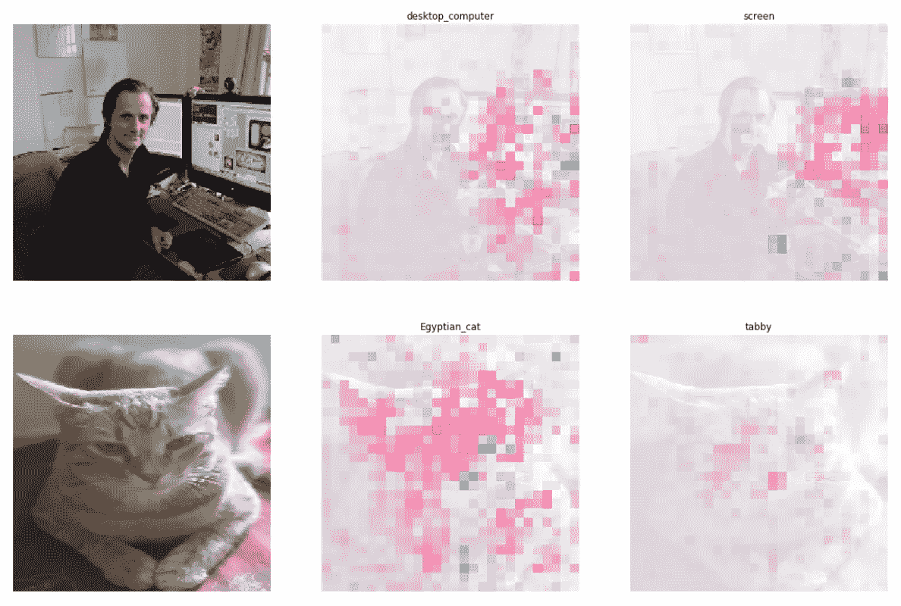

# 解读计算机视觉的深度学习模型

> 原文：<https://medium.com/google-developer-experts/interpreting-deep-learning-models-for-computer-vision-f95683e23c1d?source=collection_archive---------0----------------------->

## 可解释的人工智能

## 解释用 TensorFlow 构建的卷积神经网络模型

What does a deep learning model really see?

# 介绍

人工智能(AI)不再是一个仅限于研究论文和学术界的领域。企业和…