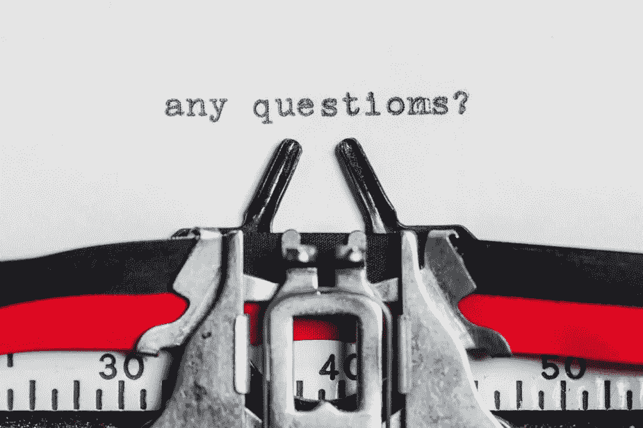

# 采访开发者:我学到了什么

> 原文：<https://medium.com/version-1/interviewing-developers-what-i-learnt-9df52e70ad5a?source=collection_archive---------1----------------------->

Hiring is about finding a common agreement between two parties: one provides work and salary and the other provides knowledge and time

# 介绍

招聘候选人是任何公司生活和发展中不可或缺的一部分，无论是初创公司还是老牌公司，招聘员工的方式都不会发生根本变化:他们通过面试进行评估。当然，不同的公司遵循不同的面试流程，有些公司只满足于一次面试，而其他公司则需要多个阶段。

在许多情况下，新员工旨在取代离职者，但在某些情况下，公司会经历扩张期，需要更多的承诺来寻找各种经验水平的最佳人才。

在代表 Version 1 参与了这样一个以扩展为重点的招聘活动后，我最终面试了许多软件开发职位的候选人，并学会了(至少在某种程度上)如何面试人，我认为分享这一经验很有价值，这样其他人可以从我学到的经验中受益。

Do you want to grow your new hire or do you need a full-grown one? This is the very first question you will need to ask yourself.

# 面试前:记住你想覆盖的资历

面试初级职员和面试高级职员完全不同。虽然你对低年级学生的期望是他们能够在不同程度的监督下处理基本任务，但你对高年级学生的期望要高得多。例如，在软件开发人员的情况下，您将希望他们能够做出架构选择，以及计划工作并向其他人员传授最佳实践。

这两个数字在技能广度上的差异意味着，在面试一位高管时，你希望你的问题能迅速告诉你他们是否具备你所需要的技术知识，这样你就有足够的时间来问与“软技能”(领导力、管理、谈判)相关的问题，你需要他们能够至少部分涵盖这些技能。另一方面，当面试一个大三学生时，你要确保他们有解决问题的技能和一些技术知识，因为他们在这个领域是至关重要的。

## **学长提问重点:**

*   领导力、评估和谈判问题
*   教导他人的最佳开发实践
*   确保他们有丰富的经验(架构、有问题的情况、需求类型)

## **初级提问重点:**

*   关于项目所需技能的基本问题
*   确保验证他们了解特定的技能(例如:计算带有“join”和“order by”子句的简单 SQL 查询的输出)
*   确保测试一般的问题解决方法(例如:解释你将应用于确定一个数是否是质数的函数的逻辑)

Knowing what you need from the candidate is critical, much like knowing what tools to use for woodworking.

# 面试前:确定你要评估这个人的哪些方面

当我们试图为软件开发人员准备问题时，我们首先想到的通常是我们希望候选人使用的语言或技术。虽然这可能很重要，但它既不是唯一的衡量标准，也不一定是要评估的最关键的方面。

实际上，除了其他方面，您还需要新员工:

*   融入现有团队
*   能够与他人有效沟通
*   为您提供他们对各种问题的观点和见解
*   保持富有成效的行为
*   有能力解决问题
*   能够超越手头的小任务(你希望他们看到“大局”)
*   能够与他人谈判、管理并可能领导他人

这意味着在面试时，你也需要问一些问题来了解他们的性格和倾向。

例如，可以假设一个能够回答每一分钟技术问题的人一定会成为团队的重要资产，因此适合高资历的职位，但是如果这个人不擅长培训经验较少的开发人员，不擅长与不同的利益相关者交谈和谈判，或者不擅长设置合理的优先级，那么你可能最终会给团队的关键职位带来不稳定的因素。

在进入面试之前，试着确定你想评估候选人的哪些方面，准备好相关的问题，以及对好的和(尤其是)坏的答案的预期。

## **行为问题示例:**

**问:**你曾经和不讲道理的同事或客户打过交道吗？你是如何处理这种情况的？

**可能的好答案:**我试图询问他们的观点并找到一个折中方案，我试图让另一位同事参与进来以获得公正的观点，最终我不得不去找我们的经理/领导来解决这个问题。

**可能不好回答:**我去找他们经理投诉。

To interview one person you need one set of questions, to interview many you should still need only one.

# 面试前:准备好你要问每个人的基本问题

当你面试少数几个候选人时(比如说:填补一个特定的职位)，你可以完全根据职位和个别候选人来安排面试。另一方面，当你参与一个更大的招聘活动时，你需要考虑你的其他职责和时间限制。

从本质上来说，上面的意思是，你需要找到一种方法来运用“规模经济”,这种方法可以让你最大限度地减少准备将要参加的许多面试所花费的时间。一个非常好的方法是准备一个你和你的同事都能问的问题基线。

有了这样的问题基线，不仅可以节省你的时间，还可以让你一次又一次地面试，它可以让你学会如何从一个普通的答案中识别出一个优秀的答案，这将有助于你选择最优秀的人才，并向你面试的人学习(是的，你有时会从他们的答案中学习！).此外，一个精心选择的问题基线将允许你进一步扩展相关的概念和问题，从而为感觉像对话而不是审问的面试奠定基础。

## **基线问题示例:**

*   什么是独生子女？(可能导致弹簧启动、web 应用、线程模型)
*   什么是抽象类，它与接口有什么不同？(可以引出语言特有的问题，继承/作文，扎实)
*   你听说过 JavaScript 中“真实”的概念吗？(可能导致 TypeScript、一般 web 开发)
*   你如何评估一项复杂的任务？(可能会引出分析问题、NFRs、测试、个人体验)
*   在管理你的团队时，你如何避免成为瓶颈？(这可能会引发关于领导风格的讨论)

Interviews can be stressful for candidates, but stress tolerance may also need to be assessed.

# 面试时:让候选人放松…也许吧

面试旨在了解某人是否“适合”某个角色。这意味着面试官对整个过程有很大的控制权，而候选人则处于劣势。

这种隐含的劣势给候选人带来了很大的压力，根据经验、所涵盖的角色和个性，我们往往会对有压力的情况做出不同的反应。有些人能很好地处理压力，而有些人会看到他们的大脑完全空白，尽管他们通常完全有能力以令人满意的方式回答你的问题。

压力和恐慌可能是面试中的一个大问题，因为它们有效地阻止了从技术角度评估候选人的生存能力……但也会告诉你他们是否能应付有压力的角色。

这意味着，根据你要面试的职位，你可能想让应聘者放松下来，问一些他们自然能够回答的问题，因为他们是谁，他们每天都在做什么(例如，问一个关于他们当前项目和角色的描述，应该是一个简单的问题)，或者不管压力水平如何，保持速度，看看他们的反应。需要注意的是，你需要知道这个职位对他们有什么要求，否则，你就有可能失去不必要的人才。

## **示例标准:**

**初级和中级候选人:**尽可能缓解紧张气氛

高级候选人:试着缓解紧张，但看看他们是否能自己摆脱恐慌

**团队领导人选:**他们根本不该紧张；首先，他们应该自信而果断

Although hiring is not a scientific process, objectivity is still critical and emotions should be kept in check.

# 面试时:控制住自己，保持客观

你将要进行的大多数面试都会非常顺利。大多数候选人至少是可行的，有些则不然。然而，如果你进行了大量的面试，你迟早会发现那些要么作弊要么态度恶劣的人。

有一次，我有一个候选人试图在维基百科上查找他的答案，然后试图把一些答案拼凑起来。一旦我明白了这一点，我基本上有两个选择:揭露他或继续采访。在另一个例子中，我有一个候选人回答了两次关于基本知识的问题“我必须让你参考一下文档”(如果是为了说“我不知道”，这是一个特别糟糕的用词)，绝大多数候选人回答这些问题都没有问题，不管他们的经验如何。

对于作弊的候选人，我的处理方式是深入挖掘他们犹豫不决的回答，并收集他们对这件事的真实理解的适当笔记。对于“态度恶劣”的候选人，我继续问我的其他问题——没有一个问题需要经过任何文档记录——再次根据他们的回答收集笔记，包括他们在面试所有阶段的行为笔记。

底线是，无论发生什么情况，最好的做法是继续提问，直到面试结束，使用你收集的笔记来推动你的决定，这需要尽可能客观。

## **最佳实践:**

*   根据你计划要问的问题，客观地收集笔记
*   将任何主观反应推迟到面试之后:毕竟这可能只是一个糟糕的词汇选择

The economics of hiring should not factor into your decision as a technical interviewer.

# 采访后:经济学不是你的问题

雇用一个人的决定是一系列独立评估的结果，包括技术、个人和经济评估。人们询问的金额当然对最终决定至关重要，但你需要明白，这可能与你无关。

在技术面试中，你的角色是从技术角度决定候选人是否合适，你对自己的评估有多少信心，以及他们是领先还是落后于其他候选人。一旦你知道候选人“有多好”,你就可以推荐他们是否被录用，但你不是最后打电话的人。

利用对他们财务需求的了解来判断技术面试是否成功是一个坏主意，因为它会扭曲你的技术评估。例如，你可能倾向于对一个优秀的候选人说“不”,这个候选人看起来不错，但在你看来要价太高，但如果这个价格可以商量呢？作为一名技术型面试官，你不会参与谈判:招聘人员会依赖你的是/否评估，假设它的基础是纯粹的技术，并会拒绝求职者的工作，不管他们是否愿意谈判。此外，根据公司的政策，你现在的“不”可能会自动转化为将来的“不”，因此在技术面试中进行经济评估，你可能会不必要地、持续地失去人才。反之亦然:你可能会对一个平庸的应聘者说“是”,他向你提出了很低的薪水要求，但在随后的步骤中与招聘人员协商了更高的薪水，这甚至更糟，因为你可能不得不在他的试用期内拒绝他——包括所有的间接成本——或者让他溜走，留下一个没有生产力的员工。

这里的要点是，应该对决定候选人是否应该被聘用的关键指标进行单独、独立的评估。作为一名技术面试者，你的角色是从技术角度，而不是经济角度来评估候选人。

## **最佳实践:**

*   仅从技术方面评估候选人

Taking structured notes is critical to ensure consistent results and objective interviews.

# 面试后:尽可能详细地记录结果

面试需要时间。一旦完成，简单地说“是”或“不是”将是非常诱人的……但是现实是有许多灰色阴影的，你需要记住这一点。此外，决定可能会被推迟，你可能会在一段时间后被要求在两个候选人之间做出决定，所以你需要回忆这两次面试，或者你可能会被分配给新员工，你会希望在面试中记住他们的优势和劣势。

综上所述，你希望有一个系统的方法来收集你提出的所有问题的反馈，你也可能希望收集他们所说的任何引起你注意的事情的笔记，无论是好的还是坏的，因为这将有助于你以后记住候选人。

## **最佳实践:**

*   给每个答案打分(例如:优秀/良好/一般/糟糕/糟糕)
*   写下候选人给出的每个答案的底线，以解释为什么该答案是好的、坏的或一般的。
*   以书面形式记录下给你留下印象的任何细节，无论是好的还是坏的
*   以书面形式记录下候选人的大致背景，这可能有助于你记住他们

Your role is to make a decision on hiring. “Maybe” is not a decision.

# 面试后:没有“可能”这回事

技术面试的目的是确定候选人是否可行。从这个意义上说，那些需要决定雇佣的人需要你对你的是/否评估有信心。因此,“也许”评估是一个大问题，你应该尽可能地避免它。

当然，有时你会发现自己在这个问题上非常分裂。

例如，你可能会发现一个高级职位的候选人不适合做高级职位，但适合做中级职位。在另一种情况下，您可能会发现申请高级开发人员角色的候选人有很长的职业生涯，这使他们远离了纯粹的技术角色，以至于他们可以出色地涵盖非技术角色，您知道这可以帮助团队，但不是作为高级开发人员。

在这两种情况下，你都必须努力给招聘人员必要的工具来解释你的“可能”评估，这样潜在的决定总是可以清楚地做出。在这两个例子中，你可以清楚地表明，如果候选人接受不同的角色，你的“也许”可以变成“是”，否则就变成“否”。

## **最佳实践:**

*   尽可能避免不明确(“可能”)的评估
*   当你不能清楚地避免一个“可能”的状态时，什么会把它变成“是”或“否”

If you are taking an interview, try to relax and be honest.

# 对考生来说:要有准备，要诚实，不要惊慌

虽然这篇文章的重点是给面试官一些建议，但我也想给应聘者一些建议，虽然这需要一篇专门的文章来阐述，但提供一些要点也无妨。

## **有备而来:**

*   试着记住你在面试谁，查一下这家公司，它是做什么的，他们使用什么技术(如果你从来没有使用过也没关系)
*   根据你自己想要什么和不想要什么，为公司准备一些问题:在一家你不喜欢的公司结束工作是浪费你和公司的时间，所以把面试作为评估公司的一个机会
*   尽可能带着富有成效的心态进入面试:面试官有很多问题想问，为了做到这一点，他们需要你的回答简明扼要。一次有效的面试将会看到你以一种清晰而合理简洁的方式回答问题，让面试官明白你抓住了问题的要点，同时留出空间来阐述对他们来说重要的方面

## **诚实，因为没有人知道一切:**

*   面试官准备接受你可能不知道他们问的一些事情，所以当你不知道一些事情或者当你不确定你要给出的答案时，就承认吧。此外，不要忽视他们可能想知道你会如何回答你不知道的问题。
*   面试官根据自己的知识提前准备好问题，这样当你试图在没有事先了解的情况下编造一个答案时，他们会立即知道。尝试这样的壮举很可能会给他们留下不好的印象，所以不要这样做。

## **不要慌:**

*   面试官知道面试过程对应聘者来说会很有压力，并做好应对的准备。在大多数情况下，对他们来说，理想的面试是同事之间的友好交谈，可以分享意见，清楚地表达个人观点……所以，试着放松:事情按照它们的方式发展。

## **奖励:**

*   要有策略。参加面试是一项可以学习的技能。如果你没有参加面试的经验，那就从你最不感兴趣的公司开始，不要害怕对前两三份工作说不:你可以用它们来试着了解哪些问题被问得更多，以及你目前的专业水平值多少钱。

Planning and preparing for interviews are critical to their success.

# 结论:准备是关键

面试在很多方面都是“第一印象”及其问题的完美体现。作为一名面试官，你有非常有限的时间去了解一名候选人是否会对公司有价值，并报告这一结果。这就要求你在参加面试时，尽可能准确地知道你想要什么，如何确定候选人是否拥有这种能力，以及如何以结构化和客观的方式报告面试结果。

所有这些的底线可以总结为几个要点:

*   了解对这个角色的期望，并相应地调整你的问题
*   准备一个你会问所有候选人的问题基线
*   以结构化的方式做笔记并获取信息/摘录
*   仅仅根据你打算评估的方面来做你的评估
*   额外收获:确保任何时候都有两个人在进行面试。它有助于客观性，并可以防止其他问题
*   对考生来说:做好准备，尽量放松

以上所有要点可以进一步总结为一句话:准备是关键。

所有图片由 burst.shopify.com[提供](https://burst.shopify.com/)

**关于作者:**
Filippo Possenti 是 Version 1 的 Java 技术主管。