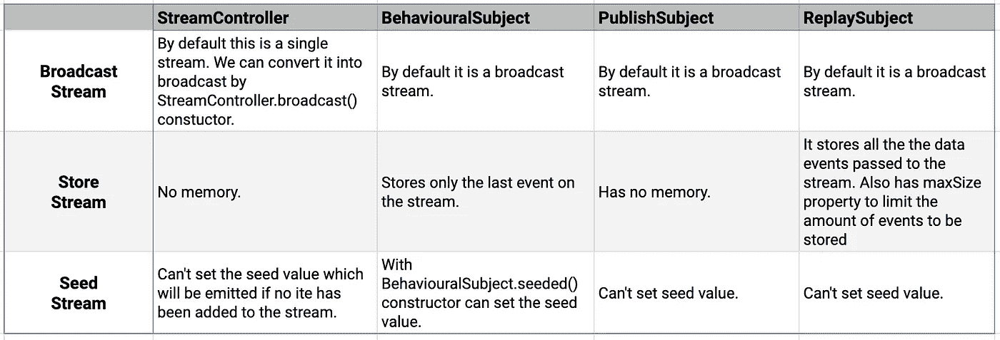
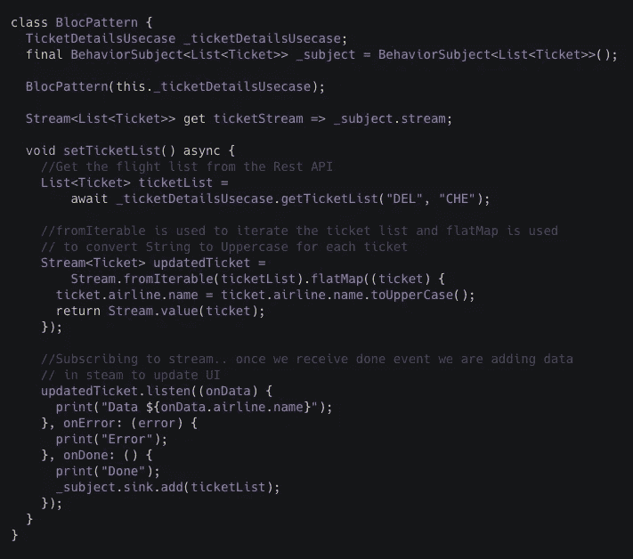
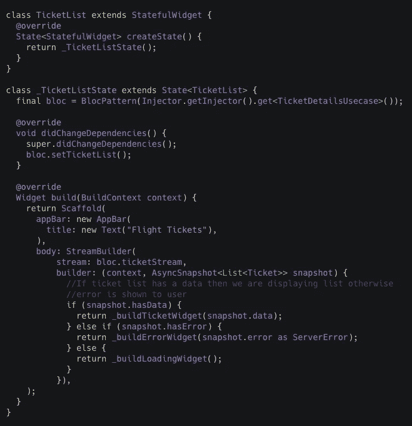

# RxDart 简介

> 原文：<https://medium.com/globant/intro-to-rxdart-7e1429fabce0?source=collection_archive---------1----------------------->

大多数时候，在移动应用程序中，我们必须并行或一个接一个地执行多个异步操作，根据结果，我们需要转换数据，然后更新 UI。为了处理这些复杂的情况，Rx 来救援。

Reactive 来自 react 这个词，意思是对状态的变化做出反应。RxDart 属于反应式编程，它只关心数据流和变化的传播。

想到的一个问题是，**为什么要用 *RxDart* ？**
Dart 附带了体面的*流 API*,*rx Dart*没有试图提供该 API 的替代方案，而是在它的基础上添加了“反应式扩展规范”中的功能。 *RxDart* 不提供自己的“可观察”类来替代 *Dart 流*。相反，它提供了几个额外的流类、操作符(流类的扩展方法)和*主题*。

**为什么要进行反应式编程？**

1.  更容易链接多个请求和应用转换。
2.  将一个流转换成另一个具有多种能力的流。
3.  回调处理和跟踪错误。
4.  通过执行复杂的线程操作来处理多线程，保持一切同步并返回相关的内容。

**流**

**流**是一系列异步事件。它就像一个管道，当你在一端放入数据，如果在另一端有一个监听器，这个监听器将接收那个值。使用*Stream controller/Subject*可以将数据放入*流*中。由于使用 RxDart 0.23.x **流**代替**可观察。**

**Subjects-** Dart 已经提供了 *StreamController* 来创建和管理*流*。然而， *RxDart* 提供了与 *StreamControllers* 相同的*主题*，但是具有额外的功能。

**学科类型:
1。behavioral Subject**-这是广播流控制器，意味着 *Subject 流*可以多次收听。*行为主体*捕捉最新的值或错误。当新的监听器订阅*流*时，最新的值或错误将被发送给监听器。

2.这是一个默认的广播流控制器。仅订阅后添加的值/错误将被发送给侦听器。

3.**replay subject**——这是一个特殊的广播 *StreamController* ，它捕获所有已经添加到控制器中的项目。这个主题允许向监听器发送数据、错误和完成事件。随着项目被添加到*主题*， *ReplaySubject* 将会存储它们。当*流*被收听时，那些记录的项目将被发送给收听者。之后，任何新添加的内容都将被传递给侦听器。

为了限制存储的元素，我们可以设置 maxSize。

*流控制器*和*主题*的比较

Comparision

正如我们在前面的例子中看到的，我们必须监听*流*来捕获事件。下面是*流订阅*的语法:

**onData，on error&on done methods
*on data***:每次发布新事件时都会调用这个方法。在这里，我们可以对事件执行操作。
***onError*** :这是在 *RxDart 框架*代码或者我们的事件处理代码中抛出未处理的异常时调用的。
***onDone* :** 当与流相关联的事件序列完成时，调用此函数。
***取消错误* :** 取消错误的默认值为 false。如果 cancelOnError 为 true，则在传递第一个错误事件时，订阅将自动取消。

到目前为止，我们已经看到了基本的 *RxDart* 和*流*。

现在，让我们看看如何在 flutter UI 中使用所有这些组件。

bloc.dart

ticket_widget.dart

这都是关于*流*和 *RxDart* 的。在下一篇博客中，我们将详细探讨 Rx 操作符。

希望这篇博客对你有所帮助。谢谢！！

参考资料:

[https://pub.dev/documentation/rxdart/latest/](https://pub.dev/documentation/rxdart/latest/)