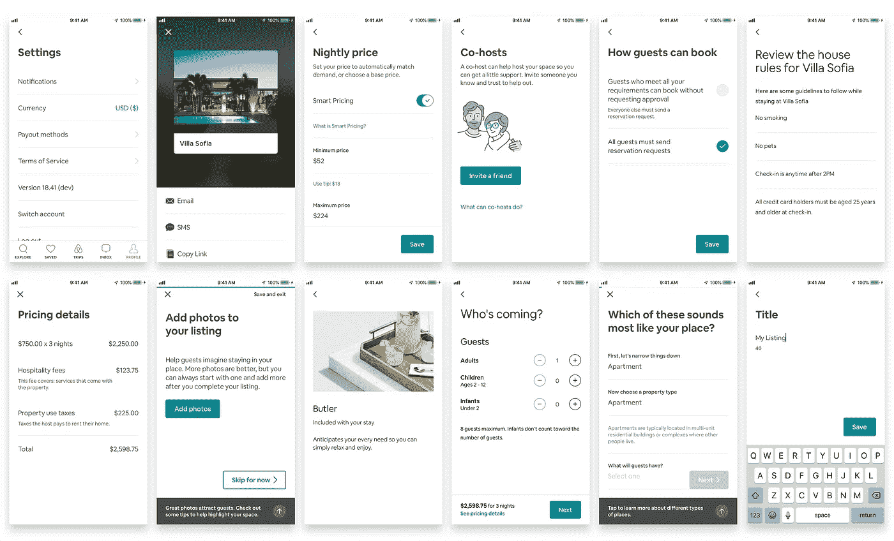

# iOS 版 AloeStackView 简介

> 原文：<https://medium.com/airbnb-engineering/introducing-aloestackview-for-ios-a676d253c6ba?source=collection_archive---------1----------------------->

## 一个简单的开源类，用一个方便的 API 设计了一组视图。

Some of the ~200 screens in the Airbnb iOS app built using AloeStackView.

在 Airbnb，我们一直在寻找提高建筑产品效率的方法。

在过去的几年里，我们的移动开发工作以惊人的速度增长。仅在过去一年，我们就在 iOS 应用中增加了 260 多个屏幕。与此同时，越来越多的人开始采用我们的原生移动应用。这些趋势没有减缓的迹象。

大约两年前，我们坐下来审视我们如何在 iOS 上构建产品，看看我们的开发效率是否有提高的空间。我们发现的一个主要问题是，在我们的 iOS 应用程序中实现一个新的屏幕需要花费数天甚至数周的开发时间。

所以我们开始改变这种状况。我们希望找到一种比我们想象的更快的方法来构建屏幕。我们希望工程师能够在几分钟或几小时内，而不是几天或几周内，为 iOS 应用程序添加一个新屏幕。

在过去的两年里，我们学到了很多快速、高质量地构建 iOS 用户界面的经验。

基于这些经验，我们今天非常兴奋地向大家介绍我们在 Airbnb 开发的一个工具，它可以帮助我们快速、轻松、高效地编写 iOS UI。

# 介绍 AloeStackView

2016 年，我们开始在我们的 iOS 应用程序中使用 Airbnb 的 [AloeStackView](https://github.com/airbnb/AloeStackView) ,此后我们使用它实现了应用程序中的近 200 个屏幕。用例非常多样:从设置屏幕到创建新列表的表单，再到列表共享表。

AloeStackView 是一个类，它允许在一个垂直列表中放置一组视图。从广义上讲，它类似于 UITableView，但是它的实现非常不同，并且它做出了一组不同的权衡。

AloeStackView 首先关注的是使 UI 实现起来非常快速、简单和直接。它通过两种方式做到这一点:

*   它利用自动布局的能力，在对视图进行更改时自动更新 UI。
*   它放弃了 UITableView 的一些特性，比如视图回收，以实现一个更加简单和安全的 API。

# 简化 iOS UI 开发

当我们研究如何在 iOS 上提高开发效率时，我们首先意识到的一件事是，即使在应用程序中实现最小的屏幕也需要多少工作。

事实证明，为处理大而复杂的屏幕而设计的抽象有时会成为小屏幕的负担，因为它们引入了开发开销。

通常，较小的屏幕也不会从这些抽象提供的优势中受益。例如，如果一个 UI 完全适合一个屏幕，那么它就不会从视图回收中受益。然而，如果我们使用一个面向视图回收的抽象来构建这个屏幕，那么我们仍然要为这个功能给 API 增加的复杂性付出代价。

为了解决这个问题，我们开始寻找更简单的方法来编写屏幕。我们发现的一个非常有效的技术是使用嵌套在 UIScrollView 中的 UIStackView 来布局屏幕。这种方法成为我们构建一个桌面视图的基础。

这项技术非常有用，因为它允许您保留对视图的强引用，并随时动态更改它们的属性，而自动布局会自动更新 UI。

在 Airbnb，我们发现这种技术非常适合接受用户输入的屏幕，比如表单。在这些情况下，保持对用户正在编辑的字段的强引用，并直接用验证反馈更新 UI 通常是很方便的。

我们发现这种技术有用的另一个地方是在较小的屏幕上，由一组不同的视图组成，内容不到一两屏。简单地在 UI 中声明一个视图列表通常会使实现这些屏幕更快更容易。

在实践中，我们发现 iOS 应用程序中的大量屏幕都属于这些类别。AloeStackView 简单灵活的 API 允许我们快速轻松地构建许多屏幕，使它成为我们工具箱中的一个有用工具。

# 减少 bug

我们提高开发人员效率的另一种方式是专注于使 iOS UI 开发更容易正确进行。AloeStackView 的 API 的一个主要目标是通过设计确保安全性，以便工程师花更多的时间来构建产品，而不是花更少的时间来跟踪 bug。

AloeStackView 没有 reloadData 方法，也没有任何方法通知它视图的更改。这使得它比像 UITableView 这样的类更不容易出错，也更容易调试。例如，AloeStackView 永远不会因为它管理的视图的底层数据发生变化而崩溃。

因为 AloeStackView 使用了 UIStackView，所以它不会在你滚动时回收视图。这消除了由于没有正确回收视图而导致的常见错误。它还提供了额外的优势，即当用户与视图交互时，不需要独立地维护视图的状态。这可以使一些 UI 更容易实现，并减少 bug 可能蔓延的表面区域。

# 权衡取舍

虽然 AloeStackView 方便有用，但我们发现它并不适用于所有情况。

例如，当您的屏幕加载时，AloeStackView 在一次传递中布局整个 UI。因此，较长的屏幕在首次显示 UI 之前会有延迟。因此，AloeStackView 更适合实现少于一两屏内容的 UI。

放弃视图回收也是一种权衡:虽然 AloeStackView 编写 UI 更快，更不容易出错，但它的性能不如 UITableView，对于更长的屏幕，它可以使用更多的内存。因此，像 UITableView 和 UICollectionView 这样的类对于包含许多相同类型视图的屏幕来说仍然是很好的选择，这些视图都显示相似的数据。

尽管有这些限制，我们发现 AloeStackView 非常适合数量惊人的用例。事实证明，AloeStackView 在实现 UI 方面非常高效，帮助我们实现了提高 iOS 开发效率的目标。

# 保持代码可管理

第三方依赖经常给应用程序带来的一个问题是二进制文件大小增加。这是我们希望通过 AloeStackView 避免的。整个库不到 500 行代码，没有外部依赖性，这使得二进制文件的大小增加到最小。

少量的代码还在其他方面有所帮助:它使库更容易理解，更快地集成到现有的应用程序中，调试更容易，更容易做出贡献。

第三方依赖有时会出现的另一个问题是库和应用程序当前的工作方式不匹配。为了缓解这个问题，AloeStackView 尽可能少地限制它的使用方式。任何 UIView 都可以与 AloeStackView 一起使用，这使得它可以很容易地与您当前用于在应用程序中构建 UI 的任何模式相集成。

所有这些因素结合在一起，使得尝试 AloeStackView 变得非常容易，而且没有风险。如果你感兴趣，请[试一试](https://github.com/airbnb/AloeStackView)并让我们知道你的想法。

AloeStackView 并不是我们在 Airbnb 用来构建 iOS UI 的唯一基础设施，但它在许多情况下对我们都很有价值。我们希望你也觉得有用！

# 入门指南

我们真的很高兴能分享一个全景。如果你想了解更多，请访问 [GitHub 资源库](https://github.com/airbnb/AloeStackView)开始。

如果您或您的公司认为这个库有用，我们希望收到您的来信。如果你想取得联系，请随时给维护者发邮件(你可以在 [GitHub](https://github.com/airbnb/AloeStackView#maintainers) 上找到我们)，或者你可以在[aloestackview@airbnb.com](mailto:aloestackview@airbnb.com)联系我们。

*想参与进来？我们一直在寻找* [*有才华的人加入我们的团队*](https://www.airbnb.com/careers) *！*

*AloeStackView 由 Marli Oshlack、Fan Cox 和 Arthur Pang 开发和维护。*

AloeStackView 还受益于许多 Airbnb 工程师的贡献:Daniel Crampton、Francisco Diaz、何玺、Jeff Hodnett、Eric Horacek、Garrett Larson、Jasmine Lee、Isaac Lim、陆中浪、Noah Martin、Phil Nachum、gon zalo nuez、Laura Skelton、Cal Stephens 和 Ortal Yahdav。

*此外，如果没有 Jordan Harband、Tyler Hedrick、Michael Bachand、Laura Skelton、Dan Federman 和 John Pottebaum 的帮助和支持，这个项目的开源是不可能的。*