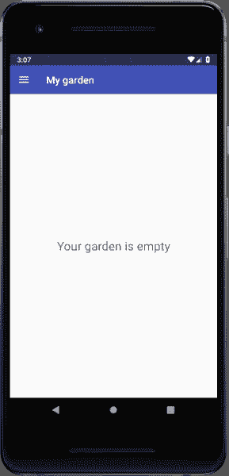
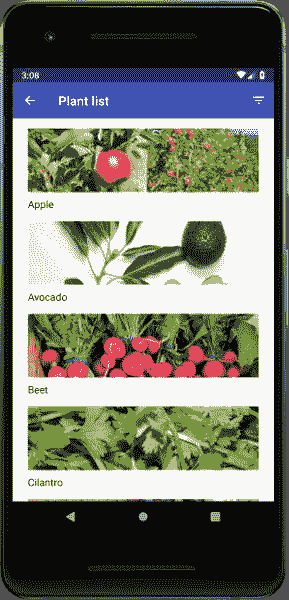
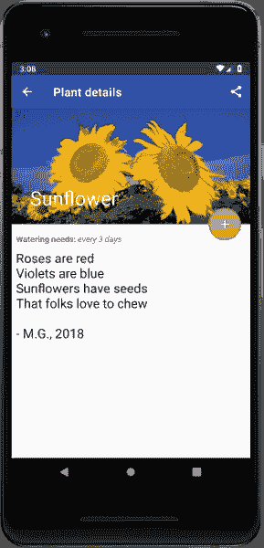
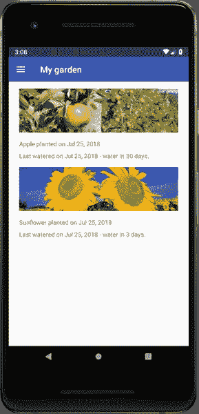

# 介绍 Android 向日葵

> 原文：<https://medium.com/androiddevelopers/introducing-android-sunflower-e421b43fe0c2?source=collection_archive---------0----------------------->

Illustration by [Virginia Poltrack](https://twitter.com/VPoltrack)

## 一款园艺应用，展示了 Android Jetpack 开发的最佳实践

(This article is also available in Chinese at [WeChat](https://mp.weixin.qq.com/s/k-zQVB5EhsKXIR1H3hbGYQ) / 中文版请参考 [WeChat](https://mp.weixin.qq.com/s/k-zQVB5EhsKXIR1H3hbGYQ))

谷歌在 Google I/O 2018 上公布了 [Android Jetpack](https://developer.android.com/jetpack/) 。Jetpack 是一个 Android 软件组件的集合，让你更容易开发优秀的 Android 应用程序。这些组件帮助您遵循最佳实践，将您从编写样板代码中解放出来，并简化复杂的任务，因此您可以专注于您关心的代码。

为了帮助开发人员了解如何将 Jetpack 组件集成到他们自己的应用程序中，我们创建了[向日葵](https://github.com/googlesamples/android-sunflower)，这是一个园艺应用程序，展示了使用 Android Jetpack 的 Android 开发最佳实践。如果你是 Jetpack 的新手，在继续之前，最好在 developer.android.com 和[上查看一下](https://developer.android.com/jetpack/docs/getting-started) [Jetpack 的内容，并构建你的第一个简单的基于 Jetpack 的应用](https://developer.android.com/jetpack/)。

这篇关于向日葵的文章是系列文章的第一篇。它将带你参观向日葵，并简要说明应用程序中包含哪些 Jetpack 组件。未来的文章将讨论 Jetpack 和 Android 开发，并深入探讨特定的主题，如导航和使用 WorkManager 调度重复任务。

# 快速花园游览

当应用程序首次启动时，用户会看到“我的花园”屏幕，最初是空的。

My Garden screen with an empty garden

让我们添加一个植物！点击汉堡菜单并打开导航抽屉，导航至植物列表。

Plant list

每种植物都与一个种植区相关联，种植区由纬度决定，指示最适合植物生长的区域。您可以通过点击选择种植区的过滤器菜单项来过滤植物列表。

点击特定工厂将导航至工厂详细信息屏幕。

Plant details

植物详细信息屏幕显示植物的名称、描述、浇水需求和植物图片。用户可以通过点击[浮动操作按钮](https://developer.android.com/guide/topics/ui/floating-action-button)将植物添加到他们的花园中。他们还可以通过菜单选项[共享](https://developer.android.com/training/sharing/)工厂。

添加一株或多株植物后，每株新植物都会出现在“我的花园”屏幕上，同时还会显示种植日期和下次需要浇水的时间。现在我们已经添加了一两株植物，让我们导航回“我的花园”来查看屏幕。

My garden with added plants

“我的花园”屏幕现在显示添加的植物，以及它们种植和最后一次浇水的日期。

# 使用 Jetpack 组件

向日葵使用许多喷气背包组件。下面简单介绍一下每个组件是如何发挥作用的:

*   向日葵完全用 [Kotlin](https://developer.android.com/kotlin) 编写，使用 [Android KTX](https://developer.android.com/kotlin/ktx) 。Android KTX 是一套 [Kotlin 扩展](https://kotlinlang.org/docs/reference/extensions.html)，它优化了 Jetpack 和 Android 平台 API，以获得更简洁、更地道的 Kotlin 代码。
*   该应用程序使用一个带有多个[片段](https://developer.android.com/guide/components/fragments)的活动。片段之间的过渡使用[导航组件](https://developer.android.com/topic/libraries/architecture/navigation/)和[过渡动画动作](https://developer.android.com/topic/libraries/architecture/navigation/navigation-implementing#Create-transition)。
*   屏幕使用片段布局，使用[约束布局](https://developer.android.com/training/constraint-layout/)和[数据绑定](https://developer.android.com/topic/libraries/data-binding/)创建
*   植物列表和我的花园条目的设备上数据存储由[室](https://developer.android.com/topic/libraries/architecture/room)在数据库级别管理，并通过[视图模型](https://developer.android.com/topic/libraries/architecture/viewmodel)经由 [LiveData](https://developer.android.com/topic/libraries/architecture/livedata) 呈现给 UI
*   AppCompat 用于保留旧版本 Android 上的关键应用功能
*   后台任务由[工作管理器](https://developer.android.com/topic/libraries/architecture/workmanager)处理
*   工厂细节可以与设备上的其他应用程序共享，或者简单地复制到剪贴板
*   [测试](https://developer.android.com/training/testing/)由[本地 JUnit 测试](https://developer.android.com/training/testing/unit-testing/)和 [Espresso](https://developer.android.com/training/testing/espresso/) Android UI 测试共同执行

# 未来的改进

Sunflower 目前以 alpha 版本发布，正在进行大量开发，新特性和更深层次的组件集成会定期登陆。这些即将到来的改进包括根据用户的位置过滤植物列表，迁移到 [AndroidX](https://developer.android.com/topic/libraries/support-library/androidx-overview) ，以及在植物需要浇水时发出通知。

在 GitHub 上创建您希望实现或探索的[问题](https://github.com/googlesamples/android-sunflower/issues)并投票。

在以后的文章中，我们将探索如何在 Sunflower 中使用其他 Jetpack 组件，如导航和重复任务，敬请关注。感谢阅读！

A sunflower in a Google garden

# 继续探索

*   在[https://github.com/googlesamples/android-sunflower](https://github.com/googlesamples/android-sunflower)查看向日葵代码。
*   了解 [Jetpack](https://developer.android.com/jetpack/) 和[构建您的第一个 Jetpack 应用](https://developer.android.com/jetpack/docs/getting-started)。

*感谢 Android 开发者关系和 Jetpack 团队的优秀人员对向日葵和本文的贡献。*