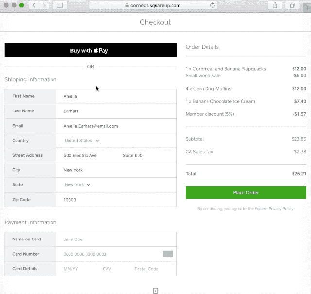

# 在网上为 Square 的 API 引入 Apple Pay

> 原文：<https://medium.com/square-corner-blog/introducing-apple-pay-on-the-web-for-squares-apis-1f85cb6fe433?source=collection_archive---------3----------------------->

> 注意，我们已经行动了！如果您想继续了解 Square 的最新技术内容，请访问我们的新家[https://developer.squareup.com/blog](https://developer.squareup.com/blog)

正如你们许多人所知，Square 的[最新阅读器](https://squareup.com/contactless-chip-reader)支持 Apple Pay 在店内支付。今天，我们很高兴地宣布，我们正在扩展我们的 API，使买家也可以在网上使用 Apple Pay 支付。

同样，Apple Pay 减少了实体企业的排队人数，加快了结账速度， [Apple Pay for web 提高了在线结账速度和转换率](https://developer.apple.com/apple-pay/get-started/)，因为买家不必输入信用卡详细信息，可以通过触控 ID 认证支付。随着越来越多的消费者在移动设备上购物，我们希望尽可能轻松、无缝地提供优化的结账体验。

# 方形收银台

从今天开始，所有的 [Square Checkout](/square-corner-blog/introducing-the-new-square-catalog-api-3e2ebf254967) 卖家都支持 Apple Pay 在线支付，无需修改代码。现在，您的客户可以通过 Square Checkout 使用 Apple Pay 支付，并在 iPhone、iPad、Apple Watch 和 Mac 上使用触控 ID 或密码完成购买，因此支付比以往更快、更安全。

# 电子商务 API

我们也很兴奋地宣布，从今天开始，我们的[电子商务 API](https://docs.connect.squareup.com/articles/adding-payment-form) 支持网上 Apple Pay。若要开始在网上使用 Apple Pay:

1.  进入你的[开发者仪表盘](http://connect.squareup.com/apps)，寻找 Apple Pay 标签。
2.  通过开发者仪表板添加您的 web 域，并下载域验证文件。

一旦注册了域名，如果你已经在使用我们的[电子商务 API](https://docs.connect.squareup.com/articles/adding-payment-form) ，你需要做的就是调整你的代码并在 SqPayment 表单中添加 locationId:

在回电部分添加以下内容:

和

要了解更多关于你可以用 Square 的电子商务 API 做什么的信息，请参阅我们关于[嵌入支付表单](https://docs.connect.squareup.com/articles/adding-payment-form)的文档。

我们对在 Square Checkout 和我们的电子商务 API 中发布 Apple Pay 感到非常兴奋，因为它已经使许多卖家的结账转化率翻了一番，并减少了结账时间和退货率。

# 附加阅读

*   方形收银台[概述](https://docs.connect.squareup.com/articles/square-checkout-overview)
*   要阅读更多关于我们的电子商务 API，请参见[嵌入支付表单](https://docs.connect.squareup.com/articles/adding-payment-form)
*   应用实例: [C#](https://github.com/square/connect-api-examples/tree/master/connect-examples/v2/csharp_payment) ， [Java](https://github.com/square/connect-api-examples/tree/master/connect-examples/v2/java_payment) ， [PHP](https://github.com/square/connect-api-examples/tree/master/connect-examples/v2/php_payment) ， [Python](https://github.com/square/connect-api-examples/tree/master/connect-examples/v2/python_payment) ， [Ruby](https://github.com/square/connect-api-examples/tree/master/connect-examples/v2/rails_payment)