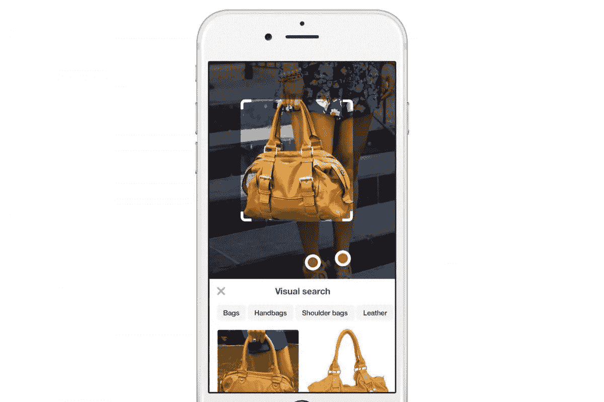
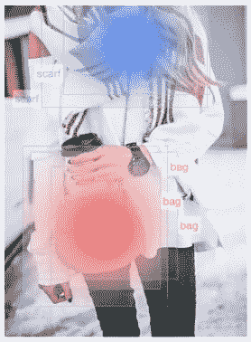
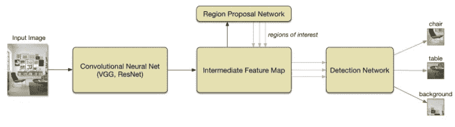

# 将自动对象检测引入视觉搜索

> 原文：<https://medium.com/pinterest-engineering/introducing-automatic-object-detection-to-visual-search-e57c29191c30?source=collection_archive---------0----------------------->

视觉搜索工程师 Dmitry Kislyuk

当我们去年推出[视觉搜索](https://engineering.pinterest.com/blog/introducing-new-way-visually-search-pinterest)时，我们第一次看到了当你使用图像作为搜索查询时的可能性。现在，每个月都有超过 1.3 亿次的视觉搜索，因为人们会搜索他们在大头针上看到的物品、风格和颜色，并获得相关的推荐。这是一种全新的搜索方式，也是一项技术挑战。

今天，我们为 Pinterest 上最受欢迎的类别引入了自动对象检测，因此人们可以在大头针图像内直观地搜索产品。当我们展望视觉搜索的未来时，我们也开始预览新的相机搜索技术，这将为 Pinners 推荐他们在现实世界中找到的产品。Pinners 将很快能够拍摄单个物体的照片，如运动鞋，并在 Pinterest 上获得推荐，甚至可以拍摄整个房间的照片，并获得多个项目的结果。

## Pinterest 的深度学习

视觉搜索是近年来深度学习的进步转变的许多领域之一。卷积神经网络将图像和视频表示为保留语义概念和视觉信息的特征向量，并在使用优化的最近邻技术时允许快速检索。去年 11 月，当我们发布了一个[视觉搜索产品](https://engineering.pinterest.com/blog/introducing-new-way-visually-search-pinterest)时，我们利用了这个想法，以及我们丰富注释的图像数据集，使在大头针图像中搜索变得像拖动庄稼一样简单。在我们的首次发布中，我们从 10 亿张 Pinterest 图片中提取了微调后的 VGG 模型的全连接-6 层，并将其索引到分布式服务中，正如我们在 [KDD 的论文](http://arxiv.org/abs/1505.07647)中所述。

您的浏览器不支持视频标签。

## 动机

由于一个图像可以包含几十个对象，我们希望尽可能简单地从它们中的任何一个开始发现体验。与自动完成改善文本搜索体验的方式相同，自动对象检测使视觉搜索体验更加无缝。视觉搜索中的对象检测也启用了新功能，如对象对对象匹配。例如，假设你在 Pinterest 或朋友家里发现了一张你喜欢的咖啡桌，很快你就能看到它在许多不同的家居环境中会是什么样子。

## 建筑物自动目标检测

我们在构建自动对象检测中的第一个挑战是收集图像中感兴趣区域的标记包围盒作为我们的训练数据。自发布以来，我们已经处理了近 10 亿幅图像(视觉搜索)。通过在数百万张参与度最高的图片中汇总这种活动，我们可以了解 Pinners 对哪些对象感兴趣。我们将视觉上相似的结果的注释聚合到每个裁剪中，并在数百个对象类别中分配一个弱标签。下面的热图显示了这种情况的一个示例，其中形成了两个用户裁剪聚类，一个围绕“围巾”标注，另一个围绕“包”标注。

由于我们的视觉搜索引擎可以使用任何图像作为查询——包括网络上看不见的内容，甚至是你的摄像头——检测必须实时进行，在几分之一秒内完成。我们广泛试验的最广泛使用的检测模型之一是更快的 R-CNN，它使用深度网络在两个主要步骤中检测图像中的对象。首先，它通过在输入图像上运行完全卷积网络来产生特征图，从而识别图像中可能包含感兴趣对象的区域。对于特征图上的每个位置，网络考虑一组固定的区域，这些区域的大小和长宽比不同，并使用二进制 softmax 分类器来确定每个区域包含感兴趣对象的可能性。如果找到一个有希望的区域，网络还输出对该区域的调整，以便它更好地框住对象。

一旦网络发现了感兴趣的区域，它就检查最有希望的区域，并试图将每个区域识别为特定类别的对象，或者如果没有发现对象，就丢弃它。对于每个候选区域，网络在卷积特征图的相应部分上执行空间汇集，从而产生具有固定大小的特征向量，而与区域的大小无关。该汇集的特征然后被用作检测网络的输入，该检测网络使用 softmax 分类器来将每个区域识别为背景或我们的对象类别之一。如果检测到对象，网络再次输出对区域边界的调整，以进一步改进检测质量。最后，对检测执行一轮非最大值抑制(NMS ),以过滤掉任何重复的检测，并将结果呈现给用户。

用更快的 R-CNN 实现高速检测的关键技巧之一是在区域提议器和检测网络中使用的卷积特征是同一个。网络延迟的很大一部分花费在产生这个中间卷积特征图上，并且通过在两个网络组件之间共享它，我们减少了冗余计算的量。这使我们能够在几分之一秒内识别物体。

您的浏览器不支持视频标签。

去年，我们部署了我们自己的这一模型的实现，以计算相关 pin 中的目标视觉相似性特征，这是我们的推荐产品之一，导致参与度增加了 4%，如我们的[技术报告](http://arxiv.org/abs/1511.04003)中所详述的。

从那以后，我们一直致力于通过应用最近发表的深度残差网络(ResNets)的进展来提高该模型的准确性和效率。尽管最终的网络由 100 多个卷积层组成，但我们一直专注于减少该模型的 GPU 内存占用，以适合在 AWS 上部署，同时将延迟保持在 300 毫秒以下。

通过对 Pinterest、网络或现实世界中任何地方的任何图像进行实时对象检测，Pinterest 上的视觉搜索变得更加出色。物体检测将在未来几周在所有 Pinners 和平台上推出。

## 视觉搜索的未来

我们还在开发一种技术，帮助人们在 Pinterest 上获得他们在现实世界中发现的产品的推荐，只需拍张照片。这将实现一种新的视觉搜索体验，结合图像检索，对象检测和我们的兴趣图的力量。请继续关注相机搜索技术的更多信息。

***鸣谢***
*视觉搜索是 Pinterest 的一项合作成果，我们要感谢来自伯克利视觉与学习中心(BVLC)的徐克雷、Vishwa Patel、Andrew Zhai、Shirley Du、、Michelle Vu、Michael Feng 和 Kevin Jing，以及 Eric Tzeng、Jeff Donahue 和 Trevor Darrell。此外，我们要感谢 Mike Repass、Naveen Gavini 和 Albert Pereta，他们使产品发布成为可能。*