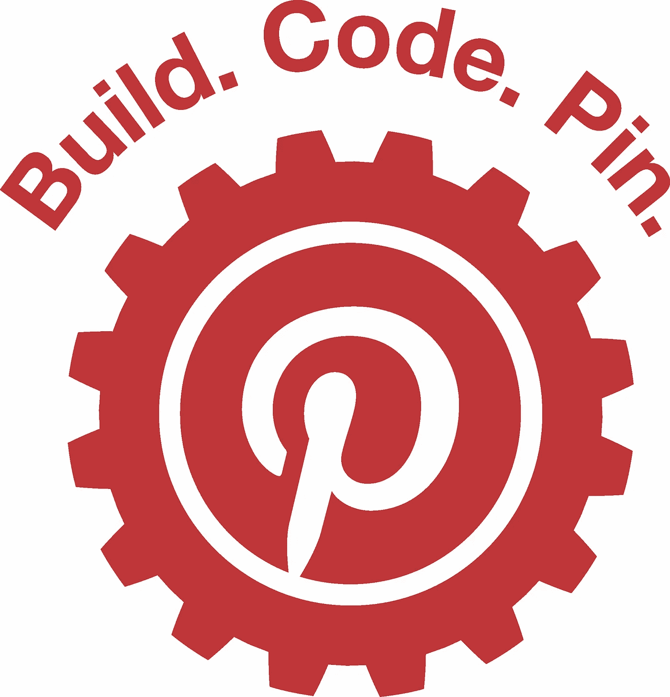

# Bonsai 简介:一个开源的 Webpack 分析器

> 原文：<https://medium.com/pinterest-engineering/introducing-bonsai-an-open-source-webpack-analyzer-6bdfe22f8984?source=collection_archive---------0----------------------->

Ryan Albrecht | Pinterest 增长工程师

在 Pinterest，我们知道性能是一项功能。无数的实验表明，当品酒人有一个平稳和反应灵敏的体验时，他们会为自己的生活找到更多创造性的想法。但有一个问题:随着我们的 web 应用程序变得越来越复杂，JavaScript Pinners 下载的规模也急剧膨胀。所有这些代码都降低了页面的速度，而且它们通常是“以防万一”某个按钮或功能被点击。

为了帮助我们分析我们的代码并应用熟悉的技术来加速站点，我们构建了一个新工具， [Bonsai](https://pinterest.github.io/bonsai/analyze/) ，一个帮助减少依赖树的 Webpack 分析器。今天我们将 Bonsai 作为开源项目发布，现在可以在 [GitHub](https://github.com/pinterest/bonsai) 上下载。在本帖中，我们将讲述我们在一个大量使用 JavaScript 的网站上面临的挑战，以及 Bonsai 如何帮助减少页面加载时间。

## 我们是如何来到这里的

正如许多人所做的那样，通过查看一些仪表板和指标，故事展开了。在 Pinterest，我们一直在衡量我们网站的性能和效率。我们有自动化的系统和分析，可以告诉我们世界各地的 Pinners 网站加载速度有多快，如果我们检查我们的预算，就会发出警报，默认情况下，助手小工具可以让事情变得更快。然而，我们的仪表板显示，随着时间的推移，小功能变得越来越大，我们发送给浏览器的 JavaScript 的总量也在增加。更多的 JavaScript 意味着更长的页面负载指标和更差的 Pinners 体验。

## 代码分割

[代码分割](https://webpack.js.org/guides/code-splitting/)是一项众所周知的技术，它可以改善大量使用 JavaScript 的网站的页面加载时间。从根本上说，它是将 JavaScript 代码分成多个包，这对于只下载显示当前页面所需的 JavaScript 的用户来说更好。

自从去年我们从[切换到 React](/@Pinterest_Engineering/how-we-switched-our-template-rendering-engine-to-react-a799a3d540b0) 以来，我们使用 [Webpack](https://webpack.github.io/) 在页面级别构建和拆分我们的 JavaScript 包。使用 [React-router](https://github.com/ReactTraining/react-router/blob/master/packages/react-router-dom/docs/guides/code-splitting.md) 很容易做到，页面为代码分割和异步加载提供了一个天然的接口。这也使得加载页面的速度更快！我们希望通过从我们的页面中分离出一些特性来实现同样的成功。这只是找到更多接缝的问题。

## Bonsai，一个 Webpack 分析器

这就是盆景的用武之地。Bonsai 是一个 Webpack 分析器，它通过分析项目中模块的依赖关系并跟踪它们添加到页面中的字节的相对权重来揭示大模块。它有助于修剪依赖关系树。

例如，以下是我们在前端代码中发现的一些挑战，以及我们用来解决这些挑战的不同方法:

*   我们将 www.pinterest.com 的一些大型广告客户工作流程转换成了惰性负载。
*   我们从一个巨大的帮助程序库中找到了使用单一方法的页面，并将该方法分离出来，这样我们就不再下载整个库了。
*   我们从没有孩子对数据感兴趣的页面根中删除了 React 上下文提供者。

我们发现的一些事情需要简单的改变才能产生巨大的影响，而其他的则是更大的项目。我们发现，一旦知道了关键的瓶颈在哪里，删除或推迟加载代码就会容易得多。

你可以在 GitHub 上找到[代码和文档，请在下面分享你自己的成功故事，以及 GitHub 上的问题或请求。](https://pinterest.github.io/bonsai/)

*鸣谢:感谢 Jason Chalecki、John Mogielnicki 和成长团队的其他成员提供的所有反馈和测试。*