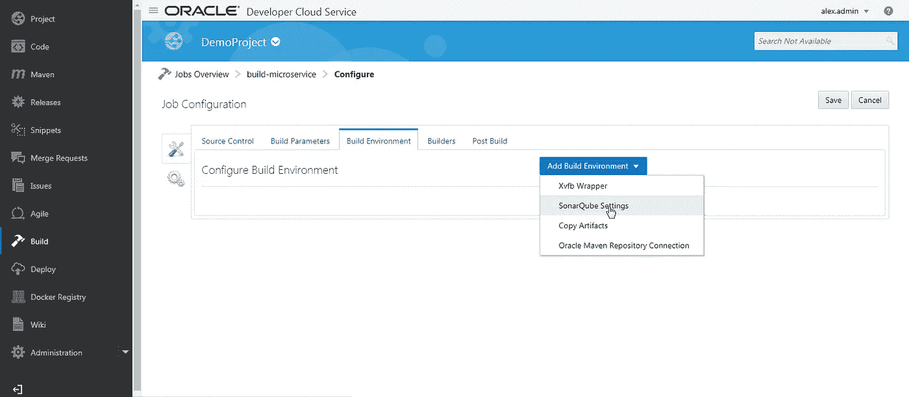

# 在 Oracle 开发人员云中引入构建管道

> 原文：<https://medium.com/oracledevs/introducing-build-pipeline-in-oracle-developer-cloud-90ad27227187?source=collection_archive---------0----------------------->

在当前版本中，我们在 Oracle 开发人员云中引入了一个新的构建引擎。这个新的构建引擎还在 Oracle Developer Cloud Service 的“构建”选项卡中提供了新的增强功能和用户界面，用于可视化定义构建管道。从持续集成和持续交付的角度来看，这是 Oracle 开发人员云中期待已久的功能。

**那么，开发人员云构建正在发生什么变化呢？**

下图显示了 Oracle Developer Cloud 中新的“Build”选项卡的用户界面。快速浏览一下，你会发现在“作业”选项卡旁边增加了一个名为“管道”的新选项卡。因此，创建构建工作的概念保持不变。除了您可以创建的构建作业之外，我们还有 Pipeline。

构建工作的创建也经历了一个变化。当您尝试通过单击“build”选项卡中的“+New Job”按钮来创建构建作业时，您将看到一个用于创建新构建作业的对话框。第一个屏幕截图显示了之前的“New Job”对话框，您可以在其中给出作业名称，并选择创建自由作业或复制现有的构建作业。

第二个屏幕截图显示了 Oracle Developer Cloud 中出现的最新“新作业”对话框。它有一个作业名称、描述(您可以在前面的构建配置界面中给出)、创建新作业/复制现有作业选项、用于选择“用于合并请求”的复选框以及最引人注目的软件模板下拉列表。

旧构建系统中的对话框:

新构建系统中的对话框:

**“新工作”对话框中的这些附加字段是什么意思？**

**描述:**给出工作描述，可以在之前的构建配置界面给出。您仍然可以在构建配置中作为设置选项卡的一部分对其进行编辑。

**用于合并请求:**通过选择此选项，您的构建将被参数化以获取 Git repo URL、Git repo 分支和 Git repo 合并 id，并作为构建的一部分执行合并。

**软件模板:**在此版本中，您将使用自己的 Oracle Compute Classic 来运行/执行您的构建作业。之前，构建作业是在内部计算池中执行的。这为您提供了巨大的灵活性，您可以使用我们作为开发人员云服务的一部分提供的用户界面，使用您需要的软件运行时来配置您的构建机器。这些配置将保持不变，构建机器也不会被收回，因为它是您自己的计算实例。这也将使您能够运行多个并行构建，而没有任何约束，根据您的需求增加新的计算。您将能够创建多个具有不同软件配置的虚拟机模板，并在根据您的要求创建构建作业时选择它们。

请使用此 [**链接**](https://docs.oracle.com/en/cloud/paas/developer-cloud/csdcs/viewing-and-managing-virtual-machines.html#GUID-0FCE0C4F-75F4-43BC-8699-EBE039DA5E7A) 查阅配置软件模板的文档。

**构建配置屏幕:**

在 build configuration 选项卡中，您现在将有两个选项卡，如下面的屏幕截图所示。

1.构建配置

2.构建设置

如下面的屏幕截图所示，build configuration 选项卡还会有 Source Control 选项卡、Build Parameters、Build Environment、Builders 和 Post Build 子选项卡。

在“构建设置”选项卡中，您将拥有子选项卡，如“常规”、“软件”、“触发器”和“高级”。下面是每个选项卡的简要说明:

**概述:**如下图所示，是关于一般构建工作的详细信息。它类似于以前存在的主选项卡。

**Software:** 这个选项卡是构建配置中的一个新的引入，用于支持构建机器的软件模板，它将在我们的当前版本中引入，如上所述。它将允许您更改/查看您在创建构建作业时选择的软件模板，还允许您查看模板中可用的软件(运行时)。请看下面的截图，供你参考。

**触发器:**您可以添加构建触发器，如定期触发器和 SCM 轮询触发器，如下图所示。这类似于先前存在的触发器选项卡。

**高级:**包含一些与中止作业条件、重试计数和向控制台输出添加时间戳相关的构建设置。

**在构建配置选项卡中**

“构建配置”选项卡中有四个选项卡，如下所述:

**源代码控制:**您可以从下拉菜单中添加 Git 作为源代码控制——“添加源代码控制”。

**构建参数:**除了现有的字符串参数、密码参数、布尔参数、选择参数等构建参数外，还增加了一个新的参数类型，称为**合并请求参数**。创建构建作业时，如果选择了“用于合并请求”复选框，则会自动添加合并请求参数。这将添加 Git repo URL、Git repo branch 和 Git repo merge id 作为构建参数。

**构建环境:**除了现有的 Xvfb 包装器、复制工件和 Oracle Maven 仓库连接之外，还添加了一个新的构建环境设置，即 SonarQube 设置。

**sonar cube 设置—** 使用 sonar cube 工具进行静态代码分析。

**注意:**我将在开发者云的 SonarQube 上发布一个独立的博客。

**构建器:**添加构建步骤。构建步骤有所增加。

**Docker 构建器:**支持构建 Docker 镜像和执行任何 Docker 命令。(将为码头工人发布一个单独的博客。)

**后期构建:**添加后期构建配置，如部署。SonarQube 结果发布器是在当前版本中添加的新的后期构建配置。

**管道**

创建和配置生成作业后，可以使用这些生成作业在“管道”选项卡中创建管道。您可以使用“+新管道”按钮创建新管道。

您将看到下面的对话框，创建一个新的管道。

在创建管道时，您可以使用管道可视化编辑器拖放构建作业，根据需求对构建作业进行排序和连接。

您还可以通过双击链接并从下拉列表中选择条件来为连接添加执行条件，如下面的屏幕截图所示。

完成后，管道将在“管道”选项卡中列出，如下所示。

您可以使用播放符号按钮手动开始构件。我们还可以将其配置为当其中一个作业在外部执行时自动启动。

敬请关注更多关于开发者云服务最新特性和功能的博客。

编码快乐！

* *本文表达的观点是我个人的观点，不一定代表甲骨文的观点