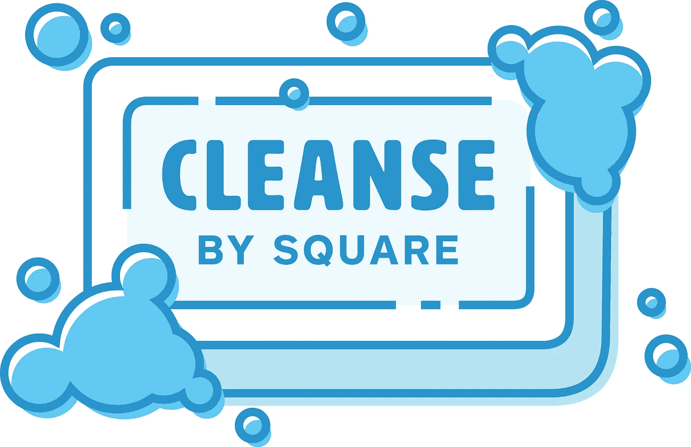

# 引入 cleane:Swift 的轻量级依赖注入框架

> 原文：<https://medium.com/square-corner-blog/introducing-cleanse-a-lightweight-dependency-injection-framework-for-swift-c1b0ddefd9c9?source=collection_archive---------0----------------------->

## Cleanse 是一个纯粹的 Swift 依赖注入库。

*作者写的*[](http://twitter.com/@mikelewis)**。**

> *注意，我们已经行动了！如果您想继续了解 Square 的最新技术内容，请访问我们的新家[https://developer.squareup.com/blog](https://developer.squareup.com/blog)*

**

# *面向所有人的依赖注入(移动设备)*

*几年前，我被介绍到这里从事 Java 服务的[依赖注入](https://en.wikipedia.org/wiki/Dependency_injection) (DI)。我们的 Java“服务容器”构建在 [Guice](https://github.com/google/guice) 之上。在经历了一个小小的学习过程后，它显然成了我离不开的技术之一。DI 使软件能够[松散耦合](https://en.wikipedia.org/wiki/Loose_coupling)，[更易测试](https://www.youtube.com/watch?v=hBVJbzAagfs)，同时需要更少[烦人的样板代码](https://corner.squareup.com/2013/05/dagger-1.0.html)。*

*在开发了几个 Java 服务之后，是时候回到 iOS，在 Objective-C 中构建我们可爱的 [Square 约会应用](https://squareup.com/appointments/app)了。转移到 Objective-C 意味着放弃强大的 DI 框架，如 [Guice](https://github.com/google/guice) 和 [Dagger](https://github.com/square/dagger) 。是的，过去和现在都有几个 Objective-C 的 DI 实现，但是我们觉得它们缺乏安全性，过度使用 Objective-C 运行时，或者配置起来过于冗长。这并没有阻止我们。我们提出了一个弗兰肯斯坦式的解决方案，使用 [LibClang](http://clang.llvm.org/docs/Tooling.html#libclang) 并基于“注释”生成代码。它模仿了 Dagger 1，并提供了编译时检查和其他一些好处。*

*大约一年前，我们开始采用 Swift。基于 Objective-C 的阿迪库开始显示出它的弱点，甚至在我们添加了对使用 swift 创建模块的支持之后。我们不能注入那些没有连接到 Objective-C 的东西，比如结构或者 [Observables](https://github.com/ReactiveX/RxSwift/blob/master/Documentation/GettingStarted.md#observables-aka-sequences) 。代码生成解决方案需要一点 Xcode 技巧，比如维护[定制构建规则](https://developer.apple.com/library/ios/recipes/xcode_help-project_editor/Articles/Adding%20a%20Build%20Rule.html#//apple_ref/doc/uid/TP40010155-CH5-SW1)，并且必须手动接触文件来触发重新编译。尽管我们不想放弃 DI，因为我们[也讨厌写样板代码](https://corner.squareup.com/2013/05/dagger-1.0.html)！*

# *输入清洗*

*在理想的情况下，我们应该为 Swift 实现类似于 [Dagger 2](http://google.github.io/dagger/) 的东西。不幸的是，Swift 缺乏工具，如注释处理器、注释、类似 Java 的反射库等。然而，Swift 确实有一个非常强大的类型系统。*

*我们利用这种类型系统为您带来了[净化](https://github.com/square/Cleanse)，这是我们针对 Swift 的依赖注入框架。配置清理模块可能看起来与配置 [Guice 模块](https://google.github.io/guice/api-docs/latest/javadoc/com/google/inject/AbstractModule.html)非常相似。然而，许多灵感也来自于[匕首 2](http://google.github.io/dagger/) ，例如[组件](http://google.github.io/dagger/users-guide.html#building-the-graph)和[缺少 ObjectGraph](http://google.github.io/dagger/dagger-1-migration.html#declaring-the-component) / [注射器](https://google.github.io/guice/api-docs/latest/javadoc/index.html?com/google/inject/Injector.html)类型，这允许不安全的操作。这让我们有了一个现代的 DI 框架，一个我们今天可以使用的健壮的[特性集](https://github.com/square/Cleanse#features)！*

# *快速游览*

*我们制作了一个[小示例 playground](https://github.com/square/Cleanse/blob/master/CleansePlayground.playground/Pages/GithubClientExample.xcplaygroundpage/Contents.swift) ,演示了如何连接 HTTP 客户端向 GitHub 的 API 发出请求。*

*与支持[绑定](https://github.com/google/guice/wiki/ProvidesMethods)和[注入](https://github.com/google/guice/wiki/Injections)的[几种](https://github.com/google/guice/wiki/LinkedBindings) [类型](https://github.com/google/guice/wiki/InstanceBindings)的两个事实上的 Java DI 框架 Dagger 和 Guice 不同，Cleanse 主要在*工厂*注入上操作。在这个上下文中，factory 只是一个取 *0 的[函数类型](https://developer.apple.com/library/ios/documentation/Swift/Conceptual/Swift_Programming_Language/Types.html#//apple_ref/doc/uid/TP40014097-CH31-ID449)..参数并返回一个新的实例。方便的是，如果有一个*GithubListMembersServiceImpl*类型，*GithubListMembersServiceImpl . init*是*GithubListMembersServiceImpl*的工厂，这使得它几乎等同于[构造函数注入](https://github.com/google/guice/wiki/Injections#constructor-injection)。**

*假设我们定义了一个协议，它应该列出 GitHub 组织的成员。*

```
***protocol** GithubListMembersService {
    **func** listMembers(organizationName: String, handler: [String] **->** ())
}*
```

*我们将该协议实现为*GithubListMembersServiceImpl**

```
***struct** GithubListMembersServiceImpl : GithubListMembersService {
  *// We require a github base URL and an NSURLSession to perform our task* **let** githubURL: TaggedProvider**<**GithubBaseURL**>**
  **let** urlSession: NSURLSession */// Lists members of an organization (ignores errors for sake of example)*
  **func** listMembers(organizationName: String, handler: [String] **->** ()) {
    **let** url **=** githubURL.**get**().URLByAppendingPathComponent("orgs/\(organizationName)/public_members") **let** dataTask **=** urlSession.dataTaskWithURL(url) { data, response, error **in**
      guard **let** data **=** data, result **=** (try**?** NSJSONSerialization.JSONObjectWithData(data, options: [])) **as?** [[String: AnyObject]] **else** {
        handler([])
        **return**
      } handler(result.flatMap { $0["login"] **as?** String })
    } dataTask.resume()
  }
}*
```

*我们希望每当请求一个*githublistmemberservice*时就提供这个实现。为此，我们将其配置在一个*模块*中。*模块*是配置 Cleanse 的构建模块。*

```
***struct** GithubAPIModule : Module {
    **func** configure**<**B : Binder**>**(binder binder: B) {
        *// Configure GithubMembersServiceImpl to be the implementation of GithubMembersService*
        binder
            .bind(GithubListMembersService.self)
            .asSingleton()
            .to(factory: GithubListMembersServiceImpl.**init**) *// While we're at it, configure the github Base URL to be "https://api.github.com"*
        binder
            .bind()
            .tagged(with: GithubBaseURL.self)
            .to(value: NSURL(string: "https://api.github.com")**!**) }
}*
```

*你可能已经注意到*githublistmemberserviceimpl*需要一个 *NSURLSession* 。为了满足这一要求，我们也需要对其进行配置。让我们制作另一个模块:*

```
***struct** NetworkModule : Module {
  **func** configure**<**B : Binder**>**(binder binder: B) {
    *// Make `NSURLSessionConfiguration.ephemeralSessionConfiguration` be provided*
    *// when one requests a `NSURLSessionConfiguration`*
    binder
        .bind()
        .asSingleton()
        .to(factory: NSURLSessionConfiguration.ephemeralSessionConfiguration) *// Make `NSURLSession` available.*
    *// It depends on `NSURLSessionConfiguration` configured above (`$0`)*
    binder
        .bind()
        .asSingleton()
        .to {
            NSURLSession(
                configuration: $0,
                delegate: nil,
                delegateQueue: NSOperationQueue.mainQueue()
            )
        }
  }
}*
```

*我们可以将这两个模块组装在一个*组件*中。一个*组件*本质上是一个*模块*，它也为一个对象图声明了一个*根*类型。在这种情况下，我们希望我们的根是*GithubListMembersService*。*

```
***struct** GithubListMembersComponent : Component {
  *// When we build this component we want `GithubListMembersService` returned*
  **typealias** Root **=** GithubListMembersService **func** configure**<**B : Binder**>**(binder binder: B) {
    *// Install both the modules we have made*
    binder.install(module: NetworkModule())
    binder.install(module: GithubAPIModule())
  }
}*
```

*现在是时候构建组件并获得我们的*GithubListMembersService*！我们在组件的实例上调用 *build()* 。这将返回*根*类型， *GithubListMembersService。**

```
***let** membersService **=** try**!** GithubListMembersComponent().build()*
```

*如果在构建我们的对象图时出现验证错误，它们将会从 *build()* 方法中抛出。*

*现在，让我们看看 [Square 的 GitHub org](https://github.com/square) 的成员是谁:*

```
*membersService.listMembers("square") { members **in**
  print("Fetched \(members.count) members:") **for** (i, login) **in** members.enumerate() {
    print("\(i+1).\t\(login)")
  }
}*
```

*更详细的入门指南可以在自述文件中的[中找到，或者看看我们的](https://github.com/square/Cleanse#using-cleanse)[示例应用](https://github.com/square/Cleanse/tree/master/Examples/CleanseGithubBrowser)。*

# *代码*

*人们可以在 GitHub 上查看[clean。](https://github.com/square/Cleanse)*

*Cleanse 是一项正在进行中的工作，但是我们认为它已经为一个非常强大和开发人员友好的 DI 框架提供了构建模块。我们鼓励社区参与开发更高级的功能(例如匕首 2 中的[子组件)。其目前的实施支持 Swift 2.2 和 Swift 3 的开源版本。](http://google.github.io/dagger/subcomponents.html)*

*我们正在完全迁移 [Square Appointments 应用](https://squareup.com/appointments/app)，以便在不久的将来满足我们所有的 DI 需求。期待在接下来的几周和几个月里看到令人兴奋的新特性、改进、更多的文档、示例，甚至更多的文章。*

*[](http://twitter.com/@mikelewis) [## 迈克·刘易斯(@MikeLewis) |推特

### 来自迈克·刘易斯的最新推文(@MikeLewis)。东西的制造者。小猫爱好者。@square 的 iOS 黑客/麻烦制造者…

twitter.com](http://twitter.com/@mikelewis)*