# 快速代码集合介绍

> 原文：<https://medium.com/quick-code/introducing-collections-on-quick-code-f0bf35d53534?source=collection_archive---------8----------------------->

## 探索和关注课程集

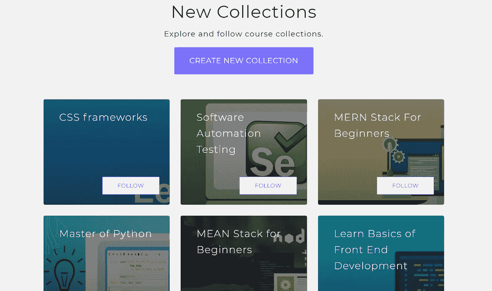

今天，我们将在快速代码上发布[系列](https://www.quickcode.co/collections)。当人们遇到他们喜欢学习的课程时，他们会将该课程保存起来，以便将来可以回到该课程并访问它们。

随着时间的推移，我们的成员已经为各种课程添加了 850 次书签。

通过收藏，我们赋予我们的成员更多的权力来创建令人惊叹的有用的课程收藏，并与他人分享。从现在开始，任何快速编码的人都可以:

*   **将课程添加到集合:**

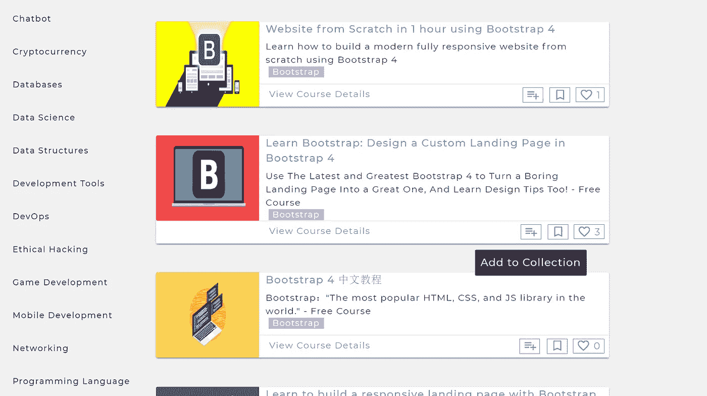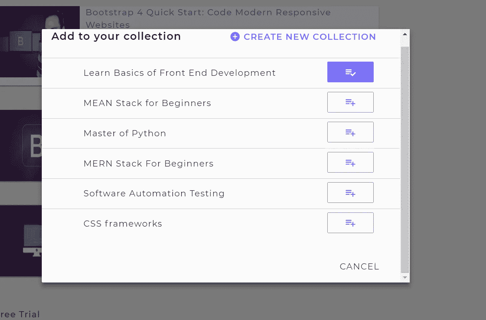

*   **创建新系列:**

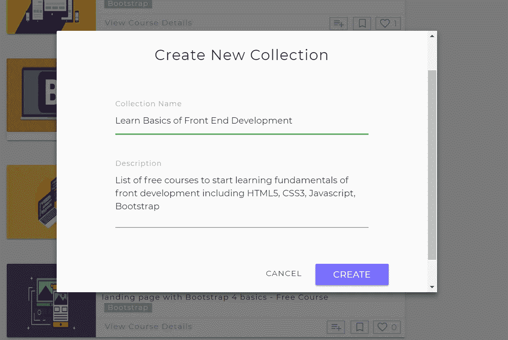

*   **查看收藏:**

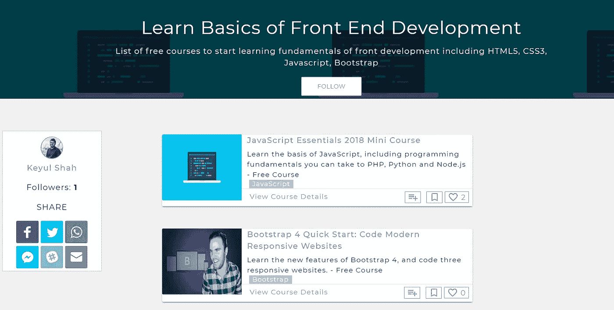

*   **我的收藏:**

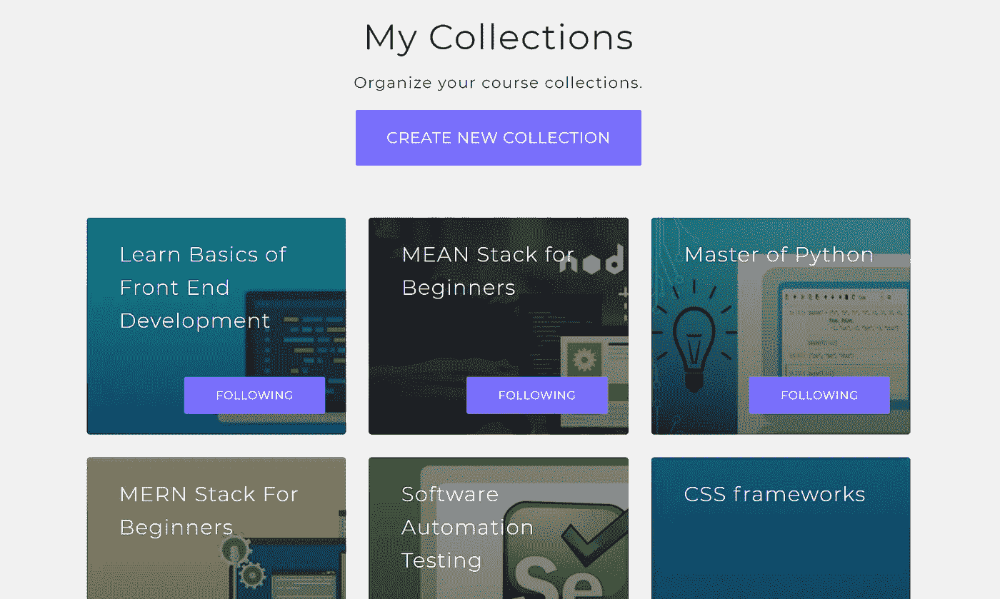

*   **以下集合:**

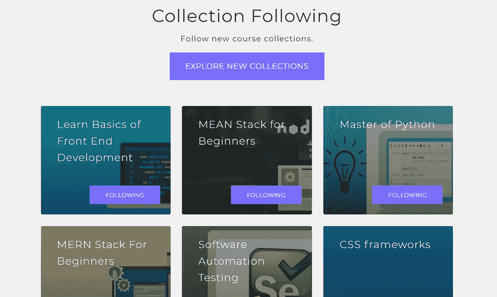

## 您可以做什么:

*   创建新收藏。
*   向集合中添加课程。
*   跟随令人惊叹的系列。
*   分享收藏。
*   查看集合详细信息。
*   了解这些系列的特色😊。

# 您喜欢探索的系列:

*   [了解前端开发的基础知识](https://www.quickcode.co/course/collections/Learn-Basics-of-Front-End-Development/1)

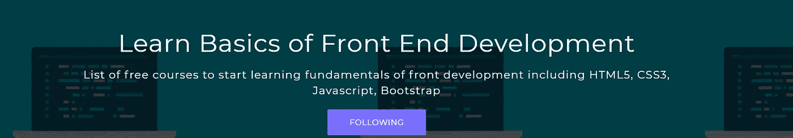

List of free courses to start learning fundamentals of front development including HTML5, CSS3, Javascript, Bootstrap

*   [初学者的平均堆栈](https://www.quickcode.co/course/collections/MEAN-Stack-for-Beginners/2)

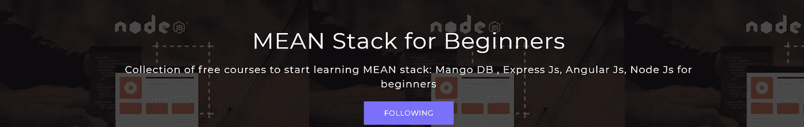

Collection of free courses to start learning MEAN stack: Mango DB , Express Js, Angular Js, Node Js for beginners

*   [软件自动化测试](https://www.quickcode.co/course/collections/Software-Automation-Testing/5)

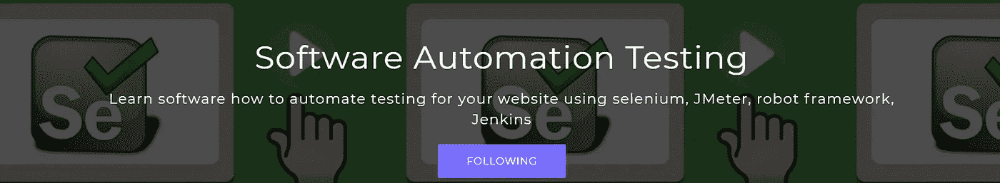

Learn how to automate software testing for your website using selenium, JMeter, robot framework, Jenkins

*   [Python 大师](https://www.quickcode.co/course/collections/Master-of-Python/3)

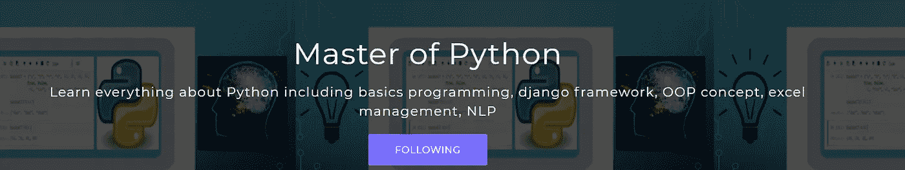

Learn everything about Python including basics programming, django framework, OOP concept, excel management, NLP

*   [初学者 MERN 堆栈](https://www.quickcode.co/course/collections/MERN-Stack-For-Beginners/4)

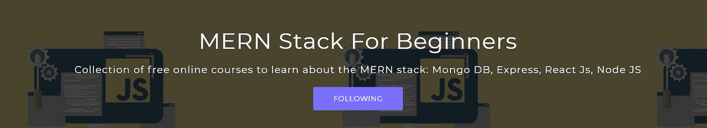

Collection of free online courses to learn about the MERN stack: Mongo DB, Express, React Js, Node JS

如果您对新系列有任何想法，请[创建系列](https://www.quickcode.co/collections)或[联系我们](https://twitter.com/QuickCode17)。我们希望收到您的来信。最好的收藏也将有机会展示。