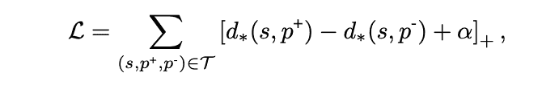

# 介绍完整外观:基于场景的互补推荐系统

> 原文：<https://medium.com/pinterest-engineering/introducing-complete-the-look-a-scene-based-complementary-recommendation-system-eb891c3fe88?source=collection_archive---------0----------------------->

Eric Kim & Eileen Li |视觉搜索

在 Pinterest 的视觉搜索团队中，我们一直致力于帮助人们从视觉上发现新想法，即使他们无法用语言来描述他们正在寻找的东西。在传统的图像搜索系统中，目标是返回视觉上类似于查询图像的结果，但是我们正在使用视觉发现引擎，我们需要从更广泛的场景中识别并返回视觉组件，以推荐服装或客厅风格等想法，并在查询中进行区分和个性化。这使得更大的场景与任何给定大头针中的主要部分一样重要。大头针内的每个视觉对象都是一个搜索和发现的机会。

在最新的开发中，为了获得灵感和可购买产品的建议，我们建立了 Complete the Look，它利用丰富的场景上下文来推荐时尚和家居装饰别针的视觉兼容结果。完整的外观考虑了服装、体型、季节、室内与室外、各种家具以及房间的整体美学等背景，通过视觉搜索技术提供基于品味的推荐。

在早期测试中，我们发现这项技术的表现明显优于以前的推荐系统。你可以在 2019 年计算机视觉和模式识别大会(CVPR)上接受的论文中找到更多细节:[完成 Look:基于场景的补充产品推荐](https://arxiv.org/abs/1812.01748)。

建模风格的兼容性由于其复杂性和主观性而具有挑战性。现有的工作集中于预测产品图像之间的兼容性(例如，包含 t 恤的图像和包含牛仔裤的图像)。然而，这些方法忽略了真实世界的“场景”图像，例如街道风格的大头针，这可能带来照明和姿势变化的复杂性，但另一方面，可能潜在地提供关键上下文(例如，用户的体型或季节)以进行更准确的推荐。

我们的解决方案是完成外观，这是一种执行视觉补充的新方法。视觉互补系统应该推荐与查询图像互补或相匹配的结果。例如，你可能在视觉上寻找与裙子相配的鞋子。该查询的结果不受视觉相似性的限制，但是可以探索风格相似性的替代维度**。**视觉搭配系统有助于搭配你的服装或寻找与新桌子相配的椅子。

# 完成外观任务

在我们讨论 CTL 模型细节之前，让我们形式化一些术语。我们将**场景图像**定义为“在野外”的真实世界图像，比如一个人在阳光明媚的日子外出或者一个别致的卧室环境。这与**产品图像**形成对比，后者是产品的特写图像，通常带有白色背景。

我们将 CTL 任务定义为:给定一幅**场景图像**和一幅**产品图像**，计算距离的定量度量，使得距离度量反映场景和产品之间的**视觉互补性**。二元分类器或重分类器都可以使用这种距离度量。

# 资料组

为了训练我们的模型，我们收集了一个带标签的数据集，我们在这里公开发布了这个数据集。数据集包括场景和产品图像对的正面示例，以及产品类别和边界框注释。每一对都增加了从同一类别中随机抽取的负产品图像。我们的模型在训练期间将这个三元组作为输入。

因为我们不想让模型记住确切的产品，所以我们做了一个额外的预处理步骤，从原始场景图像中裁剪出产品:

这个额外的步骤迫使模型严格独立于视觉相似性来学习场景和产品的兼容性。

# 模型概述

CTL 模型是一个深度卷积前馈神经网络，由两个模块组成:图像特征化器和 CTL 头。CTL head 将全局特征相似性与局部空间注意机制相结合，该机制鼓励模型关注图像的特定区域，以告知其决策。我们使用 ResNet50 模型架构作为图像特征，在 ImageNet 上进行了预处理。在所有实验中，我们不微调 ResNet50 网络。

CTL 模型包括三个步骤:

**(1)特征化场景和产品图片**

首先，模型使用 ResNet50 网络为场景和产品图像生成基本特征。我们使用 block4 特征图。

**(2)计算全局相似度。**

接下来，我们计算场景和每个正负产品图像之间的全局相似性度量。

这是通过从 ResNet50 特征地图中计算场景和产品嵌入并计算两个嵌入之间的 L2 距离来实现的:

规范中的两个术语分别是场景嵌入和产品嵌入。

**(3)计算局部相似度。**

我们计算基于类别的局部注意力显著图，该图鼓励模型关注场景中的细粒度细节，以告知其决策。

这里，我们将产品嵌入与场景图像的中间特征图中的每个空间区域进行匹配，例如 ResNet50 基本网络的 block3。因为不是所有的场景区域都是同等相关的，所以我们通过基于类别的注意力图对匹配进行加权，注意力图被定义为场景区域嵌入和目标类别嵌入之间的 L2 距离:

其中 s，p 是场景和乘积，c 是 p 的范畴，f_i 是区域 I 的场景嵌入，e_c 是范畴 c 的 L2 归一化范畴嵌入

注意力地图是基于类别的，因为不同的项目在兼容性方面关注不同的东西。例如，鞋子与衣服的其他部分搭配很重要，而对于家居装饰来说，抱枕与房间的整体美学相匹配也很重要。

最终的相似性度量是全局和局部相似性的平均值:

# 损失函数

我们使用**三元组损失公式**训练模型，其中输入三元组为:(场景图像、正图像、负图像)。我们使用铰链损耗，它促使场景和正产品图像之间的距离小于场景和负产品图像之间的距离:

# 实验

我们将我们的 CTL 模型与三个离线评估数据集上的几个基线进行了比较，包括时尚和家居装饰设置。对于二元分类和 Top-K 精度设置，我们发现我们的 CTL 模型始终优于基线。

二元分类:

有趣的是，直接将 ResNet50 特性用于 CTL 任务并不比随机选择好多少。这表明**视觉兼容性**不同于**视觉相似性**，因此有必要从数据中学习兼容性的概念。

最高精度:

# 定性结果

以下是 CTL 模型为测试集中的几幅图像提供的建议:

请注意，完整的场景和(地面实况)产品图像仅用于演示，不作为我们系统的输入。

定性来说，生成的产品与场景是兼容的。该模型已经学会建议产品不仅在视觉上类似于地面真相(例如相同的颜色)，但也包括具有相同风格的其他颜色(例如极简主义)。

# 注意力地图

以下是 CTL 模型在测试场景图像上生成的注意力图的可视化:

“A”列是我们的注意力地图，而“S”列是一个通用显著对象检测器的输出，[深度显著性](http://www.zhaoliming.net/research/deepsaliency)。

在时尚领域，我们的模特学会了在推荐服装时关注模特的着装。相比之下，室内设计领域的注意力地图更加分散，关注许多对象，而不是单一主题。这表明该模型在推荐互补产品时考虑了房间的整体美学，而不是专注于房间中的单个特定对象。

# 摘要

“完成外观”是一种新颖的视觉补充方法，它利用场景图像的丰富上下文来提供高度个性化的推荐。这个项目是视觉搜索团队在 Pinterest 研究的视觉搜索领域中许多令人兴奋的问题之一。我们将继续致力于使用最新的视觉搜索技术在 Pinterest 上提供推荐。

# 感谢

这项工作是与王合作完成的，当时他是 Pinterest 视觉搜索领域的博士实习生。我们要感谢 Julian McAuley、Jure Leskovec 和 Charles Rosenberg 在项目期间提供的指导。

*此外，我们还要感谢何瑞宁、李、Larkin Brown、于哲飞、陈凯丰、Jen Chan、Seth Park、Aimee Rancer、Andrew Zhai、、朱瑞民、、Jean Yang、Zhong、Michael Feng、Dmitry Kislyuk 和对我们工作的帮助。*