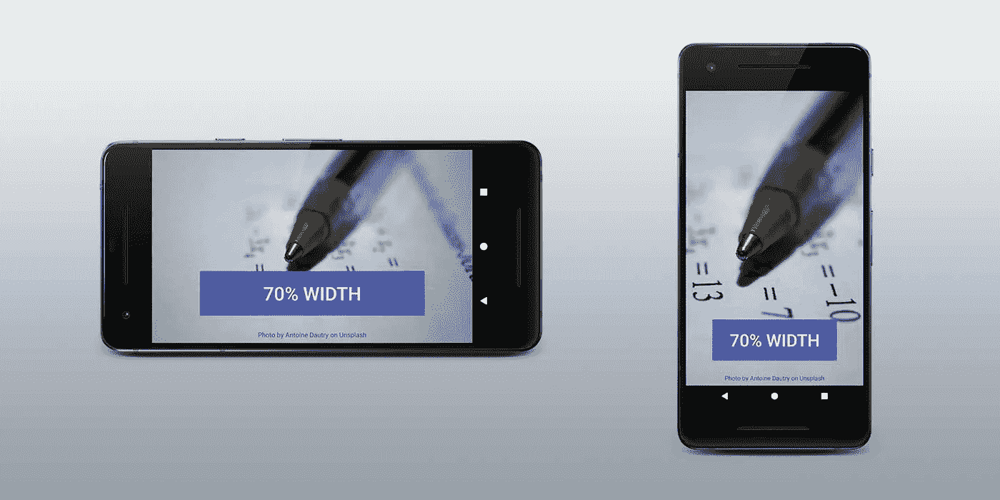
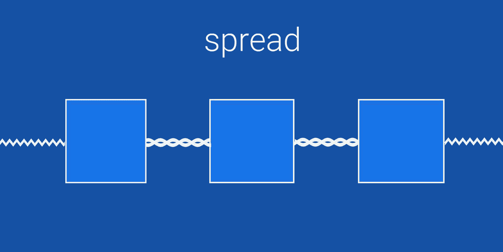
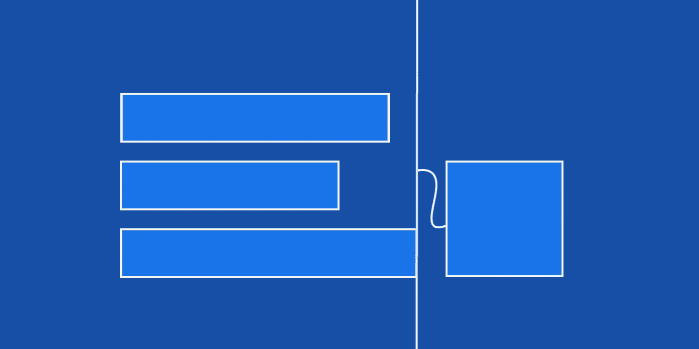
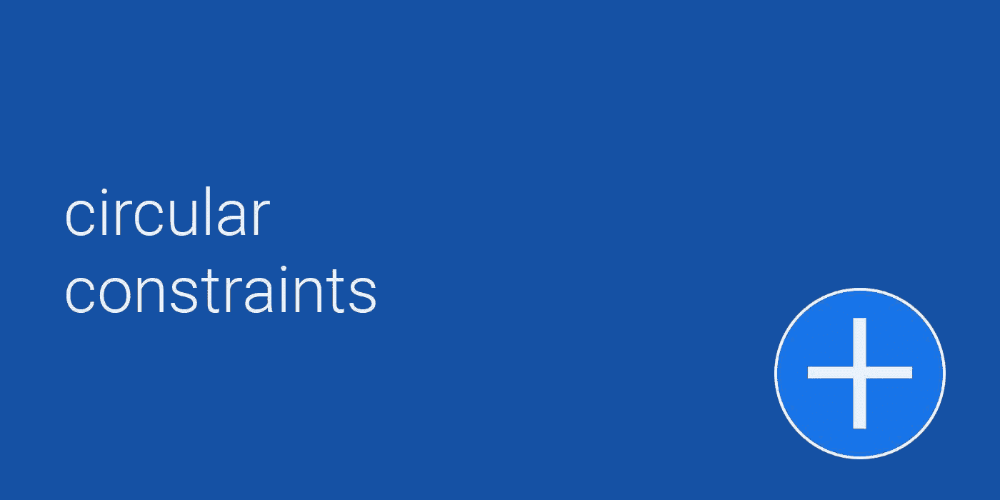

# 引入约束布局 1.1

> 原文：<https://medium.com/androiddevelopers/introducing-constraint-layout-1-1-d07fc02406bc?source=collection_archive---------1----------------------->

Constraint Layout 简化了在 Android 中创建复杂布局的过程，它使得使用 Android Studio 中的可视化编辑器来构建大部分 UI 成为可能。它经常被描述为更强大的`RelativeLayout`。使用约束布局，您可以定义复杂的布局，而无需构建复杂的视图层次结构。

Constraint Layout 1.1 最近作为稳定版发布，有很多值得喜欢的地方。优化的全面检查使大多数布局运行得比以前更快，并且像障碍和组这样的新功能使现实世界的设计变得简单！

## Android Gradle

```
dependencies {
    compile 'com.android.support.constraint:constraint-layout:1.1.0'
}
```

要在项目中使用新功能，请添加约束布局 1.1 作为依赖项。

# 1.1 中的新功能

## 百分比

在约束布局 1.0 中，使一个视图占据屏幕的一个百分比需要制定两条准则。在约束布局 1.1 中，我们通过允许您轻松地将任何视图约束到某个百分比宽度或高度，使它变得更简单。



Specify the width of button using percents so it fits in the available space while maintaining your design.

所有视图都支持`layout_constraintWidth_percent`和`layout_constraintHeight_percent`属性。这将导致约束固定在可用空间的某个百分比。所以用几行 XML 就可以让一个`Button`或一个`TextView`扩展到屏幕的某个百分比。

```
<Button
    android:layout_width="0dp"
    android:layout_height="wrap_content"
    **app:layout_constraintWidth_percent="0.7"** />
```

## 链子

用**链**定位多个元素可让您配置它们如何填充可用空间。在 1.1 中，我们修复了几个关于链的错误，并使它们可以在更多的视图上工作。通过在两个方向上添加约束来制作链。例如，在这个动画中，每个视图之间都有一个约束。



Chains let you configure how to layout multiple related views with **spread**, **spread_inside**, and **packed**.

在链中的任何视图上都可以使用`app:layout_constraintVertical_chainStyle`属性。您可以将其设置为`spread`、`spread_inside`或`packed`。

*   **传播**在链中平均分布所有视图
*   **spread_inside** 将第一个和最后一个元素定位在边缘上，并平均分布其余的元素
*   **打包**在链条中心将元素打包在一起

## 障碍

当你有几个可能在运行时改变大小的视图时，你可以使用一个**屏障**来约束元素。一个屏障位于几个元件的`start`、`top`、`end`或`bottom`处。您可以将它视为创建虚拟组的一种方式，因为它不会将该组添加到视图层次结构中。

当你布局国际化的字符串或者显示用户生成的内容，而这些内容的大小你无法预测的时候，栅栏是非常有用的。



Barriers allow you to create a constraint from several views.

屏障将始终将其自身定位在虚拟组之外，您可以使用它来约束其他视图。在此示例中，右视图被约束为始终位于最大文本视图的末尾。

## 组

有时你需要同时显示或隐藏几个元素。为了支持这一点，约束布局增加了**组**。

组并没有给视图层次结构增加一个级别——它实际上只是一种标记视图的方式。在下面的例子中，我们标记了 id `profile`引用的`profile_name`和`profile_image`。

当有几个元素一起显示时，这很有用。

```
<android.support.constraint.Group
    android:id="@+id/profile"
    **app:constraint_referenced_ids="profile_name,profile_image"** />
```

一旦你定义了群组`profile`，你就可以对群组应用可见性，它将同时应用于`profile_name`和`profile_image`。

```
profile.visibility = GONEprofile.visibility = VISIBLE
```

## 循环约束

在约束布局中，大多数约束是由屏幕尺寸(水平和垂直)指定的。在约束布局 1.1 中，有一种新的约束类型，`constraintCircle`，允许你沿着一个圆指定约束。您可以指定圆的角度和半径，而不是提供水平和垂直边距。这对于像放射式菜单那样有角度偏移的视图很有用！



You can create radial menus by specifying a **radius** and **angle** to offset.

创建圆形约束时，请注意，角度从顶部开始，顺时针前进。在本例中，您将如何指定中间 fab:

```
<android.support.design.widget.FloatingActionButton
    android:id="@+id/middle_expanded_fab"
 **app:layout_constraintCircle="@+id/fab"
    app:layout_constraintCircleRadius="50dp"
    app:layout_constraintCircleAngle="315"** />
```

## 带约束集的动画

你可以使用约束布局和`[ConstraintSet](https://developer.android.com/reference/android/support/constraint/ConstraintSet.html)`一次激活几个元素。

一个`ConstraintSet`只包含一个`ConstraintLayout`的约束。您可以在代码中创建一个`ConstraintSet`，或者从布局文件中加载它。然后您可以将一个`ConstraintSet`应用到一个`ConstraintLayout`，更新所有约束以匹配`ConstraintSet`中的内容。

要制作动画，使用支持库中的`[TransitionManager.beginDelayedTransition()](https://developer.android.com/reference/android/transition/TransitionManager.html#beginDelayedTransition(android.view.ViewGroup))`。此功能将使您的`ConstraintSet`中的所有布局更改变为动画。

这里有一段视频更深入地讲述了这个话题:

## 新的优化

约束布局 1.1 增加了几个新的优化来加快你的布局。优化作为一个单独的过程运行，并试图减少布局视图所需的约束数量。

一般来说，它们的工作原理是在你的布局中找到常数并简化它们。

有一个新标签，叫做`layout_optimizationLevel`，它配置优化级别。它可以设置为以下内容:

*   **障碍**找出障碍所在，并用更简单的约束代替它们
*   **direct** 优化直接连接到固定元素的元素，例如屏幕或指引线的侧面，并继续优化直接连接到它们的任何元素
*   **标准**是默认优化级别，包括**障碍**和**直接**
*   **尺寸**目前处于试验阶段，可能会导致某些布局出现问题——它通过计算尺寸来优化布局路径
*   **链**目前是实验性的，并且弄清楚如何以固定的大小来布置元素链

如果您想尝试实验性优化**尺寸**和**链**，您可以在 ConstraintLayout 上启用它们

```
<android.support.constraint.ConstraintLayout 
    **app:layout_optimizationLevel="standard|dimensions|chains"**
```

# 了解更多信息

[](https://developer.android.com/training/constraint-layout/index.html) [## 使用 ConstraintLayout | Android 开发人员构建响应式用户界面

### ConstraintLayout 在与 Android 2.3 (API level 9)及更高版本兼容的 API 库中可用。这一页…

developer.android.com](https://developer.android.com/training/constraint-layout/index.html) [](https://developer.android.com/reference/android/support/constraint/ConstraintLayout.html) [## ConstraintLayout | Android 开发者

### 相对定位是在 ConstraintLayout 中创建布局的基本构件之一。那些限制…

developer.android.com](https://developer.android.com/reference/android/support/constraint/ConstraintLayout.html) [](https://codelabs.developers.google.com/codelabs/constraint-layout/) [## 使用 ConstraintLayout 设计您的 Android 视图

### 在这个代码实验室中，你将学习如何使用 Android Studio 布局编辑器和 constraint Layout——一种新的布局类型…

codelabs.developers.google.com](https://codelabs.developers.google.com/codelabs/constraint-layout/) 

要了解更多关于约束布局 1.1 的内容，请查看文档和代码实验室！