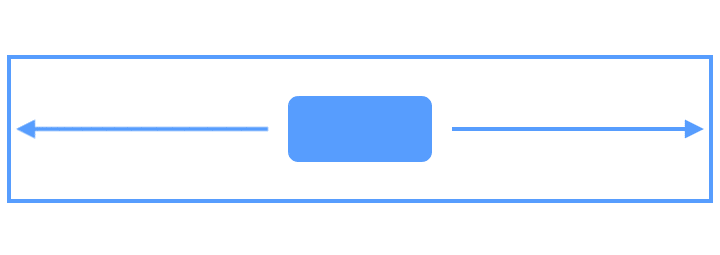
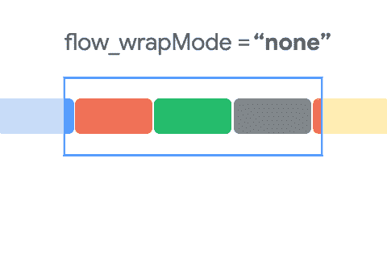
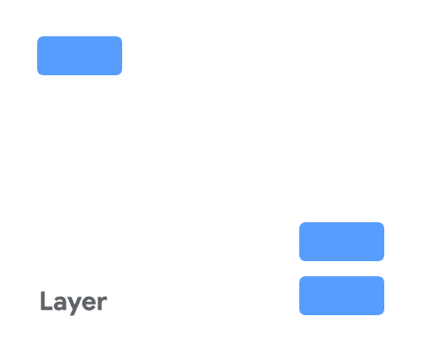
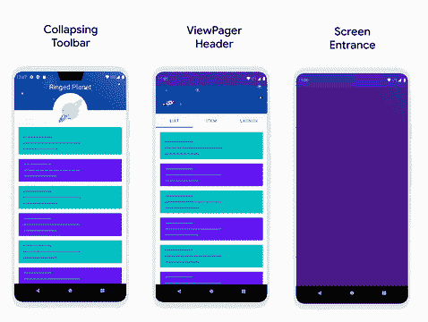

# 引入约束布局 2.0

> 原文：<https://medium.com/androiddevelopers/introducing-constraint-layout-2-0-9daa3e99995b?source=collection_archive---------2----------------------->


Illustration by [Virginia Poltrack](/@VPoltrack).

Constraint Layout 是最受欢迎的 jetpack 库之一，我们很高兴地分享 Constraint Layout 2.0 已经发布！它具有 Constraint Layout 1.1 的所有特性，您可以熟悉这些特性来快速构建复杂的布局，并与 Android Studio 集成了工具来预览您的 XML 甚至编辑您的布局。

约束布局 2.0 为约束布局带来了几个新功能。要用的话，撞一下`build.gradle`里的版本。

```
implementation “androidx.constraintlayout:constraintlayout:2.0.1”
```

随着 2.0 的发布，我们还为约束布局创建了一个 github [库](https://github.com/AndroidX/constraintlayout)。它目前是一个只读存储库，我们正在努力实现拉请求。

# 流动

[Flow](https://developer.android.com/reference/androidx/constraintlayout/helper/widget/Flow?hl=en) 是一个新的虚拟布局，用于构建链，当链用完空间时，可以绕到下一行，甚至屏幕的另一部分。当您在一个链中布置多个项目，但不太确定容器在运行时会有多大时，这很有用。您可以使用它在应用程序中基于动态大小构建布局，比如旋转时的屏幕宽度。



**Figure:** Animation showing `*Flow*` creating multiple chains as elements overfill a row

`Flow` 是虚拟布局。**约束布局中的虚拟布局**是参与约束和布局的虚拟视图组，但不增加层次。相反，它们参考约束布局中的其他视图来完成布局。



**Figure:** Visualization of flow modes `*"none"*`, `*"chain"*`, `*"align"*`

使用`Flow`标签在约束布局 2.0 中添加一个`Flow`。`Flow`围绕您在`constraint_referenced_ids`中传递的视图创建一个虚拟视图组，将引用的视图排列成一个链。

Example usage of Flow in Constraint Layout

`Flow`最重要的选项之一是`wrapMode`，它允许您配置当内容溢出(或换行)时该做什么。

您可以为`wrapMode`指定三个选项:

*   `**none**`–创建一个单链，如果内容不合适，就会溢出
*   `**chain**`–溢出时，为溢出元素创建添加另一个链
*   `**align**` —类似于链，但将行与列对齐

要了解更多关于心流的知识，请阅读官方文件。

# 层

一个新的助手`[Layer](https://developer.android.com/reference/androidx/constraintlayout/helper/widget/Layer)`，让你从几个视图中创建一个虚拟层。与`Flow`不同的是，它并不展示视图。相反，`Layer`让你一次在几个视图上应用变换。

如果你想为`rotate`、`translate`或`scale`几个视图一起构建动画，这是很有用的。



**Figure:** Apply transformations to multiple views together using a `*Layer*`

图层在布局过程中调整大小，并将根据它引用的所有视图调整大小。

要在约束布局 2.0 中添加一个层，使用`Layer`标签:

Example usage of Layer in Constraint Layout

# 运动布局



**Animation:** Screens of the new [Motion Layout Integrations sample](https://github.com/android/views-widgets-samples/tree/master/ConstraintLayoutExamples/motionlayoutintegrations)

运动布局是约束布局 2.0 中最受期待的功能之一。它提供了一个丰富的动画系统来协调多个视图的动画。`MotionLayout`基于`ConstraintLayout`并对其进行扩展，允许你在多组约束(或`ConstraintSet` s)之间制作动画。您可以自定义视图如何移动、滚动、缩放、旋转、淡入淡出，甚至动画化自定义属性。它还可以处理基于物理的手势和控制动画的速度。用`MotionLayout`构建的动画是可查找和可逆的。这意味着你可以跳到动画中的任何一点，甚至可以倒放。

集成在 Android Studio 中的运动编辑器可以让你使用`MotionLayout`构建、预览和编辑动画。这使得在协调多个视图时调整动画的细节变得容易。

了解更多关于运动编辑器的信息，请阅读 Scott Swarthout 的博客文章

[](https://android-developers.googleblog.com/2020/07/introducing-motion-editor.html) [## 运动编辑器简介

### 我们与 Android 开发者社区进行了交流，了解到动画对于使用户界面更加直观非常重要…

android-developers.googleblog.com](https://android-developers.googleblog.com/2020/07/introducing-motion-editor.html) 

通过实践指南了解运动布局，查看运动布局代码实验室:

[](https://codelabs.developers.google.com/codelabs/motion-layout/#1) [## Kotlin 03.2 中的高级 Android:带 MotionLayout 的动画

### 这个代码实验室是 Kotlin 高级机器人课程的一部分。如果你努力学习，你将从这门课程中获得最大的价值

codelabs.developers.google.com](https://codelabs.developers.google.com/codelabs/motion-layout/#1) 

Motion Layout 是一个通用的动画工具——你可以用它在 Android 上制作几乎任何动画。然而，在两种情况下，Motion Layout 比其他选项更擅长构建动画。

*   **可查找的动画** —由其他输入驱动的动画，例如响应滚动的折叠工具栏
*   **状态转换** —由状态变化驱动的动画，例如用户进入屏幕

新的[运动布局集成示例](https://github.com/android/views-widgets-samples/tree/master/ConstraintLayoutExamples/motionlayoutintegrations)展示了如何使用运动布局为这些用例构建丰富的动画。每个屏幕都旨在展示您可以使用 Motion Layout 构建的实用动画效果，以及如何构建与其他视图的集成。

[](https://github.com/android/views-widgets-samples/tree/master/ConstraintLayoutExamples/motionlayoutintegrations) [## Android/视图-小部件-示例

### 多个示例展示了 Android 上视图小部件的最佳实践。-Android/视图-小部件-示例

github.com](https://github.com/android/views-widgets-samples/tree/master/ConstraintLayoutExamples/motionlayoutintegrations) 

约束布局 2.0 中有很多新特性。查看文档、codelab 和示例，开始在您的应用中使用它。

我们迫不及待地想看看你的作品！