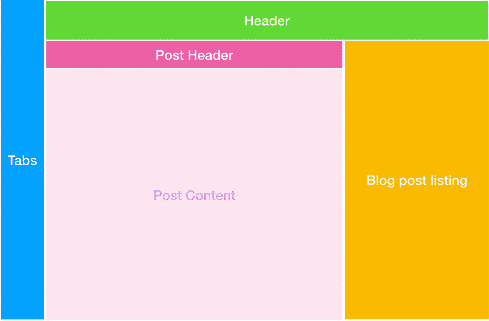
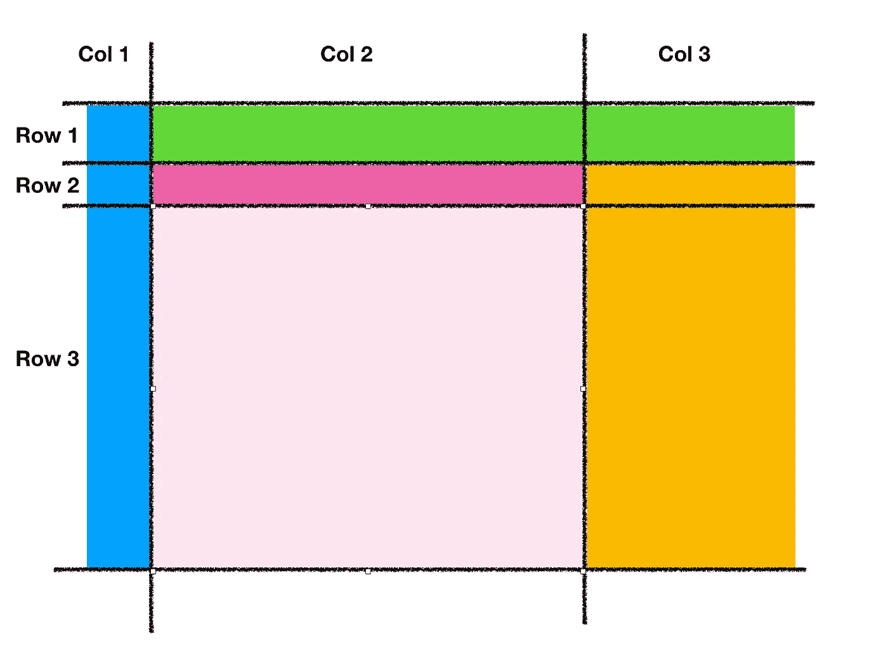

# 介绍 CSS 网格——一个“盒子里面”的理论！

> 原文：<https://medium.com/quick-code/introducing-css-grids-a-think-inside-the-box-theory-c74e96c2f626?source=collection_archive---------0----------------------->


Photo by [Hal Gatewood](https://unsplash.com/@halgatewood?utm_source=medium&utm_medium=referral) on [Unsplash](https://unsplash.com?utm_source=medium&utm_medium=referral)

如果你没有使用过 CSS 网格或者还不知道它是什么，那么让我大胆地说一句

## 你建立网站的方式是错误的！

是啊！css 提供了如此令人难以置信的特性，并且得到了所有主流浏览器的支持。不使用它是刑事犯罪！

很长一段时间以来，web 开发人员一直在一维空间中进行标记。这是一种从上到下的方式，元素从左到右对齐。有些人可能会说，到目前为止，它做得很好，我同意！世界各地的开发者已经用它建立了一些惊人的网站！但是这里有三个支持 css 网格的词，它会让你离开你的舒适区，跳入未知的领域…

## 二维布局

是时候了！很长一段时间以来，我们一直在为从上到下的流程中从左到右排列项目而烦恼。使用网格，你不仅可以定义列，还可以定义行！所以你得到了这些单元格**，你可以通过添加一个叫做网格区域的 css 属性来放置任何 html。**

本文不是对 CSS 网格的定性分析。所以，我将用一个实际的例子向你展示是什么让 css 网格变得如此棒。让我们假设你想创建自己的博客。你想出了非常独特和体面的布局，唯一要做的就是把这个布局变成现实。



A fancy blog webpage layout!

您可以通过保持“tabs”div 独立来创建这种布局。然后将所有其他元素放在一个包装器 div 中。那么在这个包装器中，你必须保持头部独立。再次将所有其他元素嵌套到另一个包装器中，这样一直进行到最后一部分结束！对吗？如果你认为在传统风格中有更好的方法，请在评论部分指出来。

这是一个代码笔截图的参考，我在这里用传统的方式构建了这个布局

如果你看到 HTML 元素复杂的嵌套结构，那就没有任何意义了。如你所见，在 css 中，我必须为几乎每个元素的类指定尺寸和位置。

但是现在我想让你看看下面附上的代码笔截图。输出是相同的。但是再深入一点，观察两个例子的区别！

[https://codepen.io/ankush-vats/pen/wxmarb?editors=1100](https://codepen.io/ankush-vats/pen/wxmarb?editors=1100)

# 我知道没错！

你猜对了！或者即使不完全理解，也很容易理解第二个例子中发生了什么！但我打算对第二个进行详细分析，以填补空白(如果有的话)。

所以，让我们从什么改变了开始…

## 1.平面 HTML 结构

不需要嵌套，我创建了一堆 div 元素，给它们一个类名，就这样！我不需要考虑它在布局中如何堆叠，因为所有这些现在都在 css 中控制。这里你应该注意的一点是，这些 div 的顺序并不重要。您可以在 html 代码中上下移动 div，布局仍然保持不变。(只要您将它们放在容器内，即标签)

## 2.尺寸的一次性声明

正如您在代码中看到的，我们不需要指定每个元素在它们自己的 css 类中的维度。多酷啊！连你的 css 现在都这么干净。

```
.tab{
 grid-area: tab;
 background-color: #00A2FF;
}.header{
 grid-area: header;
 background-color: #61D836;
}.post-header{
 background-color: #EF5FA7;
}.post{
 grid-area: post;
 background-color: lightpink;
}.sidebar{
 grid-area: sidebar;
 background-color: #F8BA00;
}
```

## 3.那么，奇迹发生在哪里呢？

在这一点上，你可能会想，到目前为止我们没有做什么特别的事情，那么神奇的事情都发生在哪里呢？对吗？这一切都发生在 body 标签的样式定义中。

```
body{
 display:grid;

 grid-template-areas: 
        “tab header header”
        “tab post-header sidebar”
        “tab post sidebar”; grid-template-columns: 40px auto 200px;
 grid-template-rows: 40px 30px auto;

 height: 330px;
 width: 640px;

 font-family: sans-serif;
 color: white;
 font-weight: bolder;
 text-align: center;
}
```

在第一行，我们告诉浏览器，好的，兄弟，这个特殊的 body 标签实际上是一个网格！浏览器对此没有特别的印象

所以你用 ***网格-模板-区域来定义这个网格能容纳什么。*** 艺术就是将你的布局分割成小单元(网格区域)。别担心，这很容易做到。根据布局中的最小元素，计算所需的最大列数和行数。



Dissecting the layout into max no of rows and column required

现在我知道在这个布局中，我们将标题分成了两列，标签栏分成了 3 行，侧栏分成了 2 行。但是不用担心他们！我们将在稍后定义网格模板区域时将它们组合在一起。

> **#pro-tip** 绘制网格线，保持最小网格区域不被分割

在我们的例子中，最小的单个元素恰好是 post-header。这就是为什么我们必须将布局划分为 3×3 矩阵。

```
grid-template-areas:
        “tab header header”
        “tab post-header sidebar”
        “tab post sidebar”;
```

在定义网格区域时，您可以看到我们通过给它们相同的名称(tab)对整个 col 1 进行了分组。标题和侧边栏也是如此，这就是如何用 css 网格定义结构！你只需要知道这些！没有火箭科学是吗？现在，您只定义了布局结构。接下来是这些网格区域的尺寸。如下所示，其语法非常容易理解。

```
 grid-template-columns: 40px auto 200px;
 grid-template-rows: 40px 30px auto;
```

> **#pro-tip** 使用“自动”,您可以将整个剩余宽度/高度分配给元素。为所有固定维元素分配空间后，浏览器会计算该值。

这绝不是 css 网格的详尽指南，还有一些其他概念没有在本文中介绍。这就是为什么我喜欢在我们的项目中使用 CSS grid 来创建令人敬畏的 ui。在产品发布之前，我们曾经用 css 网格重做了整个项目。我们发现我们的 HTML 代码可读性更好。此外，它的总长度只有一半，使用网格时也不会那么头疼。我希望你喜欢你到目前为止读到的东西！我将发表另一篇关于如何使用 Css 网格制作响应式网页的文章，作为这篇文章的继续。但是现在…

# 这是它的乡亲们！

下次见！长命百岁，兴旺发达；)