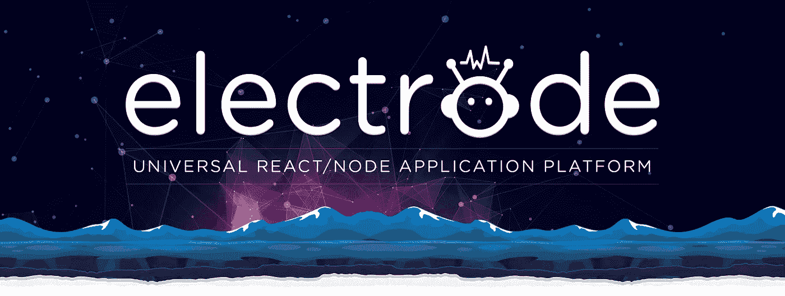
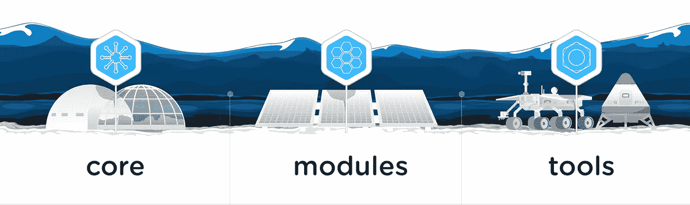

# 介绍来自@WalmartLabs 的开源版本电极

> 原文：<https://medium.com/walmartglobaltech/introducing-electrode-an-open-source-release-from-walmartlabs-14b836135319?source=collection_archive---------0----------------------->

在不到一年的时间里，Walmart.com 完成了向 React/Node.js 的迁移，我们为这一成就感到自豪！我们的目标是建立一个新的应用平台来帮助 [@WalmartLabs](http://www.walmartlabs.com/) 和它的工程师们适应未来。

> **今天，我们很兴奋地宣布为 Walmart.com 供电的应用平台** [**电极**](http://www.electrode.io) **的开源发布。**

# **Walmart.com 秤**

每月 8000 万访客，每秒加载 10，000 个请求，1500 万件商品，每月增加 100 多万件新商品，这就是沃尔玛网站的规模。由于电子商务业务在美国在线零售商中排名第二，我们不仅需要扩大 Walmart.com 的规模，还需要真正利用我们工程基础的人才和创造力。

# **核心目标**

在电子商务开发中，平台迁移是一件严肃的事情。技术在不断发展，重要的是改变和适应以保持竞争力。然而，改造一个工程组织是一个完全不同的故事。拥有数百名工程师和数十种应用的[电极平台](http://www.electrode.io)旨在解决每个大型组织都面临的核心问题:

1.  **简化开发周期-** 我们希望我们的开发人员能够快速启动新项目，以实现缩短上市时间的最终目标。当启动一个新的应用程序时，有许多技术和配置需要开发人员粘在一起(如服务器端呈现、redux、webpack 配置、css 模块、post css、部署脚本、国际化、javascript/css 林挺、karma/mocha 配置、代码覆盖配置等)。为了快速启动新的应用程序，我们希望将所有这些整合到一个易于使用的包中，并具有遵循最佳实践的可扩展结构。这种方式[电极](http://www.electrode.io)允许开发者将他们的注意力集中在构建客户想要的功能上。
2.  **结构和最佳实践-** 在@WalmartLabs 的几十个团队中有数百名工程师，我们需要确保我们所有的应用程序都是一致和可靠的，并遵循最具可扩展性的开发实践。我们还需要关注跨项目的一致构建和部署的结果，以及良好的脚手架，以使开发人员走上正确的道路。 [Electrode 的原型](http://www.electrode.io/docs/what_is_electrode.html#core-quick--easy)系统为我们提供了构建可信的可扩展应用的最佳实践和结构。
3.  **代码重用-** @WalmartLabs 为沃尔玛在 11 个国家的 12 个网站提供支持，包括美国的 SamsClub.com 和英国的 Asda。跨项目和品牌共享 React 组件是提高生产力的一个很好的方式——但前提是开发人员能够找到组件并信任它们的质量和一致性。电极的原型确保了一致的结构，并且像[电极浏览器](http://www.electrode.io/docs/electrode_explorer.html)这样的工具使得在成千上万的组件中搜索找到你需要的东西变得容易。
4.  **Performance/Universal JavaScript-**我们知道服务器端渲染(SSR)可以对性能和 SEO 产生影响，因此 Electrode 支持开箱即用。但是我们看到了进一步提升性能的机会，所以我们创建了[电极缓存和配置](http://www.electrode.io/docs/server_side_render_cache.html)、[折叠渲染](http://www.electrode.io/docs/above_fold_rendering.html)和 [Redux 路由器引擎](http://www.electrode.io/docs/redux_router_engine.html)。

> **我们在@WalmartLabs 解决的问题，我们希望为社区解决。这就是电极为您提供的开箱即用的解决方案——上述问题的解决方案。**

# **给你的 App 通电！**

我们创建[电极](http://electrode.io)的理念是，开发者应该能够获得他们需要的东西，而不必改变他们应用的结构。所以我们把它分成三部分:[电极芯](https://electrode-io.github.io/docs/what_is_electrode.html#core-quick--easy)、[电极模块](https://electrode-io.github.io/docs/what_is_electrode.html#stand-alone-modules-optimize-where-you-want)和[电极工具](https://electrode-io.github.io/docs/what_is_electrode.html#tools-power-up-your-existing-applications)。

1. [**电极芯**](https://electrode-io.github.io/docs/what_is_electrode.html#core-quick--easy) **-** 采用符合现代最佳实践的简单、一致的结构，快速启动新项目。

2. [**电极模块**](https://electrode-io.github.io/docs/what_is_electrode.html#stand-alone-modules-optimize-where-you-want) **-** 访问预打包模块，帮助完成各种复杂的任务和功能，从服务器端渲染缓存到灵活的配置管理。这些模块可以独立于电极芯使用，这意味着您可以将它们集成到您现有的应用程序中

3. [**电极工具**](https://electrode-io.github.io/docs/what_is_electrode.html#tools-power-up-your-existing-applications) **-** 使用我们强大的工具，其中包括一个能够发现可重用组件的工具([电极浏览器](http://www.electrode.io/docs/electrode_explorer.html))和另一个帮助优化 JavaScript 包的工具([通电](http://www.electrode.io/docs/electrify.html)和[包分析器](http://www.electrode.io/docs/bundle-analyzer.html))。这些工具可以被现有的应用独立地消耗，而不消耗电极芯。

> **简而言之，电极是构建通用 React/Node.js 应用的优质平台。它为 Walmart.com 供电。而且，现在开发者可以将电极平台作为一个整体使用，也可以根据需要将它分成几部分。**

# 电极对@WalmartLabs 的影响

*   **规模**-Walmart.com 的大部分现在运行在电极平台上，包括主页、登录、购物车、结账、类别和项目视图。我们正在将 SamsClub.com 转移到电极上，我们计划明年让沃尔玛超市使用电极。
*   **性能-** 我们对性能的关注对我们的应用产生了重大影响。在服务器端呈现的页面中，主页现在快了 20%，登录页面快了 15%。客户端呈现的结账页面速度提高了 20%。以前在客户端呈现的页面现在在服务器端呈现，性能提高了 30%。此外，我们的 JavaScript 包大小减少了 20%。
*   **开发人员生产力**——我们能够在工程师加入@WalmartLabs 的同一天让他们入职。大多数工程师能够在他们开始工作的几天内发布代码。
*   **重用** -我们看到大量的 React & Redux 组件在我们的应用和品牌中使用，比如 Walmart.com 和 SamsClub.com。当一个应用程序或品牌能够快速轻松地利用为另一个品牌或应用程序创建的功能时，其结果是上市时间的显著缩短。
*   总的来说，我们的工程师对他们使用的现代技术感到兴奋，我们的内部开发人员社区感到充满活力，沃尔玛能够更有效地竞争。

# **投资未来**

我们仍在改进电极。未来的增强将包括更深入地关注移动、性能增强等——因为@WalmartLabs 致力于开源，我们的投资是对所有希望使用电极的开发人员的投资。

我们很高兴看到开发人员将使用电极构建什么。查看[电极. io](http://www.electrode.io) 网站，深入了解[电极的详细特性](http://www.electrode.io/docs/what_is_electrode.html#features)，使用我们的[入门:快速指南](http://www.electrode.io/docs/get_started.html)立即开始构建，或者查看我们的 [GitHub](https://github.com/electrode-io) 。

# **特别感谢**

非常感谢 [**劳伦特·德塞格**](https://twitter.com/ldesegur) ，我们的工程副总裁，他在我们前进的每一步都给予了我们支持。没有他，这个平台，这个转变，还有开源的发布都是不可能的。

感谢 Jack Herrington，他领导了一场基层运动，向 React 宣传并激励开发者。

感谢[乔尔陈](https://medium.com/u/9f67cc98eb00?source=post_page-----14b836135319--------------------------------)、[阿潘那纳瓦提](https://medium.com/u/d8fa8407b711?source=post_page-----14b836135319--------------------------------)、[曹杨史](https://medium.com/u/e16a73e715e3?source=post_page-----14b836135319--------------------------------)。

感谢我们的领导和所有参与使 Electrode 取得成功的人。