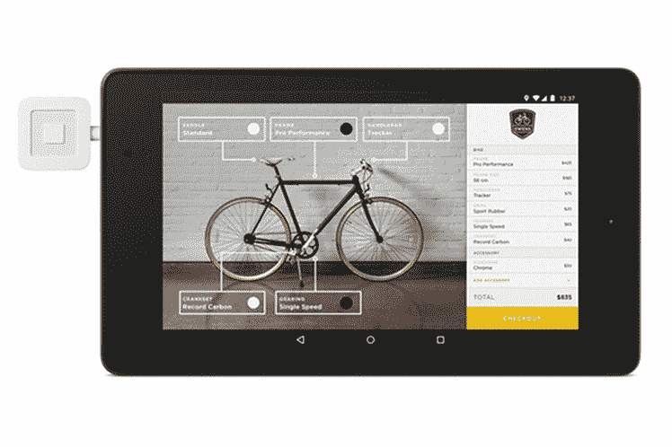

# 引入对 Square 注册 API 的增强

> 原文：<https://medium.com/square-corner-blog/introducing-enhancements-to-squares-register-api-5ba1edd0b4b8?source=collection_archive---------3----------------------->

## Square 为其开发者平台发布了一系列新功能和增强功能。

> 注意，我们已经行动了！如果您想继续了解 Square 的最新技术内容，请访问我们的新家[https://developer.squareup.com/blog](https://developer.squareup.com/blog)

Square 为其开发者平台发布了一系列新功能和增强功能。这些增强是 Register API 的一部分，包括:

*   能够将客户 ID 传递到 register 应用程序，并将客户的卡详细信息保存在文件中；
*   消除使用开发者应用为商家构建 OAuth 流的需求；和
*   Android Web API。

## **能够将客户 ID 传递给注册应用程序，并将客户的卡详细信息保存在文件中**

*注意:*这是 iOS 的新功能，Android *已经有了。*

在 iOS 上，现在可以将客户 ID 传递给 Register API 发起的事务请求。可以使用我们的 [ListCustomers](https://docs.connect.squareup.com/api/connect/v2/?q=customer%20api#endpoint-listcustomers) 端点来检索客户 ID。

当客户 ID 被传递给注册 API 时，会发生两件事:

*   顾客会对销售产生兴趣。这意味着，如果您在事后提取一个交易列表，这个客户 ID 将作为[偿付](https://docs.connect.squareup.com/api/connect/v2/?q=tender#type-tender)对象的一部分在响应中返回。
*   如果您已将`CARD_ON_FILE`偿付添加到请求中，与该客户 ID 相关联的存档卡将在结账时作为存档卡偿付类型的一部分出现在付款选项屏幕上。

Card on file helps speed up the checkout process with returning customers

更多详情，请访问我们的开发者门户[这里](https://docs.connect.squareup.com/articles/register-api-ios-v1.2-released-2016-11/)。

## **删除了使用开发者应用为商户构建 OAuth 流程的要求**

*注意:这一增强功能在 iOS 和 Android 上都可用。*

以前，如果你想让商家使用你的应用，你需要建立 OAuth 流程。该流程将使用第三方应用程序的商家重定向到 web 浏览器，商家使用其 Square 凭据登录并批准某些权限，从而使第三方应用程序能够代表商家处理支付。

Oauth requirement has been removed to enhance the user experience

然而，商家还需要下载并登录他们设备上的 Square Register 应用程序，这不是一个最佳流程。

通过取消 OAuth 要求，商家将只需在 Register 应用程序中登录一次，而不再需要通过 OAuth 流程。这使您可以更快地启动和运行，而不需要建立服务器来支持 OAuth 流。

## **Android Web API**

*注:iOS Web API 自 2016 年 3 月开始在 Square 的开发者平台上提供。*

如果您正在构建一个基于 Android web 的 POS 解决方案，需要处理当面支付，那么您现在可以使用 Register API 来完成这项工作。

Customized bike shop app built with Android web-based POS

流程如下:

商家在移动设备上从移动浏览器中使用基于网络的 POS。到了要收费的时候，商家轻点一个按钮；设备应用切换到注册；商户通过 Register 中的支付流程进行支付；交易完成后，Register 应用程序会切换回手机浏览器。

对于那些没有本地移动专业知识的人来说，这一新功能使得为任何企业集成 EMV 支付处理变得极其容易。有了 Square iOS web API 和这个新的 Android 版本，我们现在很高兴能够提供一个跨平台的 web 销售点解决方案。