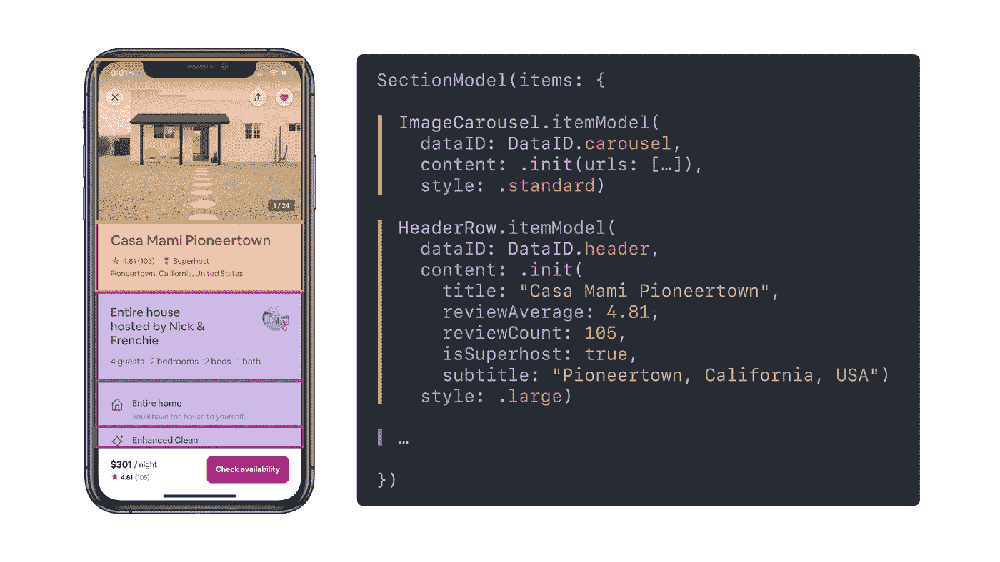
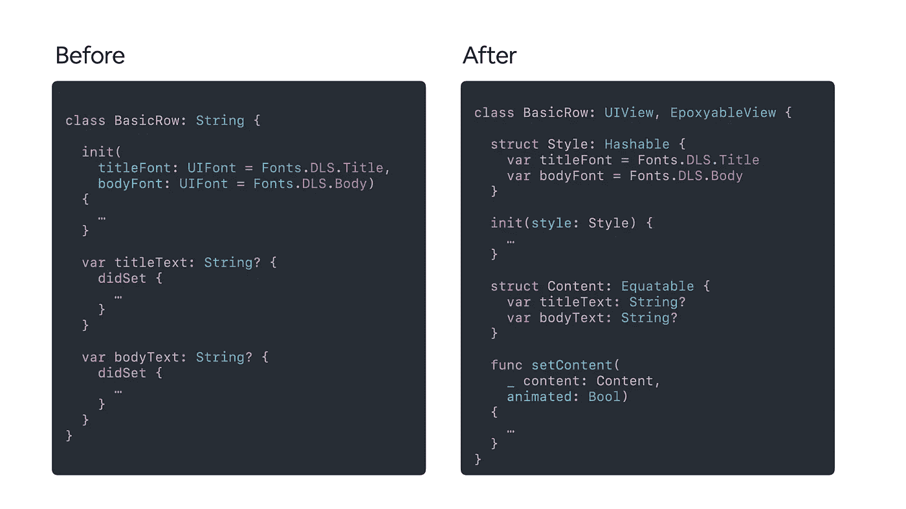
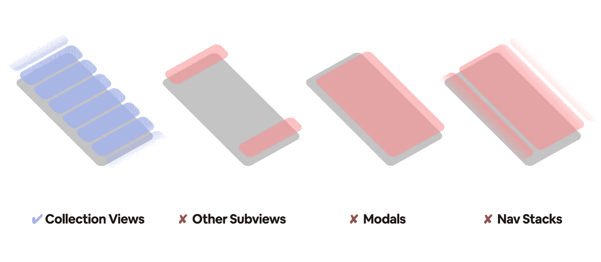
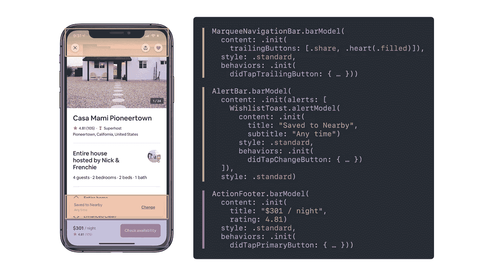
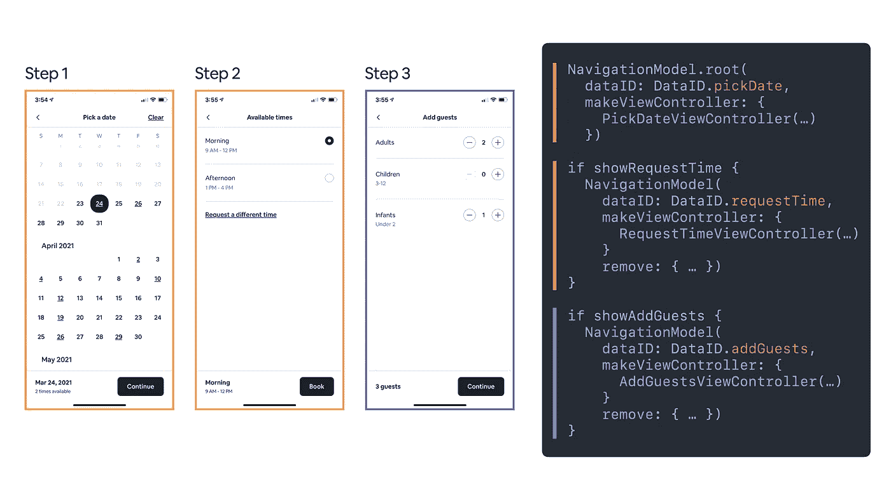
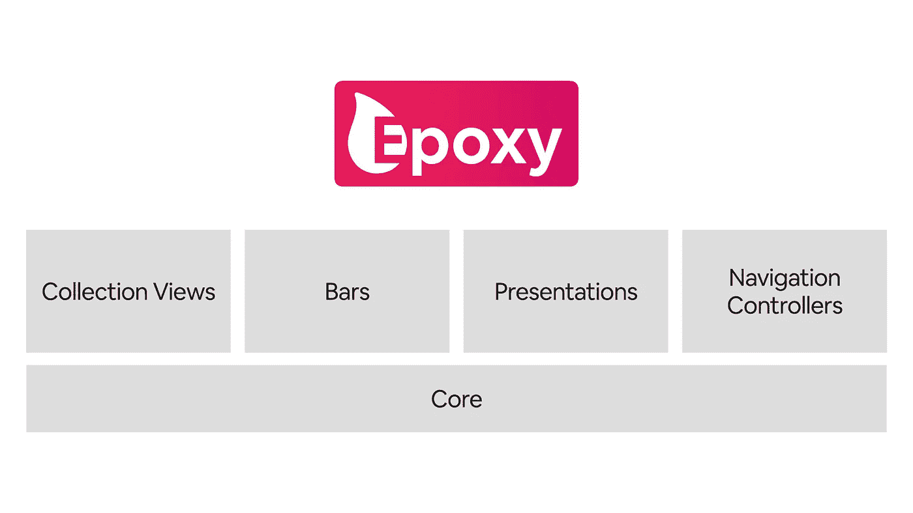
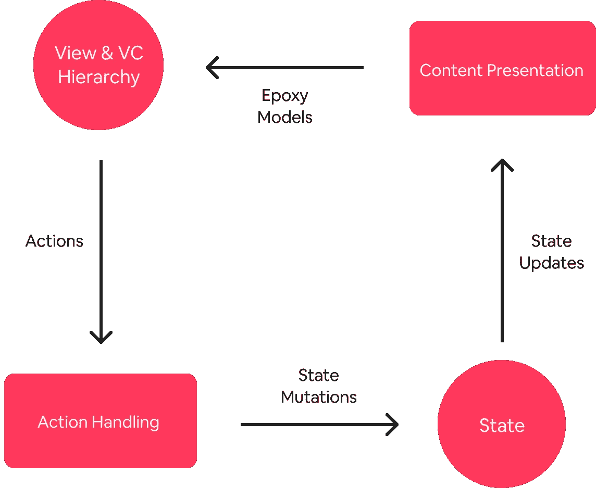

# iOS 用环氧树脂简介

> 原文：<https://medium.com/airbnb-engineering/introducing-epoxy-for-ios-6bf062be1670?source=collection_archive---------1----------------------->

Airbnb 的一个新库，用于声明性地构建 iOS 应用程序

环氧树脂在 iOS 上的故事始于 2016 年。Swift 仍然是一门非常新的语言，我们最近开始[在我们的代码库](/airbnb-engineering/getting-to-swift-3-at-airbnb-79a257d2b656)中广泛采用它。对于新语言，我们仍然在尝试如何最好地构建 UI。

不幸的是，事情并不像我们希望的那样顺利——在 Swift 中构建 UI 的早期范例中，我们不仅在我们的一些核心功能上经历了数十万次崩溃，我们还发现我们的工程师非常不满意，在-100 到 100 的范围内给他们的开发体验打了一个[净推广分数](https://en.wikipedia.org/wiki/Net_Promoter)的 **-78** 。

这是为什么？复杂性的主要来源之一是我们更新屏幕内容的 API。我们内部的 UI 框架要求工程师编写冗长而复杂的逻辑，指定每一个索引路径[以及每当内容改变时的更新，以获得平滑的更新动画。当然，每当产品需求改变时，这种逻辑也需要改变——例如，向主页详细信息屏幕添加一个新的部分，在页面加载后异步加载其内容，这就需要改变现有的索引路径更新逻辑，以便在新部分加载时动态显示。](https://developer.apple.com/documentation/foundation/indexpath)

这些索引路径中的任何一条出错都会导致生产崩溃。肯定有更好的方法来管理这个逻辑——但是真正的问题是*如何—* 我们如何重新处理这个问题以避免工程师需要手动维护这个逻辑？此外，我们如何让构建 UI 的 API 变得易于使用？

# 命令式与陈述式

退一步说，以这种方式手动指定索引路径更新是[命令式编程](https://en.wikipedia.org/wiki/Imperative_programming)的经典例子。如果你不熟悉这个概念，命令式编程就是你必须准确描述程序应该如何运行来完成你的目标。[相反，声明式编程](https://en.wikipedia.org/wiki/Declarative_programming)允许你向程序描述你的目标，并让程序明白它需要如何操作来实现这个目标。

在崩溃更新的情况下，我们通过手动指定每个索引更新来描述*程序应该如何操作*,而不是向程序描述我们的目标，即将屏幕内容更新为一组新内容。这是导致环氧树脂的关键见解。通过提升抽象层次——从命令式到声明式——我们既可以自动化这项繁琐的工作，又可以使我们的应用程序从长远来看更容易构建和维护。

因此，为了从整体上解决这个问题，[《环氧树脂》的原作者劳拉·斯凯尔顿](https://github.com/lauraskelton)将其重新划分为两个部分——首先，我们需要创建一个语义 API，让我们能够向程序描述我们的目标:我们希望它呈现的任何屏幕的内容。第二，为了自动化*如何*，我们需要编写一个通用的解决方案来自动准确地计算每当内容发生变化时需要哪些更新来应用更新的内容。

# 用于 UICollectionView 的环氧树脂

为了实现这些目标，Laura 创建了一个 API，允许您在一个数据结构中完整地描述一个 [UICollectionView](https://developer.apple.com/documentation/uikit/uicollectionview) 的内容:一个包含节级配置的节模型数组，每个节模型包含一个包含项级配置的项模型数组，比如如何构造一个视图，当它被重用时如何配置它，等等。这些模型的设计成本很低，因此可以在每次状态改变时创建并应用整个屏幕表示。

Epoxy’s semantic content API for declaring collection view content

作为这一变化的一部分，我们还更新了视图，使其可以很容易地与声明性范例一起使用。我们没有像以前那样为每个内容属性设置许多可单独设置的属性或许多唯一的初始化器参数，而是为每个视图转移到一种统一的“内容”和“样式”类型的模式，这种模式允许您一次指定所有视图属性。这给了我们一个真正的语义 API，当创建内容数据结构时，您可以提供构建或更新视图所需的所有属性，而不需要为[闭包](https://docs.swift.org/swift-book/LanguageGuide/Closures.html)提供配置视图实例的逻辑。

Creating a semantic content API required reworking our views to have unified paradigms for configuration

一旦我们创建了语义内容 API，我们需要一种方法来计算它们之间的批量更新，这样我们就可以确保我们可以完全定义索引路径崩溃。我们需要一个快速通用的差分算法，我们求助于 Paul Heckel 在 1978 年提出的快速 O(N)差分算法来完成这项工作。

Paul Heckel 的算法最初是用来操作文档中的文本的。我们对它进行了更新，改为对视图标识符进行操作，在框架中称为“数据 id”。此外，除了插入、删除和移动之外，我们还添加了“更新”的概念，允许我们在状态改变后识别内容更新并将其应用到现有的视图实例。

与此同时，我们专注于 Android 的队友也一直在开发一个框架，该框架有许多与这个新系统相同的指导原则——Android 的[Epoxy](https://github.com/airbnb/epoxy)。尽管由于平台的不同，实现细节和 API 也有所不同，但这些系统在理念上是一致的。因此，我们将我们的新系统与 Epoxy for Android 命名相结合，以简化跨平台协作和工具。

一旦我们在 UICollectionView 上构建了这个新的语义 API 和区分算法，并将我们的主页迁移到它上面，我们很高兴地看到我们仍然有很棒的更新动画，没有崩溃，也没有维护开销。我们从成千上万的索引路径崩溃到零，一个非常负面的开发者体验到+58 的净推广分数。此外，我们脆弱而复杂的命令式代码被清晰而直观的声明式代码所取代。从那时起，我们逐渐迁移了几乎所有的屏幕，使其内容由 Epoxy 集合视图驱动，并且没有回头看。

# 所有 UI 均采用环氧树脂

我们当时没有意识到的是，这种方法将为 Airbnb 的 iOS 功能开发开启一个全新的开发范式。当我们查看我们的代码库时，我们发现仍然有大量的必需的[ui kit](https://developer.apple.com/documentation/uikit)API，我们依赖它们来构建我们的应用程序。此外，我们现在发现它们之间存在心理模型不匹配——您可以使用声明性范例(如新的 Epoxy 集合视图)来构建功能的某些部分，而使用命令性方法来构建功能的其他部分:特别是对于模态表示、导航堆栈和集合视图中不包含的其他视图。

*Adding a declarative API for collection views was just the start*

考虑到这一点，在接下来的几年里，我们开始更新每一个命令性的用例，以使用声明性的 API 来驱动屏幕内容。

首先，我们从每个屏幕的顶部和底部条开始。Airbnb 几乎每个屏幕的顶部和底部都有一个或多个条形视图。使用我们以前管理这些条的 API，我们需要强制性地为每个屏幕的视图层次结构添加、删除和更新条视图。为了使这些 API 具有声明性，我们以类似的方式修改了语法:我们创建了一个语义 API 来描述可见的条，并使用与我们用于 Epoxy 集合视图相同的 diffing 算法对视图层次结构进行了更新。

Epoxy’s expanded semantic content APIs for declaring other subviews beyond collection view content

这与我们发现的 UICollectionView 有很多相同的好处，可以更容易、更安全地在屏幕上添加条形视图。

接下来，我们转向一个更复杂的问题——管理视图控制器层次结构。这是我们经常需要乏味的命令式逻辑的最后几个部分之一。开发人员需要强制性地从导航栈中推出和弹出视图控制器，并且强制性地呈现和消除视图控制器。

为了将视图控制器层次结构引入声明性世界，我们采用了类似于 bar 视图和集合视图内容的模式来驱动模态表示和导航栈。我们使用相同的区分算法和模型来指定视图控制器层次结构，就像我们指定页面上的内容一样。

Epoxy’s APIs for driving the view controller hierarchy declaratively

现在，所有这些 API 都可以作为一个完整的系统放在 Epoxy 的保护伞下，使用声明性范例完整地描述一个特性的内容。有了所有这些系统，开发人员可以指定任何屏幕的全部内容，并使用统一的声明性方法驱动其导航。在这一点上，我们决定 Epoxy 终于可以开源了，我们在二月份就这样做了。我们邀请您[亲自看看并尝试这些 APIs】。](https://github.com/airbnb/epoxy-ios)

Epoxy’s modular architecture

# 下一步是什么

有了像 Epoxy 这样的声明式 UI 框架，我们还发现解锁了一个全新的特性架构。当你能够使用一个统一的声明式 API 来描述你的应用程序的用户界面时，采用[单向数据流](https://en.wikipedia.org/wiki/Unidirectional_Data_Flow_(computer_science))就变得很简单了，因为一个特性可以根据它的状态来呈现它的用户界面。我们已经在我们的应用程序中做到了这一点，它极大地简化了状态管理，并使推断屏幕行为变得更加容易，因为屏幕内容总是可以从一个真实的来源获得:状态。

*Unidirectional data flow with Epoxy*

最后，如果我们不提到苹果新的 iOS 声明式 UI 框架 [SwiftUI](https://developer.apple.com/xcode/swiftui/) ，那就是失职了。我们对 SwiftUI 感到非常兴奋，因为它与 Epoxy 有许多相同的想法，但我们发现[目前不太适合我们的用例](https://github.com/airbnb/epoxy-ios/wiki/FAQ#why-would-i-use-epoxy-and-uikit-instead-of-swiftui)。我们期待着将来迁移到 SwiftUI，并希望在适当的时候进行简单的迁移，因为 Epoxy 和 SwiftUI APIs 在理念上是一致的。

*《环氧树脂》不可能没有原作者劳拉·斯凯尔顿的贡献，以及它的许多贡献者，包括布林·博达伊尔、布莱恩·凯勒、泰勒·亨德里克和其他许多人***。**

**了解更多关于我们移动团队及其他相关工作，请查看*[*Airbnb . io*](https://airbnb.io/mobile/)*。**

**所有商标均为其各自所有者的财产。这些的任何使用仅用于识别目的，并不意味着赞助或认可。**