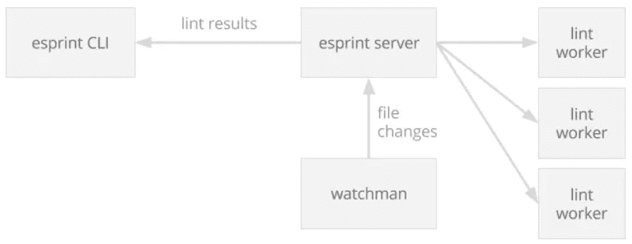

# esprint 简介:快速、开源的 eslint CLI

> 原文：<https://medium.com/pinterest-engineering/introducing-esprint-a-fast-open-source-eslint-cli-19a470cd1c7d?source=collection_archive---------5----------------------->

Arthur Lee & Allen Kleiner | Pinterest 工程师，核心经验

在 Pinterest，我们非常关心开发人员的工作效率。我们希望让工程师能够在保持高代码质量的同时快速行动。我们的网络代码库包含 4000 多个 JavaScript 文件，每个文件都使用 [eslint](http://eslint.org) 以及 Pinterest 和 [Airbnb 的 JavaScript lint 规则组合](https://github.com/airbnb/javascript)进行了严格的[lint](https://en.wikipedia.org/wiki/Lint_(software))。我们相信一套强大而全面的规则会鼓励我们的工程师编写出一致可读和可维护的代码，而不会陷入语法陷阱。然而，随着代码库和大量规则的增长，lint times 很快成为我们构建中最慢的路径。这开始减慢开发过程，所以我们构建了 esprint，这是一个针对 CI 和开发环境的快速林挺解决方案，我们今天[开源了这个解决方案](https://github.com/pinterest/esprint)。

## **多线程 eslint**

我们发现的最大瓶颈是 eslint 运行在单线程上。我们使用 [worker-farm](https://github.com/rvagg/node-worker-farm) 包在多个内核上并行运行 eslint。然后，我们将需要林挺的文件列表分发给多个工作进程。这给我们带来了立竿见影的效果，在一台 8 核机器上加速了约 3 倍。考虑到在 node 中启动工作进程所涉及的开销，这是合理的。

*Lint times: eslint, single vs. multi-threaded on an 8-core machine*

这是一个显著的改进，尤其是对于我们的持续集成(CI)工作。然而，在我们的开发环境中，每次文件发生变化时，我们都会运行 eslint，这样工程师就可以定期得到关于他们代码状态的反馈。每次文件改变时运行一个消耗 CPU 的进程会太慢，同时也可能减慢更重要的进程，比如 webpack。很明显，我们需要一个更好的开发环境解决方案。

## **灵感来自流量**

Flow 是脸书的 JavaScript 类型检查器。虽然 flow 不像 eslint 那样是样式检查器，但它也需要读取许多文件，处理它们并返回结果。Flow 很好地做到了这一点，它在初始运行期间并行执行大量工作，并保持后台服务器运行以缓存结果，以便后续运行几乎是即时的。我们从 flow 的架构中获得了灵感，构建了一个后台服务器，将 lint 结果缓存在内存中，并观察源文件的变化。

## **介绍 esprint**

我们将新的 eslint cli **称为 esprint** (读作 E-S-sprint)。它使用一个多线程的 lint runner 来 lint 文件，并使用脸书的 [watchman](https://facebook.github.io/watchman/) 启动一个后台服务器来监视源文件。每当文件发生变化时，watchman 就会发现变化，而 esprint 会先发制人地将这些变化的文件进行 lints 处理。运行`esprint`命令只是向后台服务器查询最新的 lint 状态。由于林挺每个额外的文件需要很少的时间，运行时的 esprint 是在秒的数量级，除了最初的运行。

*esprint architecture*

因此，我们有一个快速的林挺解决方案，既适合于 CI 环境，也适合于开发环境。展望未来，我们计划使用重用 eslint 引擎实例等技术来提高后台服务器的可靠性和性能。你可以在 GitHub 上找到测试版的代码。我们欢迎任何问题和拉请求！

鸣谢:感谢核心体验团队和我们的网络工程师的测试和反馈。