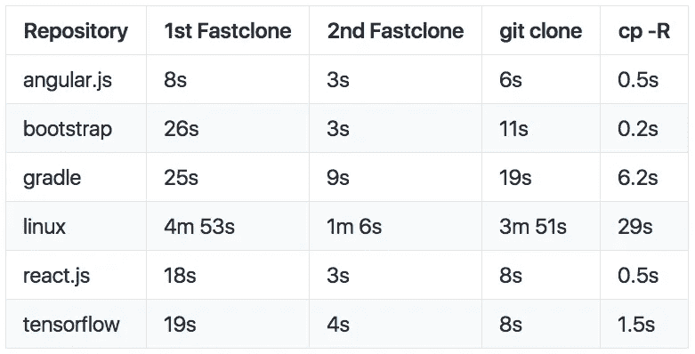

# git fastclone 简介

> 原文：<https://medium.com/square-corner-blog/introducing-git-fastclone-576ee734c509?source=collection_archive---------0----------------------->

## 如何让你的克隆人走得更快？

*由* [撰写*张志和*](https://medium.com/u/c10a005a830c?source=post_page-----576ee734c509--------------------------------) *。*

> 注意，我们已经行动了！如果您想继续了解 Square 的最新技术内容，请访问我们的新家[https://developer.squareup.com/blog](https://developer.squareup.com/blog)

# 为什么选择 fastclone？

当您的应用程序和组织在增长时，模块边界会被重新定义。这可以采取拆分大型组件的形式，或者合并并重写几个相关的较小组件。在进行这些工作时，您可能会发现自己拥有许多 git 子模块和一个整体构建。不断增长的构建时间会让您更加沮丧和低效，如果在许多机器上重复，较小任务的成本会被放大。

[Fastclone](https://github.com/square/git-fastclone) 通过在一个简单的 ruby gem 中为每个存储库及其子模块创建一个参考 repo 来缓解这些问题，只需输入 git fastclone 就可以运行这个 ruby gem。它从源位置更新镜像并将它们克隆到目标目录中，以递归和多线程的方式快速工作。

第一个克隆将花费一些时间，但是当在构建从属上有重复的克隆或者同一个 repo 有多个签出时，Fastclone 会大放异彩:

# 在后台

为了得到一个干净的结帐，我们保持我们的。git 目录，并使用 git 服务器快速检查增量更新。之后，我们按照我们要求的版本对一个合适的工作副本进行并行组装。

我们使用 git clone-mirror 在没有工作树的情况下进行检查。因为没有工作树来更新 git fetch——all 总是用远程状态覆盖本地状态。这些参考文献库有完整的历史。通过使用— reference，git clone 和 git 子模块 init 都可以配置为通过远程使用引用存储库。通过将这些放在一起，我们得到了一个具有完整历史的递归检验。

处理子模块的其余工作是线程管理和缓存。每个存储库的 gitmodules。缓存子模块依赖树允许我们在克隆操作的早期旋转所有的更新线程。因为子模块链接不会经常改变，所以我们需要从 git 服务器预取子模块，这比延迟预取有显著的加速。

子模块和 git 检验缓存保存在/var/tmp/git-fastclone 中。这可以通过环境变量进行配置。

关于子模块的一个注意事项:为了 CI 或开发的目的获得一个干净的签出是一个绝对的负担。你可以拉取，但是你不会得到子模块的改变——也许你的一些子模块有子模块。当队友删除子模块中的文件，而 git 子模块 update-init-recursive 也不会成功时，事情就变得更有趣了。随着开发人员和子模块越来越多，这种边缘情况会变得越来越糟糕。随着存储库变得越来越大，克隆也需要更多的时间。许多简单的时间优化发现自己与边缘情况不一致，并影响您的结帐的整体可靠性。

# 内部使用

Square 使用 git-fastclone 作为我们的 iOS 和硬件 CI 系统的一部分。能够快速克隆到一个空目录中，节省了我们的时间，并确保我们总是知道我们的构建的开始状态——不管在以前的构建中发生了什么。这反过来增加了系统的整体可靠性，并有利于我们的工程师。

# 维护

Fastclone 使用最稳定的 git 接口。未来对 git 的更改很可能不会影响 fastclone。

我们将在编写时发布对 git-fastclone 的改进和错误修复。非常欢迎对附加功能的请求，如果您觉得我们的小工具有用，我们很乐意倾听。

拿过来[这里](https://github.com/square/git-fastclone)。

感谢[迈克尔·陶拉索](https://www.linkedin.com/in/mtauraso)最早的快速克隆版本和这篇文章。

 [## 詹姆斯·张-简介

### 面试是软件工程师招聘过程中有缺陷但必要的一部分。一直在给予和…

medium.com](/@jamescat)