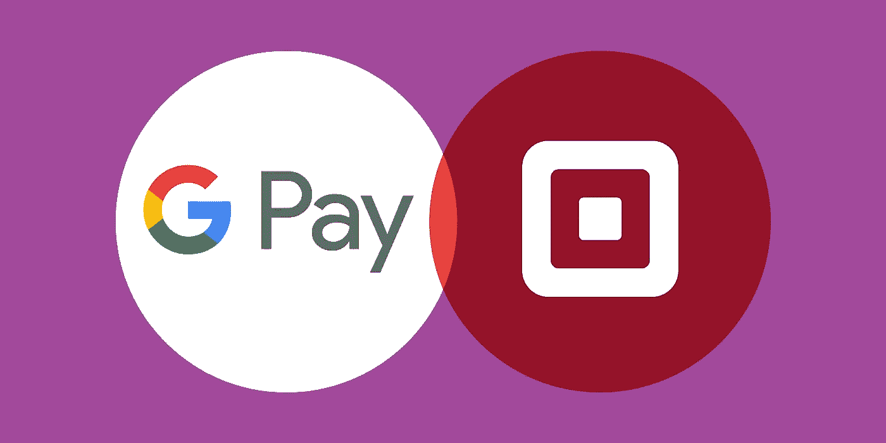
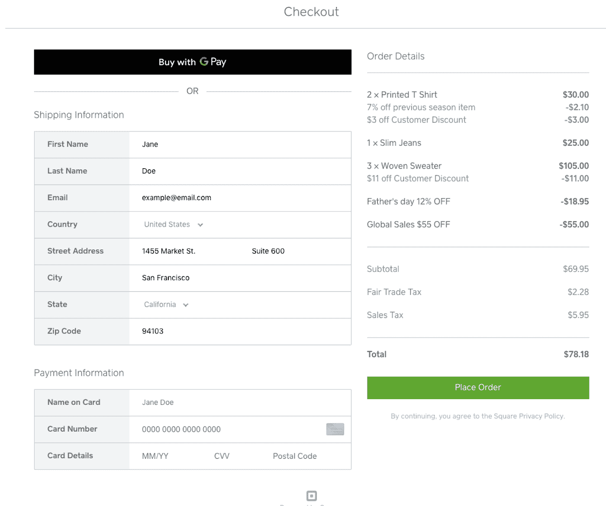
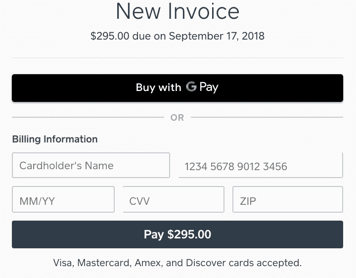

# 在 Square 在线支付 API 和 Square 发票中引入 Google Pay

> 原文：<https://medium.com/square-corner-blog/introducing-google-pay-in-square-online-payments-apis-and-square-invoices-7996bc239edb?source=collection_archive---------4----------------------->

> 注意，我们已经行动了！如果您想继续了解 Square 的最新技术内容，请访问我们的新家[https://developer.squareup.com/blog](https://developer.squareup.com/blog)

今天，我们很高兴地宣布，Square 在线支付 API 和 Square 发票现在支持 Google Pay。这种新的集成使开发者和卖家能够在他们的网站或在线商店为数百万采用 Google Pay 的买家提供快速、无摩擦的结账体验。

网上购物正变得越来越流行，但大多数网上结账流程对买家并不友好，尤其是在移动设备上。例如，买家并不总是带着信用卡，即使他们带着，准确地输入所有信息也需要时间和注意力，导致在线结账流程的高废弃率。Google Pay 解决了这一挑战，它允许买家使用已经存储在他们 Google Pay 帐户中的卡，只需点击几下就可以完成购买。它不仅减少了废弃的购物车，还增加了转化率，从而为您的企业带来更多的销售。

使用 Square 在 web 应用中激活 Google Pay 对开发者来说很容易。Square 提供了两种使用 Square 在线支付 API 的简单方法。

# 方形收银台

从今天开始，所有的 [Square Checkout](https://docs.connect.squareup.com/payments/checkout/overview) 卖家将受益于 Google Pay 支持，而**无需修改你的代码。**现在，买家可以通过 Square Checkout 使用 Google Pay 支付，只需登录他们的 Google 帐户，就可以快速轻松地完成购买。

# 广场付款形式

将 Google Pay 集成到 [Square 支付表单](https://docs.connect.squareup.com/payments/sqpaymentform/sqpaymentform-overview)中非常简单，包括五个简单的步骤:

**步骤 1** :将 Google Pay 占位符添加到您的支付页面。

**第二步**:初始化 SqPaymentForm 中的 Google Pay 参数。

**步骤 3** :如果 Google Pay 对买家可用，显示 Google Pay 按钮。

此时，如果启用了 Google Pay 按钮，买家应该能够看到它。

**步骤 4:** 用订单信息创建一个 PaymentRequest 对象。当点击 Google Pay 按钮时，这个回调被触发。

**第五步:**一旦买家完成支付，Square 将对卡进行令牌化，并通过*cardNonceResponseReceived*回调给你一个 nonce。然后，您可以将 nonce 发送到您的服务器，以便向客户收费。

除了 Google Pay 之外，我们的 API 还允许您快速集成其他移动钱包，如 [Apple Pay on the web](https://docs.connect.squareup.com/payments/sqpaymentform/config-apple-pay-web) 和 [Masterpass](https://docs.connect.squareup.com/payments/sqpaymentform/config-masterpass-web) ，为您的客户提供最佳体验。

# 方形发票

在 Square，我们的第一方产品利用我们向外部开发人员公开的相同 APIs 所以像这样的版本也允许我们向自己的产品添加功能。因此，随着我们的在线支付 API 增加了 Google Pay 支持，Square 发票卖家也将可以在发票支付屏幕上使用 Google Pay。现在，除了其他支付方式之外，买家还可以通过 Google Pay 轻松支付发票，实现快速、安全的支付。

我们对 Google Pay 在 Square 在线支付 API 和 Square 发票中的发布感到兴奋。要了解更多关于 Square 开发者平台的信息，请访问 https://squareup.com/developers 的[或加入我们在 squ.re/slack](https://squareup.com/developers)[的社区](http://squ.re/slack)。

*注意:Square 仅支持美元交易的 Google Pay。*

# 附加阅读

*   与 [SqPaymentForm](https://docs.connect.squareup.com/payments/sqpaymentform/sqpaymentform-overview) 集成
*   与[检验 API](https://docs.connect.squareup.com/payments/checkout/overview) 集成