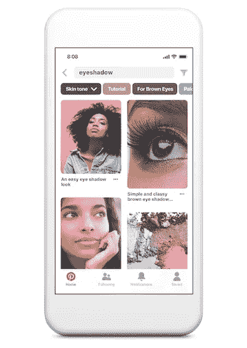

# 手机美容搜索简介

> 原文：<https://medium.com/pinterest-engineering/introducing-inclusive-beauty-searches-for-mobile-813ee2e1fa7b?source=collection_archive---------0----------------------->

作者 Yanis Markin |产品设计师，发现

本周，我们宣布[肤色范围](/@Pinterest_Engineering/building-a-more-inclusive-way-to-search-789f4c92fd73)将登陆 iOS(随后是 Android ),这样 Pinners 可以发现相关的发型和化妆创意。在接下来的几周里，当 Pinners 在他们的 iPhone 或 iPad 应用程序上搜索美容创意时，会出现一个代表一系列肤色的调色板。调色板使他们能够个性化他们看到的大头针和视频。

通过结合最新的机器学习和包容性产品开发，我们能够直接回应 Pinner 的反馈，并构建更有用的产品。

去年，皮肤相关搜索的前 100 个搜索词中有近 60%涉及一种肤色，如深色皮肤、浅色皮肤和橄榄色皮肤，这向我们表明，所有皮肤类型的女性都希望有一种定制搜索的方式。

请密切关注产品背后的设计过程。

*鸣谢:Emma Herold、Lulu Cheng、Long Cheng、、Larkin Brown、Candice Morgan、Xixia Wang 和 Laksh Bhasin。*