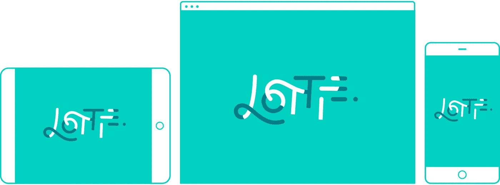

# 介绍洛蒂

> 原文：<https://medium.com/airbnb-engineering/introducing-lottie-4ff4a0afac0e?source=collection_archive---------0----------------------->

## 我们新的开源工具让向本地应用添加动画变得轻而易举。

由[布兰登·怀罗](http://github.com/buba447)、[加布里埃尔·皮尔](https://twitter.com/gpeal8)、[利兰·理查森](https://twitter.com/intelligibabble)和[萨利赫·阿卜杜勒·卡里姆](https://twitter.com/therealsalih?lang=en)

在过去，为 Android、iOS 和 React 原生应用构建复杂的动画是一个困难而漫长的过程。你要么必须为每个屏幕尺寸添加庞大的图像文件，要么必须编写一千行脆弱的、难以维护的代码。正因为如此，大多数应用都没有使用动画——尽管它是交流思想和创造引人注目的用户体验的强大工具。一年前，我们开始改变这种状况。

今天，我们很高兴介绍我们的解决方案。 [Lottie](http://airbnb.design/lottie/) 是一个 iOS、Android 和 React 原生库，可以实时渲染 After Effects 动画，并允许原生应用像使用静态资产一样轻松地使用动画。Lottie 使用从一个名为 [Bodymovin](https://github.com/bodymovin/bodymovin) 的开源 After Effects 扩展导出为 JSON 文件的动画数据。该扩展与 JavaScript 播放器捆绑在一起，可以在 web 上呈现动画。自 2015 年 2 月以来，Bodymovin 的创造者 [Hernan Torrisi](https://twitter.com/airnanan) 通过每月向插件添加功能和改进，建立了一个坚实的基础。我们的团队([iOS](http://github.com/buba447)的 Brandon Withrow 、[Android](https://twitter.com/gpeal8)的 Gabriel Peal 、[React Native](https://twitter.com/intelligibabble)的 Leland Richardson 以及体验设计的 [I](http://www.salih.tv/) )在托里西非凡工作的基础上开始了我们的旅程。

# **轻松制作丰富的动画**

Lottie 允许工程师构建更丰富的动画，而无需重新编写它们的艰苦开销。尼克·布彻的[跳过](/google-developers/animation-jump-through-861f4f5b3de4#.xlw1n2u2d)动画，巴特克·利平斯基的[汉堡菜单](https://android.jlelse.eu/animatedvectordrawablecompat-3d9568727c53#.fmiujhcdj)，米罗斯劳·斯塔内克的[推特之心](http://frogermcs.github.io/twitters-like-animation-in-android-alternative/)展示了从头开始重新创作动画是多么困难和耗时。有了 Lottie，在框架中挖掘以供参考，猜测持续时间，手动创建贝塞尔曲线，重新制作动画，只需要一个 GIF 作为参考，这些都将成为过去。现在，工程师可以准确地使用设计者想要的东西，准确地使用它是如何制造的。为了证明这一点，我们重新创建了他们的动画，并在我们的示例应用程序中提供了每个动画的 After Effects 和 JSON 文件。

我们的目标是支持尽可能多的特效功能，允许比简单的图标动画更多的功能。我们已经创建了一些其他的例子来展示这个库的灵活性、丰富性和深刻的特性集。在示例应用程序中，还有各种不同种类的动画的源文件，包括基本的艺术线条、基于字符的动画以及具有多角度和多切割的动态徽标动画。

我们已经开始在几个屏幕上发布我们自己的 Lottie 动画，包括应用内通知，全帧动画插图，以及我们的评论流程。我们计划以一种有趣而有用的方式极大地扩展我们对动画的使用。

# **灵活高效的解决方案**

Airbnb 是一家支持数百万客人和主人的全球性公司，因此拥有一种可在多个平台上播放的灵活的动画格式对我们来说极其重要。有类似洛蒂的库，比如马库斯埃克特的[飑](http://www.marcuseckert.com/squall/)和脸书的[关键帧](https://github.com/facebookincubator/Keyframes)，但是我们的目标略有不同。脸书选择了一小部分后效特性来支持，因为他们主要关注于反应，但是我们希望支持尽可能多的特性。至于 Squall，Airbnb 的设计师将它与 Lottie 结合使用，因为它有一个令人惊叹的 After Effects 预览应用程序，已经成为我们工作流程中必不可少的一部分。然而，它只支持 iOS，我们的工程团队需要一个跨平台的解决方案。

Lottie 还在其 API 中内置了几个特性，使其更加通用和高效。它支持通过网络加载 JSON 文件，这对于 A/B 测试很有用。它还有一个可选的缓存机制，所以经常使用的动画，如愿望清单心脏，每次都可以加载一个缓存副本。Lottie 动画可以通过使用动画进度功能的手势来驱动，动画速度可以通过更改一个简单的值来控制。iOS 甚至支持在运行时向动画添加额外的原生 UI，可用于复杂的动画过渡。

除了到目前为止我们所做的所有的 After Effects 特性和 API 添加之外，我们对未来有很多想法。这些包括将视图映射到 Lottie 动画，用 Lottie 控制视图转换，支持[战斧的橡皮形状](http://www.battleaxe.co/rubberhose/)，渐变，类型和图像支持。最困难的部分是挑选下一步要解决的特性。

# **建筑社区**

以开源的方式发布东西不仅仅是把它放在那里供公众使用。它是连接人们和创造社区的桥梁。随着我们越来越接近通过 GitHub 向设计师和工程师发布 Lottie，我们希望确保与动画人员保持联系。

我们受到了 [9 广场](http://9-squares.tumblr.com/)、[运动尸体](https://motioncorpse.tumblr.com/)和[漫画](https://animography.net/products/mobilo)所创建的社区的启发。这三家公司将来自世界各地的人们聚集在一起，他们原本永远不会在一起工作，在公共动画项目上进行合作。这些项目需要几个月的工作和各自团队的大量组织和争论，但它们无疑为整个动画社区提供了巨大的价值。《运动尸体》和《敌意》也公开分享了 After Effects 源文件，这些文件提供了大量关于人们如何工作的见解。

在他们的协作下，我们联系了所有三个团队，为我们的示例应用程序贡献动画。我们包括了 J.R. Canest 创作的 Motion body 动画，9 Squares 项目中 Al Boardman 的正方形之一，以及使用 Animography 的 Mobilo 动画字体的动画键盘，其中包含二十多位艺术家的作品。我们希望这些动画社区与强大的工程社区的融合会激发出一些特别的东西。

From left to right: Jr.canest on Motion Corpse, Al Boardman from 9 Squares, Animography’s Mobilo animated typeface

我们很想知道你是如何使用 Lottie 的——不管你是设计师、动画师还是工程师。请随时在 lottie@airbnb.com 直接与我们联系，分享您的想法、反馈和见解。我们很兴奋地看到，当世界各地的社区开始以我们从未想象过的方式使用洛蒂时，他们会做些什么。

下载 [Bodymovin](https://github.com/bodymovin/bodymovin) ，洛蒂 [iOS](https://github.com/airbnb/lottie-ios) ， [Android](https://github.com/airbnb/lottie-android) 和 [React Native](https://github.com/airbnb/lottie-react-native) 。

*原贴于*[airbnb.design/lottie/](http://airbnb.design/lottie/)