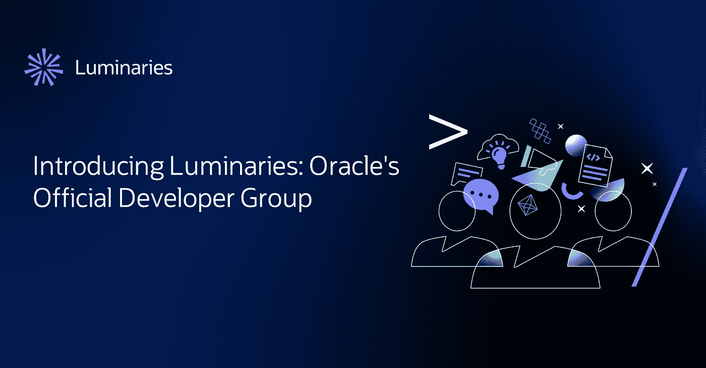

# 名人介绍:甲骨文官方开发团队

> 原文：<https://medium.com/oracledevs/introducing-luminaries-oracles-official-developer-group-e8c0969fec15?source=collection_archive---------0----------------------->

让我们现实一点——“社区”是其中一个听起来不错的词，但它的意义已经被掏空了。这是一个足以概括描述一个集体的词，但也唤起了一种淡化的感伤，尤其是当涉及到在线群体时。

当我们设计 Oracle 官方开发团队 Luminaries 时，我们希望它不仅仅是让对 Oracle 产品感兴趣的开发人员找到共同目标的简单方法。当然，我们会为开发人员提供一个共同的空间来解决问题，规划真实世界的聚会，并从合格的产品专家那里获得专业知识，但我们也希望杰出人物是真正特殊的。可以说是 Community++。

这就是为什么我们为 Luminaries 不仅仅是一个社区而自豪。它的好处不仅仅是为开发人员、技术爱好者、未来主义者，甚至是对编程感兴趣的人提供了一个方便的交流场所。这些优势确保您对甲骨文的热情有助于打开您职业生涯的新大门，增长新技能，并获得一些免费津贴。

“什么样的额外津贴？”你问。

*   独家优质技术内容
*   来自开发产品的工程师的一对一专业知识
*   邀请参加 IRL 会议
*   甲骨文官方渠道的社交媒体宣传
*   免费 OCI 认证
*   数千美元的 OCI 信用
*   一场甲骨文自有或赞助活动的会议入场券
*   赃物和其他惊喜
*   在正式上市前独家获得新品

而这仅仅是开始。

# 它是如何工作的

当您[注册成为 Luminaries】时，您会立即链接到我们的邀请专用空间(如 Luminaries Slack 频道和论坛),并获得独家技术内容。然而这仅仅触及了表面——只要你注册，你就可以享受到 OCI 自由层特权和其他更多的技术好处。](https://go.oracle.com/LP=131487?elqCampaignId=365228&nsl=lum&src1=:so:bl:or:dg:odv:::Luminaries_Blog&SC=:so:bl:or:dg:odv:::Luminaries_Blog&pcode=WWMK221006P00010)

注册后，您可以享受到以下好处:

*   免费 OCI 培训和认证
*   OCI 每年 500 美元免费积分
*   私人发布前简报和测试版测试

我们也希望杰出人物成为你和未来雇主的一种速记，让他们知道你了解自己的东西。

例如，当潜在雇主在你的 LinkedIn 个人资料上看到一个杰出人物的徽章时，他们会知道你非常重视了解你选择的甲骨文产品的来龙去脉的能力，并且重视成为一名团队成员所需的软技能。

如果任何(或所有)这些听起来让你感兴趣，要么在我们的[公共休闲频道](https://bit.ly/odevrel_slack)或[注册中留言成为名人](https://go.oracle.com/LP=131487?elqCampaignId=365228&nsl=lum&src1=:so:bl:or:dg:odv:::Luminaries_Blog&SC=:so:bl:or:dg:odv:::Luminaries_Blog&pcode=WWMK221006P00010)。

我们等不及要见你了！

DevRel 团队