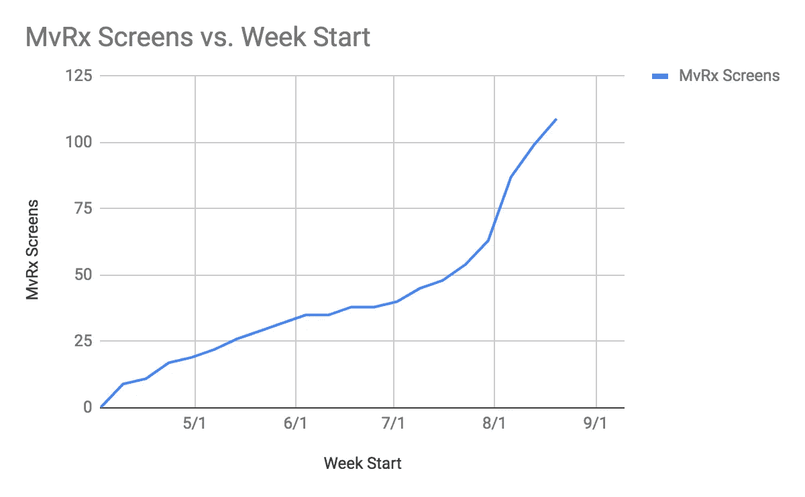

# 介绍 MvRx:自动驾驶的 Android

> 原文：<https://medium.com/airbnb-engineering/introducing-mvrx-android-on-autopilot-552bca86bd0a?source=collection_archive---------2----------------------->

## Android 的新框架完全是原生的，但减少了 50–75%的产品代码。

Havana Vieja, a great place to hang out at Airbnb HQ when you want to catch up with friends

在 Airbnb，我们正以前所未有的速度前进。每年，越来越多的人使用 Airbnb 旅行。仅在今年，我们就已经推出了 Airbnb Plus 和 T3，我们还有数不清的 T2 项目正在进行中，我们迫不及待地想要分享。

在 Android 方面，业务的天文数字增长让我们忙得不可开交。我们的应用比以往做得更多。仅在过去一年，我们就增加了 286 块新屏幕，而且这一速度丝毫没有放缓的迹象。为了让我们的生活更轻松，我们寻找可以用来防止重复工作的模式，这样我们就可以专注于运输产品。

## **推出 MvRx**

今天，我们准备分享我们的 Android 架构: [MvRx](https://github.com/airbnb/MvRx/) 。MvRx(发音为“mavericks”)诞生于这样一种认识，即我们一次又一次地解决同样的问题，分散了我们对产品运输的关注。在 Android 上，有无数的小事情是工程师为了让他们的应用程序高质量而不得不写或考虑的。其中一些是:

*   反复创建带有工具栏、RecyclerView 和页脚的布局
*   与 Android 生命周期[的争论](https://i.stack.imgur.com/fRxIQ.png)
*   在 onSaveInstanceState 中正确保存视图状态和业务逻辑
*   为异步请求(如网络或数据库调用)执行 onSuccess 和 onFailure 处理程序
*   还有更多…

MvRx 使所有这些变得简单得多。当我们出发时，我们唯一的目标是让运送高质量的产品变得更容易、更快、更有趣。最初，开源这个框架并不是我们的目标。然而，一旦它开始成形，我们知道我们必须这样做。我们不仅希望与您分享它，还希望它可以用于我们在 Airbnb 之外的项目，因为它可以轻松地从业余爱好项目扩展到拥有 70 名工程师和近百万行代码的应用程序。

## **MvRx 在动作**

MvRx 建立在谷歌的[架构组件](https://developer.android.com/topic/libraries/architecture/viewmodel)、 [RxJava](https://github.com/ReactiveX/RxJava) 、 [Epoxy](https://github.com/airbnb/epoxy) 之上。这是科特林第一，只有科特林。围绕 Kotlin 语言进行设计使我们能够构建一个比用 Java 更简洁的 API。

看起来是这样的:

在这个简单的片段中，只有 18 行代码，我们有一个 ViewModel，它的作用范围是片段，但在配置更改时会保留，还有默认布局和屏幕的可测试状态。当状态改变时，屏幕将自动更新，但只有实际改变的特定部分将被发送到 RecyclerView(感谢 Epoxy)。此外，您看到的所有代码都在后台线程上运行，因为 MvRx 无缝地处理开箱即用的线程。

## **Airbnb 的 MvRx**

仅仅几个月的时间，MvRx 已经从一个试点变成了我们编写几乎 100%新屏幕的标准方式，人们很喜欢它。在最近的调查中，93%接受调查的工程师(n=14)给了它 8/10 或更高的分数。

此外，它的采用令人震惊。在整个试验过程中，增长是稳定的，但是当我们在 7 月份开放给任何团队使用时，采用率就自动上升了。

在短短几个月内，我们已经在 MvRx 中构建了超过 110 个屏幕，并且它很快被采用为在我们的应用程序中编写任何功能的首选方式，从简单的静态功能到一些最复杂的功能。

## **入门**

我们很高兴能与世界分享 MvRx。如果你想了解更多，请前往我们的 GitHub Wiki 了解更多！

谢谢，

Airbnb 移动工程

*想参与进来？我们一直在寻找* [*有才华的人加入我们的团队*](https://www.airbnb.com/careers) *！*