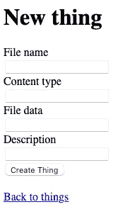

# 介绍 my file:OCI 上的一个基础 Rails 应用

> 原文：<https://medium.com/oracledevs/introducing-myfile-a-base-rails-app-on-oci-a91149812cbc?source=collection_archive---------5----------------------->


*Photo by* [***Irina Iriser***](https://www.pexels.com/@iriser?utm_content=attributionCopyText&utm_medium=referral&utm_source=pexels) *from* [***Pexels***](https://www.pexels.com/photo/train-rail-during-golden-hour-724712/?utm_content=attributionCopyText&utm_medium=referral&utm_source=pexels)

# 介绍

在我最近的一篇[帖子](/oracledevs/getting-started-with-ruby-and-ruby-on-rails-on-oci-3ce2d4c65833)中，我展示了如何在 OCI 上安装 Ruby 运行时(和 Ruby on Rails)。在本文中，我们将花几分钟时间创建一个“基础”Rails 应用程序，我们将在接下来的文章中构建这个应用程序。

# 事实真相

这是一个非常简单的应用程序，允许我们在一个小的 web 应用程序中上传/下载/管理文件。这款应用将是一款*非常*轻量级的文件共享应用。假设是我们将是唯一使用这个应用程序的人。这意味着我们限制了对应用程序的网络访问(它是通过到 OCI 实例的 SSH 隧道来访问的)，并且我们不关心身份验证(AuthN)或授权(AuthZ)。

显然，这对于任何实际应用程序来说都是不可接受的。没关系……因为重点不是如何正确地设计和/或保护 Rails 应用程序，而是如何将一些流行的宝石用于 OCI。

# 它不是什么

这不是为生产级 web 应用程序而设计的。这不是生产就绪代码。我并不真正关注 Rails 强化或 Rails 安全最佳实践。AuthN/AuthZ 完全缺失。这是为了展示不同的 Ruby 宝石如何与 OCI 交互而特意构建的。了解它的位置并自行承担部署风险。可以把它看作是如何让不同的红宝石与 OCI 互动的“食谱”。

# 云环境

本文假设您有一个 OCI 帐户。还没有账户？真的吗？！[现在就买一个](https://www.oracle.com/cloud/free/#always-free?source=:ex:tb:::::WWMK220204P00041&SC=:ex:tb:::::WWMK220204P00041&pcode=WWMK220204P00041)！你完全没有理由不享受免费(永远)提供的许多 OCI 资源。查看这篇文章，了解[一步一步的操作](/oracledevs/create-an-oracle-always-free-cloud-account-bc6aa82c1397)。

我还假设您将继续关注一个 OCI 实例(使用 [Ruby/Rails on OCI 的例子](https://github.com/oracle-devrel/terraform-oci-ruby)或类似的东西)。您可以通过访问 [this repo](https://github.com/oracle-devrel/terraform-oci-ruby) 轻松部署预构建的 OCI 环境。

# Rails 入门

因为这是超级基本的，我们有一个单一的控制器，给我们一个文件的 CRUD 接口。首先，让我们创建一个新的 Rails 应用程序:

```
rails new myfile
```

进入项目目录:

```
cd myfile
```

Rails 倾向于将许多其他有用的词保留给内部的东西，这意味着虽然我最初想将我们的资源称为“文件”，但 Rails 对此有一个问题:

```
$ rails g scaffold fileinvoke  active_recordThe name 'File' is either already used in your application or reserved by Ruby on Rails. Please choose an alternative or use --skip-collision-check or --force to skip this check and run this generator again.
```

类似地，试图使用*资产*也会在以后引起心痛——相信我，我尝试过并遇到了这种情况。的确，您将能够生成脚手架，但是 Rails 稍后会给您带来一些奇怪的东西(至少对我来说是这样)。正因为如此，我选择称文件为“东西”。现在让我们创建*的东西*脚手架(模型、视图、控制器等)。):

```
rails g scaffold thing file_name:string content_type:string file_data:binary description:string
```

继续执行数据库迁移(此时，我们只是使用内置的 SQLite3):

```
rake db:migrate
```

启动本地 web 服务器，以便您可以随时查看:

```
rails s
```

如果你正在使用一个 OCI 实例(你正在使用预建的 [Ruby/Rails on OCI 的例子](https://github.com/oracle-devrel/terraform-oci-ruby)，对吗？)，您需要通过 SSH 会话重定向端口。类似这样的…

```
ssh -L 3000:localhost:3000 opc@<public_ip>
```

(您可能需要用 *-i* 参数指定您的私钥)

然后你就可以去[http://localhost:3000/things/](http://localhost:3000/things/)看看了。耶！您应该会看到一个相当无聊的页面。

# 但是它看起来太丑了

是啊，我明白了，它*就是*丑。对于这其中的大部分，我们将很大程度上让它变得极其无聊。重点不是放在前端(让它看起来漂亮)，而是放在后端功能(与 OCI 的集成)，所以它会有点乏味。没关系。

为了使它变得更加易读，在/app/assets/style sheets/application . CSS 中添加以下内容:

```
...#things p {
  display: inline;
  border-right: 1px solid #999;
}
```

没多大帮助，但还是那句话..这篇文章(或系列文章)不是关于 UI/UX 的，而是关于后端的本质。继续表演…

# 添加默认路由

虽然它可以工作，但我不喜欢必须键入 */things* ，所以让我们设置一个默认路线。这是一件小事，但会让生活变得更简单，将 *things#index* 设置为我们的默认路线(editing /config/routes.rb):

```
Rails.application.routes.draw do ... root "things#index"
end
```

# 上传功能

首先，我们需要一种上传文件的方法。为我们生成的默认 CRUD 是可以的，但对于我们想要的东西来说确实不理想。想要露齿一笑，点击*新事物*，就能看到它提供的开箱即用的非常温和的形式:



这不是我们想要的文件上传体验，所以让我们更改 GET 视图，修改/app/views/things/_ form . html . erb，更改 file_data 字段的字段类型:

```
...
  <div>
    <%= form.label :file_data, style: "display: block" %>
    <%= form.file_field :file_data %>
  </div>
...
```

从同一个文件中删除以下内容(我们将通过 file_data 参数获取文件名和内容类型):

```
...
  <div>
    <%= form.label :file_name, style: "display: block" %>
    <%= form.text_field :file_name %>
  </div><div>
    <%= form.label :content_type, style: "display: block" %>
    <%= form.text_field :content_type %>
  </div>
...
```

为了上传工作，我们需要修改控制器(/app/controllers/things _ controller . Rb)中的一些内容:

```
 private
    ... # Only allow a list of trusted parameters through.
    def thing_params
      ret = params.require(:thing).permit(:description)
      ret.merge( { file_data: params[:thing][:file_data].read, file_name: params[:thing][:file_data].original_filename, content_type: params[:thing][:file_data].content_type } )
    end
end
```

我们在这里做的是从 *file_data* 字段追加一些字段值。当生成脚手架时，它假设我们已经为 *content_type* 和 *file_name* 字段提供了用户提供的(手动输入的)值。我们不想那样。这是一种痛苦，真的没有必要。内容类型和文件名与文件数据本身包含在一起(作为上传过程的一部分)，所以我们只是将它们添加到参数中，就好像它们是单独提供的一样(使我们和任何用户都更容易)。

通过以这种方式修改散列，我们根本不需要修改 *#create* 或 *#update* 方法…这些都是易于使用的，总是使用正确的数据！

# 查看“事物”

到目前为止，我们可以上传一个文件，但查看它有点混乱。更新/app/views/things/_ thing . html . erb，替换:

```
 <p>
    <strong>File data:</strong>
    <%= thing.file_data %>
  </p>
```

有了这个:

```
 <p>
    <strong>File data length (bytes):</strong>
    <%= thing.file_data.length %>
  </p>
```

试图在屏幕上显示原始文件数据确实不太理想。这将显示在索引上，以及一个特定的“东西”(资源)。相反，我们将让它显示资源的字节(长度)。

# 下载一个“东西”

这实际上很简单，只需要几个步骤:

*   添加新路线
*   添加新的控制器方法
*   更新视图

要添加新路由，只需更新/app/config/routes.rb 文件即可。更新此零件:

```
 ...
  resources :things
  ...
```

看起来像这样:

```
 ...
  resources :things do
    get 'download', on: :member
  end
  ...
```

这告诉 Rails 为特定的*事物*项(称为成员)添加一个新的 *#download* GET 动作。让我们为此添加控制器逻辑，更新/app/controllers/things _ controller . Rb，向 ThingsController 类添加一个 *#download* 方法:

```
class ThingsController < ApplicationController
  ... def download
    response.set_header('Content-Disposition', "attachment; filename=\"#{[@thing](http://twitter.com/thing).file_name}\"")
    response.content_type = [@thing](http://twitter.com/thing).content_type
    response.write([@thing](http://twitter.com/thing).file_data)
  end ...
end
```

我必须给它应得的荣誉。虽然文件传输头不是 Rails 特有的，但我在本文的[中找到了一个资源。其中讨论了一个文件传输实现。我能够根据我在那里找到的内容修改内容处置头部分。为协作和知识共享而欢呼！](https://piotrmurach.com/articles/streaming-large-zip-files-in-rails/)

对同一个控制器再进行一次更新，更改如下:

```
class ThingsController < ApplicationController
  before_action :set_thing, only: %i[ show edit update destroy ]
```

对此:

```
class ThingsController < ApplicationController
  before_action :set_thing, only: %i[ show edit update destroy download ]
```

我们告诉它为#download 动作设置@thing 全局变量(除了其他特定于成员的动作之外)。

最后，但同样重要的是，我们需要一种启动下载的方法。更新/app/views/things/_ thing . html . erb 中的视图，替换以下内容:

```
 ... <p>
    <strong>File name:</strong>
    <%= thing.file_name %>
  </p> ...
```

有了这个:

```
 ...
  <p>
    <strong>File name:</strong>
    <%= link_to thing.file_name, download_thing_path(thing) %>
  </p>

  ...
```

这使得文件名显示为下载“东西”(文件)的超链接。虽然它可能不是超级直观，但它是实用的，不会进一步扰乱我们令人难以置信的用户界面/UX 设计。☺

# 结果呢

我们有一个基本的(超级难看的)应用程序，它提供:

*   文件上传
*   文件存储器
*   文件下载

用户界面/UX 不存在。文件上传非常简单——没有 AJAXy 的优点(比如我们期待的非常熟悉的拖放体验)。文件下载，嗯，它只是工作。这里没有华而不实的东西！

文件存储不太理想。我们将数据存储在 SQLite 数据库中。是的，太可怕了。但这仅仅是开始。我们必须从某个地方开始，所以我们从尽可能最小的共同点开始。当然，有些人可能会认为我们应该将文件存储在数据库之外的本地文件系统中。我们本可以做到的。坦白地说，除了绝对需要的时间，我不想在这上面花更多的时间，因为这实际上是一个跳板。

# 资源

这里有一些很棒的参考资料和资源，你可能会觉得有用(我找到了！):

*   [https://piotrmurach . com/articles/streaming-large-zip-files-in-rails/](https://piotrmurach.com/articles/streaming-large-zip-files-in-rails/)
*   [https://API . ruby on rails . org/classes/action dispatch/response . html](https://api.rubyonrails.org/classes/ActionDispatch/Response.html)
*   [https://guides . ruby on rails . org/action _ controller _ overview . html # the-response-object](https://guides.rubyonrails.org/action_controller_overview.html%23the-response-object)
*   [https://guides . ruby on rails . org/form _ helpers . html #上传文件](https://guides.rubyonrails.org/form_helpers.html%23uploading-files)
*   [https://guides.rubyonrails.org/routing.html](https://guides.rubyonrails.org/routing.html)
*   [https://API . ruby on rails . org/classes/active record/connection adapters/schema statements . html # method-I-add _ column](https://api.rubyonrails.org/classes/ActiveRecord/ConnectionAdapters/SchemaStatements.html%23method-i-add_column)

# 下一步是什么

请关注下一篇文章，我们将在那里使用这个超级基本的应用程序，并让它使用[活动存储](https://guides.rubyonrails.org/active_storage_overview.html)。也许将来会探索一些其他的宝石选择——可能性几乎是无限的！

# 加入对话！

如果你对甲骨文开发人员在他们的自然栖息地发生的事情感到好奇，请加入我们的[公共休闲频道](https://oracledevrel.slack.com/join/shared_invite/zt-uffjmwh3-ksmv2ii9YxSkc6IpbokL1g#/shared-invite/email)！我们不介意成为你的鱼缸🐠