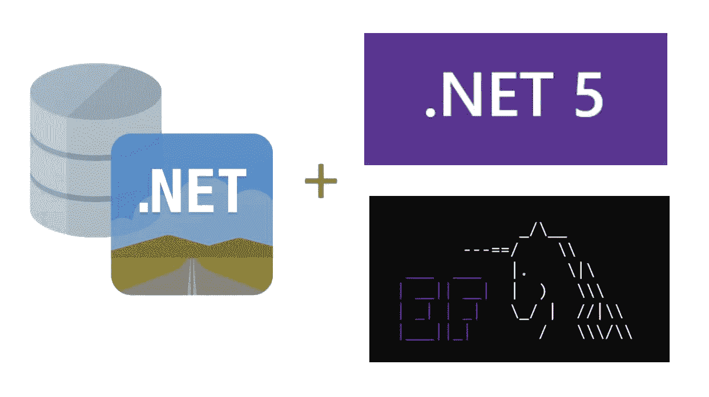
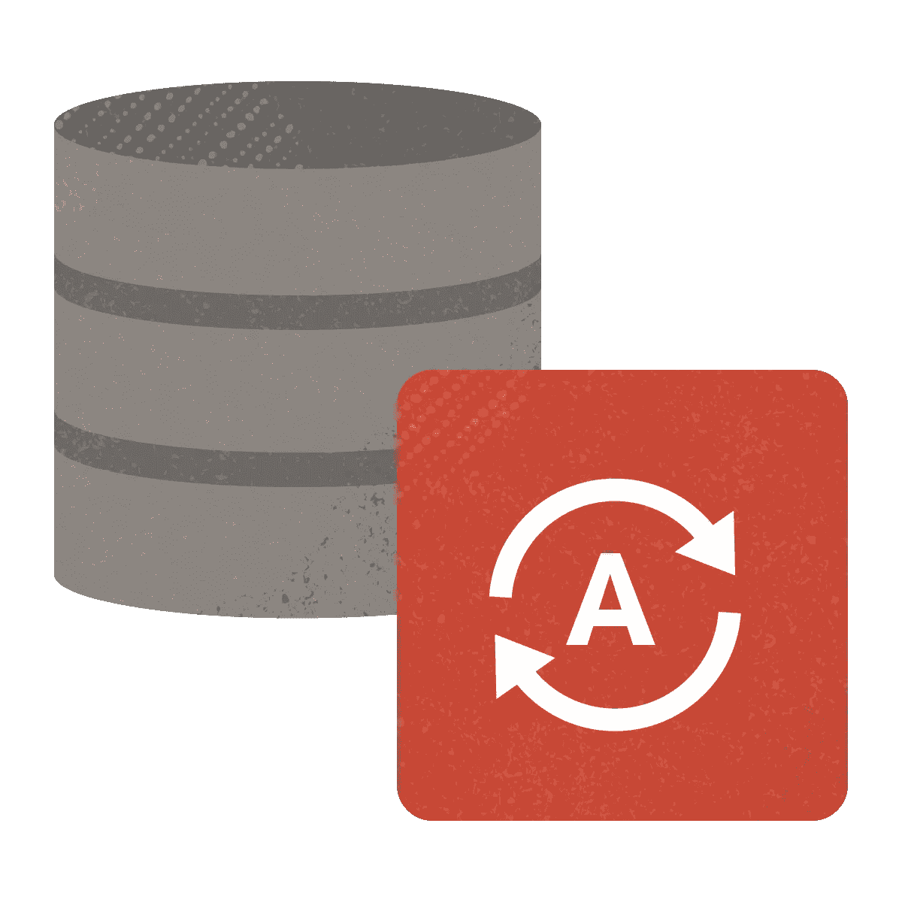
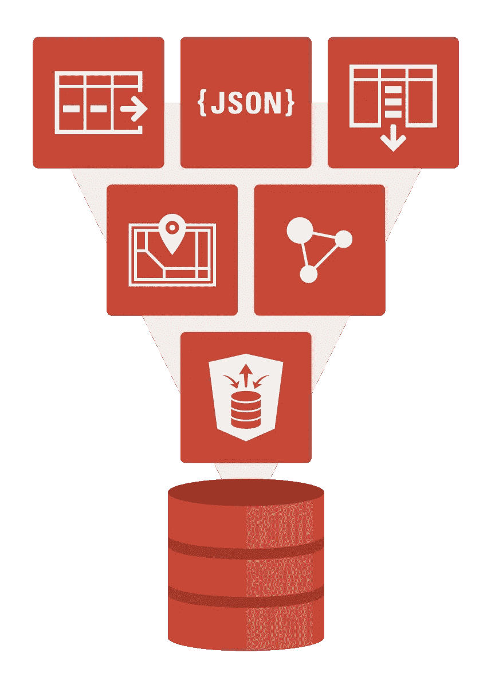

# 介绍 ODP.NET 21c:EF Core 5、JSON 等

> 原文：<https://medium.com/oracledevs/introducing-odp-net-21c-ef-core-5-json-and-more-ea0843e89dea?source=collection_archive---------1----------------------->

我很高兴地宣布 ODP.NET 21c 现已上市。您可以从 NuGet Gallery 下载[ODP.NET 核心](https://www.nuget.org/packages/Oracle.ManagedDataAccess.Core/3.21.1)和 [Oracle 实体框架核心](https://www.nuget.org/packages/Oracle.EntityFrameworkCore/5.21.1)。新功能包括:

*   实体框架核心 5
*   JSON 列数据类型
*   客户端启动的连续查询通知(CICQN)
*   分片
*   更多管理权限
*   调试跟踪修订

让我们深入了解这些新特性。

# 实体框架核心 5

ODP。NET Core 21c 现在支持微软实体框架(EF) Core 5。EF Core 5 是最新的微软对象关系映射器版本。

对于大多数应用程序，从 Oracle EF Core 3.1 provider 升级到 Oracle EF Core 5 provider 不需要更改代码。如果您确实调用了`UseOracleIdentityColumn`和`ForOracleUseSequenceHiLo`方法，现在在 EF Core 5 中分别调用`UseIdentityColumn`和`UseHiLo`方法。

Oracle EF Core 5 支持新的 EF Core 5 APIs。这些 API 中的大多数都遵循微软 EF 核心文档中描述的标准行为。可能会有一些差异。例如，`IQueryingEnumerable` `ToQueryString`扩展方法通常为 Oracle 查询提供 SQL 文本。未修改的 SQL 可用于 12.1 及更高版本的数据库服务器。对于 11.2.0.4，需要做一些有文档记录的小修改，以便针对这个较旧的数据库版本运行生成的 SQL。

有关 Oracle EF Core 5 的更多信息，请查看 ODP.NET EF Core 5 nu get 软件包中包含的文档或在线 ODP.NET 21c 文档。当你解压软件包时，你会发现 PDF 文件。

# JSON

ODP。NET 支持 Oracle 数据库 21c 中的本地 JavaScript 对象表示法(JSON)列数据类型。新的二进制 JSON 数据类型针对查询和 DML 处理进行了优化，从而提高了性能。这种新的本机 JSON 二进制格式通常被称为 OSON。

Oracle 数据库或 ODP.NET 将隐式执行 OSON 和客户端数据类型之间的解码和编码。开发人员甚至不需要知道数据库正在使用 OSON。当使用. NET 字符串或`OracleString`检索 JSON 数据类型或将其传递给数据库，并使用`OracleDbType.Json`枚举值将其绑定为参数时，ODP.NET 执行数据类型转换。在所有其他情况下，当 JSON 数据类型从数据库中检索或返回到数据库时，数据库本身执行类型转换，而不是 ODP.NET。

ODP.NET 核心、托管和非托管都支持这些新的 JSON 特性。

这个[ODP.NET 核心 JSON 代码示例](https://github.com/oracle/dotnet-db-samples/tree/master/session-demos/2021/cicqn-json)演示了如何将原生 Oracle 数据库 JSON 类型检索到. NET 数据集。如果您没有安装 Oracle 数据库 21c，您可以在几分钟内创建一个免费的 Oracle 自治数据库 21c。

从代码示例中，可以看到在使用新的 JSON 类型时，不需要新的 ODP.NET API。使用这种新的数据库类型对开发人员来说是透明的。

# 客户端启动的连续查询通知

客户端发起的连续查询通知(CICQN)类似于 ODP.NET 已有的传统连续查询通知(CQN)功能。在 CQN 中，当服务器端发生影响客户端查询结果集、底层模式对象或数据库状态的更改时，客户端应用程序会收到通知。此通知不在进程中，无需 ODP.NET 连接即可发生。

新的 CICQN 特性使用进程内通知。ODP.NET 为每个池创建一个单独的连接来接收通知。应用程序不需要管理这个连接。ODP.NET 自动处理它。数据库服务器使用这个 ODP。NET 拥有的连接向应用程序发送更改通知。当客户端和数据库服务器之间的进程外通信不可用时，例如云部署，或者当客户端和服务器之间存在防火墙时，CICQN 非常有用。

ODP。NET 21c 在核心、托管和非托管提供程序中引入了对 CICQN 的支持。CICQN 的专用连接取代了传统的 CQN 监听端点。此连接聚合了池用户的所有数据库更改通知。ODP.NET 试图始终保持这种联系。它不计入`Min Pool Size`和`Max Pool Size`限值。

ODP。NET CICQN 需要 Oracle 数据库 21c 或更高版本。可以通过设置`OracleConfiguration` `UseClientInitiatedCQN` 静态布尔属性或者。NET 框架配置文件`UseClientInitiatedCQN`设置为 true。默认情况下，它是假的。

这个[ODP.NET 核心 CICQN 代码示例](https://github.com/oracle/dotnet-db-samples/tree/master/session-demos/2021/cicqn-json)演示了如何启用 CICQN 和使用事件处理程序的变更通知。如前所述，如果您没有安装 Oracle 数据库 21c，您可以在几分钟内创建一个[免费的 Oracle 自治数据库 21c。](https://www.oracle.com/cloud/free/)

# 分片

ODP。NET 核心和托管提供程序现在支持分片。Oracle 分片提供了跨多个独立 Oracle 数据库(分片)对数据进行水平分区的能力。基于连接字符串中指定的键，ODP.NET 将数据库请求路由到特定的碎片。

Oracle Sharding 是一种无共享架构，允许跨位于一个或多个本地或全球数据中心的低成本商用数据库服务器进行近乎线性的数据库扩展。其他主要优势包括全局数据分布(存储靠近消费者的特定数据)和故障遏制(一个碎片的故障不会影响其他碎片的可用性)。全局数据服务管理数据在碎片中的位置，并允许 ODP.NET 客户端请求被路由到这个分布式数据库系统中的适当碎片。

ODP。NET 21c 托管和核心提供程序现在支持与非托管 ODP.NET 相同的分片功能。该功能包括使用分片键和超级分片键来快速定位特定行所在的位置。此外，托管和核心提供程序支持在区块迁移期间暂停连接请求。在这样的迁移过程中，如果没有给块足够的时间跨碎片迁移，用户将不会遇到超时。

# 更多管理权限

ODP。NET 21c 连接现在支持分配更多特定于任务的管理特权，以实现数据库管理员职责分离。新添加的权限包括:

*   用于备份和恢复的 SYSBACKUP
*   用于 Oracle Data Guard 的 SYSDG
*   用于加密密钥管理的 SYSKM
*   Oracle Real Applications 集群操作的 SYSRAC。

这些权限可以在`DBA Privilege`连接字符串属性上设置。它们是对现有 SYSASM、SYSDBA 和 SYSOPER 属性的补充。核心、托管和非托管 ODP.NET 支持所有这些管理权限。

# 跟踪修订

ODP。NET 21c 为托管和核心提供程序引入了一个新的跟踪级别，它将 SQL 语句和网络数据包内容排除在写入跟踪的范围之外。这个新的跟踪级别的值是 8，可以在`TraceLevel`属性中以按位 OR 的方式设置。

# 接下来是什么—用户定义的类型

展望第二版 ODP.NET 21c，核心和托管提供商将增加用户定义类型(UDT)支持。Oracle 集合(可变数组和嵌套表)、Oracle 对象和对对象类型的引用(REF)都是受支持的类型。这些新功能提供了与现有的 ODP.NET、非托管驱动程序 UDT 功能相近的性能。绝大多数不受管理的 ODP.NET UDT 应用程序将能够轻松地迁移到受管理的 ODP.NET 或 ODP.NET 核心，只需最少的代码更改。

对 UDT 的支持只是我们为第二版 ODP.NET 21c 计划的功能之一。

# 结论

ODP。NET 21c 允许您使用最新的 Oracle Database 21c 特性，比如 JSON 列数据类型和 CICQN，new。NET 特性，如 EF Core 5，并支持比以往更多的数据库功能。

对于现有的数据库，ODP.NET 21c 向后兼容 Oracle 数据库服务器 11.2.0.4 和更高版本。它适用于内部和云数据库，包括所有 Oracle 自治数据库版本。用户可以升级到 ODP.NET 21c，并仍然保持其当前支持的数据库服务器版本。

这只是 ODP.NET 21c 的开始。更多的功能，管理 ODP.NET 和非管理 ODP.NET 即将到来！

# 关于 Oracle 数据库 21c 的更多信息

Oracle 自治数据库并不是目前访问 Oracle Database 21c 的唯一方式。如 Oracle 数据库博客中所述:

> Oracle Database 21c 现已在 Oracle Cloud [数据库服务虚拟机](https://www.oracle.com/database/vm-cloud.html)(针对 RAC 和单实例)和[裸机服务](https://www.oracle.com/database/bare-metal-cloud.html)(单实例)中“云优先”推出。在阿什本(IAD)、菲尼克斯(PHX)、法兰克福(法国)和伦敦(LHR)地区的[自主数据库自由层服务](https://www.oracle.com/cloud/free/)中也提供了该服务。面向本地平台(包括数据库云服务器、Linux 和 Windows)的 Oracle Database 21c 将于 2021 年全面上市。

如果您对 Oracle Database 21c 感兴趣，这篇博客文章提供了对主要新特性的精彩总结。