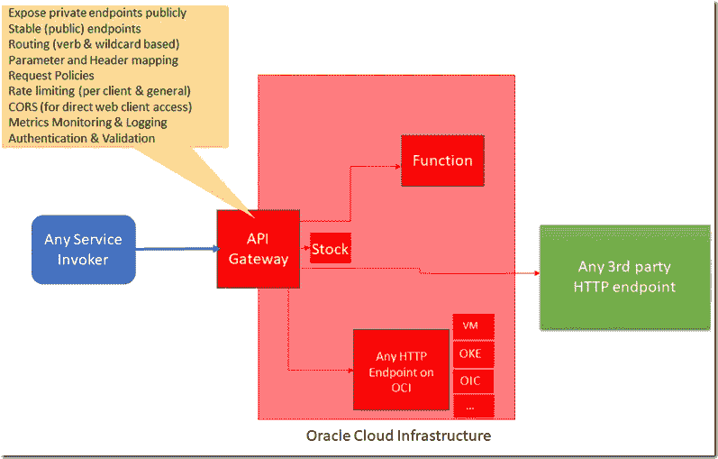
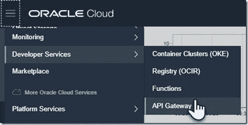

# Oracle Cloud API Gateway 简介—连接公共和私有 OCI 端点的轻量级公共或私有路由器

> 原文：<https://medium.com/oracledevs/introducing-oracle-cloud-api-gateway-the-light-weight-public-or-private-router-to-public-and-50056a45221f?source=collection_archive---------1----------------------->

两天前，Oracle 云基础设施上的 API 网关服务投入使用——阅读[公告](https://blogs.oracle.com/cloud-infrastructure/oracle-cloud-infrastructure-api-gateway-now-generally-available)。对于许多应用和解决方案设计来说，这是一个至关重要的组件。这种新的 API 网关是我们基于 OCI 的解决方案设计参考架构中的首选。API 网关充当反向代理，处理来自客户端(无论是在 OCI 还是在公共互联网上)的 HTTP 请求，并将它们路由到已配置的端点。这些端点可以是 OCI 境内的任何 HTTP 端点，如集成(OIC)、Kubernetes 上的入口(OKE)、计算虚拟机中的服务、自治数据库上的 ORDS，也可以是 OCI 境外的端点。API 网关还公开了基于 OCI 的无服务器功能(基于项目 Fn)。API Gateway 支持的后端类型之一——仅次于 HTTP 后端和 Oracle Function 作为后端——是 Stock[response]；这种类型的后端总是返回完全相同的静态响应——头和主体。它可以用来快速测试 API 网关和路由(请求策略在这种情况下也是强制执行的)的[健康状况、可用性和可访问性],或者提供模拟响应来代替仍在开发中的后端。

API 网关位于 OCI 区间中，与 OCI VCN 和公共或私有子网相关联。在后一种情况下，API 网关不公开，仅用于 OCI 境内的流量。

API Gateway 可以通过授权器功能执行请求认证、授权和验证，这是一个 OCI 功能，它获取请求头和参数，并通过与 OAuth 提供商(包括 Oracle IDCS)的交互来执行认证。

提供速率限制—我们可以定义每秒对任何路由的最大请求数—按单个客户端 ip 或总数计算。这用于防止后端泛洪，防止 DoS 攻击，限制后端资源的云成本

API Gateway 在您部署的 API 中提供 CORS 支持。当您在 API 部署中启用 CORS 支持时，HTTP 飞行前请求和对 API 部署的实际请求会向客户端返回一个或多个 CORS 响应头。这意味着可以从 web 客户端直接调用 API。

API Gateway 提供了监控洞察—处理的请求数量、响应时间和发生的故障数量的概览。警报可以与被监控的指标相关联。此外，可以记录每个调用的详细信息——目前可以记录 OCI 对象存储上的文件，不久将记录到新的 OCI 日志服务中。

# 与 API 网关相关的成本

API Gateway 是一个轻量级组件——几乎不增加调用开销——伸缩性非常好。它的定价很简单:每月 100 万次 API 调用，收费 3 美元。您不需要为每个 API 网关或部署付费——只需为每个调用付费。而且每次通话也不多。有了这个价格水平，对具有开源 API 网关的虚拟机的需求(因为 API 平台解决方案太贵了)就不存在了。

API 网关和 API 平台服务之间没有连接。当然，在功能上有一些重叠。后者是一个更丰富的平台，专注于完整的 API[开发&出版]生命周期，而 API Gateway 更简单、更轻便、更便宜，并且不一定对它所支持的路线的功能意图感兴趣。

# 资源

关于 API 网关的文档:[https://docs . cloud . Oracle . com/iaas/Content/API Gateway/Concepts/API Gateway overview . htm](https://docs.cloud.oracle.com/iaas/Content/APIGateway/Concepts/apigatewayoverview.htm)

教程: [Oracle 云基础设施 API 网关—设置、创建和部署](https://www.oracle.com/webfolder/technetwork/tutorials/infographics/oci_apigw_gs_quickview/apigw_quickview_top/apigw_quickview/index.html)

教程/博客:[在 Oracle 云中创建第一个 API 网关](https://blogs.oracle.com/developers/creating-your-first-api-gateway-in-the-oracle-cloud)

Oracle Cloud Native—Oracle Cloud infra structure API 网关:[https://www.oracle.com/cloud/cloud-native/api-gateway/](https://www.oracle.com/cloud/cloud-native/api-gateway/)

博客[扩展您的 SaaS 应用程序的云原生方法](https://www.ateam-oracle.com/the-cloud-native-approach-to-extending-your-saas-applications)提供了一个使用 API Gateway 的场景示例，并解释了授权功能如何融入故事中

*原载于 2019 年 12 月 23 日*[*https://technology . amis . nl*](https://technology.amis.nl/2019/12/23/first-steps-with-oracle-cloud-api-gateway-the-light-weight-public-or-private-router-to-public-and-private-oci-endpoints/)*。*