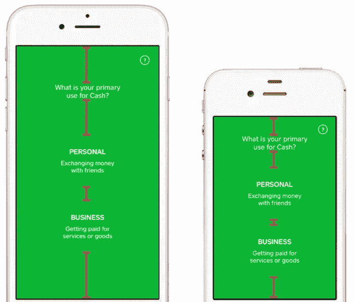
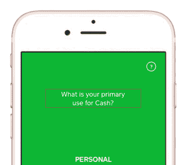
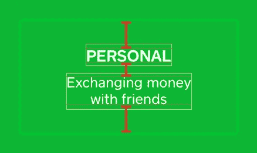

# Paralayout 简介

> 原文：<https://medium.com/square-corner-blog/introducing-paralayout-d5ac09e93fb0?source=collection_archive---------1----------------------->

> 注意，我们已经行动了！如果您想继续了解 Square 的最新技术内容，请访问我们的新家[https://developer.squareup.com/blog](https://developer.squareup.com/blog)

你知道这种感觉:设计规范来了，经过打磨和完善，你一眼就知道你有两条路可走:

1.  精确地按照规范实现，但是背后有一堆可怕的代码和 UI 配置(可能晚了几天),或者
2.  准时发货，用一个更简单的实现获得 UI，你知道，大部分是正确的——避免第二天早上照镜子。

我就不赘述 Autolayout 了，它是苹果基于约束的系统，通过规则而不是代码来指定 UI。虽然在技术上令人印象深刻，但在实践中，我们发现它使 UI 需要更长的时间来实现，并且更难以审查、重用、调试、修改、动画和性能调整。在 Cash iOS 团队中，我们采用了不同的理念，优先考虑开发速度、正确性、可读性、可维护性和性能。我们称之为 Paralayout，它是 100%快速的，我们很高兴地宣布它是开源的！

前提很简单:我们不是接管布局的任务，而是让任务变得更简单。希腊语词根 *auto* 意为“自我”，词根 *para* 意为“帮助”(想想律师助理或护理人员)。Paralayout 不是一个抽象层；这是一组*按菜单点菜*的便利方法。

考虑一下现金应用程序中的这个屏幕，它出现在 iPhone 7 和 iPhone 4 上:

标题和两个按钮是垂直分布的，因此它们上方和之间的空白空间在更大或更小的屏幕上成比例地扩展或压缩。无论屏幕大小如何，我们的工具集只需一行易于阅读的代码就能做到这一点:

但是这个设计还有更多！简单布局的标题文本看起来不正确:文本中有一个柔和的换行符，看起来更加平衡:

Paralayout 扩展了 UILabel 以提供定制的“紧凑”换行，从而消除了手动排版的需要。它通过执行二分搜索法来找到不换行到第三行的文本的最窄宽度，从而实现这一点。它还为指定像字距和行距这样的属性提供了便利，而不需要杂乱的代码来组成 NSAttributedString 和 NSParagraphStyle。结果是文本更容易本地化、重用和修改，而不需要额外的测试和定制。

我们还没完！在按钮中，边距是固定的常数。设计者基于文本本身选择它们，即基线和“帽高”:

工程师通常采用这些边距，并相对于 UILabels 本身的边界重新解释它们。如果字体大小发生变化，保持正确是一件非常痛苦的事情。Paralayout 解释每个标签中相对于字体度量*的边距，因此您的代码与设计者头脑中的数字完全匹配:*

现金应用程序的布局可以变得更加微妙。这是您付款活动中的一个标题，当您滚动时，它会优雅地折叠成一个导航栏:

这种手势驱动的过渡有三个不同的阶段:头像达到最小边距，当它淡出时缩小到一半高度，然后名称缓和到垂直对齐的位置，而其他元素淡出。获得正确的数学计算需要计算大量的边界尺寸，并在它们之间干净地插入不同的值。我们使用一个简单的值类型(一个 0 到 1 之间的数字)来保证所有的数学运算都是正确的，所以代码本身只与参数有关:

Paralayout 还负责像素级舍入，即在 iPhone 7 上将视图捕捉到点边界，在 7 Plus 上捕捉到⅓-point 边界，以及在布局视图之前用于调整视图大小的高度可适应和可定制的工具。它还提供了 AspectRatio 值类型来支持特征拟合和特征填充计算(精确到像素级， *natch* )。

这对我们非常有用，所以我们决定把它打包并开源:

> 【https://github.com/square/Paralayout】T5[T6](https://github.com/square/Paralayout)

我们希望你喜欢它，并愿意将你的想法和其他具有挑战性的布局用例融入到 Paralayout 中，使它更加…有用。干杯！