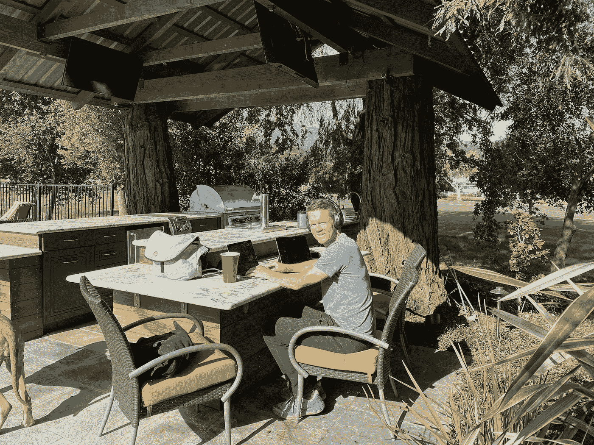

# 介绍 PinFlex: Pinterest 的未来工作模式

> 原文：<https://medium.com/pinterest-engineering/introducing-pinflex-pinterests-model-for-the-future-of-work-437731fabde?source=collection_archive---------0----------------------->

Jeremy King |工程高级副总裁

两年前，当我作为 Pinterest 的工程主管，接近我的第一个年度“Pinniversary”时，我们的办公室关闭了，我们所知道的工作(即生活)突然发生了变化。随着我们都适应了周围的剧烈变化，我们学到了很多关于在工作场所什么是有效的，什么是无效的。灵活工作的好处以及我们在任何地方都能高效工作的能力使我们能够出色地完成工作，同时消除了长途通勤，让我们比以往任何时候都更能与家人共度重要时刻。我们还意识到与同事进行有意的面对面接触对于建立文化和推动协作的价值。两年后，也就是我加入 Pinterest 的三年后，我很兴奋地宣布，我们已经宣布了 [**PinFlex**](https://www.pinterestcareers.com/pinflex/) **，**一种独特的 Pinterest 工作模式，为员工提供灵活生活和工作的自主权，同时优先考虑面对面协作，作为一个团队一起工作。

Jeremy King working remotely from his backyard

# **灵活性和全球化**

Pinterest 已经扩展到整个疫情的全球范围，在西雅图、旧金山和帕洛阿尔托办事处的基础上，在多伦多、墨西哥城(CDMX)和都柏林建立了工程中心。所有这些地区都成功地进行了跨国合作，为世界各地的 Pinners 提供服务，证明了分散工作人员的价值和有效性。我们也认识到从任何地方招聘员工以建立多元化员工队伍的价值。有了 PinFlex，我们可以在美国所有 50 个州进行招聘。我们将继续在全球范围内招聘员工，非美国员工可以居住在他们工作的国家或地区内的任何地方。Pinterest 将为我们在过去两年中错过的有意的面对面合作时刻支付旅行费用。

# **面对面交流推动创新**

虽然远程工作有明显的好处，但疫情教会了我们在有意的时刻将我们的团队聚集在一起以推动创新并继续建立强大文化的价值和重要性。PinFlex 允许工作引导协作风格，确保我们考虑到现实生活中的接触点，并最大限度地利用我们在办公室内外的时间。

例如，在过去的两年里，我非常想念“5 分钟会议”——这个有点重要的话题非常容易面对面地讨论，但并不重要到需要安排 15 或 30 分钟的会议。最近，我在旧金山办公室，在走廊上碰到了我们的基础设施融资主管。有一会儿，我们讨论了困扰我数周的预测报告的复杂性。我们在走廊上花了五分钟找到了问题和复杂的解决方案，并在接下来的一周内解决了问题。尽管 5 分钟的会议有很多虚拟的替代方式(Slack，text，doc comments，git 等等)。)，偶尔的面对面交流所提供的生产力是如此的有价值。有了 PinFlex，面对面的时间将是有意的、全方位的服务，以推动协作、联系和生产力。

# **工程、产品和设计团队的 PinFlex】**

当我们为 PinFlex 做计划时，我们认为在我们所有的工程、产品和设计团队中统一一种方法非常重要。我们将要求员工最多有 25%的时间呆在办公室。在剩下的时间里，员工可以在他们想去的任何地方，无论是在办公室里还是在办公室外。有了 PinFlex，我们真的希望赢得员工的办公室时间，并在邀请员工出差时表现出极大的意愿。我们将对这种面对面的时间进行深思熟虑和有计划的安排，以便员工真正感觉到这是值得花的时间。例如，现场时间将集中在:

*   深度协作
*   策略计划
*   团队建设
*   学习和发展

各小组将聚在一起，讨论这在实践中是怎样的。我们已经制定了广泛的指导方针，但我们将共同努力使其成为现实。此外，我们将从我们的团队中获取反馈和经验，并相应地对 PinFlex 进行调整。重要的是，每个人都觉得自己有能力一起塑造我们的工作未来。

Work from home is our pets’ favorite

# **我们正在全球招聘工程师**

Pinterest 在世界各地有数百个工程、产品和设计职位空缺，我们正在寻找优秀的人才来接受鼓舞人心的挑战，推动 Pinterest 向前发展。**您可以在这里** **了解更多信息并申请我们开放的机会** [**。**](https://www.pinterestcareers.com/?utm_source=medium&utm_medium=blog-article&utm_campaign=pinflex-announcement&utm_content=jeremy-eng-blog)

我们对 PinFlex 将为全球员工创造的机会感到兴奋。在 Pinterest，我们的使命是给人们创造他们热爱的生活所需的灵感，这从我们履行这一使命并每天激励我们的员工开始。