# 介绍 Pinqueue3.0，Pinterest 的新一代内容审核平台

> 原文：<https://medium.com/pinterest-engineering/introducing-pinqueue3-0-pinterests-next-gen-content-moderation-platform-fcfa972bf39c?source=collection_archive---------4----------------------->

詹姆斯·曼|信托与安全工程

在 2016 年，我们达到了一个里程碑，推出了 [Pinqueue2.0](/@Pinterest_Engineering/under-the-hood-pinqueue-a-generic-content-review-system-f2711de1331e) ，这已经成为工程、社区和数据科学团队的首选内容审核工具。我们在 Pinterest 的首要任务之一是为所有 Pinners 提供安全可信的体验。随着 Pinterest 的用户群和广告业务的增长，评论量一直呈指数级增长，更多的内容类型需要审核支持。为了大规模解决更大的工程和运营挑战，我们需要一个高度可靠和高性能的系统来检测、报告、评估和处理滥用内容和用户。

**为什么是 Pinqueue3.0？**

[Pinqueue2.0](/@Pinterest_Engineering/under-the-hood-pinqueue-a-generic-content-review-system-f2711de1331e) 没有足够有效的功能来支持日常操作，而且它还受到性能和可用性问题的困扰。Pinqueue2.0 的设计太死板，不允许像可配置模板或热键这样的新特性。我们决定通过名为 **Pinqueue3.0** 的重大重写将内容审核提升到一个新的水平。它的设计和构建旨在实现以下目标:

*   **更多自助功能**:通过最少的工程工作，团队领导应该能够管理诸如如何设置评审队列、谁可以访问评审以及设置任意热键首选项之类的事情。
*   **易于扩展到新的审查格式**:我们的主要审查来源曾经是令人反感的内容，但现在我们需要适应各种形式的欺骗和误导的新兴趋势。与此同时，除了图像之外，更多的内容类型和媒体格式正在被引入 Pinterest(例如， [carousel promoted pins](https://business.pinterest.com/en/blog/introducing-promoted-carousel-on-pinterest) 和 [video pins](https://business.pinterest.com/en/promoted-video-ads) )。需要更大范围的适度支持。
*   **高效和高性能的审核体验:**审核时间和整体效率是衡量应用成功的关键指标。任何生产率的提高都会导致更低的运营成本和更高的用户满意度。
*   **稳定且可扩展的基础设施，具有主动监控和警报功能**:良好的基础设施是一切的基础。该平台应保持全天候监控和可用，以确保所有 Pinners 的安全。

**概述**

Pinqueue3.0 是一个用于内容审核和人工标记的通用平台。不同类型的审阅事件被分类到不同的组和队列中。实时运营指标可帮助用户相应地确定审查资源的优先级并进行分配。审阅页面分为两个部分:审阅小部件和操作小部件。尽管在不同的审阅用例中，审阅 UI 和操作模板会有所不同，但它们拥有相同的本机特性，如热键和项目传递。

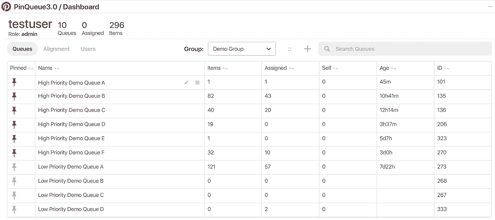

Figure 1: Pinqueue3.0 Dashboard

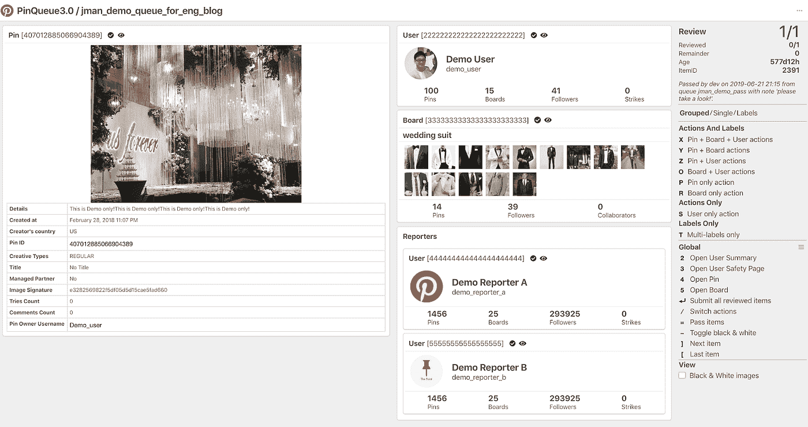

Figure 2: Pinqueue3.0 Review Page

在引擎盖下，Pinqueue3.0 是一个 Flask + ReactJS 应用程序，由 Pinterest 自己的 [Gestalt](https://github.com/pinterest/gestalt) UI 框架提供支持。在后端，Pinqueue3.0 严重依赖于 [PinLater](/@Pinterest_Engineering/pinlater-an-asynchronous-job-execution-system-b8664cb8aa7d) ，一个 Pinterest 构建的可靠的异步作业执行系统，来处理排队和采取行动的请求。使用 PinLater 显著增强了 Pinqueue3.0 的整体基础架构，它能够通过可配置的重试策略处理大量事件负载。

Pinqueue 的内容审核周期包括四个主要流程:

*   **接收事件进行评论:** Pinqueue 不知道评论的来源。通过 Pinqueue 高度健壮的 enqueue API，任何上游服务都可以发送有效的 review 事件。
*   **获取和显示数据:**从不一定由 Pinqueue 管理的各种来源获取数据。收集在线指标是为了保护和监控通信的健康状况。
*   **根据决策采取行动:** Pinqueue 将所有的动作执行卸载给 PinLater。与行动相关的信息，如决策人或决策时间，将被安全、适当地记录。
*   **保存数据:**最终，我们将所有决策数据转储到 Hive。人工审核数据是离线运营分析、审核质量审计和进一步机器学习工作的宝贵资产。

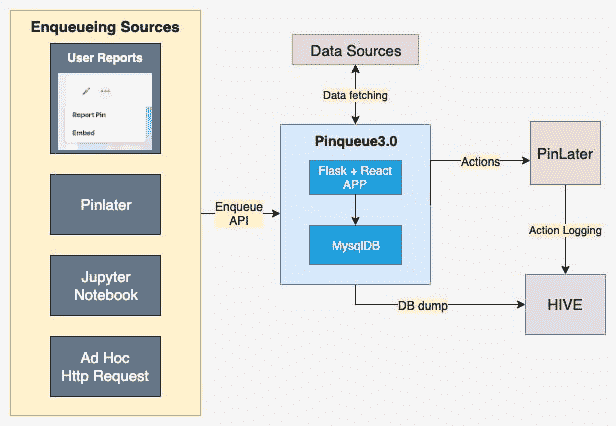

Figure 3: Pinqueue3.0 core architecture

**基于对象的架构**

如今，Pinterest 支持多种类型的用户生成内容实体:Pin、board、user、comment、tryed-it 和 message。Pinqueue 必须为所有主要实体提供内容审核支持，它还包括其他相关实体(如 Pin 的所有者)，以使审核更符合数据。例如，所有者的行为可以是决定 Pin 是否是垃圾邮件的决定性因素之一。所有者的行为越可疑，Pin 就可能越垃圾，所以一起检查这两者是很好的。在 Pinqueue3.0 中，我们将所有待审核的实体称为“**对象**”。

在实践中，信任与安全审查可能包括报告的 Pin、Pin 的所有者、相关的委员会和报告者。特定于商家的评论使用一组不同的对象:商家、其最近的 pin 和板。然而，垃圾邮件审查可能共享一个对象子集( **Pin** 或**板**)如信任&安全审查，以及另一个对象子集(大多数**最近 Pin**或**最近板**)如商家审查。

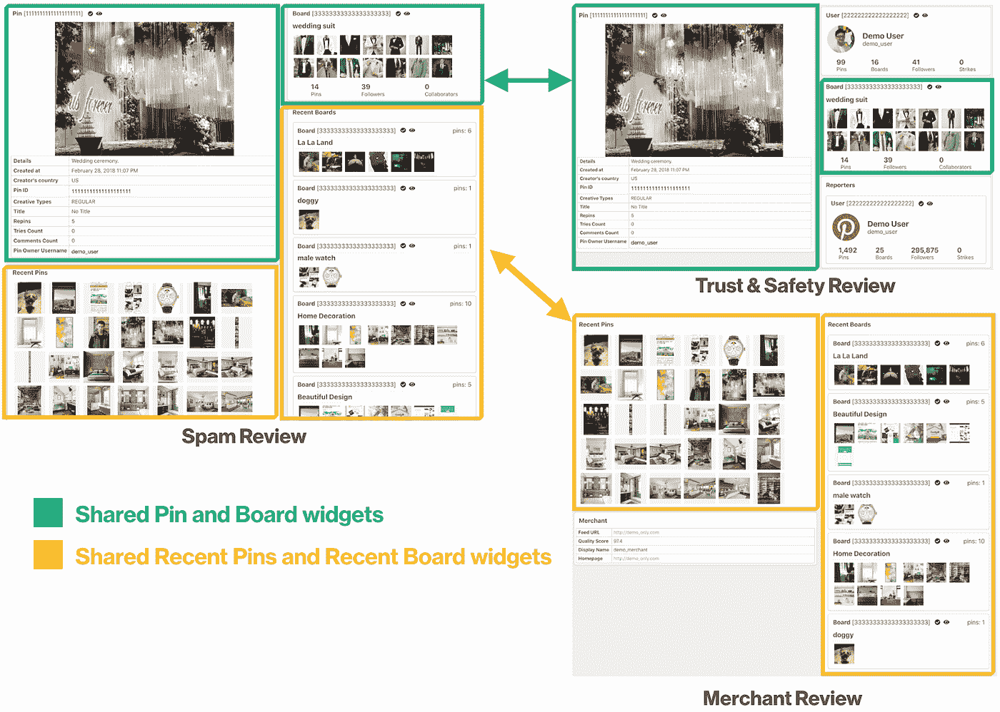

Figure 4: Shared objects across different reviews

正如您所看到的，不同的审查场景本质上是审查“**对象**”的不同组合。在整个审阅周期中，每个对象主要共享相同的方面:

*   **数据取数:**不管数据源是什么，每个对象都必须有一个对应的数据取数器，才能知道从哪里以及如何获取数据。
*   **UI 呈现:**获取的数据应该以用户友好的方式显示，最好由一组标准化的、可重用的、可扩展的 UI 组件来呈现。
*   **决策制定:**一旦针对某个对象做出了决策，它应该与目标下游服务进行对话，并确保执行和记录该操作。

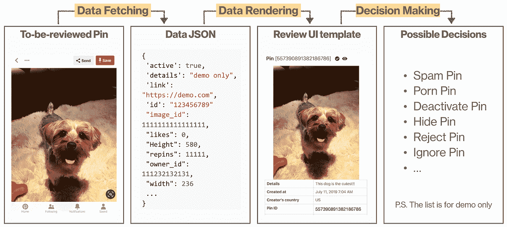

Figure 5: Object-specific modules during the review cycle

Pinqueue3.0 提供了特定于对象的抽象的模块化框架。它允许开发人员轻松扩展对任何审阅格式或对象的内容审核支持。唯一的要求是定义 UI 模板，用队列配置工具配置动作，并构建数据获取逻辑。我们已经建立了基础设施来管理对象的生命周期，并将每个对象与其对应的处理程序连接起来，因此一个 review 事件可以适应任何受支持对象的任意组合。下面是一个示例评审事件的流程图。我们将在下一节讨论**模板引擎**和**队列配置**。

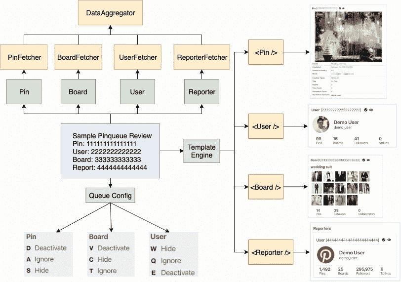

Figure 6: Pinqueue3.0 object-based architecture diagram

**使用模板引擎的动态用户界面渲染**

用 ReactJS 和 [JSX](https://reactjs.org/docs/introducing-jsx.html) 构建使我们能够传递由 HTML 或 React 元素组成的树形结构，就好像它们是标准的 JavaScript 值一样。通过利用 JSX，我们可以将每个评论页面转换为单独的模板。Pinqueue 的**模板引擎**有三个组件:**模板编辑器、模板解析器和模板渲染器**。给定编辑器生成的原始模板代码，模板解析器解析语法并决定显示哪些小部件。最终，渲染器从小部件库中调出匹配的 UI 小部件，并在有组织的布局中渲染它们。

为什么我们需要一个模板引擎？首先，它允许我们轻松地定义评论页面的布局，并指定使用什么组件。人眼更倾向于关注页面的中心。小部件的位置就像一个自然的向导，可以精确定位最重要的信息，我们让用户可以灵活地管理这些信息。它还使每个代理的模板成为可能。其次，它是可扩展的，可用于未来的改进。UI 小部件可以由图像、视频、表格或标题等基本元素组成。我们计划使组件更加通用和抽象。用户可以通过组装基本组件来定义他们的小部件，并配置要显示的字段。

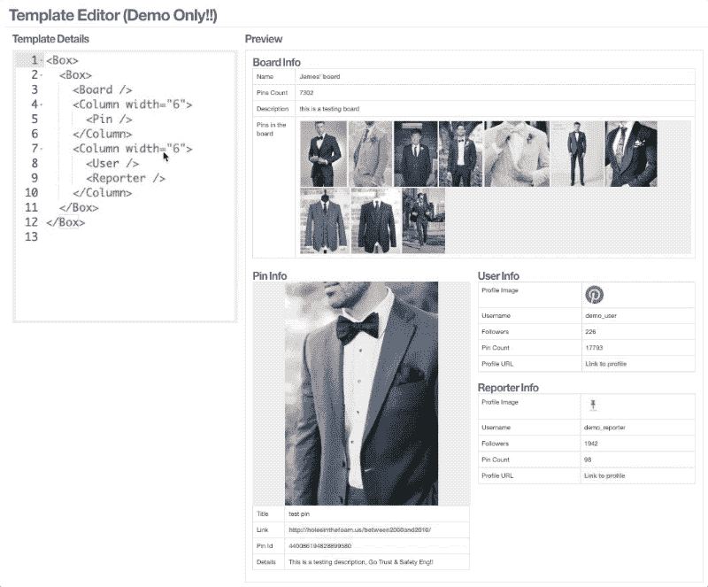

Figure 7: Pinqueue3.0 template engine demo

**通过队列配置实现完全自助服务**

作为一个通用平台，Pinqueue3.0 旨在支持各种用例。当审查相同的滥用内容时，运营团队可能希望删除内容，而 ML 工程师可能只想标记它。没有完善的自助服务功能，很难满足所有需求。当模板引擎控制 UI 时，**队列配置**涵盖了更多特定于审核的规范，比如哪些动作或标签可用，使用哪个热键和模板以及其他各种配置。**队列配置**是可重用和可共享的，它保证了跨队列的统一和可管理的审查体验。

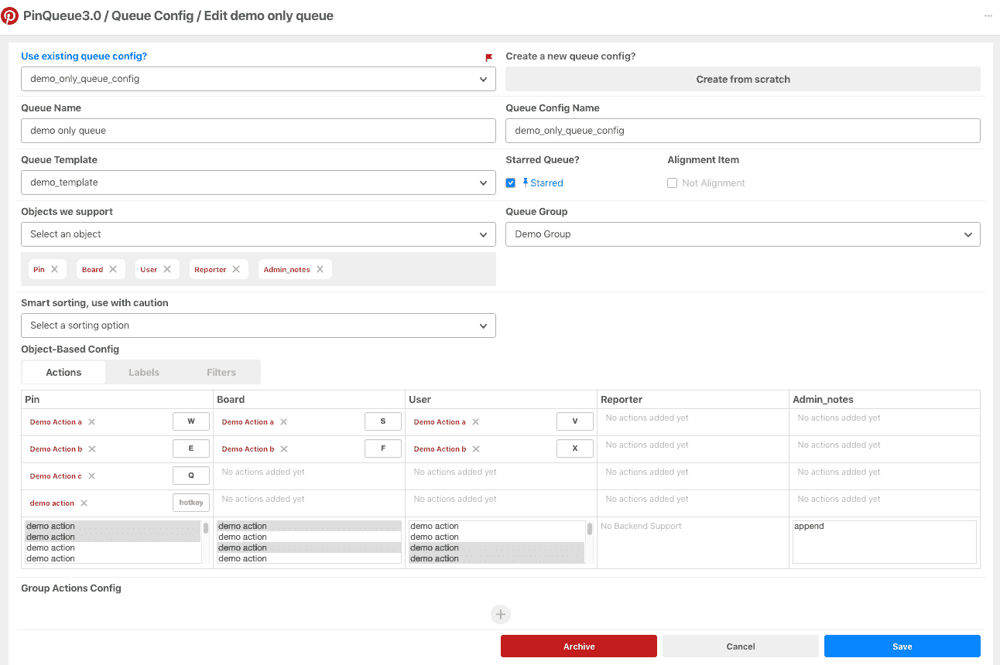

Figure 8: Pinqueue3.0 main queue config page

Pinqueue3.0 为每个对象维护一个**支持动作**的列表。审核主管可以轻松配置对审核页面上的对象采取的操作。即使多个队列正在检查相同的对象，它们的决策选项也可能不同。

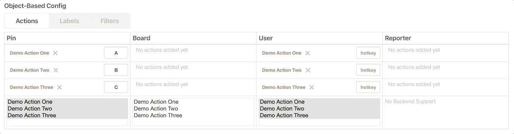

Figure 9: Pinqueue3.0 actions config

仅仅依靠人力来解决信任和安全问题是不可扩展的。未来的自动化和机器学习工作可以受益于高质量的人类策划的标签。我们高度重视标记的重要性，所以我们将**标记**作为队列配置的内置特性。到目前为止，标签是一个自由格式的字符串。除了热键支持，还有其他高级配置，如标签是可选的还是强制的，以及是否允许单个或多个标签。

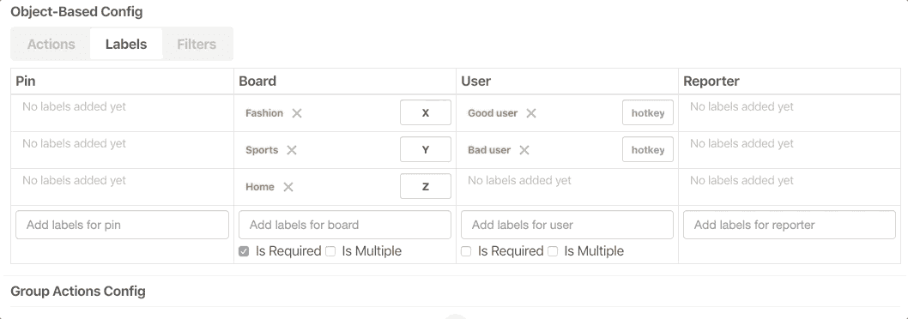

Figure 10: Pinqueue3.0 labels config

在后台，队列配置被保存为结构良好的 JSON。使用 JSON 使得添加和管理新配置变得可扩展。review 页面严格遵循队列配置，并相应地在菜单上呈现操作/标签。

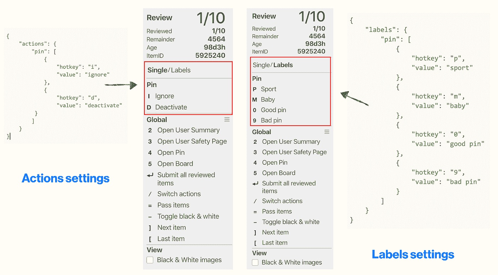

Figure 11: Queue Config JSON to action menu items mapping

我们相信模板引擎和队列配置的结合是释放更多自助服务功能的关键。我们计划通过引入拖放功能使模板编辑更加直观。队列配置在提高审查效率和运营效率方面继续发挥着关键作用。

**其他高级功能**

**Kitty 模式:**有时用户希望在不捕捉图形内容的情况下，通过截图/视频来测试或重现一个 bug。当小猫模式打开时，所有图像都变成小猫。

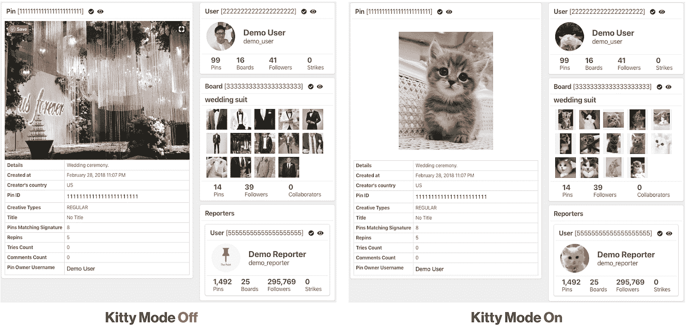

Figure 12: Kitty Mode off and on

**评审细节:**为了培训或进一步审核评审人员的评审质量，评审团队需要一种方法来了解谁作出了决定，何时作出了决定，以及对哪个对象采取了行动。“查看详细信息”页面是一个一站式商店，它检索并显示与某些对象或特定项目相关的决策的完整历史。

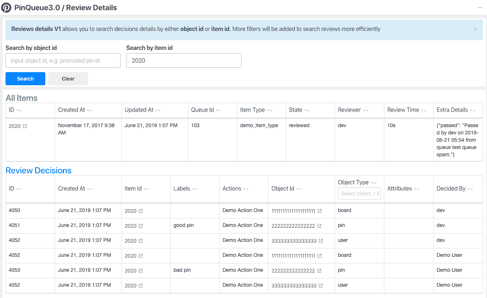

Figure 13: Review details page

**通过:**我们经常看到由于错误选择的报告原因(例如，垃圾邮件评论结果是色情评论，或者用户遇到外语评论)，错误路由的项目最终出现在错误的队列中。由于每个队列都由一组训练有素、最了解策略的审阅者管理，因此用户可以将项目传递到不同的队列，以确保正确处理。

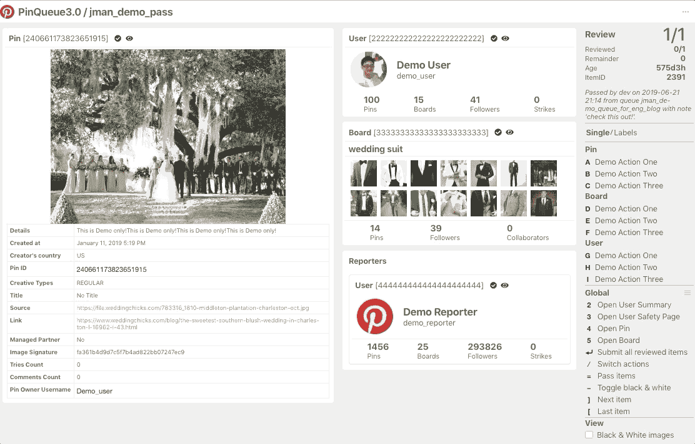

Figure 14: item passing feature

下一步是什么

世界上有数亿人使用 Pinterest 来发现和做他们喜欢的事情，我们的工作是保护他们免受虐待和有害内容的影响。我们致力于为所有 Pinners 提供鼓舞人心而又安全的体验。解决信任和安全问题需要跨多个领域的专业知识的共同努力。Pinqueue3.0 不仅在迅速删除不安全内容方面发挥着关键作用，而且通过提供高质量的人工标签，它已经成为未来 ML/自动化计划的推动者。展望未来，我们将继续改善审核体验，衡量审核质量，并与我们的机器学习团队合作，在更大范围内解决人工审核之外的内容审核问题。

***致谢*** *:非常感谢整个信任&安全工具团队，他们帮助改善 Pinqueue 并确保 Pinners 的安全。特别感谢戴维·苏、贝基·斯通曼、帕特里夏·佩罗佐、阿洛克·辛哈尔和丹尼斯·霍特的反馈和编辑协助。*