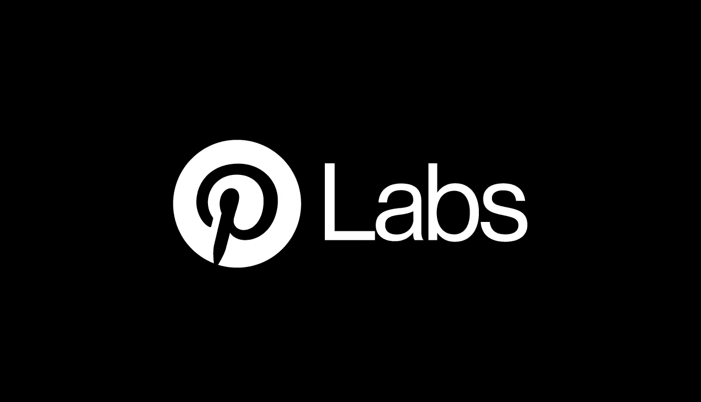

# 介绍 Pinterest 实验室

> 原文：<https://medium.com/pinterest-engineering/introducing-pinterest-labs-2e230bdcd1fc?source=collection_archive---------3----------------------->

Jure Leskovec | Pinterest 首席科学家

**Pinterest Labs tackles the most challenging problems in machine learning and artificial intelligence with experts inside and outside of the company.**

这些年来，Pinterest 在机器学习和人工智能方面取得了长足的进步，从构建引导搜索到视觉搜索、镜头和商店外观，再到相关 pin、本地化和推广 pin。深度学习是推动 Pinterest 发展和帮助世界各地的人发现新想法的关键，即使他们没有语言来描述他们想要的东西。

尽管我们已经做了很多工作，但仍有很长的路要走 Pinterest 的大部分还没有建成。这就是为什么今天我们宣布 Pinterest Labs，在那里我们将解决机器学习和人工智能中最具挑战性的问题。实验室汇集了顶尖的研究人员、科学家和工程师，致力于图像识别、用户建模、推荐系统和大数据分析。我们的研究人员遍布 Pinterest，使我们的发现每天影响数亿用户。

在 Pinterest 内部，我们有在人工智能和 ML 研究方面具有数十年经验的专家，包括我(斯坦福副教授，Kosei 的联合创始人)、Ruben Ortega(前艾伦人工智能研究所 CTO，A9 CTO & Mechanical Turk 总监)、Sonja Knoll(前微软研究科学家)和 Vanja Josifovski(前谷歌和雅虎研究公司)，将会有更多的人加入。

作为实验室的一部分，我们将与研究团体和大学合作，包括伯克利人工智能研究实验室、加利福尼亚大学圣地亚哥分校和斯坦福大学。我们将通过在顶级会议上发表的研究论文，并通过发布数据集以推进学术研究，开发供研究社区研究的挑战性问题，以及向公众开放技术讲座(第一场讲座将于明天举行—[加入我们的行列](https://pinteresttechtalk.splashthat.com/))来分享我们在 labs.pinterest.com一路上学到的知识！).

有超过 1000 亿个物体，我们正在使用世界上最大的图像丰富的数据集，它混合了技术和人类治疗。这一独特的机会使我们能够分析趋势、理解意图并预测消费者行为。我们只是触及了通过开发尖端算法可能实现的目标的表面。我们希望通过与公司内外的专家合作，我们能够更快地为味觉图谱和个性化推荐构建人工智能。

有很多关于人工智能和机器学习的未来以及它在未来 10 年能带我们去哪里的谈论。虽然我们致力于塑造人工智能的未来，但我们也受到了今天触及日常生活的技术的启发。我们没有等待机器学习的未来，我们正在将它带给 Pinterest 上超过 1.5 亿人。例如，我们的系统每天对超过 3000 亿个对象进行排名，仅在去年一年，我们提供的推荐数量就增加了 200 %,同时增加了 30%的吸引力。

在[labs.pinterest.com](http://labs.pinterest.com)关注所有这些和更多，并在这个博客、 [Pinterest](https://www.pinterest.com/malorie/pinterest-engineering-news/) 、 [Github](https://github.com/pinterest/) 、[脸书](https://www.facebook.com/pinterestengineering/)和 [Twitter](https://twitter.com/PinterestEng) 上了解更广泛的工程团队。