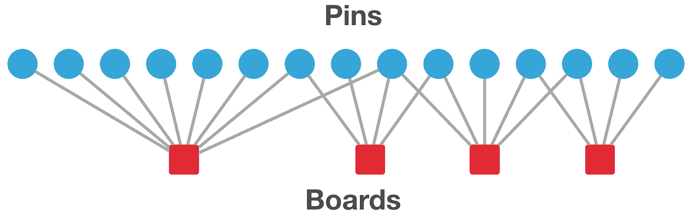
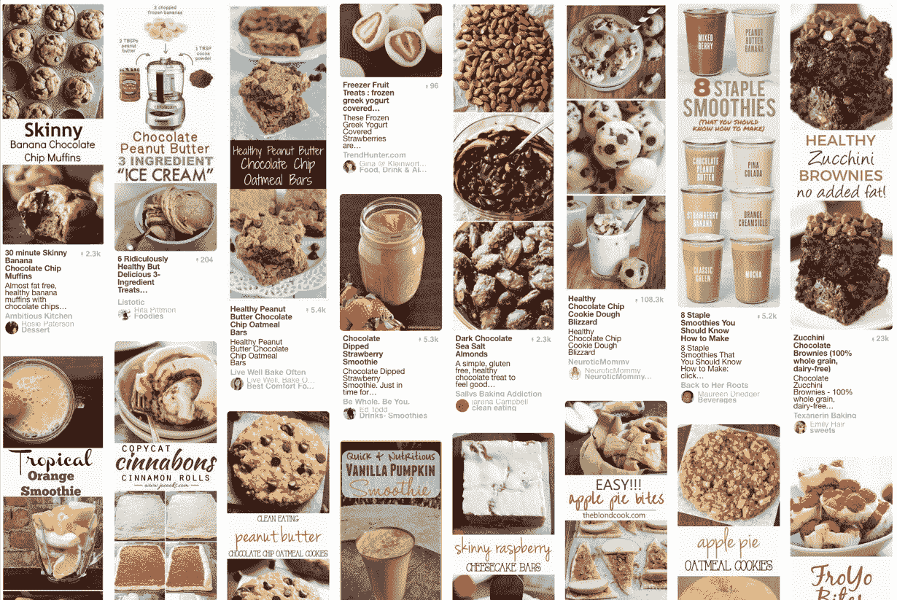

# 介绍 Pixie，一个基于图形的高级推荐系统

> 原文：<https://medium.com/pinterest-engineering/introducing-pixie-an-advanced-graph-based-recommendation-system-e7b4229b664b?source=collection_archive---------1----------------------->

作者:Pong Eksombatchai & Mark Ulrich | Pinterest 工程师，发现

在 Pinterest，一个主要的工程挑战是帮助人们每天发现和做事情，这意味着在正确的时间将正确的想法提供给正确的人。虽然大多数其他推荐系统只有一小部分可能的候选人，例如 10 万部电影，但 Pinterest 必须从全球 1.5 亿人保存的 1000 多亿个想法中实时推荐。我们设定了 60 毫秒 p99 延迟的性能目标，为了实现这一目标，我们构建了 Pixie，这是一个灵活的基于图形的系统，用于实时提供个性化建议。Pixie 现在在 Pinterest 的相关 pin、home feed 和 Explore 中提供推荐，占所有保存的 pin 的一半左右。

**小精灵**

我们从一个[二分图](https://en.wikipedia.org/wiki/Bipartite_graph)开始，其中每条边显示一个人将一个大头针保存到一块板上。

这个图表从我们的用户那里获取了大量丰富的数据，非常大，有超过[1000 亿条边](https://twitter.com/Pinterest/status/829391363158446080)和几十亿个节点。值得庆幸的是，今天的 RAM 非常便宜，像这样的大数据足够小，可以安装在现成的 AWS 机器上。在太字节规模的 RAM 机器可用之前，需要像 Hadoop 或 Spark 这样的复杂分布式系统来为这种规模的数据计算算法。幸运的是，在某种程度上，大数据实际上正在变得越来越小！现在，我们可以将整个图加载到一台机器上，并遍历所有图，而无需进行任何网络调用。这使得密集连通图上的实时算法更容易开发和大规模部署，并允许我们在 Pinner 打开我们的应用程序时实时提出建议(而不是在前一天晚上在批处理作业中计算它们)。

虽然我们已经开发了像 [Pinnability](/@Pinterest_Engineering/pinnability-machine-learning-in-the-home-feed-64be2074bf60) 这样的高级机器学习系统，可以预测一个想法与 Pinner 的相关程度，但第一个挑战是计算出 1000 多亿个 pin 中的哪些可以考虑，因为我们不可能一次对它们进行评分。这就是为什么基于图表的推荐系统对我们来说是有价值的。Pixie 通过从一组我们已知当前与 Pinner 相关的节点开始遍历图形来解决候选生成问题。然后，通过使用[有偏随机游走](https://en.wikipedia.org/wiki/Biased_random_walk_on_a_graph)算法来估计个性化 [PageRank](https://en.wikipedia.org/wiki/PageRank) ，它只检查图中最靠近这些节点的部分。我们从多个引脚开始遍历，并在所有引脚的交叉点找到推荐。例如，假设一个 Pinner 最近与以下三个 pin 进行了交互。

我们可以把它们都送给 Pixie，然后拿回几千个类似的别针。

事实上，我们可以在一个查询中向 Pixie 发送数百个不同的图钉，每个图钉都有自己定制的重量。

Pixie 已经成功替换了 Pinterest 上的多个候选生成器。我们已经看到该系统将用户参与度提高了 50 %,并且通过推荐以前未发现的内容改善了生态系统的健康状况。今天，我们有一个庞大的 Pixie 服务器群，每个服务器每秒支持 1，000 个查询，p99 延迟为 60 毫秒，用于我们的推荐产品，包括[相关 pin](/@Pinterest_Engineering/applying-deep-learning-to-related-pins-a6fee3c92f5e#.m1zyskflp)、home feed、email、Explore 等！

*鸣谢:该系统由 Jure Leskovec 领导的 Pinterest 实验室的许多工程师构建和改进，其中包括作者 Rahul Sharma、Jerry Zitao Liu、Pranav Jindal、和 Charles Sugnet。整个公司的人都帮助将它推广到单个产品，并利用他们的见解和反馈来改进它。*