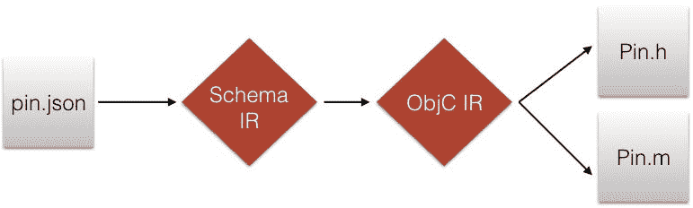
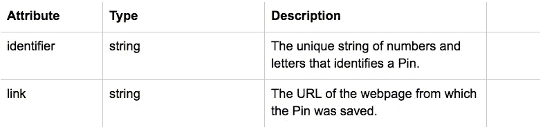
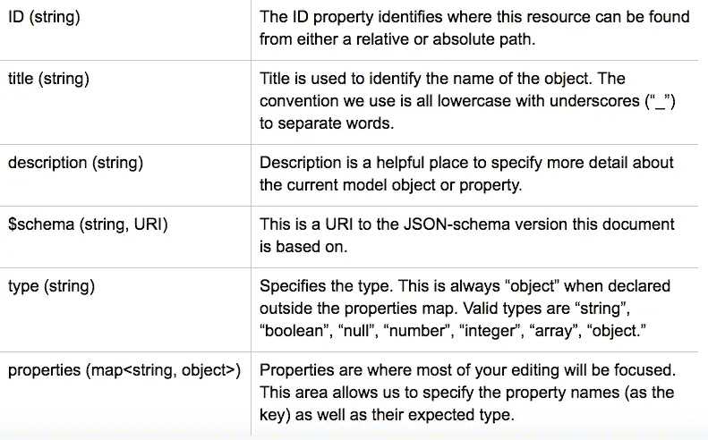

# 介绍 Plank:面向 iOS 的不可变模型生成

> 原文：<https://medium.com/pinterest-engineering/introducing-plank-immutable-model-generation-for-ios-4b2f64bda00c?source=collection_archive---------2----------------------->

Rahul Malik | Pinterest 技术主管，iOS 核心体验

去年，我们的 iOS 团队[对我们整个应用的架构](/@Pinterest_Engineering/re-architecting-pinterest-039-s-ios-app-e0a2d34a6ac2#.qodvqwle1)进行了彻底检查。这是一项巨大的努力，它让开发者迭代更快，更容易扩展，并让全世界的 Pinners 快了 3 倍。我们的新系统非常依赖于并发性。UI 渲染、图像下载、GIF 解码和网络响应处理只是利用多线程提升性能的几个方面。这意味着这些组件使用的对象必须是线程安全的，以避免错误和潜在的崩溃。由于模型对象在我们应用程序的几乎所有组件中传递，所以我们的模型层可以安全地跨线程使用是很重要的。

为了解决这个问题，我们转移到了一个[不可变模型层](/@Pinterest_Engineering/immutable-models-and-data-consistency-in-our-ios-app-d10e248bfef8#.jf1rib7oz)。不可变对象与可变对象的不同之处在于，它们一旦被创建就不能被修改，这使得它们本质上是线程安全的。这允许开发人员编写更容易推理的代码，因为不变量一旦建立就不能改变。今天[我们开源了 Plank，](https://pinterest.github.io/plank/)一个不可变的 iOS 模型生成器来实现这个目标。 [Plank](https://pinterest.github.io/plank/) 是一个用 Swift 编写的命令行工具，可以生成不可变的 Objective-C 模型。在这篇文章中，我们将重点介绍它的一些主要功能和创建动机。


# 动机

设计和维护一个模型层可能是乏味且容易出错的。缺少简单的空检查或试图序列化包含无法序列化的属性的对象会导致未定义的行为和崩溃。手写的模型在实现中也会遇到不一致的问题，并且在序列化时会导致不同的行为和策略。

这里有几个由于手写模型中的问题而导致的常见错误和崩溃的例子。

当我们开始构建我们的不可变模型层时，我们正在着手一个新的领域。我们中的一些人熟悉不变性的好处，但是没有构建不可变对象的经验。

假设我们的应用程序模式中有数百种类型的模型，那么模型设计中的任何错误，比如添加一个类似序列化的新功能，都可能是很难修复的。当您考虑处理 JSON 解析、序列化、等式和其他常见操作的更新方法时，即使是为模型类型添加新字段这样简单的任务也很容易出错，而且很乏味。

如果我们将模型严格定义为一组值的表示，那么像合并和序列化这样的特性就可以从该模式中派生出来。这意味着我们的模型代码是完全可预测的，所以我们选择生成它们。

# 目标

开始时，我们对生成的代码有几个主要目标:

*   **不可变:**模型类将根据不变性作为一个需求来生成。每个类都有一个“生成器”类来处理变异。
*   **类型安全:**基于模式定义中指定的类型信息，每个类将提供类型验证和空引用检查，以确保模型的完整性。
*   **模式定义的:**模型类型应该以一种独立于语言的格式定义，这种格式易于扩展并且广为人知。

# 政纲条目

Plank 模式基于 [JSON](http://json-schema.org/) ，这是一个定义良好、可扩展且独立于语言的规范。在 JSON 中定义模式使我们能够避免编写不必要的解析器代码，并为从服务器上使用的相同类型的系统中生成代码提供了可能性。

类似于编译器，我们将这些 JSON 模式转换成一个中间表示(IR)，我们称之为“模式 IR”一旦我们有了模式 IR，我们就把它翻译成一个目标-C IR。这个额外的 IR 级别很重要，因为虽然 Plank 现在生成 Objective-C 代码，但它是为将来支持更多语言而设计的。



# 通过 Plank 生成模型

让我们用这些字段创建一个表示 Pin 的模型。



# 定义模式

Plank 接受一个模式文件作为输入，所以我们需要创建一个。这是我们的 Pin 类型的模式。您会注意到我们指定了模型的名称及其属性列表。注意，link 指定了一个附加的`format`属性，告诉 Plank 使用一个更具体的类型，比如`NSURL`或`NSDate`。



# 生成模型

假设这个模式被保存为`pin.json`，我们通过运行`plank` `pin.json`来生成我们的模型。下面我们将重点介绍 Plank 从您的模式中生成的一些功能。

```
$ plank pin.json
```

The Pin class interface created by Plank

您会注意到的第一件事是所有属性都是`readonly`。这使得该类成为不可变的，但是它并不真正有用，因为我们没有办法用任何值来填充`Pin`的实例。为了解决这个问题，我们需要一个抽象，它接受一组值并产生一个不可变的对象。

# 突变和建设者

Plank 生成的模型中的变异是通过一个构建器类执行的。这是[构建器模式](https://en.wikipedia.org/wiki/Builder_pattern)的直接实现，Plank 将为您生成它。builder 类是一个单独的类型，它包含了`readwrite`属性和一个`build`方法，该方法将创建一个新的对象。

# JSON 解析

现在我们有了一个不可变的模型和一个生成器类来创建新的实例。然而，大多数应用程序并不是静态的，而是依赖于从 API 返回的 JSON 数据。下面是我们的 Pin 模型的 JSON 响应示例。

为了正确处理这个响应，我们不仅需要断言响应类型是正确的，还需要添加额外的逻辑来将链接表示为`NSURL`的一个实例。小心处理`null`值也很重要，以避免将属性设置为`NSNull`的值或将`null`传递给需要`nonnull`参数的 API。这些错误会导致不可预测的行为和崩溃。

Plank 将创建一个名为`initWithModelDictionary`的初始化方法，用于解析符合您的模式的`NSDictionary`对象。

# 序列化

如果您想要为您的应用程序构建离线支持或者在应用程序启动时持久化数据，您需要将模型存储到磁盘。iOS 上最传统的方式是在每个模型上实现`NSSecureCoding`。在 Pinterest，我们使用 [PINCache](https://github.com/pinterest/PINCache) 作为冗余的直写模式缓存，它也通过`NSSecureCoding`管理持久性。

Plank 为您生成了`NSSecureCoding`实现。因为所有本机类型都已经是可序列化的，所以您可以免费获得这一功能。

通过这种实现，使用`NSKeyedArchiver`对对象进行序列化

# 模型合并和部分对象具体化

如果你的团队决定采用一个新奇的后端 API，允许消费者精确地指定他们需要的字段，类似于 [Pinterest 开发者 API](https://developers.pinterest.com/docs/api/overview/) 或 [GraphQL](http://graphql.org/) ，我们之前请求的 Pin 现在可能只返回`identifier`或`link`或两者！Pinterest 中的一个例子是，当你点击一个大头针，我们就会加载更多信息。

这里我们必须考虑几个因素:

*   如果您有 Pin 并收到包含更多信息的更新版本，您如何知道要更新哪些属性？
*   如果一个属性是`nil`，如何检测该属性是否被设置过，而不是有一个值`nil`？
*   更新 Pin 后，我们如何在整个应用程序中传播该信息？

Plank 使用传统的“最后写入者获胜”方法来解决一致性问题，方法是保留该实体的最近实例中的属性集。我们使用`identifier`值作为主键，用来确定两个对象是否代表同一个实体。为了知道设置了哪些属性，我们在初始化期间或通过任何变异方法在模型本身内部跟踪这些信息。

对于不可变模型，您必须考虑数据如何流经您的应用程序，以及如何保持一致的状态。在每个模型类初始化器的末尾，有一个更新模型的通知。这对于与您的[数据一致性框架](/@Pinterest_Engineering/immutable-models-and-data-consistency-in-our-ios-app-d10e248bfef8#.d1solh378)集成非常有用。有了它，我们就可以跟踪模型的更新，并且可以使用内部跟踪来合并新的模型。

# 代数数据类型

随着应用程序变得越来越复杂，数据模型也会变得越来越复杂。您可能会发现自己需要对一个属性进行建模，这个属性可能是一组类型中的一个特殊变体，这些类型通常被称为代数数据类型(ADT)。

在 Pinterest，我们会显示一个 Pin 的原因或属性，告诉用户他们为什么会看到它。这可能是因为它来自他们关注的另一个 Pinner 或董事会，也可能是基于他们兴趣的推荐。

让我们更新我们的 Pin 模式，使其具有一个`attribution`属性，该属性可以是`User`、`Board`或`Interest`。假设我们在文件`user.json`、`board.json`和`interest.json`中分别定义了单独的模式。

Representing Algebraic Data Types with Plank

Plank 采用了这个`attribution`的定义，并创建了必要的样板代码来处理每种可能性。它还通过生成一个新的类来表示您的 ADT，从而提供了额外的类型安全。

Implicitly generated ADT class for the “attribution” property

注意在头中声明了一个“匹配”函数。这就是提取 ADT 实例的真正潜在价值的方式。这种方法保证在编译时您已经显式地处理了每一种可能的情况，防止了错误并减少了对使用运行时反射的需求，运行时反射会降低性能。下面的例子展示了如何使用这个匹配函数。

# 迅速发生的

Plank 是在 Swift 中从头开始构建的，Swift 是完成这项任务的理想语言，因为它具有强大的类型安全特性和优雅的语法。我们利用递归枚举来定义模式的所有排列。此外，尾随闭包和内联字符串插值被用来为生成代码创建一个优雅的 DSL。

下面是我们如何利用 Swift 的语言功能创建 DSL 来表达生成的 Objective-C switch 语句的一个例子:

这里有一个使用我们刚刚创建的`switch`语句 DSL 的例子。假设我们有一个变量`dayOfWeek`，它是一个从 1 到 7 的整数，分别代表周一到周日。如果`dayOfWeek`是周末，可以生成下面的 switch 语句。

# 建立强大的核心

[Plank](https://pinterest.github.io/plank/) 是构建和缩放不可变模型层的宝贵工具。生成代码为我们节省了大量开发时间，并消除了常见错误的风险。在过去的一年里，它已经在 Pinterest 的生产中进行了大量测试，我们很高兴能与社区分享这项技术。如果您有改进 Plank 的建议，请随时[在 Github](https://github.com/pinterest/plank) 上提交问题或 PR。如果这些是让你兴奋的问题，我们将雇佣你。

*鸣谢:感谢我们所有的 iOS 开发者对 plank 的使用和反馈，特别是我的队友 Wendy Lu、Brandon Kase、Levi McCallum、Bill Kunz、Jon Parise、Tim Johnsen、Connor Montgomery、Harry Shamansky 和 Garrett Moon 对本文的反馈，以及 Laurie Berger 为 Plank 设计的徽标。*