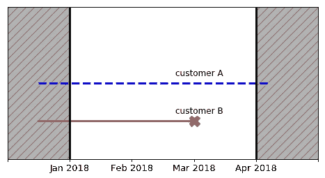

# PySurvival 简介

> 原文：<https://medium.com/square-corner-blog/introducing-pysurvival-5a274b072381?source=collection_archive---------2----------------------->


> 注意，我们已经行动了！如果您想继续了解 Square 的最新技术内容，请访问我们的新家[https://developer.squareup.com/blog](https://developer.squareup.com/blog)

> PySurvival 是一个用于生存分析建模的开源 python 包。

今天，我们很兴奋地向大家介绍 [**PySurvival**](https://www.pysurvival.io/) ，一个用于生存分析建模的 python 包。

本文是由四部分组成的系列文章的第一部分，该系列文章将包括旨在演示如何轻松利用该包的教程。你也可以在官方网站上找到这些教程:

*   [流失建模](https://www.pysurvival.io/tutorials/churn.html)
*   [预测性维护](https://www.pysurvival.io/tutorials/maintenance.html)
*   [信用风险](https://www.pysurvival.io/tutorials/credit_risk.html)


PySurvival Logo

# PySurvival 是什么？

PySurvival 是一个用于生存分析建模的开源 python 包——用于分析或预测事件可能发生时间的建模概念。它建立在最常用的机器学习包之上: [NumPy](http://www.numpy.org/) 、 [SciPy](https://www.scipy.org/) 和 [PyTorch](https://pytorch.org/) 。

PySurvival 提供了一种非常简单的方法，可以在生存分析的理论知识和如何进行全面分析以及构建和使用模型的详细教程之间导航。该包装包含:

*   从 [Cox 比例风险模型](https://www.pysurvival.io/models/coxph.html)和[神经多任务逻辑回归](https://www.pysurvival.io/models/neural_mtlr.html)到[随机生存森林](https://www.pysurvival.io/models/random_survival_forest.html)的 10+模型
*   每个模型背后的理论总结以及 API 描述和示例
*   关于如何进行探索性数据分析、生存建模、交叉验证和预测的详细教程，例如[流失建模](https://www.pysurvival.io/tutorials/churn.html)和[信用风险](https://www.pysurvival.io/tutorials/credit_risk.html)
*   评估模型能力的绩效指标，如 [c-index](https://www.pysurvival.io/metrics/c_index.html) 或 [brier 评分](https://www.pysurvival.io/metrics/brier_score.html)
*   [加载和保存模型的简单方法](https://www.pysurvival.io/miscellaneous/save_load.html)

# 装置

如果您已经安装了 gcc 的工作版本，安装 Pysurvival 最简单的方法是使用 pip。

```
pip install pysurvival
```

完整的安装步骤可以在[这里](https://www.pysurvival.io/installation.html)找到。

# 生存分析导论

## 什么是生存分析？

***生存分析用于分析或预测某一事件何时可能发生*** 。它起源于医学研究，但它的用途已大大扩展到许多不同的领域。例如:

*   银行、贷方和其他金融机构用它来[预测贷款的偿还速度](https://square.github.io/pysurvival/tutorials/credit_risk.html)
*   企业用它来预测客户何时会流失
*   公司用它来预测员工何时决定离开
*   工程师/制造商用它来[预测机器何时会损坏](https://square.github.io/pysurvival/tutorials/maintenance.html)

## 审查:为什么回归模型不能使用？

生存分析的真正优势在于它在事件尚未发生时处理情况的能力。为了说明这一点，我们以一家公司的两个客户为例，跟踪他们在 2018 年 1 月至 2018 年 4 月之间的活跃/流失状态:



Figure 1 — Example of censoring

*   **客户 A** 在时间窗口之前开始做生意，截至 2018 年 4 月，仍是公司的客户
*   **客户 B** 也是在 2018 年 1 月前开始做生意，但在 2018 年 3 月翻盘

这里，我们对客户 b 的事件有明确的描述。但是，我们没有关于客户 A 的信息，只知道他/她在 2018 年 1 月到 2018 年 4 月的时间窗结束时还没有搅拌。这种情况叫做**审查**。

人们可能会尝试使用回归模型来预测事件可能发生的时间。但是，要做到这一点，我们需要忽略经过审查的样本，这会导致重要信息的丢失。幸运的是，生存模型能够将审查考虑在内，并纳入不确定性，因此我们不是预测事件发生的*时间，而是预测事件在特定时间 发生的 ***概率。****

**

*PySurvival Logo*