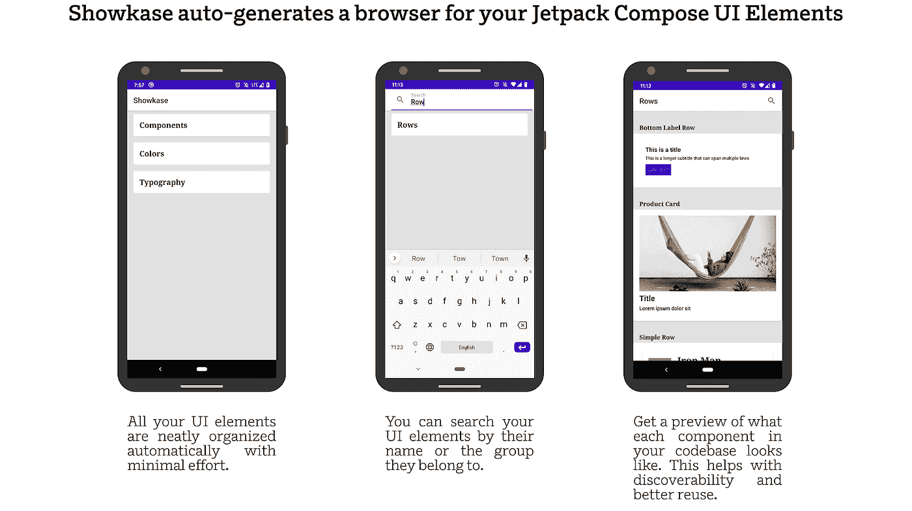
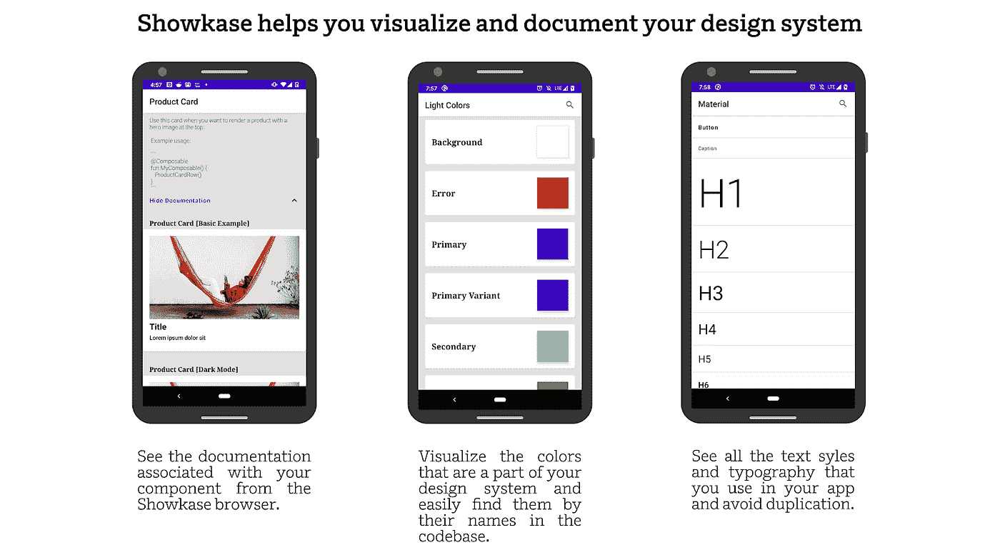
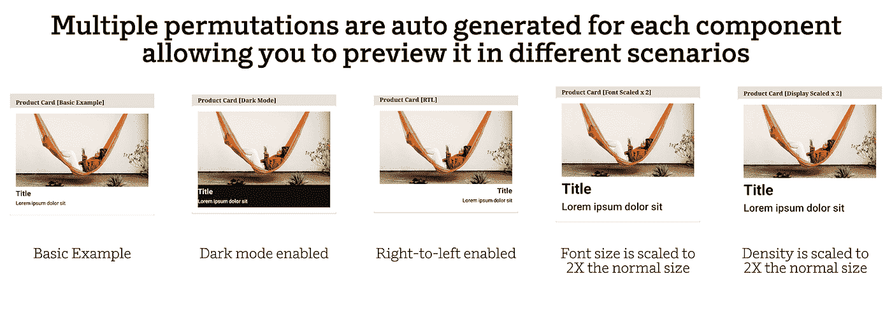
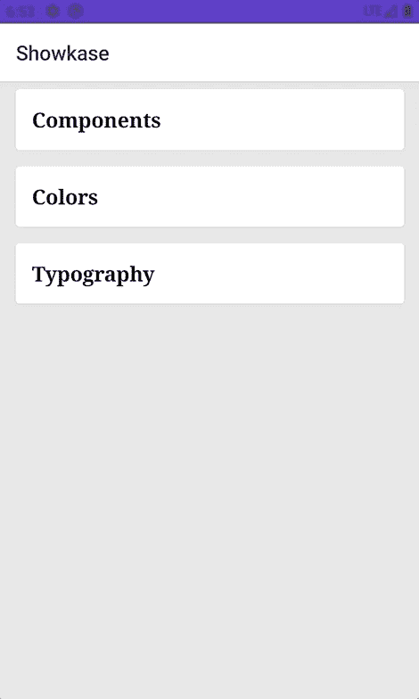
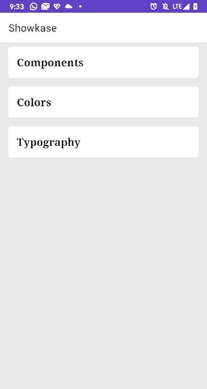

# Showkase 简介:一个用于组织、发现和可视化 Jetpack 合成元素的库

> 原文：<https://medium.com/airbnb-engineering/introducing-showkase-a-library-to-organize-discover-and-visualize-your-jetpack-compose-elements-d5c34ef01095?source=collection_archive---------1----------------------->

在过去的几年里，Android 开发在应用程序的结构、开发语言、加速开发的工具和库以及测试应用程序的改进方面都经历了巨大的变化。这些年没变的是 Android UI 工具包。

这随着 [Jetpack Compose](https://developer.android.com/jetpack/compose) 而改变——Android 用于构建原生 UI 的现代工具包。它简化并加速了 Android 上的 UI 开发，是我们所知的 Android 开发中的一个范式转变。使用声明式编程来描述 UI 是一个受欢迎的变化，随着像 web 的 [React](https://reactjs.org/) ，iOS 的 [SwiftUI](https://developer.apple.com/xcode/swiftui/) ，跨平台开发的 [Flutter](https://flutter.dev/) 这样的框架的引入，这种变化在各个平台上都很普遍。

声明式 UI 框架鼓励创建可重用的组件，这些组件可以在应用程序的不同部分之间共享。我们知道可重用性是一个很好的工程实践，但是最终经常发生的事情要稍微微妙一些。

# 有什么问题？

*   随着开发人员添加新的 UI 组件，代码库最终会有数百个组件，这些组件通常很难可视化。
*   这些组件的可发现性是一个挑战，没有简单的搜索方法。因此，您的代码库经常以提供相似功能的重复组件而告终。如果使用描述性很强的名称，您可能能够使用 IDE 来搜索组件。然而，给事物命名是困难的，描述性的名称仍然不能总是帮助我们找到要使用的正确组件。
*   同样的问题会延伸到你设计系统的其他方面，比如颜色、字体、图标等等。
*   为了解决这个问题，大多数移动团队构建了他们自己版本的“组件浏览器”,让你可以可视化你的设计系统。这通常是手工维护的，很少或根本没有工具。

如果您曾经在任何前端平台上工作过，那么您可能会对这些导致开发人员体验不佳的问题感兴趣。作为工程师，我们的工作是让软件为我们做这些工作。

# 介绍 Showkase

Showkase 是一个基于注释处理器的 Android 库，可以帮助你组织、发现、搜索和可视化 Jetpack Compose UI 元素。通过最少的配置，它会自动生成一个 UI 浏览器，为您组织设计系统。

Showkase auto-generates a browser for your Jetpack Compose UI Elements

Showkase helps you visualize and document your design system

Showkase 更进一步，在常见情况下自动生成组件的排列，如黑暗模式、从右向左布局、缩放字体等。这有助于在常见场景中预览组件，而无需做任何额外的工作。这有助于在开发组件时尽早发现问题并修复它们。

Multiple permutations are auto generated for each component allowing you to preview it in different scenarios

# 我如何使用 Showkase？

设置 Showkase 只需要几个简单的步骤-

**步骤 1:** 将依赖项添加到你的模块的`build.gradle`文件中。如果您有一个多模块设置，那么将这个依赖项添加到所有带有 UI 元素的模块中，这些元素应该显示在 Showkase 浏览器中。

**步骤 2:** 为每个受支持的 UI 元素添加相关注释，这些元素应该是 Showkase 浏览器的一部分。

Showkase 提供了不同的注释来标记您希望在 Showkase UI 浏览器中看到的 UI 元素。

对于`@Composable`组件，使用`@ShowkaseComposable`注释:

Showkase 为`[@Preview](https://developer.android.com/jetpack/compose/preview)`提供一流支持。如果您已经在使用 Compose 为在 Android Studio 中预览 Composable 提供的`@Preview`注释，您不需要做任何其他事情。

对于颜色属性，您可以向字段添加`@ShowkaseColor`注释:

类似地，对于在 Jetpack Compose 中用于表示版式的 TextStyle 属性，您可以向字段添加`@ShowkaseTypography`注释:

**步骤 3:** 在你的根模块中定义一个`ShowkaseRootModule`接口的实现。

**第四步** : Showkase 现已准备就绪！

Showkase 附带了一个预定义的活动，该活动为使用您注释的元素访问 UI 浏览器做了必要的搭建。通常你可以从应用程序的调试菜单开始这个活动，但是你也可以从任何你喜欢的地方开始！一个很好的助手函数`createShowkaseBrowserIntent`已经为你生成——只要启动 intent，你就可以开始了。

Showkase in action demonstrating how you can visualize and search all your Jetpack Compose components in your codebase.

Showkase also lets you visualize the other aspects of your design system like colors & typography.

通过减少维护您的设计系统/UI 组件所需的人工工作量，并使其更容易被发现，Showkase 有助于推动 Android 代码库中可重用组件的采用。

如果你喜欢你所看到的，并且正在试用 Jetpack Compose，试试 Showkase，让我们知道你的想法。

# 怎样才能进一步提高 Showkase？

我们正在想办法扩展 Showkase。这里有一些我们正在考虑的想法。

*   截图测试的钩子。因为您的所有组件都是 Showkase 浏览器的一部分，所以这将是一个很好的机会，让它成为您的 CI 的一部分，并检测跨 pull 请求的组件的差异。
*   支持作为设计系统一部分的其他 UI 元素(如图标、间距等)。
*   生成带有文档、搜索和截图的 Showkase 浏览器的 web 版本。

# 承认

Showkase 的灵感来自 Nathanael Silverman 在 Airbnb 开发的一个类似的内部工具。

非常感谢 Eli Hart、Ben Schwab、Laura Kelly、Andreas Rossbacher、Gaurav Mathur、Laura Skelton、Madison Capps、Steve Flanders、Shreya Sharma、Brett Bukowski、Lauren Mackevich 和 David Shariff 对 Showkase 各方面的帮助。

Airbnb 一直在寻找像你这样有才华的 Android 工程师。查看我们的[职业页面](https://careers.airbnb.com)了解当前的职位空缺并申请！

*所有商标、注册商标、产品名称、品牌均为其各自所有者的财产。在本网站中使用此类信息仅用于识别目的，并不意味着认可。*

*安卓是谷歌公司的商标。*