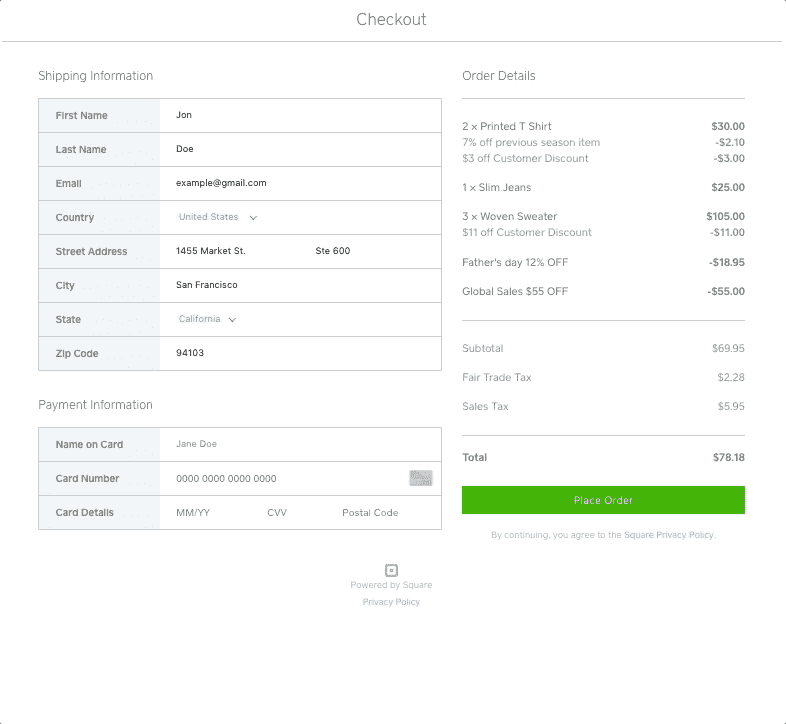
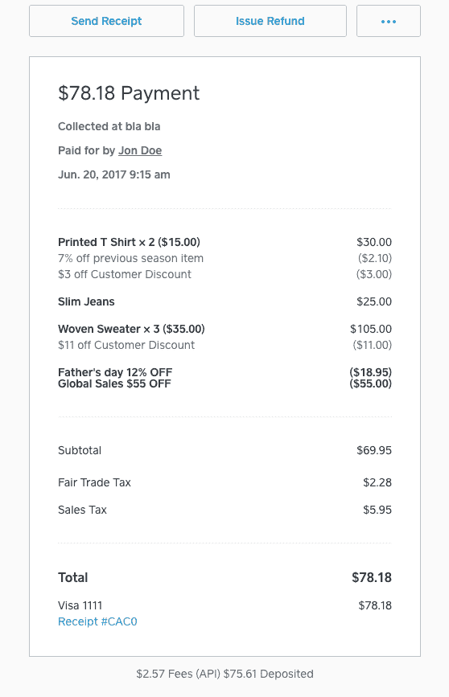
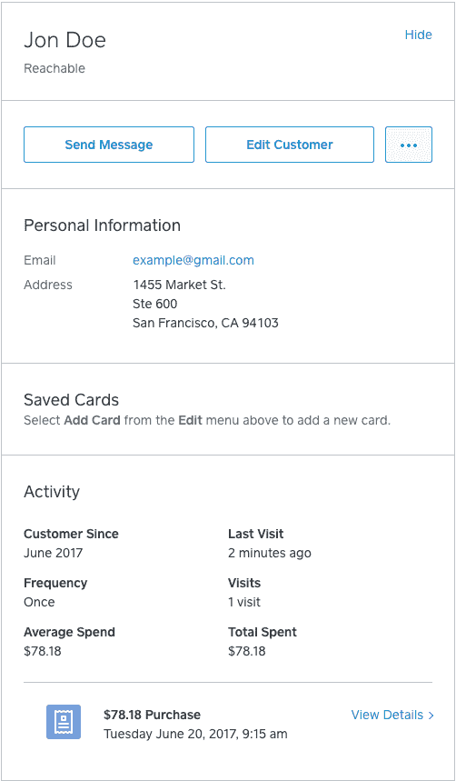

# 介绍方形收银台

> 原文：<https://medium.com/square-corner-blog/introducing-square-checkout-2991fc713c5c?source=collection_archive---------0----------------------->

## 为寻求一站式集成的 Square 开发人员提供开箱即用的托管结账支付解决方案。

> 注意，我们已经行动了！如果您想继续了解 Square 的最新技术内容，请访问我们的新家[https://developer.squareup.com/blog](https://developer.squareup.com/blog)

一年多前，我们推出了 [Build with Square](https://squareup.com/developers) ，这是我们的在线和离线支付平台以及我们的报告 API。从那以后，我们与开发者和卖家密切合作，确定如何在利用我们的 API 的同时，让开始[在线销售](https://squareup.com/ecommerce)变得更加容易。我们不断从卖家那里听到的反馈之一是:*买家和卖家都认可、信任并喜爱 Square 品牌；Square 能把这种信任带到网上吗？*

通过 Square Checkout，我们使卖家能够利用消费者在支付流程的关键点——在线输入信用卡信息——对 Square 的信任。通过清楚地说明结帐体验是由 Square 支持的，我们希望将商店中相同的信任买家体验带到他们的在线购买中。



现在，有了我们的托管结账解决方案，开发人员可以专注于构建出色的在线买家体验，而不必担心[支付处理](https://squareup.com/pos/payments)和复杂的安全和监管，因为我们会处理这些问题(例如，Square Checkout 不要求您的网站拥有 SSL 认证)。

square check out beta customer[123 contact form](https://www.123contactform.com/)帮助小型企业通过在线表单处理大量数据。它的客户包括在线销售产品或服务的公司以及募集捐款的非营利组织。当 123ContactForm 希望扩展其可用的支付处理选项时，它听取了客户的需求。

> 123ContactForm 产品负责人阿林·图胡特说:“我们的客户要求我们将 Square 作为一种支付方式，因为他们已经信任这个品牌的移动支付功能。“Square Checkout 集成过程很顺利，我们已经看到 Square 的使用量在该平台上稳步增长。”

Square Checkout 只需要一个集成，就可以访问许多 Square 功能。

# 详细登录

Square Checkout 允许开发人员将完整的交易明细(商品、税收和折扣)作为 POST 请求的一部分。要传递明细交易，您只需将订单对象和您想要的行项目传递给我们:

```
"order": {
  "reference_id": "my-order-{{$randomInt}}",
  "line_items": [
    {
      "name": "Printed T Shirt",
      "quantity": "2",
      "base_price_money": {
        "amount": 1500,
        "currency": "USD"
      },
      "discounts": [
        {
          "name": "7% off previous season item",
          "percentage": "7"
        },
        {
          "name": "$3 off Customer Discount",
          "amount_money": {
            "amount": 300,
            "currency": "USD"
          }
        }
      ]
    },
    {
      "name": "Slim Jeans",
      "quantity": "1",
      "base_price_money": {
        "amount": 2500,
        "currency": "USD"
      }
    },
    {
      "name": "Woven Sweater",
      "quantity": "3",
      "base_price_money": {
        "amount": 3500,
        "currency": "USD"
      },
      "discounts": [
        {
          "name": "$11 off Customer Discount",
          "amount_money": {
            "amount": 1100,
            "currency": "USD"
          }
        }
      ],
      "taxes": [
        {
          "name": "Fair Trade Tax",
          "percentage": "5"
        }
      ]
    }
  ],
  "discounts": [
    {
      "name": "Father's day 12% OFF",
      "percentage": "12"
    },
    {
      "name": "Global Sales $55 OFF",
      "amount_money": {
        "amount": 5500,
        "currency": "USD"
      }
    }
  ],
  "taxes": [
    {
      "name": "Sales Tax",
      "percentage": "8.5"
    }
  ]
}
```

# 仪表板报告

每次通过您的托管结帐页面进行购买，我们都会记录客户和售出的商品，随时间跟踪数据，并通过 Square Dashboard 提供对报告的访问。这样，卖家可以跟踪他们的客户和他们出售的物品。



Itemized transaction data on Square Dashboard

# 客户 API

作为 Square Checkout 集成的一部分，开发人员无需额外开发即可从[客户 API](https://docs.connect.squareup.com/api/connect/v2/#navsection-customers) 中获益。这允许卖家拥有与其所有销售相关的买家数据，提供销售报告和运输信息的完整整体视图。



Customer data attached to transaction

# 其他好处

为了让开发人员的体验更轻松，我们在使用 Square Checkout 时还提供了以下好处:

*   [退款保护](https://squareup.com/help/us/en/article/5394-square-chargeback-protection)
*   下一工作日存款
*   [PCI 符合性](https://squareup.com/guides/pci-compliance)
*   不需要 SSL 支持

像我们的其他产品一样，所有这些信息都可以通过使用我们的 [listCustomers](https://docs.connect.squareup.com/api/connect/v2/#endpoint-listcustomers) 和[list transaction](https://docs.connect.squareup.com/api/connect/v2/#endpoint-listtransactions)API 随时导出到您自己的系统中。

如果您对产品有任何反馈，请随时联系我们。

# 附加阅读

*   结账[入门](https://docs.connect.squareup.com/articles/square-checkout-getstarted)。
*   检验[发行说明](https://docs.connect.squareup.com/articles/checkout-api-released-transactions-api-updated-2017-06)。
*   结帐 API 参考[页面](https://docs.connect.squareup.com/api/connect/v2/#navsection-checkout)。
*   支持的 SDK:[Ruby](https://github.com/square/connect-ruby-sdk/)， [Python](https://github.com/square/connect-python-sdk/) ， [PHP](https://github.com/square/connect-php-sdk/) ， [C#](https://github.com/square/connect-csharp-sdk) ， [Java](https://github.com/square/connect-java-sdk)