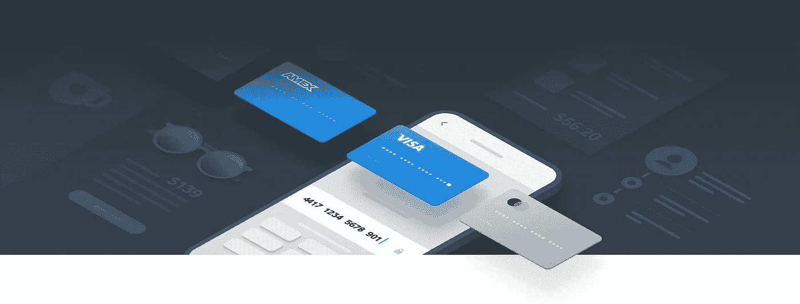
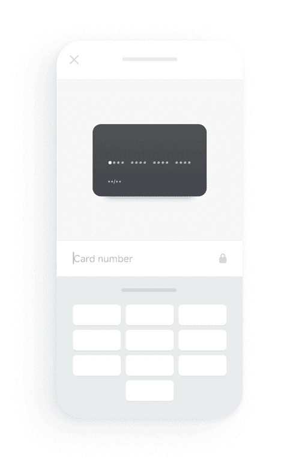
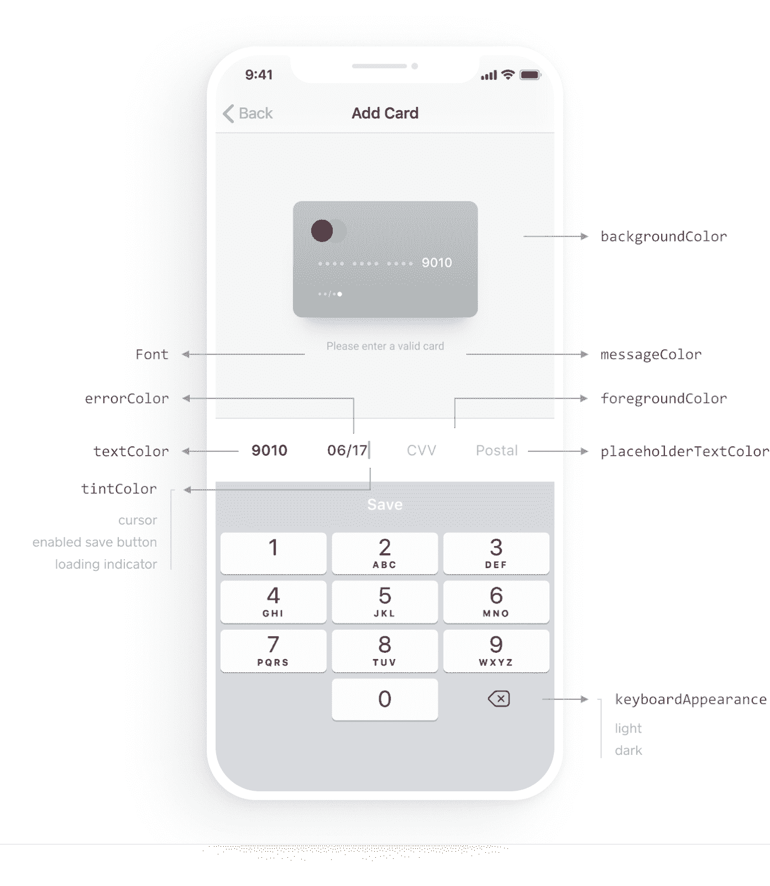
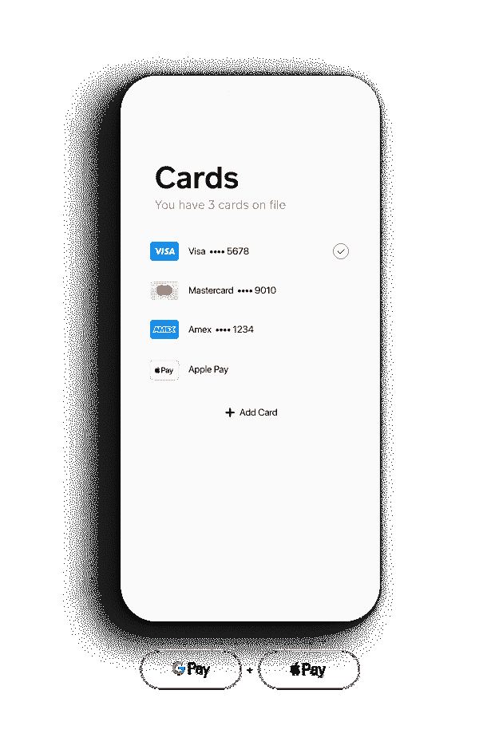
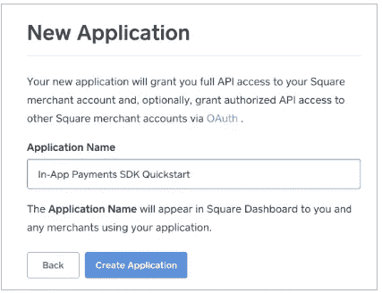

# Square 应用内支付 SDK 简介

> 原文：<https://medium.com/square-corner-blog/introducing-square-in-app-payments-sdk-1fc93b32814c?source=collection_archive---------1----------------------->

## 适用于 iOS、Android 和 Flutter 的安全、可定制的应用内支付解决方案。

> 注意，我们已经行动了！如果您想继续了解 Square 的最新技术内容，请访问我们的新家[https://developer.squareup.com/blog](https://developer.squareup.com/blog)

毫不奇怪，移动商务继续流行。比如 2018 年黑色星期五和网络星期一期间，[移动占](https://www.pixelunion.net/blog/mobile-ecommerce-stats/)销售额的 66%。随着我们在过去几年中构建了 Square 开发人员平台，我们的开发人员社区一直要求能够在买方设备上运行的移动应用程序中通过 Square 进行原生支付。我们听取了社区的意见，并不懈努力提供真正符合 Square 标准的应用内支付体验。

今天，我们很高兴推出 [Square 应用内支付 SDK](https://squareup.com/us/en/developers/in-app-payments) ，它使开发者能够在他们自己的移动应用内接受 Square 支付。这使得买家可以通过移动应用安全地支付购买的实物商品或服务，并在他们的个人资料中添加信用卡。

Square 应用内支付 SDK 完善了 Square 的全渠道开发者平台，这意味着开发者现在可以使用 Square 构建[在线](https://squareup.com/us/en/developers/online-payment-apis)、[面对面](https://squareup.com/us/en/developers/reader-sdk)和[应用内](https://squareup.com/us/en/developers/in-app-payments)支付解决方案。这意味着构建和维护多个支付集成花费的时间更少。这还意味着后台报告无缝地统一在一个系统中，使企业能够轻松地做出数据驱动的决策。

[Brushfire](https://brushfire.com/) 是一个快速增长的票务和注册平台，一直通过测试程序使用 SDK，并能够快速将 Square 的应用内支付 SDK 集成到他们的移动应用中。他们在活动中使用 Square 来驱动信息亭，但在他们的移动应用中实施应用内支付 SDK 使客户能够轻松购买他们大型活动的门票，将转化率提高了 20%以上。

> “Square 的应用内支付 SDK 简单易用。从技术的角度来看，我们喜欢它:它让我们可以做一些以前不可能做的事情，而且我们比以前更容易做到。这对开发者来说才是最重要的。”
> 
> **Jorin Slaybaugh，Brushfire 的技术负责人**

与我们的其他 API 和 SDK 一样，Square 处理所有的支付复杂性，例如维护 PCI 合规性、减少欺诈、管理纠纷，以及代表使用 Square 应用内支付 SDK 的开发人员保护买家数据的安全。

# 它是如何工作的

Customizable components of the Square In-App Payments SDK.

该 SDK 具有交互式 UX，可以安全地收集买家的信用卡信息并对其进行标记。开发人员不需要处理原始的信用卡信息，这不属于 PCI 的范围。SDK 允许开发人员完全定制 UX 的所有不同部分，以便他们可以匹配自己应用程序的外观和感觉。

Digital wallet support of the Square In-App Payments SDK.

还支持类似 Apple Pay 和 Google Pay 的数字钱包，这有助于开发者提高转化率，并提供更流畅的买家体验。开发商还可以选择安全地将卡存储在文件中，这样重复购买者下次就不必重新输入他们的卡。

# 开始

使用应用内支付 SDK 很容易上手。

## 1.访问我们的[文档](https://docs.connect.squareup.com/payments/in-app-payments-sdk/what-it-does)网站了解更多信息，然后前往[开发者仪表板](https://connect.squareup.com/apps?v=developers)创建一个新应用

## 2.添加 SDK

> ios

> 机器人

## 3.自定义 UX 以匹配您的应用程序的外观，并实例化卡片条目视图

> ios

> 机器人

当买家将信用卡详细信息输入到您的应用程序中时，SDK 会标记这些详细信息并返回一个 nonce，这是一个引用信用卡详细信息的一次性标记。然后，您将 nonce 发送到您的后端，并使用我们的 Connect V2 API 向客户收费或在文件上创建卡。就是这样！

> “有了这个 SDK，Square 处理了大量存储卡信息、处理交易等繁重工作。Square 应用内支付 SDK 是一个比市场上其他选择更灵活的实现，从一开始就感觉没有摩擦。我们能够定制流程的外观和感觉，这样它看起来就像我们的客户想要的那样，但仍然感觉是应用程序的原生，因此它值得信赖和诚实。”
> 
> PepperHQ 首席产品官 Adam Robinson。

[PepperHQ](https://www.pepperhq.com/) 是一家为寻求移动支付、订单提前解决方案等服务的酒店公司开发定制的商家品牌移动应用的公司。

我们很高兴看到您将使用这个 SDK 构建什么。Square 应用内支付 SDK 从今天开始在美国、加拿大、英国、澳大利亚和日本上市。你可以在我们的[文档](https://docs.connect.squareup.com/payments/in-app-payments-sdk/what-it-does)中了解更多关于 Square 应用内支付 SDK 的信息。要了解 Square 开发者平台的更多信息，请访问 https://squareup.com/developers 的[或加入我们在 squ.re/slack](https://squareup.com/developers)的社区。

*注意:Square 只支持 Apple Pay 和 Google Pay 进行美元交易。*

**附加阅读**

*   使用 [Square Reader SDK](https://docs.connect.squareup.com/payments/readersdk/quickstart/start) 将当面支付与 Square 硬件集成
*   通过 [SqPaymentForm](https://docs.connect.squareup.com/payments/sqpaymentform/sqpaymentform-overview) 将在线支付与 Square 整合