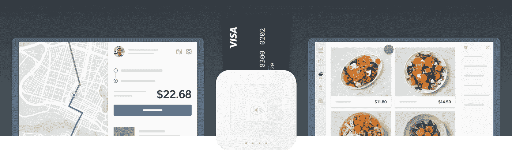
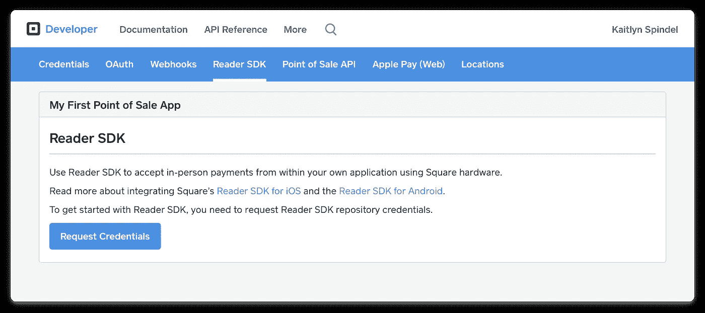
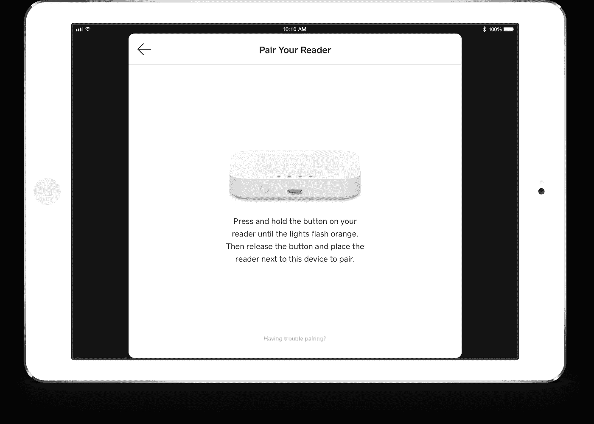
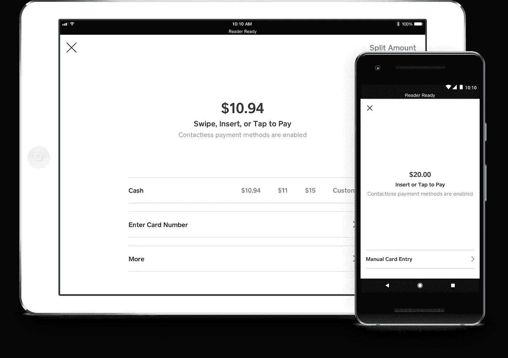

# Square Reader SDK 简介

> 原文：<https://medium.com/square-corner-blog/introducing-square-reader-sdk-939a9ec2d197?source=collection_archive---------1----------------------->



## 面向 Android 和 iOS 开发者的集成当面支付解决方案，使用 Square 硬件。

> 注意，我们已经行动了！如果您想继续了解 Square 的最新技术内容，请访问我们的新家[https://developer.squareup.com/blog](https://developer.squareup.com/blog)

两年前我们推出了 [Square Developer](https://squareup.com/developers) ，这是一个让开发者能够为 Square 卖家构建定制解决方案的平台。从那以后，开发人员利用 Square 硬件，使用[销售点 API](https://docs.connect.squareup.com/payments/pos/overview) 来构建成千上万卖家使用的定制解决方案。

虽然开发人员喜欢依靠 Square 来安全地管理复杂的支付，但我们听说必须通过 API 打开 Square 销售点应用程序并不总是理想的。例如，在构建自助结账亭解决方案时，很难管理两个不同的应用程序，并且随着部署规模的扩大，很难管理两个独立应用程序的身份验证。

我们已经听取了您的反馈，今天很高兴地宣布推出 [Square Reader SDK](https://squareup.com/developers/reader-sdk) 。开发者现在可以使用 Square 硬件直接从他们自己的应用程序中接受当面支付，而不需要切换应用程序。只需几行代码，您就可以快速将符合 EMV 和 PCI 标准的当面支付添加到任何 Android 或 iOS 应用程序中。

> “Square Reader SDK 允许对支付一无所知的工程师构建一个安全、合规的解决方案，让硬件与应用程序对话。它让开发者做他们擅长的事情，而 Square 可以做它擅长的事情。”
> - Adam Mack，Fuzz Productions 首席系统架构师(Shake Shack kiosk 的开发者)

## 它是如何工作的

Reader SDK 使 iOS 和 Android 开发者能够使用 Square 的平台和价格合理、易于获得的硬件，轻松构建当面支付解决方案。开发人员可以在早上将 SDK 添加到他们的项目中，在午餐后购买一个 Square 阅读器，并在下午进行他们的第一次 PCI 和 EMV 兼容的卡支付。

> “这是一种神奇的瞬间。我们可以花更多的时间来谈论有趣的事情，而不是担心支付是否可行。”
> - Jenny Zhao，三叶草食品实验室数字营销总监

## 添加 SDK

Reader SDK 很容易上手。只需访问我们的[文档](https://docs.connect.squareup.com/payments/readersdk/overview)网站了解更多信息，然后前往[开发者仪表板](https://connect.squareup.com/apps?v=developers)请求访问您的 SDK 库。



## 授权 SDK

无论您部署 10 台还是 10，000 台设备，都可以轻松授权您的应用程序代表任何 Square 卖家进行支付。您的服务器调用我们的移动授权 API，并将结果授权代码发送到您的客户端，然后客户端使用它来授权 SDK。

```
squareup.com/mobile/authorization-code
{
  "authorization_code": "YOUR_MOBILE_AUTHORIZATION_CODE",
  "expires_at": "2018-05-11T02:05:07Z"
}
```

## 连接一个方形阅读器

Reader SDK 旨在与 Square 漂亮、可靠且价格合理的硬件配合使用，包括我们的[非接触式和芯片读卡器](https://squareup.com/contactless-chip-reader)。我们提供用户界面，帮助您的销售人员配对读卡器，确保它拥有最新的固件，并帮助解决任何连接问题。



## 接受任何形式的付款

Reader SDK 可以轻松接受所有主流信用卡、NFC 支付等。我们的当面结账流程符合 EMV 标准，被全球数百万 Square 卖家及其买家使用。我们还提供强大的结帐配置参数，因此您可以配置结帐流程来满足您的需求。



## 了解更多信息

数十名开发人员参与了我们的测试计划，并使用 Reader SDK 构建了强大的定制解决方案。以下是一些例子:

*   [Shake Shack + Fuzz](https://www.squareup.com/developers/reader-sdk/case-studies/shake-shack-fuzz) —构建了一个自助服务信息亭应用程序来简化订购流程，允许更多员工与客户互动。
*   [Infinite Peripherals](https://www.squareup.com/developers/reader-sdk/case-studies/infinite-peripherals) —打造了 ezMetr，这是一款下一代数字出租车计价器，目前华盛顿特区的出租车都使用它来接受卡支付。
*   [Clover Food Labs](https://www.squareup.com/developers/reader-sdk/case-studies/clover-food-labs) —建立了一个定制的销售点系统，可以在 12 个位置实时更新菜单，以适应不断变化的菜单。
*   [Acuity Scheduling](https://www.squareup.com/developers/reader-sdk/case-studies/acuity-scheduling) —在其小型企业日程安排解决方案中增加了当面付款，因此客户不必键入卡号，并可以享受更低的凭卡付款费率。
*   [QuiqMeds](https://www.squareup.com/developers/reader-sdk/case-studies/quiqmeds) —建立了一个平台，使护理点也能起到药房的作用，这样患者就可以在医生出诊结束时拿到药物。

请访问我们文档网站上的 [Square Reader SDK](https://docs.connect.squareup.com/payments/readersdk/overview) 开始吧。我们迫不及待地想看看你会建立什么！