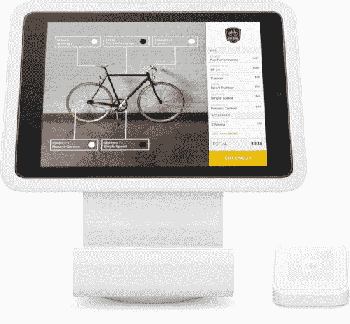

# 介绍 Square 的注册 API 和电子商务 API

> 原文：<https://medium.com/square-corner-blog/introducing-squares-register-api-and-e-commerce-api-555701db8f1b?source=collection_archive---------0----------------------->

## 让开发商能够帮助卖家接受付款，无论买家身在何处:当面还是在线

*作者写的*[](https://github.com/zhao-squareup)**。**

> *注意，我们已经行动了！如果您想继续了解 Square 的最新技术内容，请访问我们的新家[https://developer.squareup.com/blog](https://developer.squareup.com/blog)*

*你有没有看过 Square 的硬件产品(可能是我们最新的 EMV 和 NFC 读卡器)，然后想，“我可以用它来做一些令人惊叹的东西”？从历史上看，支付和硬件开发往往与陈旧和难以使用的技术相关联。今天，我们很高兴发布 [Square 的注册和电子商务 API](https://squareup.com/developers)。任何开发人员都可以开发一个 iOS 应用程序，通过滑动、蘸取或点击来进行支付。开发者现在还可以通过 Square 为网站提供在线支付。*

# *注册 API*

*Square Register API 让你专注于你最擅长的事情:为你的卖家打造一个令人惊叹的销售点体验。我们会负责转移资金。只需两次 API 调用，您就可以告诉我们您希望我们向客户收取多少费用，并让 [Square Register](http://squareup.com/register) 完成所有繁重的工作。顾客付款就像他们习惯在任何其他广场卖家，我们甚至会发短信，电子邮件，或打印一张收据的卖家的名义。最重要的是，它支持我们所有的硬件，包括[方形支架](http://squareup.com/stand)和新的[方形非接触式+芯片读卡器](https://squareup.com/contactless-chip-reader)。*

*在您的应用程序中发出一个 API 请求:*

```
*[SCCAPIRequest requestWithCallbackURL:yourAppCallbackURL
                               amount:amountToCharge
                       userInfoString:dataWePassBackToYou
                           merchantID:nil
                                notes:descriptionOfCharge
                 supportedTenderTypes:SCCAPIRequestTenderTypeCard
                    clearsDefaultFees:NO
                                error:**&**error];
[SCCAPIConnection performRequest:request error:**&**error];*
```

*Square Register 切换到前台并代表您完成支付。完成后，我们会将结果通知你的应用。*

**

# *电子商务 API*

*现在，任何开发者都可以为他们的客户构建解决方案，让他们在使用 Square 的网站上接受支付。您是否正在开始使用 [Square 的在线商店](http://squareup.com/online-store)进行在线销售；你正在通过 Square 与[电子商务平台](https://squareup.com/app-marketplace)如 Bigcommerce、Weebly 和 Ecwid 的整合而成长；或者现在，你正在建立一个定制网站，任何业务都可以通过 Square 支付在线扩展。此外，借助我们的电子商务 API，Square 消除了 PCI 合规性方面的麻烦，而不会影响网站的设计或外观，也不会将客户重定向到异地。*

*Square 的 JavaScript 库使用一组透明的、动态样式的 iframes 来接受敏感的持卡人信息。这样持卡人的数据就不会接触到你的网站或服务器。作为交换，它返回一个一次性卡随机数:*

```
*<script type="text/javascript" src="https://js.squareup.com/v2/paymentform">
</script>
<script>
**var** paymentForm **=** **new** SqPaymentForm({
  applicationId**:** 'your_app_id',
  inputClass**:** 'sq-input',
  cardNumber**:** { elementId**:** 'sq-card-number' },
  cvv**:** { elementId**:** 'sq-cvv' },
  expirationDate**:** { elementId**:** 'sq-expiration-date' },
  postalCode**:** { elementId**:** 'sq-postal-code' },
  callbacks**:** {
    cardNonceResponseReceived**:** **function**(errors, nonce, cardData) {
      *// your app code*
    }
  }
});
**function** requestCardNonce() { paymentForm.requestCardNonce(); }
</script><div id="sq-card-number"></div>
<div id="sq-cvv"></div>
<div id="sq-expiration-date"></div>
<div id="sq-postal-code"></div><button type="submit" onclick="requestCardNonce()">Submit</button>*
```

*(参见[文档](https://docs.connect.squareup.com/articles/adding-payment-form/)中完整的工作示例)。*

*您的服务器使用卡 nonce 并从购买者的卡中收费。*

```
*$api = new \SquareConnect\Api\TransactionApi();
$transaction = $api->charge($accessToken, $locationId, [
  'amount_money' => ['amount' => 1337, 'currency' => 'USD'],
  'idempotency_key' => uniqid(),
  'card_nonce' => $cardNonce
])->getTransaction();print_r($transaction);*
```

*或者，您可以将信用卡与客户记录一起存储，以便持续收费。*

```
*// Create the customer
$customer = $customerApi->createCustomer($accessToken, [
  'given_name' => 'Customer Name',
  'note' => "add a note"
])->getCustomer();print_r($customer);// Link the card
$card = $cardApi->createCustomerCard($accessToken, $customer->getId(), [
  'card_nonce' => $cardNonce,
  'cardholder_name' => 'Customer Name',
  'billing_address': [
    'postal_code' => '12345'
  ]
])->getCard();print_r($card);*
```

# *把所有的东西放在一起*

*随着今天 Register 和电子商务 API 的发布，开发人员可以构建解决方案，为任何卖家提供在线和面对面支付，所有这些都由 Square 提供支持。当你使用 Square 的商务平台时，你为卖家提供了一个解决方案，可以让他们对整个业务有一个统一的看法。卖家可以识别顾客是在网上购买、在店内购买还是两者兼有。使用 Square 的 API 和工具可以让卖家更容易地了解客户的购买趋势和习惯。最后，由于开发人员正在利用 Square 的平台，卖方也可以受益于 Square payments 提供的一切:透明的定价、无月费、支持挑战性退款、退款保护、出色的分析、开放的 API，以及访问 Square Capital 和 Square 的 SaaS 产品。*

*今天就从[注册 Square](http://squareup.com/signup) ，阅读[文档](https://docs.connect.squareup.com/)，以及[创建应用](https://connect.squareup.com/apps)开始吧。*

*[](https://github.com/zhao-squareup) [## 赵(赵建亮)

### zhao-squareup 有 1 个存储库可用。在 GitHub 上关注他们的代码。

github.com](https://github.com/zhao-squareup)*