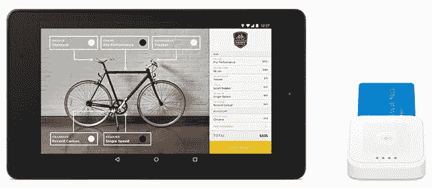

# 介绍 Square 的 Android 注册 API

> 原文：<https://medium.com/square-corner-blog/introducing-squares-register-api-for-android-85e4cee5aa3d?source=collection_archive---------1----------------------->

## 开发者现在可以构建定制的 Android 销售点应用程序，通过 Square 硬件进行刷卡、蘸取或点击支付，并与 Square 的软件和服务集成。

*作者写的*[](https://twitter.com/Piwai)**。**

> *注意，我们已经行动了！如果您想继续了解 Square 的最新技术内容，请访问我们的新家[https://developer.squareup.com/blog](https://developer.squareup.com/blog)*

*继我们在 3 月份推出 iOS 的 [Register API 之后，从今天开始，开发人员现在可以构建定制的 Android 销售点应用程序，通过 Square 硬件进行刷卡、蘸取或点击支付，并与 Square 的软件和服务集成。这建立在我们现有的用于](https://corner.squareup.com/2016/03/introducing-squares-register-api-and-ecommerce-api.html) [Square Register 和电子商务](http://squareup.com/developers)的 API 产品之上。*

# *为 Android 注册 API*

*Square Register API 让您专注于自己最擅长的领域:在 Square 处理资金转移的同时，为您的商家创造令人惊叹的销售点体验。您可以建立一个具有特定功能的定制销售点，以满足您的业务需求，或者为一个新的销售点创建一家技术公司，并将其出售给企业。立即开始[创建您的 Android 应用](https://docs.connect.squareup.com/articles/register-api-android/)！*

*也许你会为草坪护理服务公司建立一个定制的销售点，一个店内的地面零售业务收银台，一个优化的购物车和酒厂的会员漏斗，一个小狗日托的自助收银台——你的想象力是有限的！您的应用程序不需要处理任何支付信息，这使得 PCI 合规性变得无足轻重。而且你不需要考虑与硬件读卡器的集成。构建您的自定义应用程序，并像往常一样在 Play Store 上分发。当你的应用程序开始支付时，调用我们的 SDK，在支付屏幕上启动 [Square Register](http://squareup.com/register) 应用程序。买家在 Register 中完成支付(通过刷卡、轻触、蘸取或键入卡中)，然后 focus and control 会自动返回到您的应用程序，并显示收费结果。多亏了 Square Register，所有的资金转移和繁重的工作都得到了处理。Android Register API 支持我们所有的硬件，包括新的[方形非接触式+芯片阅读器](https://squareup.com/contactless-chip-reader)。*

*要开始接受付款，只需三行代码:*

```
*ChargeRequest chargeRequest **=** **new** ChargeRequest**.**Builder**(**1_00**,** USD**).**build**();**
Intent chargeIntent **=** registerClient**.**createChargeIntent**(**chargeRequest**);**
startActivityForResult**(**chargeIntent**,** CHARGE_REQUEST_CODE**);***
```

*Square Register 将出现在前台，并代表您完成支付。完成后，我们会将支付结果返回到你的应用。*

```
*@Override **protected** **void** **onActivityResult(int** requestCode**,** **int** resultCode**,** 
    Intent data**)** **{**
  **if** **(**requestCode **==** CHARGE_REQUEST_CODE**)** **{**
    **if** **(**resultCode **==** Activity**.**RESULT_OK**)** **{**
      ChargeRequest**.**Success success **=** registerClient**.**parseChargeSuccess**(**data**);**
      onTransactionSuccess**(**success**);**
    **}** **else** **{**
      ChargeRequest**.**Error error **=** registerClient**.**parseChargeError**(**data**);**
      onTransactionError**(**error**);**
    **}**
  **}** **else** **{**
    **super.**onActivityResult**(**requestCode**,** resultCode**,** data**);**
  **}**
**}***
```

*定价与使用 Square Register 完成的其他付款相同。Android 的注册 API 目前仅在美国和加拿大可用，其他市场将很快跟进。*

**

*我们正忙于打造 Square 的商务平台，为商家提供解决方案，帮助他们轻松运营业务。我们渴望听到您的反馈！你可以通过 developers@squareup.com[的](https://corner.squareup.com/2016/05/developers@squareup.com)联系我们，并在 Twitter 上关注 [@SquareDev](https://twitter.com/squaredev) 以获得更多关于 Square 开发者平台和社区的更新。立即开始[创建您的 Android 应用程序](https://docs.connect.squareup.com/articles/register-api-android/)！*

*[](https://twitter.com/Piwai) [## 皮埃尔-伊夫·里考(@皮瓦伊)|推特

### Pierre-Yves Ricau (@Piwai)的最新推文。安卓贝克@广场。巴黎/旧金山

twitter.com](https://twitter.com/Piwai)*