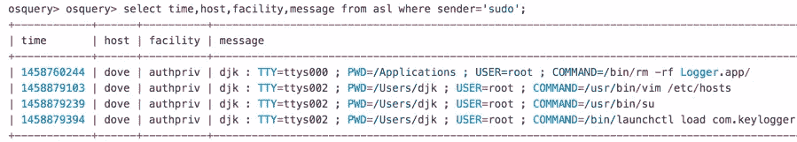
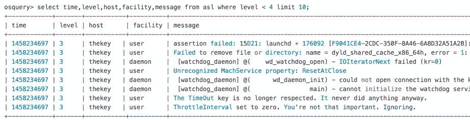
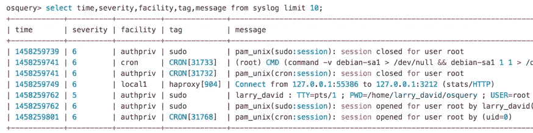

# 通过 Osquery 将 Syslog 引入 AWS Kinesis

> 原文：<https://medium.com/airbnb-engineering/introducing-syslog-to-aws-kinesis-via-osquery-da4fc19de5ce?source=collection_archive---------0----------------------->


Logs awaiting collection ([Logs in Yyteri](https://commons.wikimedia.org/wiki/File:Logs_in_Yyteri.JPG) by kallerna, licensed under Creative Commons)

在 Airbnb，我们致力于保护我们的社区。这个博客是这一努力的延伸，因为我们将定期更新我们对安全计划和更广泛的社区的投资。

*对于我们开放的安全相关帖子，我们很高兴地宣布我们已经开源了* [*osquery*](https://osquery.io/) *表，允许企业收集和查询 OS X 和 Linux 主机的系统日志数据！这允许您捕获特权操作(sudo)、横向移动(sshd)、影响系统可用性/可靠性的错误等等。除了这些表格，我们还开源了 osquery 插件，允许你将查询结果发送到亚马逊的 Kinesis Streams 和 Firehose 产品。请阅读以下内容了解更多信息！*

## 简化

我们想要一个支持 OS X 和 Linux 的代理:

*   文件完整性监控(FIM)
*   IOC(危害指示器)入侵检测
    (IPs、域、端口、文件名/路径/哈希等)
*   基于状态的入侵检测
    (外壳历史、/etc/hosts、NFS 共享、防火墙设置……)
*   系统日志收集
*   灵活的远程日志记录

osquery 是我们考虑的第一个选项。

对于那些不熟悉 osquery 的人来说，它是一个开源工具，将操作系统公开为一个高性能的关系数据库。您可以针对表示系统属性(如用户、进程、设备、网络连接等)的表编写基于 SQL 的查询。

开箱即用，osquery 支持我们所有的用例，除了一个:**OS X 的 Syslog 收集& Linux。**

因为 osquery 是一个开源项目，所以我们构建了 syslog 表并回馈给社区！

在我们进入细节之前，重要的是要注意我们只使用了安全的、受支持的操作系统 API。您不会发现任何内核攻击或外壳，就像您在安全供应商产品中常见的那样。你可以自己看代码[这里](https://github.com/facebook/osquery/pull/1915/files)和[这里](https://github.com/facebook/osquery/pull/1961/files)。

> 因为 osquery 是一个开源项目，所以我们构建了 syslog 表并回馈给社区

## 苹果系统日志

我们的第一个贡献是 osquery 表，它允许您显示、收集和查询 OS X ASL 系统日志数据，而无需任何额外的配置。

在下面的假设示例中，我们查询在给定主机上执行的特权操作。查询结果显示，攻击者修改了 */etc/hosts* ，将他们的权限提升到 root，并加载了一个键盘记录器:



除了与安全相关的查询，您还可以查询 ASL 以发现影响系统可用性或可靠性的错误:



在我们的例子中，ASL 表通知我们，我们的 VPN 客户端正在用调试信息淹没 syslog，这是一个在以后的构建中解决的错误。

ASL 表定义为[此处为](https://osquery.io/docs/tables/#asl)，其他用法和配置详情可在[此处](https://github.com/facebook/osquery/blob/master/docs/wiki/deployment/syslog.md#osx-syslog)找到。

## Linux 系统日志

我们的第二个贡献是 osquery 表，它允许您显示、收集和查询 Linux syslog 数据。

使用 osquery 的[事件框架](https://osquery.readthedocs.org/en/stable/development/pubsub-framework/)，我们通过命名管道接收从 rsyslog 转发的日志，维护数据完整性的适当权限。然后，我们可以通过新表使用这些日志。这与 osquery 和 rsyslog (Ubuntu 12/14，CentOS，RHEL……)支持的任何 Linux 发行版兼容。

现在，您可以相对轻松地更好地了解您的基础架构:



关于 Linux 系统日志表的其他用法和配置细节可以在[这里](https://github.com/facebook/osquery/blob/master/docs/wiki/deployment/syslog.md#linux-syslog)找到。这个特性被合并到 osquery 的 *master* 分支中，预计将随 osquery v1.7.4 一起发布。

## 系统日志挑战

默认情况下，OS X 不会将其所有日志发送到苹果系统日志(ASL)。例如，下面是两个不发送给 ASL 的日志，它们捕获关于应用程序和软件包安装的信息:

*/var/log/install . log
/var/log/commerce . log*

我们辛苦了几个小时，试图通过 */etc/asl.conf* 和 */etc/syslog.conf* 捕获这些数据。我们用谷歌搜索，我们阅读了页面，什么都没有。由于/System/Library/private frameworks/*中的一些引用，我们几乎得出结论，这些路径是硬编码的。

当我们仔细重读手册的第*页时，我们偶然发现了成功:*

```
Messages that match the query associated with a '**claim'** action are not processed by the main ASL configuration file */etc/asl.conf*.....
```

因此，我们可以通过将*存储*动作添加到以下文件中并重启 syslogd 来让这些日志流入 ASL:

```
***/etc/asl/com.apple.install:*** *? [= Facility install] store****/etc/asl/com.apple.commerce.asl:*** *? [= Facility com.apple.commerce] store*
```

有些不幸的使用案例中，应用程序可能不会(或不能)记录到系统日志。因此，我们将为 OS X 和 Linux 开发一个 osquery 表，它可以使用任何日志文件，并以如下模式呈现它: *{path，line，time，message}。*

## 亚马逊 Kinesis 溪流和消防水管

除了系统日志表，**我们还发布了 osquery 插件，允许将任何查询结果发送到亚马逊 kine sis Streams&kine sis fire hose。**这个功能是[合并](https://github.com/facebook/osquery/pull/2045)到 osquery 的 *master* 分支，预计会随 osquery v1.7.4 一起发货，这些插件使用 AWS C++ SDK 来避免部署 Amazon Kinesis 代理的需要。

Kinesis Streams 和 Kinesis Firehose 让我们可以灵活地处理和存储日志。自动扩展功能和与 S3(每 GB 约 0.0300 美元)等服务的互操作性使其成本效益高，维护成本低。

在一篇即将发布的博客文章中，Airbnb 安全工程师 [Jack Naglieri](https://twitter.com/jack_naglieri) 将详细介绍我们的 kine sis Streams&kine sis fire hose 用例及基础设施。敬请期待！

## 总结想法

这项工程工作是扎克·乏色曼爱的结晶。我们要感谢 Teddy Reed 和 Mike Arpaia 的代码审查和帮助。

为这个开源项目做贡献非常有趣，我们鼓励其他人也这样做！一个很棒的回馈方式是通过[查询包](https://osquery.io/docs/packs/) [贡献](https://github.com/facebook/osquery/tree/master/packs)将您的 syslog 相关查询分享给社区。

我们希望这篇博文和我们的开源贡献能够鼓励其他人和我们一起探索这个日志架构。

干杯！
[*@ mime frame*](https://twitter.com/mimeframe) *Airbnb 安全经理*


## 在 [airbnb.io](http://airbnb.io) 查看我们所有的开源项目，并在 Twitter 上关注我们:[@ Airbnb eng](https://twitter.com/AirbnbEng)+[@ Airbnb data](https://twitter.com/AirbnbData)