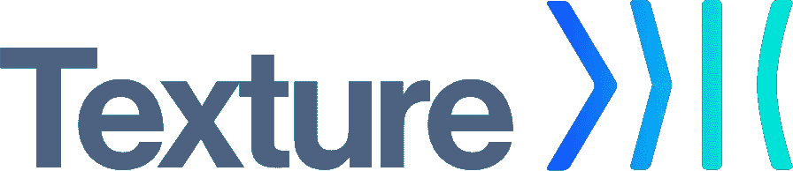

# 介绍纹理，AsyncDisplayKit 的新家

> 原文：<https://medium.com/pinterest-engineering/introducing-texture-a-new-home-for-asyncdisplaykit-e7c003308f50?source=collection_archive---------0----------------------->

Garrett Moon | Pinterest 技术主管，iOS 开源框架

在过去的两年里，Pinterest 一直是 AsyncDisplayKit 的主要开发者，AsyncDisplayKit 是一个用于平滑和响应界面的 iOS 框架。AsyncDisplayKit 是在脸书创建的，我们的 iOS 团队在该项目上进行了大量投资，领导了针对 2.0 版本的新功能和改进的开发，并为 AsyncDisplayKit 存储库贡献了 70%以上的提交。Pinterest 致力于投资 AsyncDisplayKit 的未来，所以今天我们宣布 AsyncDisplayKit 的新家和新名字——[Texture](https://github.com/TextureGroup/Texture)。这不是叉子。虽然 Pinterest 不会直接拥有该项目，但我们的工程师将继续帮助管理它，以便该框架为社区发展和改进。

在这篇文章中，我们将讨论迁移到一个新的存储库的动机，以及这对开发人员来说意味着什么。

## 动机

我们相信创建 Texture 将最终建立一个更强大的开发人员开放社区，从开发快速异步接口中受益。将 Texture 作为 Pinterest 之外的一个独立项目来托管有三个显著的优势。首先，作为一个独立的组织，Texture 的未来不会与一家公司捆绑在一起，因此它可以通过社区继续改进。

其次，现在是社区参与的大好时机。我们已经发布了新的[贡献指南](https://github.com/TextureGroup/Texture/blob/master/CONTRIBUTING.md)，并打算允许新的核心贡献者拥有合并权限，并在他们做出重大贡献后加入定期计划会议。我们期待新想法、实现、文档和错误报告的贡献。

最后，拥有社区可以控制的纹理(以前称为 AsyncDisplayKit)也意味着我们可以走得更快。我们将能够为存储库提供更细粒度的成员资格，这将允许社区成员更容易地参与审查和组织现有问题。值得注意的是，我们还将能够添加新的 Github 集成，比如一个完全改进的持续集成系统，它可以更快地运行更多的测试。

## 物流

作为一个纹理用户，这对你意味着什么？

1.  你想把现有的叉子移到纹理上吗？[栈溢出来救援！](http://stackoverflow.com/questions/9644046/how-to-change-the-source-of-a-github-fork)
2.  **CocoaPod 用户:**你会想换成指向纹理，即` pod 'Texture ' `。如果您指定了 git 回购，新的回购位于 https://github.com/TextureGroup/Texture。
3.  **Carthage 用户:**你只需要更新 [GitHub](https://github.com/TextureGroup/Texture) 地址。
4.  所有导入现在都需要 AsyncDisplayKit 前缀。即`#import <ASDisplayNode.h>`需要变成`#import <AsyncDisplayKit/ASDisplayNode.h>`
5.  所有新的拉请求都应该提交给 [Texture 的 GitHub](https://github.com/TextureGroup/Texture) repo。
6.  所有新发行的债券都应在[结构](https://github.com/TextureGroup/Texture/issues)回购中备案。如果您在 AsyncDisplayKit 上打开了一个新的，我们将关闭它并要求您将其移动。
7.  我们刚刚开始将 AsyncDisplayKit 的名称改为 Texture。目前应该有最小的变化需要包括新的类，但是期望我们在 3.0 版本中对名字和品牌做更大的改变。

## 下一步是什么

对于 Texture 的下一个大版本 3.0，我们有很多令人兴奋的计划。我们专注于提高可靠性、性能和可维护性，目的是让自己能够添加新的令人兴奋的功能，如进度驱动的布局转换和自动异步布局。

如果你在使用纹理，我们很乐意在我们的 slack 频道听到这个消息:[http://texturegroup.org/slack.html](http://texturegroup.org/slack.html)。

鸣谢:如果没有很多人的帮助，这个项目就不会启动。感谢出色的 Pinterest 工程师们，他们是 Texture 的主要贡献者:他们做了所有艰苦的工作:Adlai Holler，Huy Nguyen 和 Michael Schneider。杰米·法瓦扎、亨利·连、利维·麦卡勒姆、乔希·恩德斯和基南·拉隆都帮忙搬家。还要感谢脸书帮助推动了这一进程。