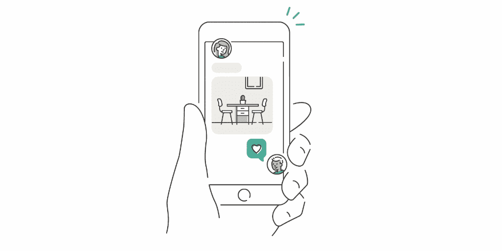
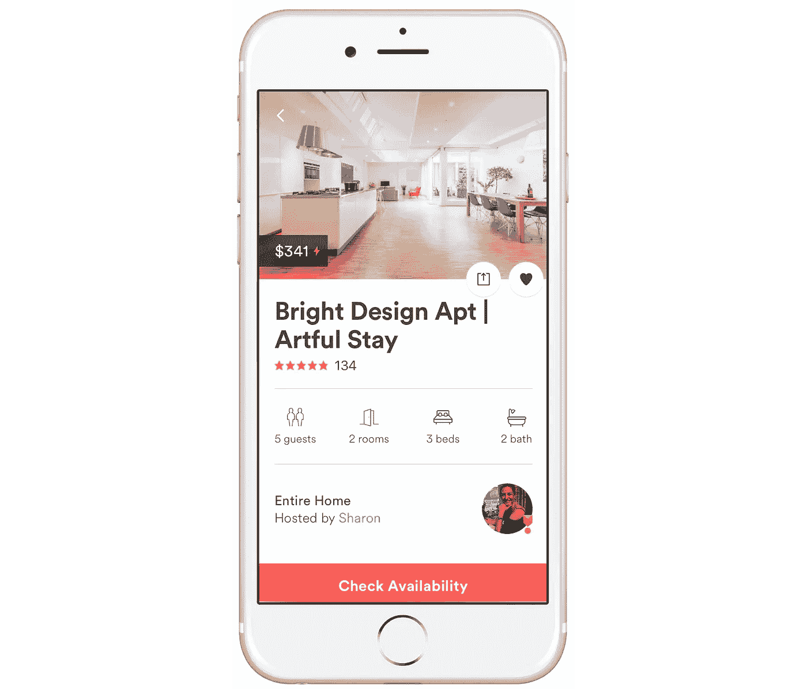
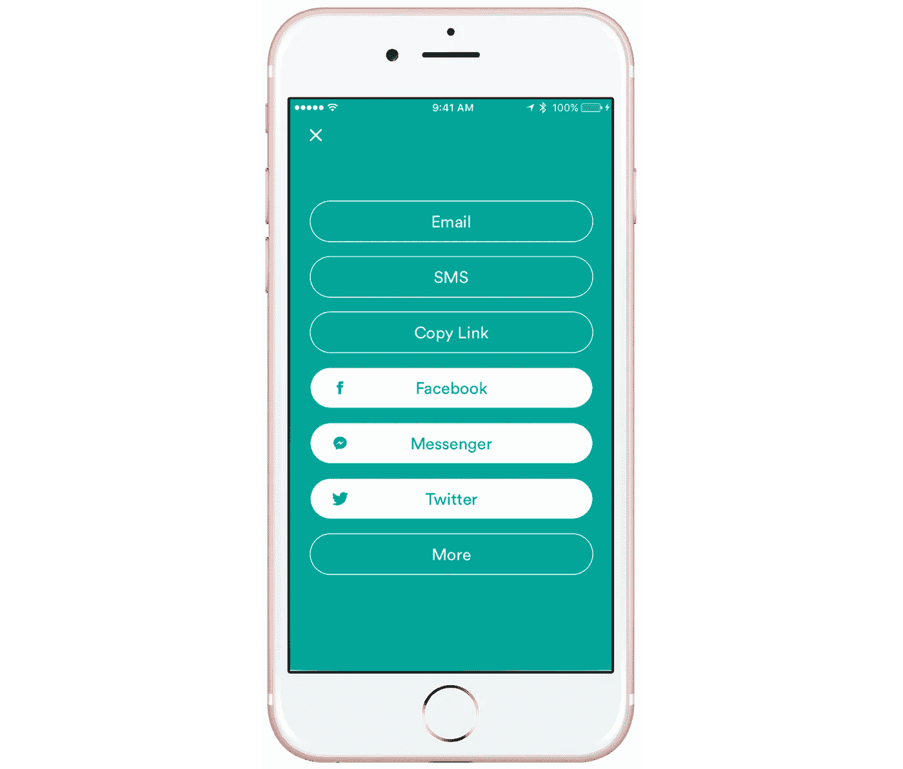
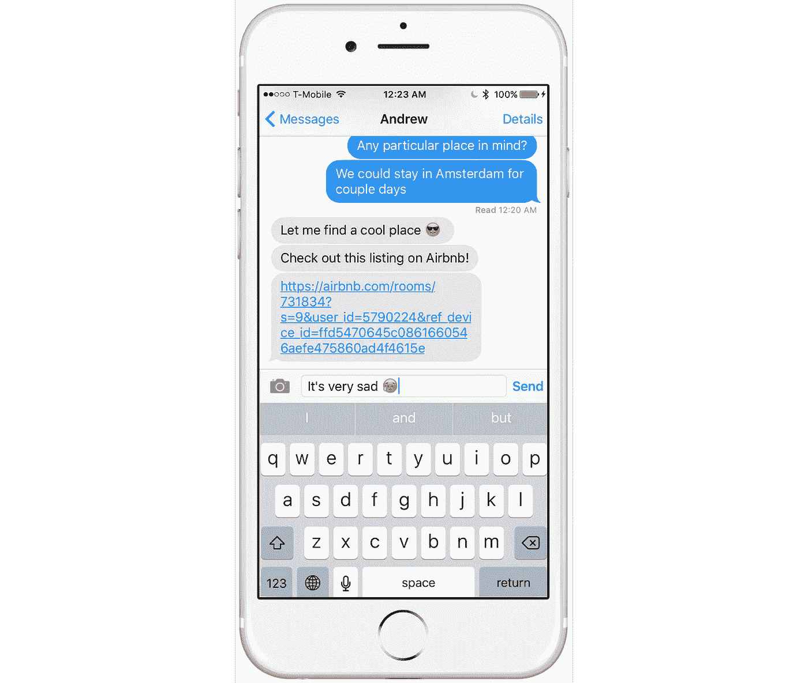
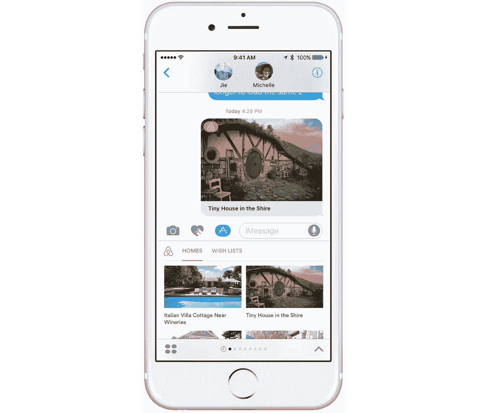
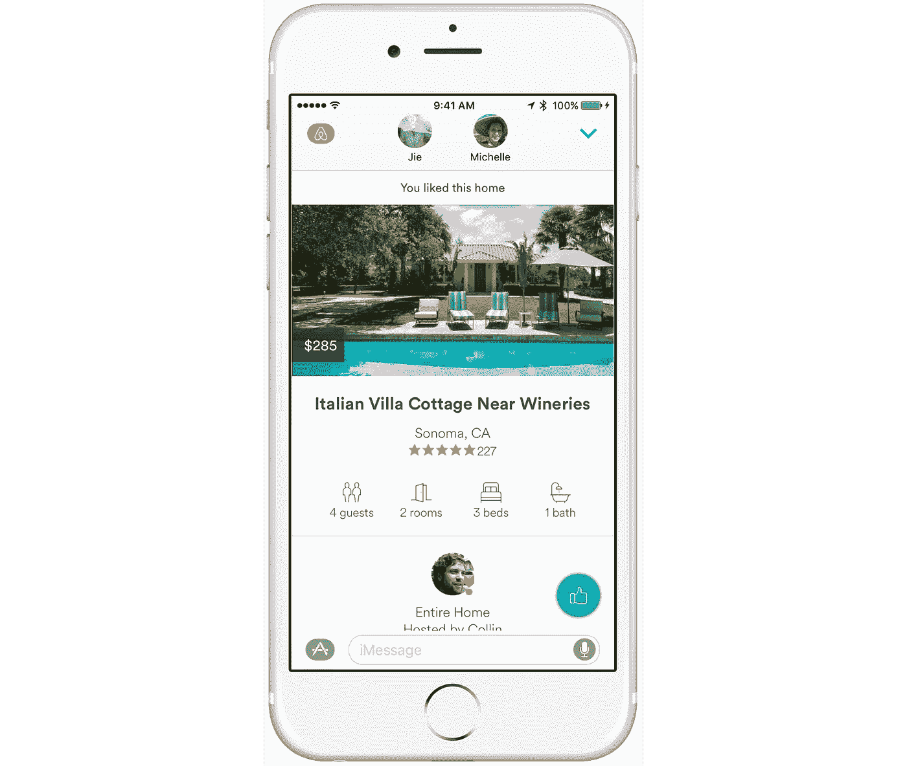
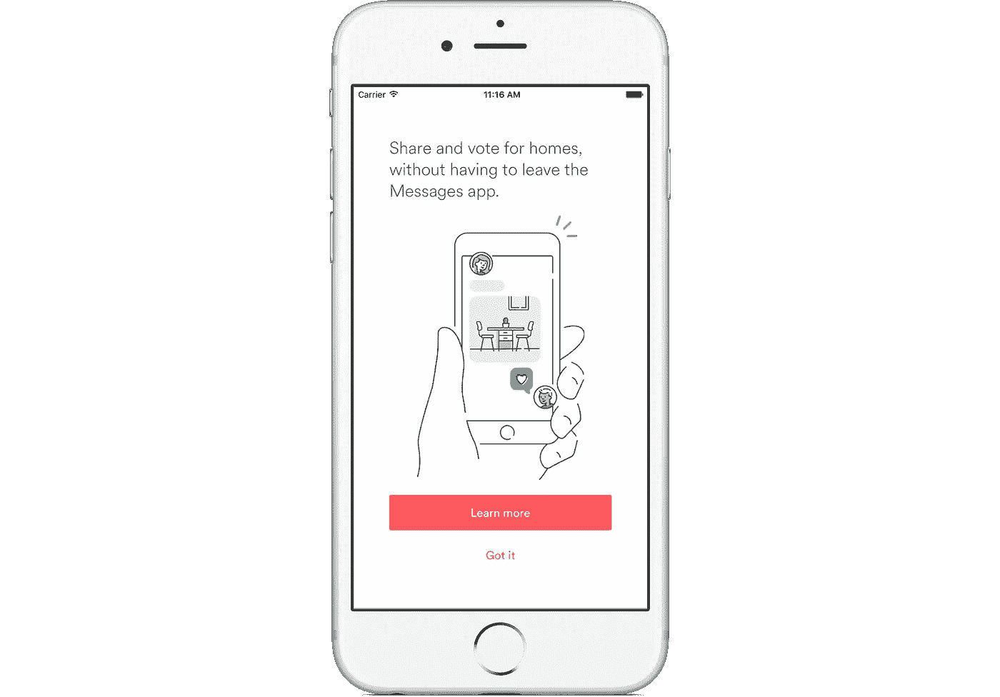

# 计划旅行的新方法:引入 Airbnb iMessage 应用程序

> 原文：<https://medium.com/airbnb-engineering/introducing-the-airbnb-imessage-app-806f48d303a8?source=collection_archive---------1----------------------->

由[谢尔盖耶科](https://www.linkedin.com/in/asergiyenko) & [诺亚马丁](https://twitter.com/sond813)



今天，我们非常兴奋地为 iOS 10 推出全新的 [Airbnb iMessage 应用](http://airbnb.com/imessage)！我们相信这将极大地改善您与朋友和家人一起计划旅行的方式。

# 在 iOS 10 之前计划一次旅行

如果您今天使用我们的移动应用程序和 iMessage 计划一次旅行，您的体验很可能是这样的。你找到了一个美丽的地方:



您通过短信分享它:



当你这样做的时候，你会得到这样的结果:



正如你所看到的，在分享它之后，我们已经完全失去了原来的吸引力，因为它现在只是纯文本。从 Airbnb 到 iMessage 的过渡缺乏视觉上的丰富性，而在这个时代，一个有吸引力的数据呈现具有巨大的价值。尽管我们无法控制房源在对话线索中的呈现方式，但它会直接影响客人对我们应用的看法，以及 Airbnb 的整体体验。

# iOS 10 的使用体验

我们开始寻求在 Messages 中定义规划 Airbnb 旅行的宏伟愿景——在这个新平台上会是什么样子？在 iOS 10 发布前的几周时间里，我们的团队迅速对各种想法进行了原型设计。我们从无数可能特性的图纸和模型开始，随着我们越来越熟悉 Messages 框架的可能性和局限性，一个产品开始形成。一旦我们有了可以使用的东西，工程师、设计师和产品经理之间的一组 iMessage 线程允许我们快速发现我们想要的功能——这是一种相当 *meta* 的方法。在这一点上，我们有一个 iMessage 应用程序，人们可以在朋友之间分享房屋，并查看住宿的关键细节。

这个过程中的一个关键决策是确定要展示哪些列表。方便的是，Airbnb 已经有两种很好的方式来组织房源:愿望清单和最近查看的房源。我们利用现有的资源将这些内容构建到 iMessage 应用程序中。



通过使用方便的基于选项卡的 UI，您可以在两者之间切换，同时保持在折叠的应用程序视图中。在展示房源信息时，我们知道大多数客人只需要看到几个关键特征，就能帮助他们决定预订哪个房间。新的应用程序在一个简洁的用户界面中显示价格、照片、位置、主机信息和房屋细节，因此协作仍然是重点。



说到协作，如果没有一个额外的社交功能:投票，iMessage 应用就不完整。当与朋友分享消息时，每个合作者可以为他们喜欢的房子投票，并查看还有谁为他们投票。这给了旅行组织者一个最受欢迎的列表的鸟瞰图，极大地简化了预订哪一个的决定。

# 使用消息框架开发

## 个性化体验

苹果完全致力于隐私，我们也是。这是每个人都想要的东西，但它也提出了某些工程挑战。应用于 iMessage 应用程序的主要含义是根本无法获取对话参与者的任何联系信息。我们只能获得参与者的 UUIDs，然后可以将其用作占位符标签，iOS 会在对话线程中用用户名替换它。但是，这对我们来说并不理想，因为我们希望了解更多关于参与者的信息，以便能够访问他们最近查看的列表和愿望列表等。

事实证明，我们可以通过要求每个人登录 Airbnb 的主应用程序来解决这个问题。通过创建一个共享应用程序组，我们可以使用钥匙串在主应用程序和 iMessage 应用程序之间共享数据。一旦他们登录，我们可以在扩展中获取所有需要的信息，并使用它来个性化用户界面，并进行网络呼叫。

关于测试的一个小注意事项。当我们开始使用共享钥匙串来个性化体验时，我们注意到我们无法再使用 iOS 模拟器来测试群组对话。这是因为，即使您可以将当前参与者模拟为模拟器默认的*凯特·贝尔*或*约翰·苹果籽*，他们仍然使用相同的钥匙串实例，因此被视为相同的运行时用户。为了解决这个限制，我们必须总是在设备上进行测试。

# 发送消息时的竞争条件

当多个用户同时与同一条消息交互时，就会出现人类竞争的情况。考虑下面的例子:Jie 与 Michelle 和 Noah 共享一个列表。他们都打开互动信息，投票，并发送回复。如果米歇尔的消息最后到达，它将覆盖诺亚的消息。此外，由于来自同一会话的所有消息都被压缩到一个气泡中，因此无法访问以前的回复，从而导致数据丢失。

为什么会这样？嗯，Messages 框架方便地让您将 URL 附加到一个 *MSMessage* 实例。这使我们能够添加 URL 参数，并在所有参与者之间的单个消息会话中共享状态。如果多个回复是并行的，那么只有一个会出现在对话中。因此，所有其他消息都将被覆盖，其中的信息将不幸丢失。

## URL 安全措施

从参与者的角度来看，消息可以处于 3 种状态——未打开、以编辑模式打开和暂存(即等待他们点击“发送”)。我们不必对第一种情况做任何事情，但我们可以明智地对待其他两种情况。

当您通过点击对话线程中的气泡与邮件进行交互时，它将成为活动对话中的选定邮件。MSMessagesAppViewController 通过调用其委托上的方法请求转换到扩展的呈现样式:

```
func **willTransitionToPresentationStyle**(**presentationStyle**: MSMessagesAppPresentationStyle)
```

此时，iMessage 应用程序会显示当前所选信息的扩展视图。在这种状态下，同一会话的新消息可能到达，可能在 URL 中包含更新的数据。*MSMessagesAppViewController*然后通过调用以下命令通知应用程序:

```
func **didReceiveMessage**(**message**: MSMessage, **conversation**: MSConversation)
```

这将使用新的输入数据更新当前演示文稿。这种方法解决了覆盖有效数据的问题，方法是在发送前用收到的回复更新当前消息。

第三个用例出现在消息被存放在输入框中并准备发送的时候。当消息被暂存时，新消息可能到达，这将再次触发 *didReceiveMessage* 回调。推荐的方法是读取传入消息的 URL，将其数据与当前消息的 URL 合并，然后重新暂存当前消息。只需将消息第二次插入到当前会话线程中，即可实现重新登台； *MSConversation* 上的 insert 方法将替换输入框中的旧消息。

虽然上述两种方法将极大地有助于保持数据安全，但它们并不能缓解同时传输两条或更多条消息的情况。这里很难防止数据丢失，因为它们现在已经超出了消息的生命周期。

## 服务器端资源

使用服务器端资源来保存数据是保持数据完整性的最可靠的方法，也是 Apple 建议的方法。我们从 URL 开始，最终过渡到服务器端资源。消息 URL 被视为不可变的标记，因此一旦创建，在整个会话期间不会改变。这使得它们本质上非常适合用作它们对应的服务器端资源的惟一 id，我们在服务器端资源上保存消息状态。所有客户端都将数据写入同一个资源，每次打开一条消息时，它们都会重新获取数据并更新 UI。

# 数据应该在什么时候持久化？

在服务器上保持消息状态时，需要保持一种微妙的平衡。如前所述， *MSConversation* 允许使用以下方法将新消息插入输入字段:

```
func **insert**(**message**: MSMessage, **completionHandler**: ((Error?) -> Void)? = nil)
```

但是，它不发送消息。参与者必须显式发送消息来实际提交该操作。在我们的例子中，他们需要这样做来发送投票。

苹果公司并不指望数据会在服务器上持久保存，直到信息被实际上传并发送出去。然而，这带来了数据丢失的风险，因为不能保证存储数据的网络请求会成功。经过一番头脑风暴后，我们认为在消息被暂存和发送之前保存状态数据更可靠，这样可以确保远程数据资源总是最新的。

# 后退

不幸的是，那些没有安装 iOS 10 的用户将无法享受这种丰富的信息体验。当 iMessage 应用程序发送一条信息时，不支持的设备将收到两条单独的信息——一条图像和一个 URL。我们仍然试图为所有参与者提供尽可能最好的 Airbnb 体验，通过以这样一种方式形成 URL，当在浏览器中打开时，我们知道它们是 iMessage 对话的一部分。对于这个特定的场景，我们像往常一样显示列表细节，但另外还允许投票！

因此，iOS 10 对话线程中的用户可以使用投票数据。通过在服务器端生成推送通知来通知 iOS 10 用户有新数据可用，我们为每个人保持了对话流的实时性。

# 应用程序可发现性

在让您亲自试用该应用程序之前，我们想解决我们面临的另一个挑战:应用程序的可发现性。希望通过阅读这篇文章，你现在已经完全意识到我们正在向 Airbnb 应用程序引入的新功能，但不是每个人都会！我们想让每个人都非常容易地看到这个新的 iMessage 应用程序可用。然而，没有 API 可以轻松地从父应用程序深度链接到 iMessage 设置屏幕，以启用相应的应用程序扩展。你必须首先打开“信息”，点击打开应用抽屉，进入 iMessage 应用商店，选择“管理”标签，然后启用应用。

我们试图通过在分享列表后立即引入教育提示来缓解这种缺乏可发现性的情况，这是主应用程序中与发送消息相关的最常见的操作。我们希望这能在最需要的时候推广 iMessage 应用！



# 下一步是什么？

我们非常兴奋地看到 iOS 10 版 Airbnb iMessage 应用程序今天在全球 Airbnb 社区上线。我们在规划和实现这一新功能的过程中获得了如此多的乐趣，并且很自豪能够在第一天就出现在这个全新的平台上！

然而，旅程才刚刚开始。我们将继续探索新的方式来改善旅行规划对话，并尽可能提供无缝体验。想象一下，将 Airbnb 主应用程序的全套协作功能作为不同类型的交互消息——搜索房屋、比较地图上的房源、向朋友发送推荐和旅行积分、协助帐户注册过程等。我们才刚刚开始。

在 [App Store](https://itunes.apple.com/us/app/airbnb/id401626263?mt=8) 上下载 iOS、iMessage、watchOS、tvOS 的 Airbnb 应用。

【http://airbnb.com/imessage 号

## 在 [airbnb.io](http://airbnb.io) 查看我们所有的开源项目，并在 Twitter 上关注我们:[@ Airbnb eng](https://twitter.com/AirbnbEng)+[@ Airbnb data](https://twitter.com/AirbnbData)