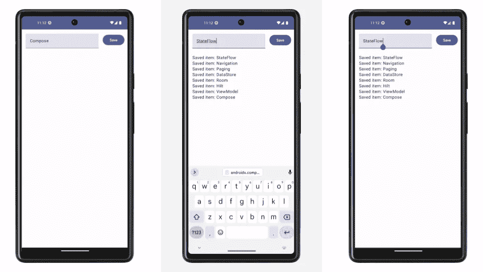

# 介绍架构模板

> 原文：<https://medium.com/androiddevelopers/introducing-the-architecture-templates-3151323e4e34?source=collection_archive---------1----------------------->

我们在 Github 上发布了一个名为 [Android 架构启动模板](https://github.com/android/architecture-templates)的新项目。



这些模板的目标是让你在做实验或从头开始一个全新的应用程序时快速入门。他们遵循我们最近发布的新的[架构建议](https://developer.android.com/topic/architecture/recommendations)，这是官方[架构指南](https://developer.android.com/topic/architecture)的总结。

这些模板不是空的，它们以架构模式和使用的库的形式包含了一些观点:

*   [房间数据库](https://developer.android.com/training/data-storage/room)
*   使用[句柄](https://developer.android.com/training/dependency-injection/hilt-android)的依赖注入
*   [Jetpack ViewModel](https://developer.android.com/topic/libraries/architecture/viewmodel)
*   UI 使用 [Jetpack 合成](https://developer.android.com/jetpack/compose)和[材料 3](https://developer.android.com/jetpack/androidx/releases/compose-material3)
*   [喷气背包导航](https://developer.android.com/jetpack/compose/navigation)
*   [反应数据层](https://developer.android.com/topic/architecture/data-layer)
*   [科特林的协程和流程](https://developer.android.com/kotlin/coroutines)
*   [单元测试](https://developer.android.com/training/testing/local-tests)
*   [UI 用](https://developer.android.com/jetpack/compose/testing)[柄](https://developer.android.com/training/dependency-injection/hilt-testing)用假数据测试
*   [KTS·格雷尔档案](https://docs.gradle.org/current/userguide/kotlin_dsl.html)
*   [版本目录](https://docs.gradle.org/current/userguide/platforms.html)
*   一个简单的 UI，显示已保存项目的列表，并允许用户保存新项目。

> *Github 上的新模板？为什么不包含在 Android Studio 中？*

模板被捆绑在每个 Studio 版本中，我们希望这个项目总是使用最新的依赖项来让您尽快开始。在 Github 上安装它可以让我们用像[翻新](https://github.com/android/architecture-templates/issues/8)这样的工具自动维护。

# 分支

目前，存储库包含两个模板:

*   `[base](https://github.com/android/architecture-templates/tree/base)` —反应式架构、组合、数据库、单个模块
*   `[multimodule](https://github.com/android/architecture-templates/tree/multimodule)` —在多个模块中实现的基础模板

# 要求

该项目包括一个`customizer.sh`脚本，重命名文件和软件包，并清理一切。它可以在 **Linux** 和 **macOS** 上运行(使用 bash 4 及以上版本)。在 Windows 上，您可以使用 Linux 的 **Windows 子系统。**如果您发现脚本有任何兼容性问题，[请提交一个 bug](https://github.com/android/architecture-templates/issues) 。

# 使用

1.  克隆存储库，可以选择一个分支。例如，检查`base`分支:

```
git clone https://github.com/android/architecture-templates.git --branch base
```

2.运行定制程序脚本:

```
bash customizer.sh your.package.name DataItemType [YourAppName]
```

*   `your.package.name`是你的 app ID(应该是小写)
*   `DataItemType`用于主屏幕、暴露状态和数据库实体的名称(应为 PascalCase)。
*   或者，您可以为您的应用程序指定一个名称(应该是 PascalCase)。

*注意:定制器脚本需要 bash 4 及以上版本。你可能需要在 macOS 上安装一个现代版本:*

```
brew install bash
```

## 让我们知道你的想法！

我们希望获得以下方面的反馈:

*   包含的库和整体功能
*   定制程序脚本
*   你可能遗漏的其他变体

要报告反馈，请随时[打开功能请求](https://github.com/android/architecture-templates/issues)或[给我留言](https://linktr.ee/ppvi)。