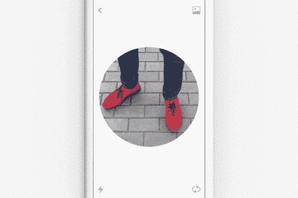
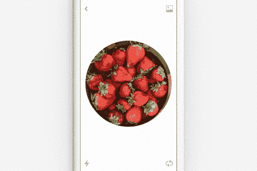
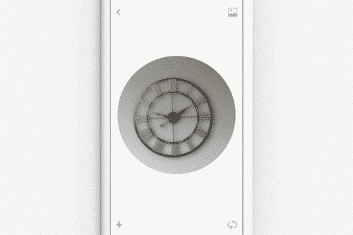
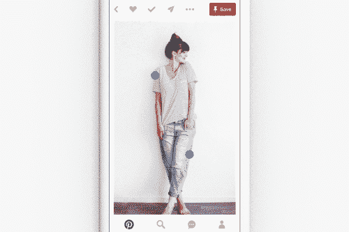
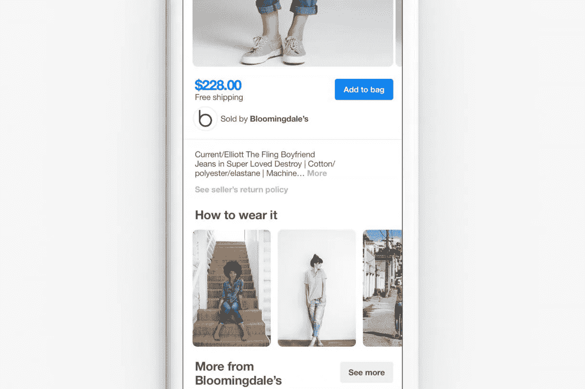

# 在 Pinterest 上介绍视觉发现的未来

> 原文：<https://medium.com/pinterest-engineering/introducing-the-future-of-visual-discovery-on-pinterest-48fb469b0d67?source=collection_archive---------2----------------------->

作者 Dmitry Kislyuk | Pinterest 视觉搜索工程经理

我们在 Pinterest 的使命是帮助你发现和做你喜欢的事情。在引擎盖下，我们正在为一个视觉发现引擎提供动力，这个引擎拥有全球 1.5 亿人保存的 1000 个想法。今天，我们将推出三款新的视觉探索产品——Lens、Instant Ideas 和 Shop the Look——它们可以将任何图像转化为寻找更多创意的切入点。

## Pinterest 上的视觉搜索

2014 年，我们开始大力投资[计算机视觉](https://engineering.pinterest.com/blog/building-scalable-machine-vision-pipeline)，并成立了一个小团队，专注于重塑人们寻找图像的方式。不到一年后，我们推出了[视觉搜索](https://blog.pinterest.com/en/our-crazy-fun-new-visual-search-tool)，一种不用文本查询就能搜索想法的新方式。第一次，视觉搜索给了人们一种方法来获得结果，即使他们找不到合适的词来描述他们正在寻找的东西。去年夏天，随着我们推出[对象检测](https://engineering.pinterest.com/blog/introducing-automatic-object-detection-visual-search)，视觉搜索得到了发展，它可以实时找到大头针图像中的所有对象，并提供相关结果。今天，视觉搜索已经成为我们最常用的功能之一，每月有数亿次视觉搜索，检测到数十亿个对象。现在，我们在视觉发现基础架构的基础上推出了三款新产品。

## Pinterest 镜头

Lens 是一种通过手机摄像头发现创意的新方式，灵感来自于您在周围世界中看到的事物。只要拍下你感兴趣的任何东西——一双鞋、当季产品、你想在家里看到的一把椅子 Lens 就会为你推荐类似的物品或方法，将创意、食谱或风格融入生活。如果你曾经想要一种简单的方法来找到一件像你在街上看到的那样的夹克，或者想用和你的设计师朋友一样的风格装饰你的房子，只需轻轻一按按钮，Lens 就是你要的。

Lens 建立在我们过去一年在计算机视觉和机器学习方面取得的进步之上，并超越了视觉相似性。Lens 试图理解你正在看的物体，以及它们如何对你有用。例如，如果你在杂货店看到草莓在出售，只要用镜头对准它们，拍张照片，就能得到创意食谱(比如巧克力草莓华夫饼干球…在棍子上！？)，不仅仅是草莓图像。如果你把镜头对准你找到的一双很棒的运动鞋，镜头不仅会找到视觉上相似的运动鞋，还会返回相同运动鞋风格的服装创意。你甚至可以将镜头对准夜空，寻找与星座、星系和不明飞行物有关的想法。

我们将在未来几天分享一篇关于我们如何构建 Lens 的深度技术博客文章。与此同时，我们正忙于在 iOS 和 Android 上推出 Lens 测试版。最终，随着越来越多的人使用它，Lens 会变得更好。如果您在使用镜头时有反馈，[请告诉我们](https://help.pinterest.com/en/camera-search-feedback))！

受 Lens 揭示的世界的启发，我们还推出了在 Pinterest 上只需轻触鼠标即可找到想法的新方法。

## 选购外观

购物外观是一种新的购物和购买产品的方式。它将我们的计算机视觉技术与人类策展相结合，向您推荐各种相关产品和风格，您可以在 Pinterest 上购买，或者只需点击一下就可以从某个品牌购买。对于可购买的大头针结果，我们还将向您展示如何将外观融入生活。例如，如果你看到一条你喜欢的围巾，现在你可以在胸针上看到不同的风格。我们将很快分享一篇关于我们如何设计购物外观的深入技术博客文章，现在，你可以在 iOS，Android 和网络上查看它。

## 即时想法

基于每天为 Pinterest 上的 10B 条推荐提供动力的机器学习，今天我们推出了 Instant Ideas，这是一种只需轻轻一点就可以用类似的想法改变你的家庭反馈的新方法。因此，当你浏览主页并发现一些有趣的东西时，现在你可以通过点击任何大头针右下角的圆圈来获得更多类似的想法。然后，我们使用这些信号来实时个性化您的主页订阅源，当您滚动浏览您的订阅源时，我们会立即提供与您的口味和兴趣更相关的推荐。从今天开始，在 iOS、Android 和 web 上查看即时创意。

有了这些新产品，现在比以往任何时候都更容易在 Pinterest 和你周围的世界中找到想法。我们很高兴看到人们如何使用这些技术。请在接下来的几天里关注这些产品的技术深度剖析！