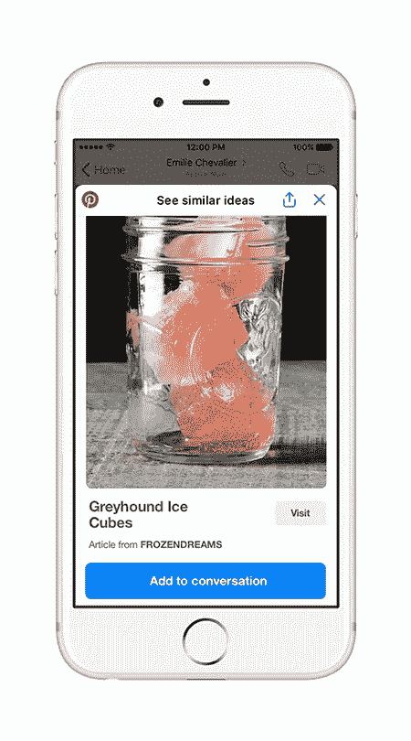

# 介绍用于 Messenger 的 Pinterest 聊天扩展和机器人

> 原文：<https://medium.com/pinterest-engineering/introducing-the-pinterest-chat-extension-and-bot-for-messenger-a88ff9d77041?source=collection_archive---------0----------------------->

Hayder Casey，Pinterest 工程经理，增长

每月有超过 2 亿人使用 Pinterest 寻找创意，从食谱到礼物到家居装饰。家人和朋友通常是这些计划的重要组成部分，这就是为什么每周有近 100 万个 pin 码被分享给 Facebook Messenger。今天，我们通过推出新的聊天扩展和机器人，让 Pinners 更容易在 Messenger 上与其他人协作。

## **用于 Messenger 的 Pinterest 聊天扩展**

我们正在推出 Pinterest 聊天扩展，以简化直接从 Messenger 与家人和朋友共享 pin 和协作的过程。现在，Pinners 无需退出 Messenger 对话就可以轻松分享想法。从今天开始，从我们的移动应用程序共享到 Messenger 的 pin 将使用 Messenger 新推出的 [SDK 链接到我们的聊天扩展。](/@heathwblack/6d9e5ee0d275)

经过改进的共享体验，现在共享后，完整的 Pin 图像将显示在 Messenger 中。如果您在 Messenger 中点击 Pin，您将通过聊天扩展看到更丰富、更完整的体验，这使得回复想法、共享新 Pin 以及访问 Pinterest 搜索和相关 Pin 比以往任何时候都更快、更容易。

我们在设计该体验时，考虑了人们与 Messenger 共享 pin 的最流行方式。我们将要求范围限定为:

*   性能–用户会经常出差，因此需要快速加载。
*   查看——展示完整的图片，并在文章可用时使其易于浏览。
*   易用性——让人们能够在 Pinterest 上浏览和搜索相关内容，并轻松分享到对话中。

我们在 React 的移动网络平台上构建了扩展。这是利用现有基础设施的有效途径。我们移除了所有的 chrome 和横幅，以利用可用空间来展示内容。

## **用于信使的 Pinterest 机器人**

我们还推出了一个 Pinterest 机器人,将 Pinterest 搜索的强大功能引入 Messenger，并帮助 Pinners 找到食谱、产品、风格灵感和其他想法。首先，与机器人聊天，选择“食物”、“家居”或“DIY”等主题，从我们的+1000 b 创意数据集中获得建议。

你也可以从 Pinterest 机器人上搜索各种想法，从鸡尾酒配方到假日服装。

这是 Pinterest 对人工智能交互的早期探索，允许用户以更自然和对话的方式与产品互动。虽然这只是第一步，但我们对未来迭代的潜力感到兴奋。

未来几天，Pinterest 聊天扩展将在 iPhone 和 Android 上使用我们应用程序的英语版本向 Pinners 推出，该机器人将在所有平台上可用，移动和网络。一定要把你的 Pinterest 应用在 iOS 上更新到 6.40 版本，在 Android 上更新到 6.45 版本。