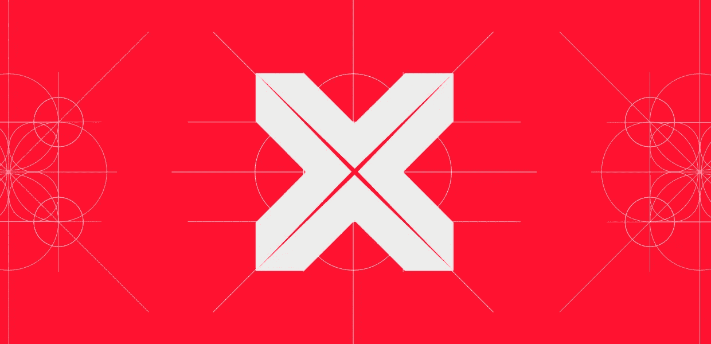
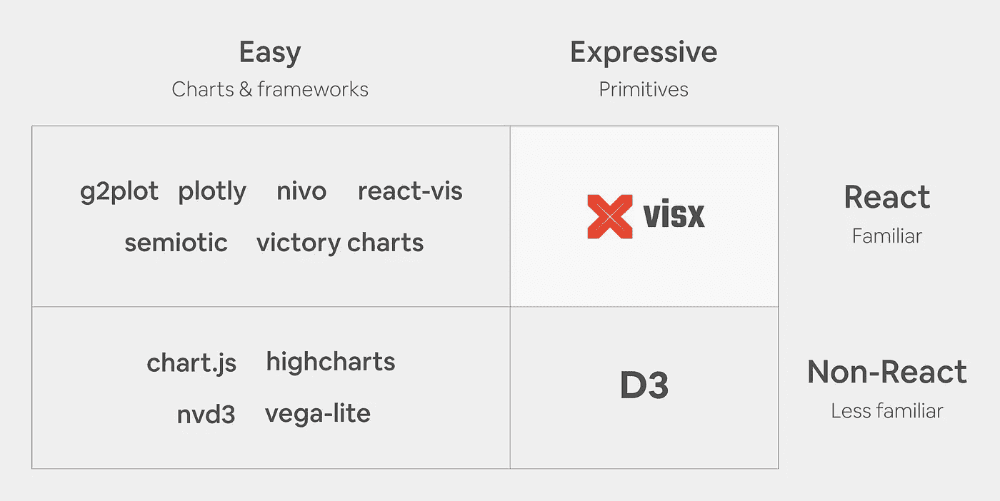
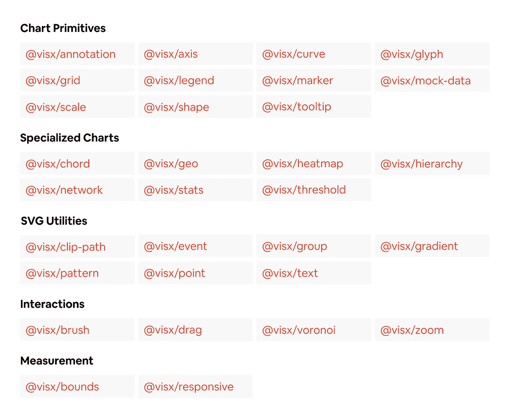
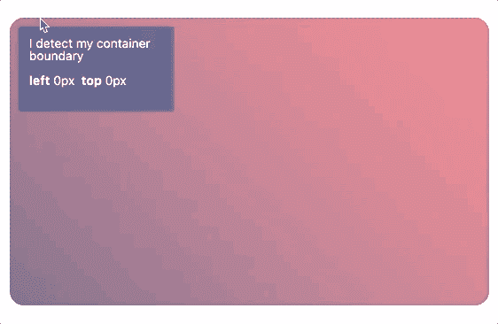
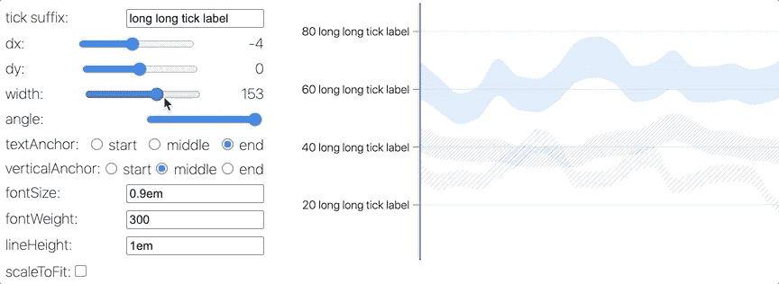
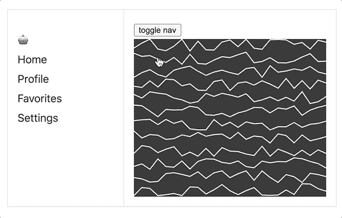
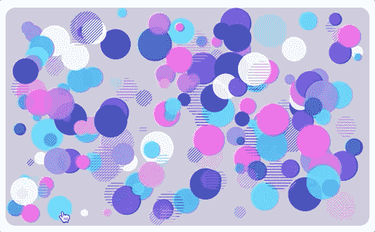
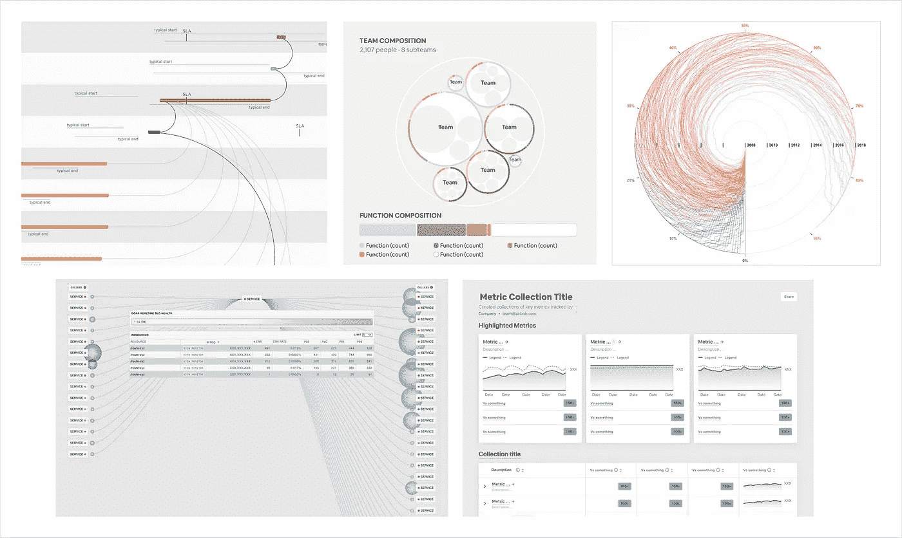
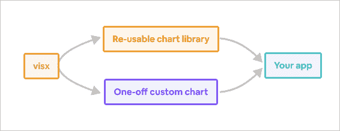
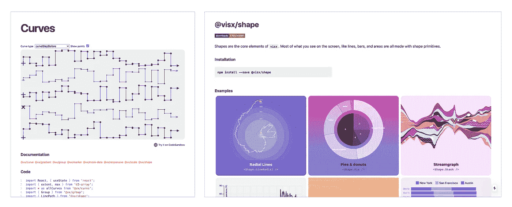

# 从 Airbnb 引入 visx

> 原文：<https://medium.com/airbnb-engineering/introducing-visx-from-airbnb-fd6155ac4658?source=collection_archive---------0----------------------->

## React 的一组富有表现力的低级可视化原语

由[克里斯·威廉姆斯](/@ccardwilliams)T2&哈里森·肖夫

经过 3 年的开发，在 Airbnb 的 2.5 年生产使用，以及在 TypeScript 中的重写，我们很兴奋地宣布 visx(以前的 [vx](https://github.com/hshoff/vx/issues/802) )的正式 1.0 版本。你可以在 GitHub 上找到项目[，在](https://github.com/airbnb/visx) [airbnb.io](https://airbnb.io/visx) 上浏览文档和例子。

在 Airbnb，我们的目标是在全公司范围内统一我们的可视化堆栈，在这个过程中，我们创建了一个新项目，将 D3 的功能与 React 的乐趣结合在一起。以下是 visx 的优势:

*   **保持捆尺寸较小。** visx 被拆分成多个包。从小处着手，只使用你需要的东西。
*   **故意固执己见。**自带状态管理，动画库，或者 CSS-in-JS 解决方案。很有可能你的 React 应用已经对动画、主题或样式的制作有了自己的看法。visx 小心翼翼地不添加另一个，并与它们全部集成。
*   **不是一个图表库。**当您开始使用可视化原语时，您将最终构建您自己的针对您的用例优化的图表库。你在掌控之中。

最重要的是，这只是反应。如果你知道反应，你就能想象。都是一样的标准 API 和熟悉的模式。visx 在任何 React 代码库中都应该感觉自在。我们很期待看到您用它来构建什么！

# 问题:前端开发人员的可视化

数据可视化与来自不同背景的更多人越来越相关，这种多样性需要可视化创作框架来迎合这些人的技能和需求。

其中一组作者是 ***前端开发人员*** ，他们越来越多地承担为 web 创建可视化的任务。有大量优秀的库和框架可用于创作基于 web 的可视化——从 [D3](https://d3js.org/) 、 [Highcharts](https://www.highcharts.com/) 、 [Plotly](https://plotly.com/graphing-libraries/) 、 [ECharts](https://echarts.apache.org/en/index.html) 、 [Victory](https://formidable.com/open-source/victory/) 、 [G2](https://g2.antv.vision/en) 、 [Recharts](https://recharts.org/) 、 [react-vis](https://uber.github.io/react-vis/) 、 [vega](https://vega.github.io/vega) 、 [vega-lite](https://vega.github.io/vega-lite/) ，到[然而，在评估了 Airbnb 上使用的十几个现有库后，我们发现大多数库至少在我们的前端开发人员重视的三个领域中的一个方面有所欠缺:](https://semiotic.nteract.io/)

*   **可学的。**(构建和维护一个可视化需要多少学习)——大多数前端工程师不是可视化专家，D3 的命令式 API 或 vega 的自定义语法的上下文切换的加速时间或成本在一个大型组织中是不小的。理想情况下，工程师应该能够像其他前端包一样快速地学习可视化库。
*   **富有表现力。有没有可能创造出几乎任何你能想象到的东西？)—要在大型组织中使用单一的可视化框架，需要支持简单的图表(比如 Airbnb.com 的图表)和高度定制的内部数据产品可视化。您的设计能力是否应该受到图表库限制的约束？我们不这么认为。**
*   **表演**。构建生产应用程序的前端开发人员——如 Airbnb.com——必须能够优化速度和软件包大小。带有内置动画、定制样式和特殊事件处理的“一刀切”的图表框架可能并不理想，而且会增加包的大小。

其他人[已经注意到](https://idl.cs.washington.edu/files/2019-ReflectionsVisAuthoring-InfoVis.pdf)在可视化工具中 ***表现性*** 和 ***可学习性*** 之间经常有一个直接的折衷，那么我们怎么可能创建一个在这些维度上都取得高分的库，并且还具有 ***性能*** ？一个字:反应。

# 解决方案:低级的以反应为中心的可视化原语

近年来，React 已经成为一个主流的 web 框架，部分原因是它有一个高度可读的、声明性的 API，可以促进代码的简洁和可维护性。React 为许多前端开发人员所熟悉，并且有大量用于性能调优和优化 React 应用程序的资源。利用 React 及其生态系统将提供 ***可学习性和性能*** ，而一个低级的模块化 API 将提供 ***表达能力*** 。

在描述这一愿景时，会出现两个常见问题:

> "**为什么不在 React 应用程序中使用 D3——它具有高度的表现力？**”

你可以！但是因为 D3 和 React 都想拥有 DOM 操作，我们发现最好只将 D3 用于数学，而 React 用于 DOM，因为更新 DOM 的两个心理模型为 bug 的潜入打开了大门。然而，仅将 D3 用于数学意味着它的大量(基于 DOM 的)功能不可用:[选择、加入](https://observablehq.com/@d3/selection-join)、[缩放](https://observablehq.com/@d3/zoom)、[拖动](https://observablehq.com/collection/@d3/d3-drag)、[笔刷](https://observablehq.com/collection/@d3/d3-brush)和[过渡](https://observablehq.com/@d3/stacked-to-grouped-bars)。此外，如上所述，D3 有自己的学习曲线，我们希望开发人员感觉他们正在用标准 API 和熟悉的模式编写本机代码。

> "T36 为什么不使用现有的 React 可视化库呢？

在我们的研究中(图 1)，我们发现现有的 React 可视化库通常是*高级抽象，并为了易用性*(即，更少的代码行)*而优化，代价是表现性*。没有一个提供 D3 原语的表现力，而且许多不允许我们在生产中想要的优化，因为计算、动画、状态管理、样式和渲染都被封装了。

**Figure 1.** Most web visualization libraries optimize for ease of use which can limit the expressivity of the possible output visualizations. visx is unique in supporting expressive, React visualization primitives.

查看图 1 中的问题空间，显然有机会让一个高表达力的 React 库茁壮成长。通过使用一流的 React API 创建低级的可视化原语，我们希望能够提供任何前端开发人员都可以获得的可学性、表现力和性能。visx 诞生了👶。

# 告诉我吧

visx(以前的 vx)代表可视化组件，是一套超过 ***30 个独立的 React 可视化原语*** 包，分为几个类别(图 2)。它在状态管理、动画和样式方面不固执己见，因此它可以与任何 React 代码库集成，并且它对模块化的强调(类似于 D3)使您可以通过仅使用创建可重用图表库或自定义一次性图表所需的包来降低包的大小。

**Figure 2.** visx is a modular suite of 30+ separate packages that abstract solutions to common tasks in React visualization engineering.

# 常见问题

> 【visx 如何使用 D3？

一些包使用 D3 进行数学和布局计算，并使用声明性的 React API 在功能上镜像底层 D3 包，如@visx/axis、@visx/geo、@visx/hierarchy 和@visx/shape。其他包取代了 D3 的 DOM 操作功能，并带来了一流的交互原语来作出反应——如@visx/brush、@visx/drag 和@visx/zoom。

> **哪些可视化“事物”是 D3 做不到的？**

许多软件包完全不同于 D3，是我们在React 中构建像素完美可视化时所面临的常见工程问题的抽象解决方案。在 React 和 simplify SVG APIs 中，许多这些抽象和简化了具有挑战性的度量任务。一些具体的例子:

**@ visx/tooltip(**[**沙盒**](https://codesandbox.io/s/github/airbnb/visx/tree/master/packages/visx-demo/src/sandboxes/visx-tooltip?file=/Example.tsx) **)**

Tooltips are common visualization elements but implementing all of their microinteractions is hard. This package abstracts state management for tooltip content, coordinates, and visibility with React hooks (useTooltip) and Higher-Order Components (withTooltip). It also simplifies the complexities of tooltip rendering, such as auto-positioning so it is not clipped by its container, or optionally rendering inside a [Portal](https://reactjs.org/docs/portals.html) to avoid [z-index stacking context](https://developer.mozilla.org/en-US/docs/Web/CSS/CSS_Positioning/Understanding_z_index/The_stacking_context) problems.

**@visx/text (** [**沙盒**](https://codesandbox.io/s/github/airbnb/visx/tree/master/packages/visx-demo/src/sandboxes/visx-text) **)**

Compared to HTML text, which easily supports wrapping long text onto multiple lines with CSS properties, there is no native support for wrapping text in SVG 1.1\. Implementing this in React, or even vanilla JavaScript, generally requires rendering invisible DOM elements to measure text size and calculate line splitting manually. This package abstracts this all away for you to make it easy to gracefully handle lengthy text in your visualizations.

**@ visx/responsive(**[**沙盒**](https://codesandbox.io/s/github/airbnb/visx/tree/master/packages/visx-demo/src/sandboxes/visx-responsive?file=/Example.tsx) **)**

Responsive web-apps are easy to create with HTML, but SVG- or canvas-based charts require pixel-based measurement which is not trivial in React. This package provides a variety of helpers to easily obtain screen or chart container dimensions in pixels so you can easily make your charts responsive.

**@visx/gradient，@visx/pattern (** [**沙盒**](https://codesandbox.io/s/github/airbnb/visx/tree/master/packages/visx-demo/src/sandboxes/visx-tooltip?file=/Example.tsx) **)**

Color gradients and pattern fills greatly expand the possible design space of charts and can uplevel or distinguish their aesthetic, but creating [these style definitions in SVG](https://developer.mozilla.org/en-US/docs/Web/SVG/Element/defs) is verbose and can be complicated. These packages greatly simplify the syntax for defining these styles to enable good-looking charts for the masses.

> **你能用 visx 做什么？**

在过去的 2.5 年里，我们一直在许多内部数据工具和 Airbnb.com 可视化工具上使用 visx(图 3)。

**Figure 3.** Examples of things we have built with visx (clockwise from top-left): Dependency-inclusive gantt chart for data pipeline task sequence analysis; circle pack donut org chart; Rainbow radial timeline; Metric business reporting; Service-to-service communication observability.

我们还利用 visx 创建了更高级的、可重用的图表库，以减少常见的、更简单的使用的样板代码(图 4)。

**Figure 4.** visx is low-level and is meant to be built on top of. Use it to build higher-level re-usable charts and to create custom visualizations for your web applications.

> **visx 听起来很有趣，但是我喜欢 D3**

我们也爱 D3！🙂

> 随着时间的推移，visx 是如何发展的？

三年来，我们沿着三条主要工作路线发展了 visx:

*   **功能**当我们将 visx 库整合到 Airbnb web 应用程序中时，我们自然会遇到一些限制(例如，不支持交互、缺少图表类型或布局)，或者发现自己在重复实现相同的东西(例如，图例、工具提示)。随着时间的推移，我们将这种缺失的功能添加到包中，或者以全新的包的形式贡献我们的解决方案。
*   30 多个包没有用，除非人们能使用它们，vx 的头号社区需求是更好的文档。我们最近改进了我们的文档在所有包中的覆盖范围，将包 API 文档链接到每个包的多个[blocks.org](http://blocks.org/)类示例，将所有示例链接到 [codesandbox](http://codesandbox.io/) 以方便修补和共享，并为 visx 更名重新设计了我们的项目站点(图 5)。
*   visx 最初是一个 JavaScript 项目，但它被完全重写为 TypeScript，以显著提高类型安全性和开发人员体验。TypeScript 现在[是 Airbnb](https://www.youtube.com/watch?v=P-J9Eg7hJwE) 前端 web 开发的官方语言，我们利用我们的 [ts-migrate](/airbnb-engineering/ts-migrate-a-tool-for-migrating-to-typescript-at-scale-cd23bfeb5cc) 工具来简化这种转换。我们最近还提高了 visx 的单元测试覆盖率，并将很快增加截图测试。

**Figure 5.** The visx docs use blocks.org-like examples that you can edit on codesandbox, and all examples are interlinked with per-package documentation.

通过这项工作以及来自像[克里斯·旺苏帕萨瓦特](https://github.com/kristw)、[肖恩·林奇](https://github.com/techniq)、[史丛雷](https://github.com/conglei)、[安迪·方](https://github.com/andyfangdz)、[乔丹·哈班德](https://github.com/ljharb)、[迈尔斯·约翰逊](https://github.com/milesj)、[塞尔吉·鲁登科](https://github.com/Rudeg)、[埃文·康拉德](https://github.com/Flaque)、[费边·贡德尔](https://github.com/sto3psl)、[诺尔·施尼勒这样的人的巨大贡献 Elijah Meeks](https://github.com/nschnierer) 和 Susie Lu ，我们已经让 GitHub 的粉丝超过 75000 位，希望这只是个开始！ 用“[检查问题👋寻求帮助](https://github.com/airbnb/visx/issues?q=is%3Aopen+is%3Aissue+label%3A%22%F0%9F%91%8Bhelp+wanted%22)或[🐣初学者友好的](https://github.com/airbnb/visx/issues?q=is%3Aopen+is%3Aissue+label%3A%22%F0%9F%90%A3+beginner+friendly%22)"标签开始吧，我们希望你能加入我们！