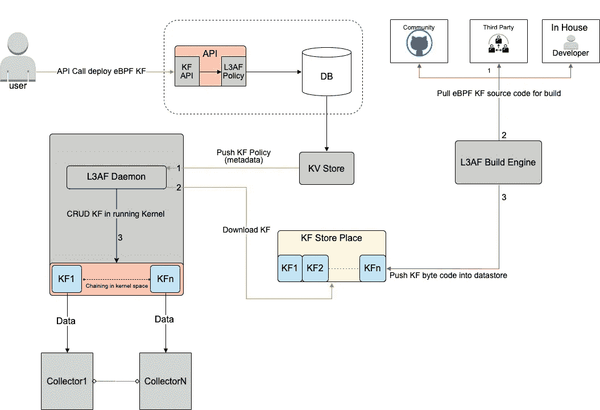
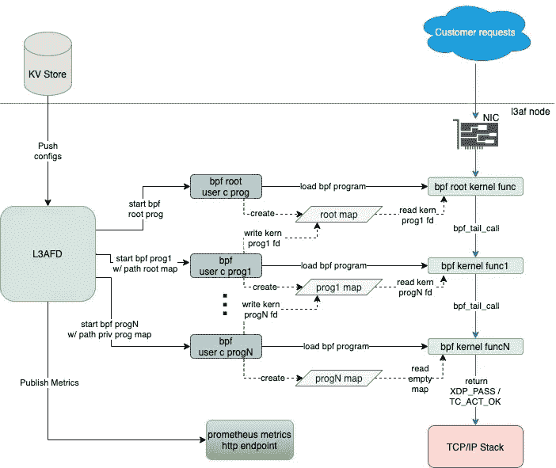

# 介绍沃尔玛的 L3AF 项目:控制平面、链接 eBPF 程序和开源计划。

> 原文：<https://medium.com/walmartglobaltech/introducing-walmarts-l3af-project-control-plane-chaining-ebpf-programs-and-open-source-plans-b96c54823ada?source=collection_archive---------0----------------------->

这是介绍 L3AF 项目的三篇系列文章中的第三篇，该项目使用 eBPF 和相关技术提供内核功能即服务。虽然这篇博客可以独立阅读，但我们建议在阅读这篇博客之前先阅读第一篇[](/walmartglobaltech/introducing-walmarts-l3af-project-how-do-we-use-ebpf-to-provide-network-visibility-in-a-8b9ae4d26200)**和第二篇*[](/walmartglobaltech/introducing-walmarts-l3af-project-xdp-based-packet-processing-at-scale-81a13ff49572)**博客。***

**eBPF 的受欢迎程度正在快速增长。越来越多的 eBPF 程序被编写来解决各种各样的问题。一些创业公司正在围绕 eBPF 构建技术，脸书、网飞甚至微软等大型技术公司都在采用 eBPF 来解决大规模问题。在沃尔玛，我们也采用 eBPF，并用它来解决类似的问题。**

**最初采用 eBPF 时，我们面临的一个挑战是如何大规模地管理和协调多个 eBPF 项目。我们需要在一个给定的节点上运行大量 eBPF 程序，在使用多个云提供商的混合云环境中，我们在许多 DC 上有数千个节点。由于缺乏企业级解决方案，我们决定开发自己的控制平台。这个控制平面在我们的网络基础设施中编排和组成独立的 eBPF 程序，以解决关键的业务问题。我们的控制平面是 L3AF 的重要组成部分。**

# **启用内核功能即服务**

**我们的控制平面由多个组件组成，这些组件协同工作以协调 eBPF 计划:**

*   **L3AF 守护进程(L3AFD)，运行在 KF 运行的每个节点上。L3AFD 读取配置数据，并管理节点上运行的 KFs 的执行和监控。L3AFD 写在 [Golang](https://golang.org/) 里。**
*   **部署 API，用户调用它来生成配置数据。这些配置数据包括将运行哪些 KFs、它们的执行顺序以及每个 KF 的配置参数。**
*   **存储配置数据的数据库和 KV 存储。**
*   **存储 KF 字节码的数据存储。**

**这里以图形方式显示了控制平面:**

****

**L3AF Ecosystem**

**如上图所示，eBPF KFs 可以是社区开发的，也可以是第三方供应商开发的，或者是 L3AF 提供的。L3AF 构建引擎提取内核函数源代码，针对不同的内核版本编译源代码，并将字节码推送到工件管理解决方案。**

**当用户想要部署 KF 时，他们可以使用适当的参数调用 L3AFD API。该请求将生成一个新的配置(KV 对),该配置将保存在数据库中，并使用配置分发机制跨所有主机分发。**

**一旦 L3AFD 读取了这个新配置，它就会按照定义的参数在 Linux 主机上编排内核函数。如果用户给定一组内核函数，那么 L3AFD 可以按照用户想要的顺序编排所有这些函数。**

**按顺序执行 eBPF 程序被称为“链接”，它相当复杂(至少对于我们在生产中使用的内核版本来说)。让我们深入探究 L3AFD 如何让这一切成为可能。下图附有一些解释:**

****

**L3AFD Orchestration**

**在高层次上，此图显示的是 L3AFD 通过利用 eBPF 映射来链接 eBPF KFs。链接是通过将下一个程序的文件描述符(fd)存储在前一个程序创建的映射中来实现的。给定的 eBPF 内核程序然后通过使用 bpf_tail_call 内核功能调用下一个 eBPF 内核程序。这种情况重复发生，直到到达链的末端。**

**实际上，对于每个链，只有第一个 eBPF 内核程序连接到网络接口。链中的后续 eBPF 程序基本上是代表第一个程序调用的。因此，需要一个“根”直通程序。根程序允许链重建，而无需将 eBPF 程序分离或重新附加到接口。**

**以下是创建链所涉及的步骤列表:**

*   **L3AFD 接收的配置包括网络接口和程序类型(XDP、TC 入口和 TC 出口)。它还包含一个序列号，指示 KF 在链中的位置。根据配置中可用的信息，L3AFD 将工件从 KF 数据存储下载到节点上。**
*   **如果序列号为 1(KF 是第一个 eBPF 程序)，那么 L3AFD 将执行以下操作:**

```
**1\. Start the appropriate type of root program (i.e., XDP or TC) depending on the program type. This root program will use libbpf APIs or TC hooks to attach the root kernel bytecode to the Network Interface.2\. Start the “user prog1” of the first KF using APIs with start arguments and this “user prog1” loads the bytecode of “kernel func1” and updates func1 fd into the root map using eBPF APIs.**
```

*   **如果序列号是 X(在链中间的某处)，L3AFD 将执行以下操作:**

```
**1\. Start the KF and update the next KF’s program fd (X+1) to the progX map.2\. Update the progX map into the previous KF’s program map (X-1) like an insertion in the linked list using Cilium’s eBPF [library](https://pkg.go.dev/github.com/cilium/ebpf%22) APIs.**
```

*   **如果序列号是 Z(链中的最后一个 KF)，那么 L3AFD 将执行以下操作:**

```
**1\. Start the KF and update the progZ map into the previous KF’s program map (Z-1).**
```

**L3AF 坚持“一次构建，处处部署”的原则，我们将为任何环境构建一次部署包(即多个内核版本)，并在部署时设置配置。**

**L3AFD 也有其他职责。它监视 KF 运行状况，收集可配置的 KF 指标，并管理 KF 资源利用率。这些健康和指标数据以与 PromQL 兼容的格式导出。**

**L3AFD 提供了用于配置的 API，因此用户可以使用他们现有的系统将配置分发到 L3AFD 节点。例如，用户可以使用 etcd、consul 或定制的内部解决方案向 L3AF 节点分发配置数据。然后，可以实现一个小服务来将配置数据转换为 L3AFD API 调用。L3AF 团队对旨在为混合云环境标准化配置分布的各种项目感兴趣，L3AF 的未来版本可能会朝着这个方向发展。**

**说到未来，这对于 L3AF 来说只是一个开始。我们对未来有许多激动人心的想法。**

# **未来计划**

**eBPF 是尖端技术。eBPF 特性经常被添加到新的内核版本中。此外，新的用户空间工具和库正在出现，这在几年前我们开始开发 L3AF 时是不可用的。**

**目前，如上图所示，L3AFD 执行单独的 C 用户空间程序，加载相应的 eBPF 内核函数。然而，已经创建了一个纯 Go eBPF 用户空间[库](https://pkg.go.dev/github.com/cilium/ebpf%22%20/)(由 Cilium 创建)。我们计划利用这个库来移植我们所有的 C 用户空间代码，这将简化我们的用户空间代码并扩展用户空间 eBPF 程序的功能。我们计划将新的 Go 用户空间程序实现为基于 RPC 的插件，以改进过程控制和通信。**

**如前所述，KF 链接非常复杂。但是，在 Linux 内核版本 5.10 及更高版本中可以简化。有了这些内核版本，libxdp 和它的 xdp 调度器功能使得事情变得更加简单(但是我们将保持对旧内核链接的支持)。使用 TC 的用户空间工具也可以简化 TC 链接。**

**我们 L3AF 项目的另一个关键部分是建立一个“内核函数市场”，在那里 KF 开发者和用户可以共享他们自己签名的 KFs 并从其他人那里下载 KFs。然后，L3AF 可以用于编排和组合来自市场的选定 KFs，以满足多种业务需求。内核功能市场的一个重要先决条件是开源 L3AF 项目，这是沃尔玛和我们团队的首要任务。**

**我们关于沃尔玛 eBPF 网络解决方案的三部分博客系列到此结束。我们已经讨论了网络可见性、XDP 包处理和开发我们自己的控制平面。这些部分组合在一起，形成了我们的 L3AF 模型，我们用它来以创新的方式解决难题。在结束之前，我们想概述一下 L3AF 型号的优势。**

# **L3AF 模型的优势**

**许多商业解决方案可以聚合流量并将其路由到相关的监控和分析工具。然而，这些解决方案是专有的，这限制了它们提供由它们的工程师开发的特性和功能。L3AF 背后的想法是提供一个开放的、可扩展的平台，该平台提供某些开箱即用的内核功能。此外，用户还可以根据自己的使用案例和需求，向我们的 KF 生态系统动态添加产品。**

**此外，L3AF 可以支持需要在流量的直接路径中采取行动的用例。这类用例的几个例子是数据包标记、速率限制、负载平衡和流量导向。这种用例不可能用传统的基于代理的解决方案来实现，因为它们中的大多数仍然在 TCP/IP 栈中运行它们的程序。L3AF 利用 eBPF，这允许我们以超低开销在内核中运行这些。此外，它还提供了其他商业工具无法提供的功能，除非它们经历了重大的设计和体系结构级别的更改。这些都给了 L3AF 在这个领域的先发优势。**

**总而言之，以下是我们 L3AF 模型的主要优势:**

## **技术优势如下:**

*   **所有内核功能的一站式商店，从而避免供应商和云锁定。**
*   **跨主机分布内核功能，消除网络中的设备和集中阻塞点(并尽可能靠近源)。**
*   **支持内核函数链接，以实现所需的工作流。**
*   **将 eBPF 用于数据路径，因此提供了超高的性能。**
*   **减少执行 L3AFD 管理的内核功能可能需要的任何额外跳数。**

## **商业利益如下:**

*   **根据用户需求配置、定制和监控内核功能的灵活平台。**
*   **降低许可费用和管理众多厂商产品内核功能并使它们协同工作的开销。**
*   **降低跨平台实现新内核功能的集成成本，避免受到跨平台最低公分母的限制。**
*   **减少网络跳数，避免额外的公共云流量成本和瓶颈。**
*   **提供尖端技术解决方案，其功能在商业工具中尚属空白。**

**L3AF 项目还在可观测性、监控和跟踪领域开发解决方案。我们将继续通过博客分享我们的工作，因为我们致力于开源这个项目。感谢收听！**

**本博客是根据 L3AF 项目工程师桑托什·费尔南德斯和 [*布莱恩*](https://www.linkedin.com/in/bgmerrell/) *的意见撰写的。***