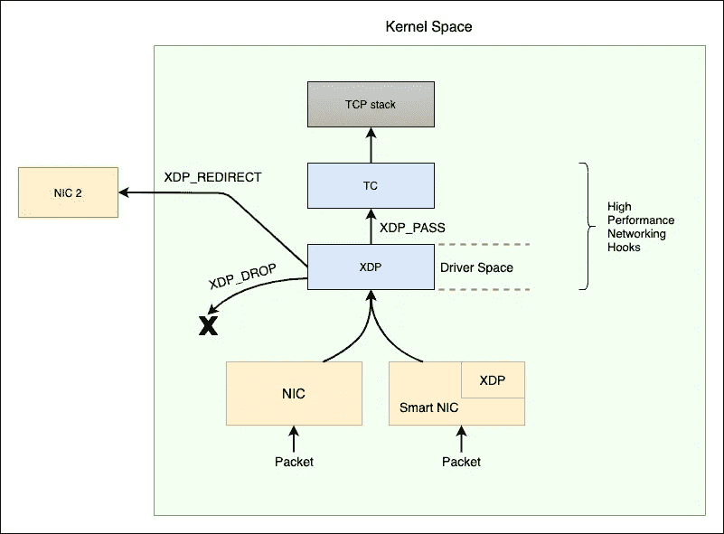
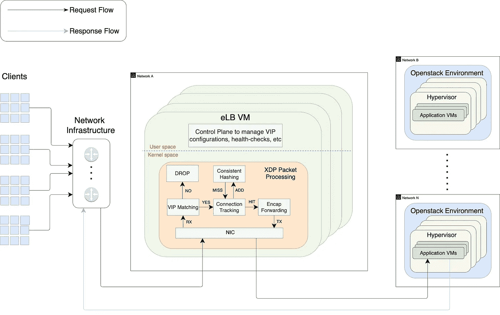
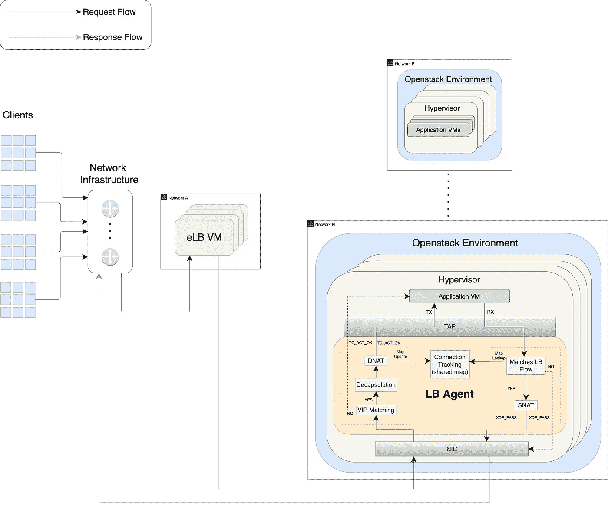
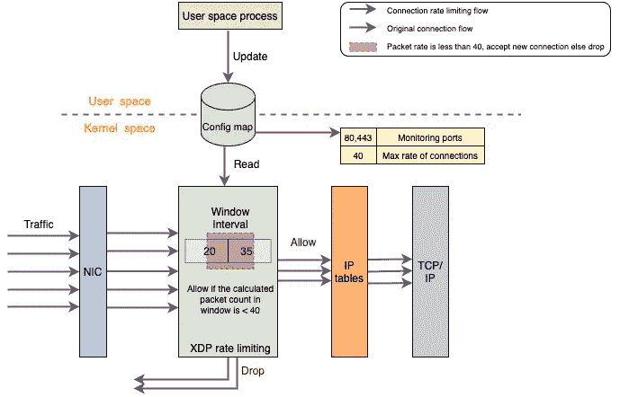
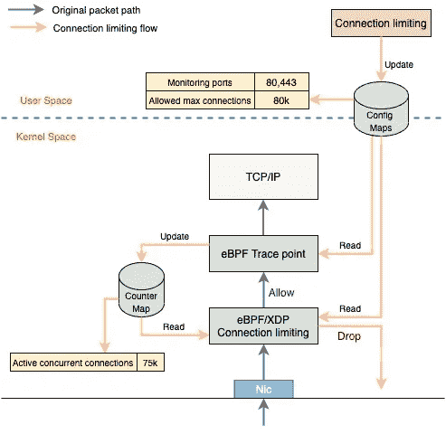

# 介绍沃尔玛的 L3AF 项目:基于 XDP 的大规模数据包处理

> 原文：<https://medium.com/walmartglobaltech/introducing-walmarts-l3af-project-xdp-based-packet-processing-at-scale-81a13ff49572?source=collection_archive---------0----------------------->

这是介绍 L3AF 项目的三篇系列文章中的第二篇，该项目使用 eBPF 和相关技术提供内核功能即服务。你可以先浏览一下博客 [*这里*](/walmartglobaltech/introducing-walmarts-l3af-project-how-do-we-use-ebpf-to-provide-network-visibility-in-a-8b9ae4d26200) *。*

随着 XDP 和 eBPF 的出现，现在有可能在内核数据路径中实现高性能的数据包处理。XDP 允许我们将 eBPF 程序附加到内核内部的低级钩子上。这个由网络驱动程序实现的 XDP 钩子在 Linux 网络堆栈之前提供了一个可编程层。

当数据包到达时，网络驱动程序在主 XDP 钩子中执行 eBPF 程序。这个框架允许我们在从硬件接收到数据包后，尽可能早地执行定制的 eBPF 程序，从而确保超高的性能。一些智能网卡还支持卸载 XDP，这使得程序可以在网卡上运行，而不会以任何方式使用主机 CPU。

XDP in action

在接下来的几节中，我们将讨论一些功能缺口，这些缺口可以通过利用 XDP/eBPF 在流量路径中采取直接行动来解决。

# eBPF 负载平衡器(L4)

一些互联网公司每秒钟从他们的边缘网络处理数百万个请求。位于流量流中关键路径的第 4 层负载平衡器正在处理极高的流量。由于 L4 LB 必须处理每个传入的数据包，因此该解决方案需要高性能。此外，还必须提供生产环境中所需的灵活性和可伸缩性。

传统上，L4 负载平衡器是基于硬件的，主要是为了满足高性能要求。然而，采用以硬件为中心的方法会限制系统的灵活性，并引入一些限制，如缺乏敏捷性、可伸缩性和弹性。随着应用数量、复杂性和重要性的增加，基础架构层必须以应用为中心，不受硬件配置的限制。

使用 eBPF 的软件解决方案本身可以满足所有的性能需求。L3AF 项目利用 [Katran](https://github.com/facebookincubator/katran) 开发了一个基于 eBPF 的负载均衡器产品(eLB ),它是在单个 NIC 上使用发夹模型中的 XDP 实现的。这个负载平衡器使用 XDP_TX 在设备驱动程序级别将流量重定向到后端。

eLB — XDP based L4 Load-Balancer

我们希望在沃尔玛的生产环境中启用的一个关键特性是 DSR(直接服务器返回)，这样我们就可以直接向客户发送响应。这确保了 eLB 不需要处理返回分组，返回分组通常更大。

为了实施 DSR，我们开发了一个 LB 代理，在私有云中的虚拟机管理程序群上运行。对于其他环境类型，我们在 VM(虚拟机)、裸机等上运行代理。这取决于使用情况。该代理可以在任何基于 Linux 的商用硬件上运行。

当客户端请求应用服务时，路由器会收到 VIP 数据包。然后，路由器通过 ECMP 将数据包转发到集群中的一个 eLB 节点。因为所有的 eLB 节点都以相同的代价通告 VIP，所以它们与路由器是 BGP 对等的(我们在 LB 节点上运行 goBGP)。当 eLB 收到数据包时，它会运行 [Maglev 算法](https://static.googleusercontent.com/media/research.google.com/en//pubs/archive/44824.pdf)，从与 VIP 相关的服务端点集中选择一个端点，并使用通用 UDP 封装(GUE)将数据包封装到目的地为服务端点的外部 IP 报头中。在我们的私有云环境中，封装是必要的，因为我们需要将数据包路由到后端，这些后端与相应的 eLB 节点位于不同的 L2 域中。

LB Agent to enable DSR

应用节点接收 eLB 转发的封装流量。我们大多数虚拟化应用工作负载的生命周期由各个应用团队直接管理。为了获得对应用程序透明的解决方案，代理被设计为在与虚拟机对应的 tap 设备上运行。代理解封装传入的流量，并将其转发给应用程序。在返回路径中，代理使用连接跟踪捕获到 VIP 的输出流量——所有这些都是使用 eBPF (XDP 和 TC 钩子)完成的。

LB 代理由我们的控制平面动态配置，该解决方案可灵活应对基础架构层的任何变化(扩展、迁移等)。)

主要优势如下:

*   eLB 正在帮助我们用基于软件的现代解决方案取代限制系统灵活性的基于硬件的解决方案。启用 DSR 不仅消除了我们网络中的集中瓶颈，还帮助我们改善了整体站点延迟。
*   eLB 利用了 XDP，与 DPDK 和 LVS 等其他软件技术相比，它的性能要好得多。这与 DSR 相结合，使我们能够显著减少 L4 LB 基础架构的占用空间。

# 连接和连接速率限制

随着企业数字足迹的增加，防范突发流量或网络攻击变得至关重要。具有连接限制和连接速率限制功能允许我们分别限制 TCP 连接的并发数量和建立新 TCP 连接的速率。我们还希望这个限制可以基于足够的基准进行调整，以确保上游系统不会不堪重负。

L3AF 项目已经开发了能够执行连接和连接速率限制的 eBPF/XDP 程序。

Connection Rate Limiting Solution

连接速率限制使用滑动窗口方法来管理连接，与令牌桶/漏桶算法相比，这种方法更容易使用和理解。程序只期望“流量率”作为输入，而其他一些算法也需要“流量突发”作为输入，这在复杂系统中很难确定。该程序本质上使用它在系统上看到的流量模式在内部进行所需的计算。

最大连接限制使用跟踪点/kprobes 来跟踪并发连接数，并向 XDP 函数提供反馈(使用 BPF 映射),如果数量超过配置的最大限制，该函数将丢弃/重置连接。

Connection Limiting Solution

主要优势如下:

*   向我们的边缘代理和负载平衡器添加连接/速率限制功能，可以保护我们的计算资源，使其在出现超出我们资源处理能力的突发流量时不会不堪重负。
*   与其他解决方案相比，通过使用 XDP，我们能够以更高的速度掉线。

上述 XDP 功能和基于 XDP 的 eLB 都可以以链式方式运行，以便彼此协同工作。这可以确保连接和连接速率限制功能丢弃所有非法流量，即使在不利条件下，eLB 也不会产生任何不良影响。

在下一篇博客的[中，我们将讨论如何按照期望的顺序编排内核函数(例如 rate-limit->max-limit->eLB)。](/walmartglobaltech/introducing-walmarts-l3af-project-control-plane-chaining-ebpf-programs-and-open-source-plans-b96c54823ada)

*这篇博客是根据 L3AF 项目的工程师*[*Ragalahari*](https://www.linkedin.com/in/raga-lahari-505b4822/)*[*Kan thi*](https://www.linkedin.com/in/kanthi-pavuluri-06135415/)*和*[*rish abh*](https://www.linkedin.com/in/rishabh-gupta34/)*的意见撰写的。**